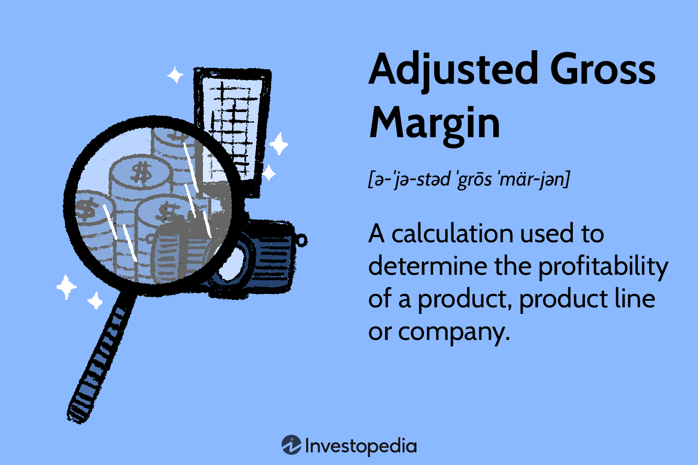

## Table of Contents

## What is Adjusted Gross Margin?

Adjusted Gross Margin is a financial metric that businesses use to understand how much money they make from selling their products or services after accounting for the costs of making or buying those products. It's like looking at the profit from sales but with some adjustments to give a clearer picture. These adjustments might include subtracting things like the cost of goods sold, which are the direct costs tied to producing the products.

This metric is helpful because it shows a company's efficiency in managing its production costs and pricing strategies. By adjusting the gross margin, businesses can remove one-time costs or other unusual expenses that might not happen regularly. This way, they get a better idea of their ongoing profitability. For example, if a company had to pay for a big, unexpected repair on their machinery, they might adjust their gross margin to see what their profit would look like without that cost.

## Why is Adjusted Gross Margin important for businesses?

Adjusted Gross Margin is important for businesses because it helps them see how well they are doing at making money from what they sell. It takes away the costs of making or buying the products, so businesses can see their profit more clearly. This is useful because it shows if they are pricing their products right and if they are keeping their production costs low. By looking at the Adjusted Gross Margin, a business can figure out if they need to change their prices or find cheaper ways to make their products.

Another reason why Adjusted Gross Margin is important is that it helps businesses plan for the future. By adjusting for one-time costs or unusual expenses, they get a better idea of their regular profits. This helps them make better decisions about where to spend money or how to grow their business. For example, if a company knows its Adjusted Gross Margin is good, it might decide to invest in new products or expand to new markets. This way, they can keep making money and growing their business.

## How is Adjusted Gross Margin different from Gross Margin?

Gross Margin is the money a business makes from selling its products after taking away the cost of making or buying those products. It's a simple way to see how much profit a business is making from its sales. For example, if a business sells a product for $100 and it costs $60 to make, the Gross Margin would be $40.

Adjusted Gross Margin is a bit different because it takes the Gross Margin and makes some changes to give a clearer picture of the business's profit. These changes might include taking away one-time costs or unusual expenses that don't happen all the time. So, if that same business had to pay $10 for a one-time repair, the Adjusted Gross Margin would be $40 minus $10, which is $30. This helps the business see what its regular profit looks like without those extra costs.

By using Adjusted Gross Margin, a business can get a better idea of its ongoing profitability. It helps them make smarter decisions about pricing, costs, and future plans. While Gross Margin gives a basic view of profit, Adjusted Gross Margin gives a more accurate and useful view for planning and managing the business.

## What are the key components needed to calculate Adjusted Gross Margin?

To calculate Adjusted Gross Margin, you start with the Gross Margin, which is the money you make from selling your products after you take away the cost of making or buying them. For example, if you sell a product for $100 and it costs $60 to make, your Gross Margin is $40. This is a basic way to see how much profit you are making from your sales.

Next, you need to make some adjustments to the Gross Margin to get the Adjusted Gross Margin. These adjustments can include taking away one-time costs or unusual expenses that don't happen all the time. For instance, if you had to pay $10 for a one-time repair, you would subtract that from your Gross Margin. So, your Adjusted Gross Margin would be $40 minus $10, which is $30. This helps you see what your regular profit looks like without those extra costs.

By using Adjusted Gross Margin, you get a clearer picture of your business's ongoing profitability. It helps you make better decisions about pricing, managing costs, and planning for the future. While Gross Margin gives you a basic view of your profit, Adjusted Gross Margin gives you a more accurate and useful view for running your business.

## Can you provide a basic formula for calculating Adjusted Gross Margin?

To calculate Adjusted Gross Margin, you start with the Gross Margin. Gross Margin is what you get when you subtract the cost of making or buying your products from the money you make by selling them. For example, if you sell a product for $100 and it costs $60 to make, your Gross Margin is $40.

Next, you adjust the Gross Margin by taking away any one-time costs or unusual expenses that don't happen all the time. These might include things like a big repair or a special project. If you had to pay $10 for a one-time repair, you would subtract that from your Gross Margin. So, your Adjusted Gross Margin would be $40 minus $10, which is $30. This helps you see what your regular profit looks like without those extra costs.

## What adjustments are typically made to calculate Adjusted Gross Margin?

When you want to find out your Adjusted Gross Margin, you start with your Gross Margin. Gross Margin is what you get when you subtract the cost of making or buying your products from the money you make by selling them. For example, if you sell a product for $100 and it costs $60 to make, your Gross Margin is $40.

To get the Adjusted Gross Margin, you need to make some changes to the Gross Margin. These changes usually include taking away one-time costs or unusual expenses that don't happen all the time. For instance, if you had to pay $10 for a one-time repair, you would subtract that from your Gross Margin. So, your Adjusted Gross Margin would be $40 minus $10, which is $30. This helps you see what your regular profit looks like without those extra costs.

By using Adjusted Gross Margin, you get a clearer picture of your business's ongoing profitability. It helps you make better decisions about pricing, managing costs, and planning for the future. While Gross Margin gives you a basic view of your profit, Adjusted Gross Margin gives you a more accurate and useful view for running your business.

## How does Adjusted Gross Margin help in financial analysis?

Adjusted Gross Margin is a helpful tool for businesses because it gives a clearer picture of how much money they are really making from selling their products. When you look at the Adjusted Gross Margin, you take away one-time costs or unusual expenses that might not happen again. This helps businesses see what their regular profit looks like, without those extra costs getting in the way. For example, if a company had to pay for a big repair on their machinery, they would take that cost out of their Gross Margin to see what their profit would be without it.

This clearer picture is important for financial analysis because it helps businesses make better decisions. They can see if they are pricing their products right and if they are keeping their production costs low. By knowing their Adjusted Gross Margin, a business can plan better for the future. They might decide to change their prices, find cheaper ways to make their products, or invest in new projects. This way, they can keep making money and growing their business over time.

## What industries commonly use Adjusted Gross Margin as a key metric?

Many different industries use Adjusted Gross Margin as a key metric to understand how well they are doing financially. In the retail industry, for example, businesses sell lots of products and need to know if they are making enough money after paying for those products. By using Adjusted Gross Margin, they can see their profit more clearly, without one-time costs like a big repair or a special event getting in the way. This helps them make better decisions about what to sell and how to price their products.

In the manufacturing industry, companies make things like cars, electronics, or clothes. They need to keep track of the costs of making these products and make sure they are selling them for enough money to make a profit. Adjusted Gross Margin helps them see if they are managing their production costs well and if they need to find cheaper ways to make their products. This way, they can plan for the future and keep their business running smoothly.

The technology industry also finds Adjusted Gross Margin useful. Tech companies often have high costs for research and development, and they need to know if their products are profitable after these costs. By adjusting for one-time expenses or unusual costs, they can get a better idea of their regular profit. This helps them decide where to invest their money and how to grow their business.

## How can Adjusted Gross Margin be used to compare companies within the same industry?

Adjusted Gross Margin is a helpful tool for comparing companies within the same industry because it shows how much profit each company makes from selling their products after taking away the costs of making them. When you compare the Adjusted Gross Margins of different companies, you can see which ones are doing a better job at managing their costs and pricing their products right. For example, if one company has a higher Adjusted Gross Margin than another, it might mean they are more efficient at keeping their production costs low or they are better at setting prices that bring in more profit.

This comparison can help investors and business owners make better decisions. If they see that one company has a consistently higher Adjusted Gross Margin, they might think that company is a better investment because it is more profitable. It also helps companies within the industry see where they stand compared to their competitors. If a company's Adjusted Gross Margin is lower than others, they might need to look at their costs and prices to see where they can improve. This way, they can work on getting better and staying competitive in their industry.

## What are common pitfalls or errors to avoid when calculating Adjusted Gross Margin?

When calculating Adjusted Gross Margin, one common mistake is not including all the right costs. It's important to subtract all the costs of making or buying your products, like materials, labor, and any other direct costs. If you forget some of these costs, your Adjusted Gross Margin will be too high, and you won't have a clear picture of your profit.

Another pitfall is making too many adjustments. While it's good to take away one-time or unusual costs, you don't want to adjust too much. If you keep taking away costs, you might end up with an Adjusted Gross Margin that doesn't reflect your real business situation. It's best to only adjust for costs that really don't happen regularly, so your numbers stay accurate and helpful.

Lastly, be careful not to mix up Adjusted Gross Margin with other financial metrics like Net Profit. Adjusted Gross Margin focuses on the profit from sales after the cost of goods sold, while Net Profit includes all other expenses like rent, salaries, and taxes. Mixing these up can lead to confusion and bad decisions about your business's financial health.

## How does Adjusted Gross Margin affect investment decisions?

Adjusted Gross Margin is important for people who want to invest in a company. It shows how much money a company makes from selling its products after taking away the costs of making them. When investors look at Adjusted Gross Margin, they can see if a company is good at managing its costs and setting the right prices for its products. If a company has a high Adjusted Gross Margin, it means they are making a lot of profit from each sale, which can make them a good investment.

Investors can compare the Adjusted Gross Margins of different companies in the same industry to decide where to put their money. If one company has a higher Adjusted Gross Margin than others, it might be a better choice because it shows they are more efficient and profitable. By looking at this number, investors can make smarter choices about which companies will likely do well in the future and give them a good return on their investment.

## What advanced techniques can be used to refine the calculation of Adjusted Gross Margin for more accurate analysis?

To get a more accurate Adjusted Gross Margin, businesses can use a technique called "segmentation." This means breaking down their sales and costs into different parts of the business, like different products or regions. By looking at the Adjusted Gross Margin for each part, a company can see which areas are doing well and which ones need improvement. For example, if one product has a much higher Adjusted Gross Margin than others, the business might focus more on selling that product. This helps them make better decisions about where to spend their money and how to grow.

Another advanced technique is to use "time-series analysis." This means looking at how the Adjusted Gross Margin changes over time. By comparing the Adjusted Gross Margin from different months or years, a business can spot trends and see if their profits are going up or down. If they notice that the Adjusted Gross Margin is getting lower, they might need to look at their costs or prices to see what's going wrong. This way, they can fix problems before they get too big and keep their business running smoothly.

## What is Adjusted Gross Margin: Overview and Calculation?

Adjusted Gross Margin is a sophisticated financial metric that provides a clearer picture of a company's profitability by factoring in inventory carrying costs—elements that are often overlooked in the standard gross margin computation. This metric offers a deeper insight into the profitability dynamics by addressing costs that directly impact a company's bottom line but are not readily apparent in basic calculations.

The adjusted gross margin is typically calculated using the following formula:

$$
\text{Adjusted Gross Margin} = \left( \frac{\text{Gross Profit} - \text{Carrying Costs}}{\text{Sales}} \right) \times 100
$$

### Components of the Calculation

1. **Gross Profit**: This figure is derived from subtracting the cost of goods sold (COGS) from total revenue. It reflects the core profit made before accounting for overhead costs, interest, taxes, and other operating expenses.

2. **Inventory Carrying Costs**: These are the expenses related to storing unsold goods. They include warehousing, insurance, depreciation, and other logistical expenses. Inventory carrying costs can significantly impact profitability, particularly for companies with substantial inventory.

3. **Sales**: This refers to total revenue generated from sales within a given period.

### Calculation Example

Consider a company with the following financial metrics for a fiscal year:

- Gross Profit: $500,000
- Inventory Carrying Costs: $50,000
- Sales: $1,000,000

Using the formula provided:

$$
\text{Adjusted Gross Margin} = \left( \frac{500,000 - 50,000}{1,000,000} \right) \times 100 = \left( \frac{450,000}{1,000,000} \right) \times 100 = 45\%
$$

This result shows that once inventory carrying costs are deducted from the gross profit, the adjusted gross margin is 45%. This metric provides a more accurate reflection of profitability than the unadjusted gross margin, especially for businesses heavily reliant on maintaining substantial inventory levels.

### Application in Financial Analysis

Adjusted gross margin is particularly helpful in industries where inventory management is critical, such as retail or manufacturing. It enables businesses to evaluate their cost structures more accurately and make informed decisions about pricing, procurement, and inventory management strategies. Furthermore, this metric can be integrated into algorithmic trading models, offering traders insights into a firm's operational efficiency and cost management practices, thereby influencing trading decisions and strategy formulation.

## How can key performance metrics be utilized in algorithmic strategies?

Performance metrics play a vital role in evaluating and enhancing the effectiveness of algorithmic trading strategies. Among the key metrics are the Sharpe Ratio, Maximum Drawdown, and Profit Factor, each offering unique insights into a strategy's risk and return profile.

### Sharpe Ratio

The Sharpe Ratio is a measure used to understand the return of an investment compared to its risk. To calculate it, subtract the risk-free rate from the portfolio's return, and then divide by the standard deviation of the portfolio returns. The formula is as follows:

$$
\text{Sharpe Ratio} = \frac{R_p - R_f}{\sigma_p}
$$

Where:
- $R_p$ is the return of the portfolio,
- $R_f$ is the risk-free rate,
- $\sigma_p$ is the standard deviation of the portfolio excess return.

A higher Sharpe Ratio indicates a more attractive risk-adjusted return, making it a crucial metric for assessing the performance of trading algorithms that aim to maximize returns while controlling for [volatility](/wiki/volatility-trading-strategies).

### Maximum Drawdown

Maximum Drawdown (MDD) is the largest peak-to-trough decline in the value of an investment before a new peak is achieved. It indicates the risk of a significant loss over a specified period:

$$
\text{Maximum Drawdown} = \frac{\text{Trough Value} - \text{Peak Value}}{\text{Peak Value}}
$$

Maximum Drawdown is especially important in algorithmic trading as it provides an insight into the worst possible loss, aiding in the assessment of the risk profile of a strategy. Minimizing MDD can lead to more stable performance even under adverse market conditions.

### Profit Factor

Profit Factor is calculated by dividing the total gross profit by the total gross losses of a trading strategy. It is a straightforward measure of profitability:

$$
\text{Profit Factor} = \frac{\text{Total Profit}}{\text{Total Loss}}
$$

A Profit Factor greater than one indicates that a strategy is profitable, and the higher the value, the better. This metric helps traders evaluate the efficiency of their algorithms in generating profit relative to their losses.

### Integrating Metrics into Algorithmic Strategies

The integration of these metrics with financial measures like adjusted gross margin provides a more rounded assessment of an algorithm's performance, enabling traders to optimize their strategies effectively. For example, using Python, one might calculate these metrics to automatize strategy evaluation:

```python
import numpy as np

def calc_sharpe_ratio(returns, risk_free_rate):
    excess_return = np.mean(returns) - risk_free_rate
    return excess_return / np.std(returns)

def calc_max_drawdown(price_series):
    peak = price_series[0]
    max_drawdown = 0
    for price in price_series:
        if price > peak:
            peak = price
        drawdown = (peak - price) / peak
        max_drawdown = max(max_drawdown, drawdown)
    return max_drawdown

def calc_profit_factor(gross_profit, gross_loss):
    return gross_profit / abs(gross_loss)

# Example usage with hypothetical data
returns = np.array([0.05, 0.02, -0.01, 0.04])
risk_free_rate = 0.01
sharpe = calc_sharpe_ratio(returns, risk_free_rate)

price_series = np.array([100, 110, 105, 115, 100, 120])
max_drawdown = calc_max_drawdown(price_series)

gross_profit = 5000
gross_loss = -4000
profit_factor = calc_profit_factor(gross_profit, gross_loss)
```

These calculations provide traders with the analytical insight needed to refine and adjust their trading algorithms. By continually assessing these key performance metrics, traders can ensure their strategies not only target high returns but also maintain acceptable risk levels.

## References & Further Reading

[1]: Bergstra, J., Bardenet, R., Bengio, Y., & Kégl, B. (2011). ["Algorithms for Hyper-Parameter Optimization."](https://dl.acm.org/doi/10.5555/2986459.2986743) Advances in Neural Information Processing Systems 24.

[2]: ["Advances in Financial Machine Learning"](https://www.amazon.com/Advances-Financial-Machine-Learning-Marcos/dp/1119482089) by Marcos Lopez de Prado

[3]: ["Evidence-Based Technical Analysis: Applying the Scientific Method and Statistical Inference to Trading Signals"](https://www.amazon.com/Evidence-Based-Technical-Analysis-Scientific-Statistical/dp/0470008741) by David Aronson

[4]: ["Machine Learning for Algorithmic Trading"](https://github.com/stefan-jansen/machine-learning-for-trading) by Stefan Jansen

[5]: ["Quantitative Trading: How to Build Your Own Algorithmic Trading Business"](https://www.amazon.com/Quantitative-Trading-Build-Algorithmic-Business/dp/1119800064) by Ernest P. Chan