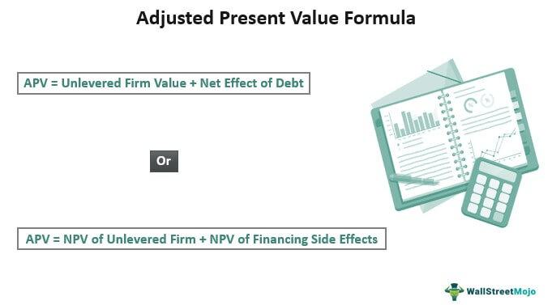

The Adjusted Present Value (APV) formula is a pivotal tool in financial valuation, offering a nuanced approach to assessing the value of investments and projects by separating financial and operational considerations. It contrasts with traditional techniques by clearly distinguishing between a project's unlevered value and the value addition or deduction brought by financing decisions, such as tax shields. This distinction is particularly relevant in complex financial situations where the traditional Net Present Value (NPV) or Discounted Cash Flow (DCF) methods might blur the lines between operational performance and financing strategy.

Algorithmic trading, on the other hand, has transformed the financial landscape by utilizing sophisticated algorithms to make more informed and timely trading decisions. In such a dynamic environment, understanding valuation methodologies like APV becomes essential. Algorithmic trading increasingly requires precise measures of a firm’s financial structure to strategize and optimize trading decisions. By integrating the APV method, traders and analysts can better account for varying levels of debt and equity financing, leading to more accurate evaluations of market opportunities and risks.



This article seeks to explore the intersection of APV and algorithmic trading, providing both a technical overview of the APV method and insights into its application within algorithmic trading frameworks. Through this exploration, readers will gain a clearer understanding of how APV can serve as a robust tool for evaluating investment decisions in an environment that is characterized by its complexity and rapid change.

## Table of Contents

## Understanding Adjusted Present Value (APV)

Adjusted Present Value (APV) is a comprehensive financial valuation technique that provides a detailed assessment by distinguishing a project's or company's value into separate equity and debt components. This method diverges from the conventional Net Present Value (NPV) approach by individually evaluating the unlevered firm value and the net effects of debt, thus offering a more nuanced analysis of valuation, particularly in scenarios of complex financial structures.

### Unlevered Firm Value and Net Effect of Debt

The APV formula is expressed as:

$$
\text{APV} = \text{Unlevered Firm Value} + \text{Net Effect of Debt}
$$

1. **Unlevered Firm Value:** This represents the value of a company or project if it is entirely equity-financed, without the influence of debt. It reflects the core operations of the business without the financial implications introduced by leverage.

2. **Net Effect of Debt:** This component accounts for the benefits and costs associated with debt financing. Primarily, it includes the tax shield that arises from the interest deductibility of debt and any other financing effects such as costs of financial distress or subsidies.

### Distinction Between Operational and Financing Effects

A critical advantage of APV is its ability to distinctly separate operational performance from financing effects. This separation is particularly beneficial when evaluating entities with fluctuating capital structures or varying levels of leverage. By isolating these elements, stakeholders can achieve a clear understanding of a business’s operational efficiency and the effects of its capital structure on overall value.

### Benefits of APV in Financial Valuation

APV is especially effective in contexts of high leverage or when capital structures are anticipated to change over time. In such scenarios, traditional valuation methods like NPV or Discounted Cash Flow (DCF) may not adequately capture the benefits and costs associated with debt financing or shifts in financial strategy. APV, by contrast, provides:

- A clearer delineation of the intrinsic value of business operations, independent of capital structure.
- Better insights into the economic benefits derived from tax shields and other debt-related advantages.
- Enhanced flexibility and precision in assessing projects with significant financing elements or strategic financial maneuvers.

Overall, the APV approach equips financial analysts and investors with a powerful tool for valuation, facilitating more informed decisions by presenting a comprehensive picture of both operational and leveraged financial aspects.

## How to Calculate APV

The Adjusted Present Value (APV) method provides a structured approach to evaluating a firm's value, particularly useful in cases of high leverage or fluctuating capital structures. The APV calculation process involves three key steps:

1. **Calculate the Firm's Value Assuming All-Equity Financing**: 
   Begin by determining the unlevered firm value, which represents the company's value if it were entirely financed by equity. This involves projecting the firm's free cash flows and discounting them at the unlevered cost of equity, also known as the company's cost of capital without debt influence. The formula to calculate this is:
$$
   \text{Unlevered Firm Value} = \sum \frac{FCF_t}{(1 + r_u)^t}

$$

   where $FCF_t$ is the free cash flow in year $t$ and $r_u$ is the unlevered cost of equity. This calculation can be efficiently done using Excel's NPV function for the projected cash flows.

2. **Account for the Tax Shield Benefits and Costs Associated with Debt Financing**: 
   The tax shield refers to the tax savings achieved from the deductibility of interest payments. To compute this, forecast the interest expenses and calculate the present value of the tax shield by discounting it at the same rate, often the firm's cost of debt. The relevant formula is:
$$
   \text{Tax Shield} = \sum \frac{T \cdot D_t \cdot r_d}{(1 + r_d)^t}

$$

   where $T$ is the corporate tax rate, $D_t$ is the debt, and $r_d$ is the cost of debt. Excel can assist in this calculation by leveraging functions like PV for present value determination.

3. **Sum These Components to Derive the APV**: 
   Finally, sum the unlevered firm value and the present value of the tax shield to find the APV:
$$
   \text{APV} = \text{Unlevered Firm Value} + \text{Tax Shield}

$$

This comprehensive approach allows for the separation of the operational value of the firm from the financing effects, providing clarity in valuation, especially useful for projects with varying financial structures. Excel's modeling capabilities, using built-in functions like NPV and PV, provide a practical toolset for executing these calculations, making it easier to adapt the APV method to different financial scenarios.

## APV in Algorithmic Trading

The integration of the Adjusted Present Value (APV) in [algorithmic trading](/wiki/algorithmic-trading) offers a strategic advantage by enhancing the precision of valuation models used in trading strategies. APV's unique ability to separate the effects of financing from operational aspects makes it especially useful for traders dealing with scenarios involving high leverage or varying financial structures.

### Optimizing Capital Structure
Traders leverage algorithms to optimize capital structure by dynamically adjusting to changes in interest rates, tax regulations, or market conditions. APV assists in this optimization by evaluating the tax shield benefits of debt financing, which are crucial in calculating the true economic value of investments. The formula for APV is:

$$
\text{APV} = V_u + \text{PV (Tax Shield)}
$$

where $V_u$ is the value of the firm if it were all-equity financed, and $\text{PV (Tax Shield)}$ represents the present value of tax savings due to debt.

Advanced trading algorithms can automate the calculation of these components, enabling the timely assessment and rebalancing of portfolios to align with optimal capital structures. The use of [machine learning](/wiki/machine-learning) models further refines these calculations by predicting shifts in market dynamics and recalibrating the inputs of the APV model.

### Evaluating Complex Investments
In algorithmic trading, complex investments often require nuanced valuation techniques to ensure accurate pricing. APV provides a more granular approach compared to traditional methods by isolating the effects of finance from intrinsic business operations. For instance, traders can use APV to evaluate mergers, acquisitions, or leveraged buyouts where debt levels may transition sharply.

By incorporating APV within algorithmic models, traders can simulate scenarios under various capital structures and interest environments, testing the resiliency of investment strategies. Algorithmic platforms like Python can be utilized to perform these evaluations through libraries such as NumPy and Pandas, which handle large data sets and perform complex calculations efficiently.

### Trading Strategy Development
APV's role in developing robust trading strategies involves accounting for financial scenarios that might impact asset valuation. By using APV, traders can better anticipate the effects of financial policy changes or economic downturns. Algorithmic trading models can integrate APV to forecast these changes and optimize decision-making.

#### Example of Algorithmic Integration
An algorithmic trading system using APV might include the following simplified Python snippet to calculate APV dynamically:

```python
import numpy as np

def calculate_apv(enterprise_value, tax_rate, debt, interest_rate):
    # Calculate the unlevered value of the firm
    unlevered_value = enterprise_value - debt

    # Calculate the present value of the tax shield
    pv_tax_shield = (tax_rate * interest_rate * debt) / (1 + interest_rate)

    # Derive APV
    apv = unlevered_value + pv_tax_shield
    return apv

enterprise_value = 1000000  # example value in dollars
tax_rate = 0.3  # 30% tax rate
debt = 500000  # example debt value in dollars
interest_rate = 0.05  # 5% interest rate

apv_value = calculate_apv(enterprise_value, tax_rate, debt, interest_rate)
print(f"The Adjusted Present Value is: ${apv_value}")
```

### Case Studies
One illustrative case study involves a financial institution implementing APV in its automated trading algorithms to manage a portfolio of leveraged buyouts. By quantifying the benefits and drawbacks of debt financing, the institution optimized its trading positions, resulting in improved risk-adjusted returns during volatile market conditions.

Another example is an investment firm using APV to adjust its holdings in response to macroeconomic shifts, such as tax reforms or [interest rate](/wiki/interest-rate-trading-strategies) changes, demonstrating the method’s versatile application.

By integrating APV into algorithmic trading frameworks, traders are equipped with a powerful tool to make informed decisions that adjust for both the operational and financial dimensions of value, enhancing their strategic capabilities in diverse financial markets.

## APV vs. Discounted Cash Flow (DCF) and NPV

In financial valuation, several methods are prevalent, each with unique attributes that cater to different types of financial analysis. The Adjusted Present Value (APV), Discounted Cash Flow (DCF), and Net Present Value (NPV) are prominent among these methods, each offering distinct approaches to evaluating investments or projects.

APV differs from traditional methodologies by its discrete separation of financial components, making it particularly advantageous under certain circumstances. DCF and NPV are integral techniques in finance, used for estimating the value of an investment based on its expected future cash flows. However, APV extends beyond their limitations by explicitly distinguishing between a company's operational and financing impacts.

### Scenarios Favorable to APV

APV is especially useful in scenarios involving high leverage or rapidly changing capital structures. Traditional methods like DCF assume a constant capital structure, which may not capture the nuances of projects with significant financing decisions. APV addresses this limitation by valuing the project as if it is all-equity financed and then incorporating the effects of debt separately, which is crucial for projects where financing structures play a pivotal role.

For example, in a leveraged buyout or a project finance situation where debt levels are substantial and fluctuate, APV provides clearer insights. It allows analysts to first calculate the unlevered value of the firm and then adjust for the tax shield benefits and costs associated with the debt, offering a transparent picture of value.

### Strengths of APV

1. **Flexibility in Capital Structures**: APV shines in complex financial scenarios by accommodating changes in leverage, which is a limitation in traditional DCF and NPV models.

2. **Clarity in Tax Implications**: By explicitly calculating the tax shield from debt, APV provides a straightforward quantification of tax benefits, crucial for optimizing capital structures and making informed financing decisions.

3. **Separation of Business and Financing Risks**: APV's separation of operation and financing effects assists in isolating business risk from financial decisions, enhancing the accuracy of risk assessments.

### Limitations of APV

Despite its strengths, APV has its limitations and is not universally superior to DCF and NPV. One considerable challenge is the complexity involved in calculating the correct cost of equity and debt separately. This can be especially demanding in dynamic environments where these rates fluctuate.

Another limitation is its reduced applicability in situations where the capital structure is consistent and debt effects are negligible. In such cases, the traditional DCF or NPV, with their relatively straightforward calculations, might suffice while saving time and effort.

### Conclusion

APV holds notable advantages over DCF and NPV in scenarios characterized by high leverage and changing capital structures. Its ability to separate investment and financing decisions offers a clearer assessment of value. Nonetheless, its complexity requires a thorough understanding and careful application, particularly when financial structures are stable or when simplicity is paramount. In conclusion, the choice between APV and traditional valuation methods should be driven by the specific financial circumstances surrounding the project or investment.

## Frequently Asked Questions (FAQs)

**Frequently Asked Questions (FAQs)**

**1. What is the Adjusted Present Value (APV) and how is it different from NPV?**

The Adjusted Present Value (APV) is a financial valuation method that considers the value added by financing decisions. Unlike the Net Present Value (NPV), which consolidates the cost of capital into a single discount rate, APV separates the unlevered project value from the value of financing decisions like tax shields from debt. This separation allows for a clearer analysis of a project's intrinsic value and the effects of financing, making it particularly advantageous in projects with significant leverage or changing capital structures.

**2. In what scenarios is APV the most beneficial?**

APV is especially useful in situations involving:

- High leverage: When a project or firm is financed significantly through debt, APV helps isolate the tax benefits and costs of leverage.
- Changing capital structures: For companies expecting frequent changes in their debt/equity ratio, APV provides more accurate valuations by accounting for the dynamic nature of financing.
- Complex financial arrangements: APV excels in environments where multiple forms of financing or tax shields need clear delineation.

**3. How do you calculate APV?**

Calculating APV involves these core steps:

1. Determine the unlevered firm value (VU) by discounting the firm's economic cash flows at the unlevered rate, which reflects the project's risk without debt.

2. Calculate the present value of the tax shield (PVTS) from debt, typically by taking the tax rate multiplied by the interest payments or debt principal, and discounting at an appropriate rate.

3. Sum the unlevered firm value and the present value of the tax shield: \[ \text{APV} = V_U + \text{PVTS}
$$

Here's a simple example in Python to compute APV:
```python
def calculate_apv(unlevered_value, debt, interest_rate, tax_rate):
    pv_tax_shield = debt * interest_rate * tax_rate
    apv = unlevered_value + pv_tax_shield
    return apv

# Example calculation
unlevered_value = 1000000  
debt = 500000  
interest_rate = 0.05  
tax_rate = 0.3  

apv = calculate_apv(unlevered_value, debt, interest_rate, tax_rate)
print(f"The Adjusted Present Value (APV) is: ${apv}")
```

**4. Are there resources available for further learning about APV?**

Aspiring finance professionals can explore several resources for an in-depth understanding of APV and related valuation techniques:

- "Valuation: Measuring and Managing the Value of Companies" by McKinsey & Company provides comprehensive insights.
- Financial modelling courses on platforms like Coursera and edX offer practical approaches to APV.
- Academic papers and case studies on Google Scholar provide specific examples and advanced applications.

These resources can help deepen your understanding and proficiency in applying APV to real-world scenarios in finance and trading.

## Conclusion

The Adjusted Present Value (APV) method has proven to be an essential tool in financial valuation, offering a nuanced approach to understanding the diverse components that contribute to a company's value. By expressly distinguishing between operational results and financing effects, APV allows for a more precise assessment of a business's true worth, which is especially beneficial in scenarios involving high leverage or evolving capital structures. This clarity enables analysts and investors to make more informed judgments, enhancing their grasp of the underlying drivers of business value.

In the arena of algorithmic trading, APV's relevance is underscored by its ability to optimize capital structure and evaluate investments under varying financial conditions. Algorithmic traders can leverage APV to incorporate detailed financial nuances into their strategies, thereby improving decision-making processes. This integration can lead to more robust trading algorithms that are adaptable to different financial environments and risks, potentially yielding better investment outcomes.

The adoption of APV in financial analysis is encouraged for its ability to provide a clear, comprehensive picture of a business’s financial health. Unlike other valuation methods such as Net Present Value (NPV) and Discounted Cash Flow (DCF), which may overlook the impacts of financing decisions, APV offers a more complete valuation perspective. By mastering financial valuation techniques such as APV, financial professionals and traders are equipped to develop more sophisticated trading strategies, ultimately contributing to improved investment performance and strategic financial planning. 

Such mastery extends beyond immediate financial gains; it fosters deeper insights into market dynamics and company valuations, providing a competitive edge in making strategic investment decisions. Embracing APV thus represents a strategic enhancement to the toolkit of financial analysts and algorithmic traders alike, empowering them to navigate complex financial landscapes with greater confidence and precision.

## References & Further Reading

[1]: Damodaran, A. (1994). ["Valuation: Measuring and Managing the Value of Companies,"](https://books.google.com/books/about/Valuation.html?id=fGXjDwAAQBAJ) Wiley Finance.

[2]: Fernandez, P. (2007). ["Valuing Companies by Cash Flow Discounting: Ten Methods and Nine Theories."](https://www.emerald.com/insight/content/doi/10.1108/03074350710823827/full/html) IESE Business School.

[3]: Feltham, G. A., & Ohlson, J. A. (1995). ["Valuation and Clean Surplus Accounting for Operating and Financial Activities."](https://www.semanticscholar.org/paper/Valuation-and-Clean-Surplus-Accounting-for-and-Feltham-Ohlson/10c8455b455134f1afeb0a6f9e71d0249f699f6a) Contemporary Accounting Research, 11(2), 689-731.

[4]: Merton, R. C. (1974). ["On the Pricing of Corporate Debt: The Risk Structure of Interest Rates."](https://onlinelibrary.wiley.com/doi/10.1111/j.1540-6261.1974.tb03058.x) The Journal of Finance, 29(2), 449-470.

[5]: Kaplan, S. N., & Ruback, R. S. (1995). ["The Valuation of Cash Flow Forecasts: An Empirical Analysis."](https://www.jstor.org/stable/2329344) The Journal of Finance, 50(4), 1059-1093.