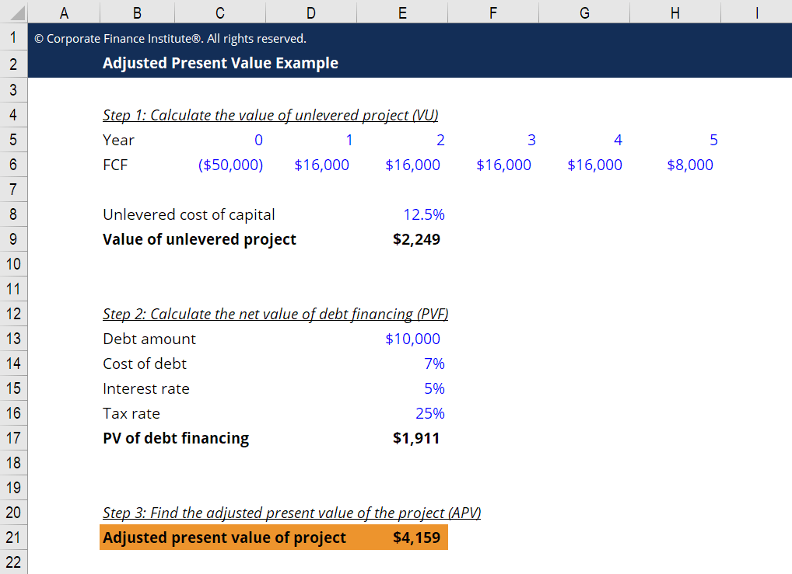

## Table of Contents

## What is Adjusted Present Value (APV)?

Adjusted Present Value (APV) is a way to figure out how much a company or a project is worth. It does this by breaking down the value into two parts: the value of the company if it had no debt, and the value that comes from using debt to finance the company. This method is helpful because it lets you see the effects of debt separately from the business's operations.

To use APV, you start by calculating the present value of the company's cash flows as if it were all-equity financed. Then, you add the value of the tax benefits from using debt, and subtract any costs related to financial distress that might come from having debt. This gives you a clearer picture of how financing decisions affect the company's value, making it easier to make smart choices about how to fund the business.

## How does APV differ from other valuation methods like WACC?

Adjusted Present Value (APV) and Weighted Average Cost of Capital (WACC) are two different ways to figure out how much a company or project is worth. APV looks at the value of the company if it had no debt, and then adds the value of the tax benefits from using debt. This means you can see the effects of debt separately from the business's operations. On the other hand, WACC mixes the cost of equity and the cost of debt into one number, and uses that to discount the company's future cash flows. This approach assumes that the company's capital structure stays the same over time.

The big difference between APV and WACC is how they handle changes in the company's debt levels. With APV, you can easily adjust the value if the company changes how much debt it uses because you add the tax benefits of debt separately. But with WACC, if the company's debt changes, you have to recalculate the whole WACC, which can be tricky. APV is often used when a company's debt levels are expected to change a lot, or when the company is in a situation where it can take advantage of tax benefits from debt in a special way.

## What are the key components of the APV formula?

The APV formula has two main parts that help figure out a company's value. The first part is the value of the company if it had no debt at all. This is called the unlevered value. To find this, you look at the company's future cash flows and figure out what they're worth today, without considering any debt. This gives you a clear picture of how much the business itself is worth, without any financial tricks.

The second part of the APV formula adds in the effects of using debt. This includes the tax benefits that come from being able to deduct interest payments on debt from the company's taxes. But it also subtracts any costs that might come from having debt, like the risk of going bankrupt. By adding these two parts together, the APV formula gives you a total value that shows how much the company is worth, taking into account both its business operations and its financing choices.

## Can you explain the step-by-step process of calculating APV?

To calculate the Adjusted Present Value (APV), start by figuring out the value of the company if it had no debt at all. This is called the unlevered value. You do this by looking at the company's future cash flows and figuring out what they're worth today, without considering any debt. You use a discount rate that matches the risk of the company's operations to find this value. This step gives you a clear picture of how much the business itself is worth, without any financial tricks.

Next, you add the effects of using debt to the unlevered value. The main effect to consider is the tax benefits that come from being able to deduct interest payments on debt from the company's taxes. You calculate the present value of these tax savings using the company's cost of debt as the discount rate. But you also need to subtract any costs that might come from having debt, like the risk of going bankrupt. These costs are harder to measure, but you should try to estimate them as best you can. By adding the unlevered value and the net effects of debt together, you get the total APV, which shows how much the company is worth, taking into account both its business operations and its financing choices.

## What types of financing benefits are typically included in APV calculations?

When calculating Adjusted Present Value (APV), the main financing benefit that's usually included is the tax savings from using debt. When a company borrows money, it can deduct the interest it pays on that debt from its taxes. This means the company pays less in taxes, which is a good thing. To figure out how much this tax benefit is worth, you look at the interest payments over time and calculate their present value using the company's cost of debt as the discount rate.

Sometimes, other financing benefits can be included in APV calculations too. For example, if a company gets a special deal on financing, like a lower interest rate, that can add value to the company. Or if a company can use debt to buy another company at a lower price because of tax benefits, that's another financing benefit to consider. These other benefits might not always be easy to measure, but if they're important, they should be included to get a full picture of the company's value.

## How do you determine the present value of tax shields in APV?

To find the present value of tax shields in APV, you first need to know how much interest the company will pay on its debt each year. Then, you figure out how much tax the company saves because of these interest payments. You do this by multiplying the interest payments by the company's tax rate. This gives you the annual tax savings from using debt.

Next, you need to figure out what these annual tax savings are worth today. You do this by calculating the present value of these savings over time, using the company's cost of debt as the discount rate. This means you're figuring out how much money you'd need today to get the same amount of tax savings in the future, taking into account the interest rate on the debt. By adding this present value of tax shields to the unlevered value of the company, you get a better idea of the company's total value with debt.

## What are some common scenarios where APV is particularly useful?

APV is really helpful when a company's debt levels change a lot. Imagine a company that's thinking about taking on more debt to buy another business. With APV, you can easily see how this new debt will affect the company's value. You start by figuring out the value of the company without any debt, then add the tax savings from the new debt. This way, you can see clearly how the new financing plan changes the company's worth.

Another time APV is useful is when a company is in a special tax situation. For example, if a company can get big tax breaks from using debt, APV helps show how valuable those tax breaks are. You calculate the value of the company without debt, then add the value of those tax savings. This makes it easier to understand how the company's tax situation affects its overall value.

## How does the choice of discount rate affect the APV calculation?

The choice of discount rate is really important when you're figuring out the Adjusted Present Value (APV). For the unlevered value part, you use a discount rate that matches the risk of the company's operations. This rate is usually the cost of equity for an all-equity company. If you pick a rate that's too high, the present value of the future cash flows will be lower, making the company seem less valuable. If you pick a rate that's too low, the present value will be higher, making the company seem more valuable than it really is.

For the tax shield part of APV, you use the company's cost of debt as the discount rate. This rate is what the company pays to borrow money. If you use a higher cost of debt, the present value of the tax savings will be lower because you're discounting them more. If you use a lower cost of debt, the present value of the tax savings will be higher. Getting the discount rate right for both parts of APV is key to making sure your calculation of the company's value is accurate.

## Can you provide a simple example of APV calculation for a beginner?

Let's say you have a small business that makes $100,000 every year. You want to figure out how much the business is worth if it has no debt. You think the business will keep making $100,000 each year forever, and you decide to use a 10% discount rate because that's what you think the risk of the business is. To find the present value of these future cash flows, you divide the yearly cash flow by the discount rate: $100,000 / 0.10 = $1,000,000. So, the value of your business without any debt is $1,000,000.

Now, let's say you decide to borrow $500,000 to help grow your business. The interest rate on this loan is 5%, and the tax rate for your business is 30%. Each year, you'll pay $25,000 in interest ($500,000 * 0.05), and because of the tax rate, you'll save $7,500 in taxes each year ($25,000 * 0.30). To find the present value of these tax savings, you use the cost of debt (5%) as the discount rate: $7,500 / 0.05 = $150,000. So, you add this $150,000 to the $1,000,000 you calculated before. The total value of your business, taking into account the tax savings from the debt, is now $1,150,000.

## What are the limitations and potential pitfalls of using APV?

Using Adjusted Present Value (APV) can be tricky because it relies on a lot of guesses and assumptions. For example, you have to guess what the future cash flows will be, what the right discount rate is, and how much tax savings you'll get from using debt. If any of these guesses are wrong, your calculation of the company's value could be way off. Also, figuring out the costs of having debt, like the risk of going bankrupt, can be really hard to do accurately. These costs are important to include in APV, but they're not easy to measure.

Another problem with APV is that it can be more complicated than other methods like WACC. You have to do two separate calculations: one for the value of the business without debt, and another for the effects of using debt. This can be confusing, especially for people who are new to figuring out how much a business is worth. If you make a mistake in either part of the calculation, your final number for the company's value won't be right. So, while APV can give you a detailed look at how debt affects a company's value, it's important to be careful and check your work to avoid mistakes.

## How can APV be adjusted for international projects with different tax regimes?

When you're figuring out the value of a project in another country using APV, you have to think about the different tax rules in that country. Every country has its own way of taxing businesses, and these rules can change how much tax savings you get from using debt. For example, if the country has a higher tax rate, the tax savings from the interest on your debt will be bigger. So, you need to use the tax rate of the country where the project is to calculate the value of those tax savings.

Also, you might need to use different discount rates for the project because the risk can be different in another country. The cost of debt might be higher or lower, and the risk of the business itself might be different too. You should use the cost of debt that matches the country's interest rates to figure out the present value of the tax savings. By doing this, you can get a better idea of how much the project is worth, taking into account the special tax and financial situation of the country where it's located.

## What advanced techniques can be used to refine APV calculations for expert analysis?

When experts want to make APV calculations more accurate, they often use a method called scenario analysis. This means they look at different possible futures for the company, like what happens if the economy gets better or worse, or if interest rates go up or down. By figuring out the APV for each of these scenarios, experts can see how sensitive the company's value is to changes in the world around it. This helps them understand the risks better and make smarter decisions about the company's financing.

Another advanced technique is using Monte Carlo simulations. This is a fancy way of saying that experts use a computer to run the APV calculation many, many times, each time using slightly different numbers for things like future cash flows, discount rates, and tax savings. By doing this, they can see a range of possible outcomes for the company's value, not just one number. This gives them a better idea of how likely it is that the company will be worth a certain amount, and helps them plan for different possibilities.

## What is Understanding Adjusted Present Value (APV)?

Adjusted Present Value (APV) is a comprehensive financial valuation technique that provides a detailed assessment by distinguishing a project's or company's value into separate equity and debt components. This method diverges from the conventional Net Present Value (NPV) approach by individually evaluating the unlevered firm value and the net effects of debt, thus offering a more nuanced analysis of valuation, particularly in scenarios of complex financial structures.

### Unlevered Firm Value and Net Effect of Debt

The APV formula is expressed as:

$$
\text{APV} = \text{Unlevered Firm Value} + \text{Net Effect of Debt}
$$

1. **Unlevered Firm Value:** This represents the value of a company or project if it is entirely equity-financed, without the influence of debt. It reflects the core operations of the business without the financial implications introduced by leverage.

2. **Net Effect of Debt:** This component accounts for the benefits and costs associated with debt financing. Primarily, it includes the tax shield that arises from the interest deductibility of debt and any other financing effects such as costs of financial distress or subsidies.

### Distinction Between Operational and Financing Effects

A critical advantage of APV is its ability to distinctly separate operational performance from financing effects. This separation is particularly beneficial when evaluating entities with fluctuating capital structures or varying levels of leverage. By isolating these elements, stakeholders can achieve a clear understanding of a business’s operational efficiency and the effects of its capital structure on overall value.

### Benefits of APV in Financial Valuation

APV is especially effective in contexts of high leverage or when capital structures are anticipated to change over time. In such scenarios, traditional valuation methods like NPV or Discounted Cash Flow (DCF) may not adequately capture the benefits and costs associated with debt financing or shifts in financial strategy. APV, by contrast, provides:

- A clearer delineation of the intrinsic value of business operations, independent of capital structure.
- Better insights into the economic benefits derived from tax shields and other debt-related advantages.
- Enhanced flexibility and precision in assessing projects with significant financing elements or strategic financial maneuvers.

Overall, the APV approach equips financial analysts and investors with a powerful tool for valuation, facilitating more informed decisions by presenting a comprehensive picture of both operational and leveraged financial aspects.

## How do you calculate APV?

The Adjusted Present Value (APV) method provides a structured approach to evaluating a firm's value, particularly useful in cases of high leverage or fluctuating capital structures. The APV calculation process involves three key steps:

1. **Calculate the Firm's Value Assuming All-Equity Financing**: 
   Begin by determining the unlevered firm value, which represents the company's value if it were entirely financed by equity. This involves projecting the firm's free cash flows and discounting them at the unlevered cost of equity, also known as the company's cost of capital without debt influence. The formula to calculate this is:
$$
   \text{Unlevered Firm Value} = \sum \frac{FCF_t}{(1 + r_u)^t}

$$

   where $FCF_t$ is the free cash flow in year $t$ and $r_u$ is the unlevered cost of equity. This calculation can be efficiently done using Excel's NPV function for the projected cash flows.

2. **Account for the Tax Shield Benefits and Costs Associated with Debt Financing**: 
   The tax shield refers to the tax savings achieved from the deductibility of interest payments. To compute this, forecast the interest expenses and calculate the present value of the tax shield by discounting it at the same rate, often the firm's cost of debt. The relevant formula is:
$$
   \text{Tax Shield} = \sum \frac{T \cdot D_t \cdot r_d}{(1 + r_d)^t}

$$

   where $T$ is the corporate tax rate, $D_t$ is the debt, and $r_d$ is the cost of debt. Excel can assist in this calculation by leveraging functions like PV for present value determination.

3. **Sum These Components to Derive the APV**: 
   Finally, sum the unlevered firm value and the present value of the tax shield to find the APV:
$$
   \text{APV} = \text{Unlevered Firm Value} + \text{Tax Shield}

$$

This comprehensive approach allows for the separation of the operational value of the firm from the financing effects, providing clarity in valuation, especially useful for projects with varying financial structures. Excel's modeling capabilities, using built-in functions like NPV and PV, provide a practical toolset for executing these calculations, making it easier to adapt the APV method to different financial scenarios.

## What is APV in Algorithmic Trading?

The integration of the Adjusted Present Value (APV) in [algorithmic trading](/wiki/algorithmic-trading) offers a strategic advantage by enhancing the precision of valuation models used in trading strategies. APV's unique ability to separate the effects of financing from operational aspects makes it especially useful for traders dealing with scenarios involving high leverage or varying financial structures.

### Optimizing Capital Structure
Traders leverage algorithms to optimize capital structure by dynamically adjusting to changes in interest rates, tax regulations, or market conditions. APV assists in this optimization by evaluating the tax shield benefits of debt financing, which are crucial in calculating the true economic value of investments. The formula for APV is:

$$
\text{APV} = V_u + \text{PV (Tax Shield)}
$$

where $V_u$ is the value of the firm if it were all-equity financed, and $\text{PV (Tax Shield)}$ represents the present value of tax savings due to debt.

Advanced trading algorithms can automate the calculation of these components, enabling the timely assessment and rebalancing of portfolios to align with optimal capital structures. The use of [machine learning](/wiki/machine-learning) models further refines these calculations by predicting shifts in market dynamics and recalibrating the inputs of the APV model.

### Evaluating Complex Investments
In algorithmic trading, complex investments often require nuanced valuation techniques to ensure accurate pricing. APV provides a more granular approach compared to traditional methods by isolating the effects of finance from intrinsic business operations. For instance, traders can use APV to evaluate mergers, acquisitions, or leveraged buyouts where debt levels may transition sharply.

By incorporating APV within algorithmic models, traders can simulate scenarios under various capital structures and interest environments, testing the resiliency of investment strategies. Algorithmic platforms like Python can be utilized to perform these evaluations through libraries such as NumPy and Pandas, which handle large data sets and perform complex calculations efficiently.

### Trading Strategy Development
APV's role in developing robust trading strategies involves accounting for financial scenarios that might impact asset valuation. By using APV, traders can better anticipate the effects of financial policy changes or economic downturns. Algorithmic trading models can integrate APV to forecast these changes and optimize decision-making.

#### Example of Algorithmic Integration
An algorithmic trading system using APV might include the following simplified Python snippet to calculate APV dynamically:

```python
import numpy as np

def calculate_apv(enterprise_value, tax_rate, debt, interest_rate):
    # Calculate the unlevered value of the firm
    unlevered_value = enterprise_value - debt

    # Calculate the present value of the tax shield
    pv_tax_shield = (tax_rate * interest_rate * debt) / (1 + interest_rate)

    # Derive APV
    apv = unlevered_value + pv_tax_shield
    return apv

enterprise_value = 1000000  # example value in dollars
tax_rate = 0.3  # 30% tax rate
debt = 500000  # example debt value in dollars
interest_rate = 0.05  # 5% interest rate

apv_value = calculate_apv(enterprise_value, tax_rate, debt, interest_rate)
print(f"The Adjusted Present Value is: ${apv_value}")
```

### Case Studies
One illustrative case study involves a financial institution implementing APV in its automated trading algorithms to manage a portfolio of leveraged buyouts. By quantifying the benefits and drawbacks of debt financing, the institution optimized its trading positions, resulting in improved risk-adjusted returns during volatile market conditions.

Another example is an investment firm using APV to adjust its holdings in response to macroeconomic shifts, such as tax reforms or [interest rate](/wiki/interest-rate-trading-strategies) changes, demonstrating the method’s versatile application.

By integrating APV into algorithmic trading frameworks, traders are equipped with a powerful tool to make informed decisions that adjust for both the operational and financial dimensions of value, enhancing their strategic capabilities in diverse financial markets.

## References & Further Reading

[1]: Damodaran, A. (1994). ["Valuation: Measuring and Managing the Value of Companies,"](https://books.google.com/books/about/Valuation.html?id=fGXjDwAAQBAJ) Wiley Finance.

[2]: Fernandez, P. (2007). ["Valuing Companies by Cash Flow Discounting: Ten Methods and Nine Theories."](https://www.emerald.com/insight/content/doi/10.1108/03074350710823827/full/html) IESE Business School.

[3]: Feltham, G. A., & Ohlson, J. A. (1995). ["Valuation and Clean Surplus Accounting for Operating and Financial Activities."](https://www.semanticscholar.org/paper/Valuation-and-Clean-Surplus-Accounting-for-and-Feltham-Ohlson/10c8455b455134f1afeb0a6f9e71d0249f699f6a) Contemporary Accounting Research, 11(2), 689-731.

[4]: Merton, R. C. (1974). ["On the Pricing of Corporate Debt: The Risk Structure of Interest Rates."](https://onlinelibrary.wiley.com/doi/10.1111/j.1540-6261.1974.tb03058.x) The Journal of Finance, 29(2), 449-470.

[5]: Kaplan, S. N., & Ruback, R. S. (1995). ["The Valuation of Cash Flow Forecasts: An Empirical Analysis."](https://www.jstor.org/stable/2329344) The Journal of Finance, 50(4), 1059-1093.