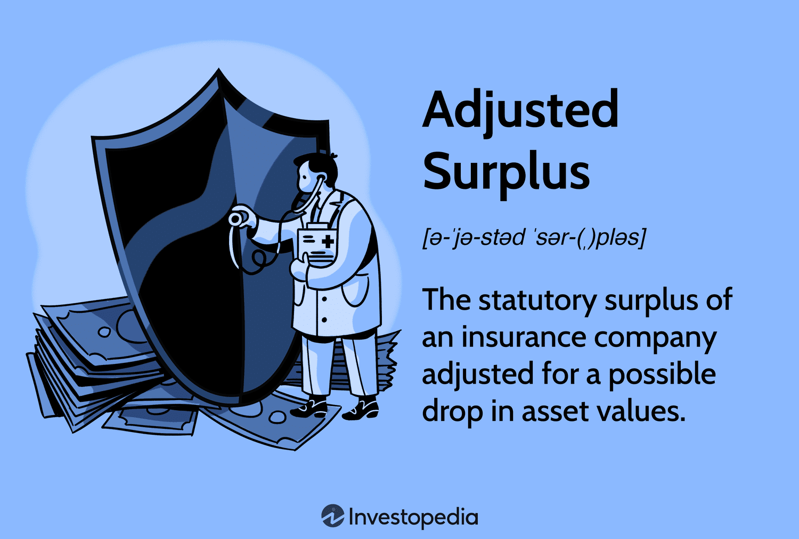

## Table of Contents

## What is the basic definition of Adjusted Surplus?

Adjusted Surplus is a term used in finance and insurance to describe the amount of money a company has left after it pays all its bills and sets aside money for future expenses. It's like checking how much money you have in your wallet after you've paid for your groceries and saved some for next month's rent. For insurance companies, this number is important because it shows how financially strong they are and how well they can handle unexpected costs.

In simpler terms, think of Adjusted Surplus as the extra money a business has after taking care of everything it needs to. This extra money can be used for new projects, investing, or as a safety net for tough times. For example, if an insurance company has a high Adjusted Surplus, it means they are in a good position to pay out claims even if many people need help at the same time.

## How is Adjusted Surplus calculated?

To calculate Adjusted Surplus, you start with the company's total surplus. This is the money left after all the bills are paid. Then, you make some adjustments. You subtract any money that's set aside for future expenses or liabilities that haven't been paid yet. You also add back any money that was used for investments or other non-operational activities. This gives you a clearer picture of the company's financial health.

For example, imagine a company has $100,000 in surplus. They have set aside $20,000 for future expenses and have $10,000 invested in stocks. To find the Adjusted Surplus, you would subtract the $20,000 set aside, leaving $80,000. Then, you add back the $10,000 from investments, which brings the Adjusted Surplus to $90,000. This number shows how much money the company really has available for unexpected costs or new projects.

## Why is Adjusted Surplus important in financial analysis?

Adjusted Surplus is important in financial analysis because it gives a clear picture of how financially healthy a company is. It tells you how much money the company has left after paying all its bills and setting aside money for future needs. This number is like checking your wallet to see how much money you have for fun stuff after you've paid your rent and saved some money for next month. For companies, especially insurance companies, this is crucial because it shows if they can handle unexpected costs or if they might run into trouble.

When analysts look at Adjusted Surplus, they can see how well a company is doing and make better decisions. If a company has a high Adjusted Surplus, it means they are in a good spot to invest in new projects, grow their business, or help out customers if something goes wrong. On the other hand, a low Adjusted Surplus might mean the company needs to be more careful with spending or find ways to bring in more money. This helps investors, managers, and others understand the company's financial strength and plan for the future.

## Can you explain the difference between Surplus and Adjusted Surplus?

Surplus is like the money left in your piggy bank after you've paid for all your bills and expenses. It's what you have left over after everything is taken care of. For a company, this means the money they have after paying all their costs and liabilities. It's a simple way to see how much money is left, but it doesn't tell the whole story because it doesn't consider money set aside for future expenses or money used for investments.

Adjusted Surplus, on the other hand, is a more detailed look at a company's financial health. It starts with the Surplus but then makes some changes to give a clearer picture. You subtract any money set aside for future expenses, which means you're not counting money that's already promised for something else. Then, you add back any money that was used for investments or other non-operational activities. This way, Adjusted Surplus shows how much money the company really has available for new projects or unexpected costs, giving a better idea of their financial strength.

## What are the common adjustments made to calculate Adjusted Surplus?

When calculating Adjusted Surplus, the first common adjustment is subtracting any money that's been set aside for future expenses or liabilities. This means taking away money that's already promised for things like future claims in insurance companies or upcoming bills. By doing this, you get a clearer picture of what money is truly available right now, not what's being saved for later.

The second common adjustment is adding back any money that was used for investments or other non-operational activities. This could be money put into stocks, bonds, or other investments that aren't part of the company's day-to-day business. By adding this money back, you see how much the company could have if they needed to use those investments, giving a better idea of their financial strength and flexibility.

## How does Adjusted Surplus impact a company's financial health?

Adjusted Surplus is like a health check for a company's money. It shows how much money the company has after paying all its bills and setting aside money for future needs. If a company has a high Adjusted Surplus, it means they are doing well financially. They have enough money to handle unexpected costs, invest in new projects, or grow their business. It's like having extra money in your pocket after you've paid for everything you need to, so you can do fun things or save for something big.

On the other hand, if a company has a low Adjusted Surplus, it might mean they need to be careful with their spending. They might not have enough money to cover unexpected costs or to start new projects. It's like having just enough money for your bills and not much left over. This can make it hard for the company to grow or handle tough times. So, Adjusted Surplus is a key number that helps everyone see how strong a company's financial health really is.

## In what industries is Adjusted Surplus most commonly used?

Adjusted Surplus is most commonly used in the insurance industry. Insurance companies need to show how much money they have to pay out claims if something goes wrong. By looking at their Adjusted Surplus, they can prove they have enough money to cover these costs. It's important for them to have a high Adjusted Surplus because it shows they are financially strong and can help their customers when they need it.

Another industry where Adjusted Surplus is used is in banking and financial services. Banks need to show they have enough money to cover their loans and other financial obligations. A high Adjusted Surplus means they can handle unexpected financial problems and keep their customers' money safe. It helps them plan for the future and make sure they are ready for any challenges that come their way.

## What are the limitations of using Adjusted Surplus as a financial metric?

Adjusted Surplus is a helpful way to see how much money a company has left after paying its bills and setting money aside for the future. But it has some limitations. One big limitation is that it doesn't show the whole picture of a company's financial health. It only looks at the money left over, not at how the company makes money or how it spends money day-to-day. This means it might not catch problems like if the company is spending too much or if its income is going down.

Another limitation is that Adjusted Surplus can change a lot from one year to the next. This can make it hard to use it to predict how the company will do in the future. For example, if a company has a high Adjusted Surplus one year because of a one-time event, like selling a big asset, it might not mean they will have that much money every year. This makes it tricky for people trying to plan or invest in the company, because they need to look at more than just this one number to understand the company's financial situation fully.

## How does Adjusted Surplus relate to other financial metrics like EBITDA?

Adjusted Surplus and EBITDA (Earnings Before Interest, Taxes, Depreciation, and Amortization) are both important financial metrics, but they show different things about a company's money. Adjusted Surplus is like checking how much money a company has left after paying all its bills and setting some aside for the future. It's a way to see if the company has enough money to handle unexpected costs or to start new projects. On the other hand, EBITDA looks at how much money a company makes from its main business before taking away costs like interest, taxes, and the wear and tear on its equipment. It's a way to see how well the company's core business is doing without worrying about how it's financed or how old its equipment is.

While Adjusted Surplus gives a snapshot of a company's financial health at a specific time, EBITDA gives a picture of the company's operating performance over a period of time. For example, if a company has a high Adjusted Surplus, it means they have a good cushion of money to fall back on. But if their EBITDA is low, it might mean their main business isn't doing so well, even if they have money saved up. Both metrics are useful, but they tell different parts of the story. Adjusted Surplus helps you see if the company can handle surprises, while EBITDA helps you understand if the company's main business is strong.

## Can you provide a real-world example of how Adjusted Surplus is applied in business decision-making?

Imagine an insurance company called SafeGuard Insurance. They want to start a new branch in another city, but they need to make sure they have enough money to do it without risking their financial health. SafeGuard looks at their Adjusted Surplus to see how much money they have left after paying all their bills and setting aside money for future claims. They find out their Adjusted Surplus is high, which means they have a good amount of extra money. This gives them the confidence to go ahead with their plan to open the new branch, knowing they can handle any unexpected costs that might come up.

In another example, let's say a bank called FirstBank is thinking about giving out more loans to help people buy homes. They check their Adjusted Surplus to see if they have enough money to cover these new loans if people can't pay them back right away. FirstBank sees that their Adjusted Surplus is low, which means they don't have much extra money. Because of this, they decide to be more careful and not give out as many loans as they planned. This helps them avoid financial trouble and keep their customers' money safe.

## What advanced techniques can be used to refine the calculation of Adjusted Surplus?

To make the calculation of Adjusted Surplus more accurate, companies can use something called stress testing. This is like imagining what would happen if really bad things happened, like a big storm or a lot of people needing help at the same time. By doing this, they can see if their Adjusted Surplus would still be enough to cover these big problems. It helps them understand how much money they really need to keep safe and ready for tough times.

Another advanced technique is using predictive analytics. This is like using a crystal ball to guess what might happen in the future. Companies can look at past data and use special math to predict how much money they will need for future bills and unexpected costs. By adding these predictions to their Adjusted Surplus calculation, they can make better plans and be more ready for whatever comes next.

## How do regulatory changes affect the calculation and relevance of Adjusted Surplus?

Regulatory changes can have a big impact on how companies calculate and use Adjusted Surplus. When the rules change, companies might have to set aside more money for future costs or change how they count their money. For example, if new rules say insurance companies need to keep more money ready for claims, this could lower their Adjusted Surplus because they have to save more money for the future. This means they might not have as much money left over for new projects or to handle unexpected costs.

Even though regulatory changes can make the calculation of Adjusted Surplus more complicated, they also help make sure that companies are being safe with their money. By following the new rules, companies can show that they are financially strong and ready for anything that might happen. This makes Adjusted Surplus a very important number for regulators, investors, and the companies themselves, because it helps everyone understand if the company is in a good financial position or if they need to be more careful with their spending.

## What is Understanding Economic Surplus?

Economic surplus, also known as total surplus, is a fundamental concept in economics, representing the total net benefits that consumers and producers receive from participating in a market. It is an essential measure of societal welfare and market efficiency, providing critical insights into how well markets are functioning.

### Components of Economic Surplus

Economic surplus comprises two primary components: consumer surplus and producer surplus.

1. **Consumer Surplus**: This represents the difference between what consumers are willing to pay for a good or service and what they actually pay. It measures the benefit to consumers from buying goods at market prices lower than the maximum price they are willing to pay. Mathematically, consumer surplus can be calculated as the area under the demand curve above the actual price level, extended to the quantity purchased.

   For a linear demand curve, consumer surplus (CS) can be represented as:
$$
   CS = \frac{1}{2} \times (Q_d) \times (P_{max} - P)

$$
   where $Q_d$ is the quantity demanded, $P_{max}$ is the maximum price consumers are willing to pay, and $P$ is the actual price.

2. **Producer Surplus**: This represents the difference between the price producers receive for a good or service and the minimum price they are willing to accept. It reflects the benefit to producers from selling goods at market prices higher than their minimum acceptable price. Producer surplus is calculated as the area above the supply curve and below the market price level.

   Producer surplus (PS) for a linear supply curve can be expressed as:
$$
   PS = \frac{1}{2} \times (Q_s) \times (P - P_{min})

$$
   where $Q_s$ is the quantity supplied, $P_{min}$ is the minimum price producers are willing to accept, and $P$ is the market price.

### Economic Surplus as a Measure of Welfare and Efficiency

Economic surplus serves as a pivotal measure of economic welfare. The total economic surplus is the sum of consumer and producer surpluses and indicates how well resources are allocated in an economy. Markets are deemed efficient when they maximize total economic surplus, achieving Pareto efficiency where no further reallocation of resources can make someone better off without making someone else worse off.

A perfectly competitive market in equilibrium tends to maximize economic surplus, signifying an optimal distribution of goods and services. When markets achieve this state, resources are utilized most efficiently, benefiting both consumers and producers.

### Implications of Maximizing Economic Surplus

Maximizing economic surplus has several crucial implications:

- **Market Equilibrium**: Achieving a market equilibrium where supply equals demand results in the maximization of economic surplus. This balance ensures that the quantity of goods supplied matches the quantity demanded, minimizing waste and inefficiencies.

- **Societal Welfare**: By maximizing economic surplus, societal welfare is enhanced. Consumers can enjoy goods and services at prices they are willing to pay, while producers receive fair compensation above their minimum thresholds, fostering a healthy economic environment.

- **Policy Considerations**: Policymakers often aim to maximize economic surplus through interventions such as subsidies, taxes, or regulations. These tools can correct market failures, redistribute surplus, or address power imbalances between consumers and producers.

In conclusion, economic surplus is a vital indicator of market efficiency and welfare, capturing the mutual benefits of market exchanges. Understanding its components and implications helps in designing policies and market strategies that promote optimal economic outcomes.

## What are the economic implications of a financial surplus?

A financial surplus occurs when an entity’s revenue surpasses its expenditures over a given period. This situation is often represented by the formula:

$$
\text{Financial Surplus} = \text{Total Revenue} - \text{Total Expenditures}
$$

When revenue is greater than expenditures, the result is a positive value, indicating a surplus.

**Government Implications:**

For governments, financial surpluses can indicate prudence in fiscal policy and effective management of public resources. Surpluses can be used to reduce public debt, fund infrastructure projects, or enhance social welfare programs. They serve as a buffer against economic downturns, ensuring stability in public services. However, challenges such as deciding the optimal allocation of surplus funds and addressing public pressure for increased spending or tax cuts can arise.

**Business Implications:**

In business, a financial surplus is a sign of sound management and operational efficiency. It provides opportunities for reinvestment into business operations, research and development, or expansion ventures. Surpluses can also be distributed to shareholders as dividends, improving investor confidence. However, like governments, businesses face challenges in optimal surplus utilization, balancing reinvestment and shareholder returns with saving for future uncertainties.

**Challenges and Opportunities in Managing Financial Surpluses:**

Both governmental and business entities must address the challenge of appropriate surplus allocation. Mismanagement can lead to inefficient investments or missed opportunities for future growth. One key opportunity lies in strategic investment that yields sustainable growth or enhances economic resiliency. Additionally, maintaining transparent and accountable surplus management can bolster stakeholder trust and support.

In summary, financial surpluses, when managed effectively, can facilitate growth and stability for both governments and businesses. However, the strategic allocation of surpluses represents a critical challenge that requires careful consideration and planning.

## References & Further Reading

1. **Economic Surplus and Market Efficiency**  
   - Varian, H. R. (1992). *Microeconomic Analysis* (3rd ed.). W. W. Norton & Company. [Link](https://books.google.com/books?id=hwK8CwAAQBAJ)
   - Harberger, A. C. (1954). Monopoly and Resource Allocation. *The American Economic Review*, 44(2), 77-87. [Link](https://www.jstor.org/stable/1819367)

2. **Adjusted Surplus in Insurance Context**  
   - Cummins, J. D., & Harrington, S. E. (Eds.). (1987). *Fair Rate of Return in Property-Liability Insurance*. Springer. [Link](https://books.google.com/books?id=J8ZEDwAAQBAJ)
   - Phillips, R. D., & Cummins, J. D. (1995). Financial Pricing of Insurance in the Multiple-Line Insurance Company. *The Journal of Risk and Insurance*, 62(4), 760-767. [Link](https://doi.org/10.2307/253592)

3. **Financial Surplus and Economic Implications**  
   - Keynes, J. M. (1936). *The General Theory of Employment, Interest and Money*. Palgrave Macmillan. [Link](https://www.marxists.org/reference/subject/economics/keynes/general-theory/)
   - Mankiw, N. G. (2019). *Principles of Economics* (8th ed.). Cengage Learning. [Link](https://books.google.com/books?id=s64qnwEACAAJ)

4. **Algorithmic Trading and Market Dynamics**  
   - Aldridge, I. (2013). *High-Frequency Trading: A Practical Guide to Algorithmic Strategies and Trading Systems*. John Wiley & Sons. [Link](https://books.google.com/books?id=miekMkvWeV0C)
   - Narang, R. K. (2009). *Inside the Black Box: The Simple Truth About Quantitative Trading*. John Wiley & Sons. [Link](https://books.google.com/books?id=PxLTIsCnJ4IC)

5. **Intersecting Economic Theories and Algorithmic Strategies**  
   - Treleaven, P., Galas, M., & Lalchand, V. (2013). Algorithmic Trading Review. *Communications of the ACM*, 56(11), 76-85. [Link](https://doi.org/10.1145/2507771.2507785)
   - Easley, D., López de Prado, M. M., & O'Hara, M. (2012). Flow Toxicity and Liquidity in a High-Frequency World. *The Review of Financial Studies*, 25(5), 1457-1493. [Link](https://doi.org/10.1093/rfs/hhr086)

6. **General Resources for Further Exploration**
   - Samuelson, P. A., & Nordhaus, W. D. (2009). *Economics* (19th ed.). McGraw-Hill Education. [Link](https://books.google.com/books?id=Gu7ErgEACAAJ)
   - Hull, J. C. (2018). *Options, Futures, and Other Derivatives* (10th ed.). Pearson. [Link](https://books.google.com/books?id=TFXStAEACAAJ)

