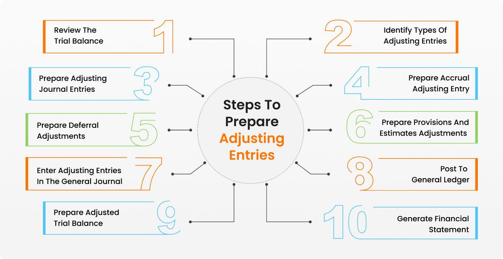

Adjusting journal entries play an indispensable role in financial reporting and accounting by ensuring the accuracy and integrity of financial records. They are fundamental in aligning financial data with the timing of transactions, thereby bridging the gap between cash and accrual accounting methods. Adjusting entries allow businesses to more precisely reflect their financial position and performance by including revenues and expenses that have occurred but have not yet been recorded. This ensures that financial statements present a true and fair view of the company’s economic activities during a specific period.

This article explores adjusting journal entries, emphasizing their criticality in financial reporting. It also examines the connection between these entries and their impact on various fields, such as accounting and algorithmic trading. As the financial landscape becomes increasingly data-driven, understanding how to implement and interpret adjusting journal entries becomes crucial for decision-makers and stakeholders who rely on accurate financial statements to inform strategic actions.



## Table of Contents

## Understanding Adjusting Journal Entries

Adjusting journal entries are pivotal in the accounting process, ensuring that financial statements genuinely reflect a company's financial position at the end of an accounting period. They are used to account for incomes and expenses that have occurred but are not yet recorded within the accounting period, thereby making financial statements more reliable and accurate.

These entries are crucial for the transition from cash basis accounting to accrual basis accounting. In cash basis accounting, transactions are recorded only when cash is exchanged. This method can obscure the true financial health of an organization because it fails to account for all economic activities within a given period. On the other hand, accrual accounting, which is more widely used and accepted under Generally Accepted Accounting Principles (GAAP) and International Financial Reporting Standards (IFRS), records revenues and expenses when they are earned or incurred, regardless of when the cash is actually received or paid.

Adjusting entries serve to ensure that financial statements adhere to the revenue recognition principle. This accounting principle dictates that revenue should be recognized in the financial statements when it is earned, not necessarily when cash is received. Similarly, expenses should be recorded when they contribute to revenue generation, aligning expenditures with the associated revenues they help to generate, an application of the matching principle.

Typically, adjusting journal entries fall into several categories: accruals, deferrals, and estimates. Each category has its unique role in accurate financial reporting.

- **Accruals** involve revenues earned or expenses incurred but not yet reflected in the cash account. For example, a company may deliver a service in December but not bill for it until January. The adjusting entry would record the revenue in December when the service was provided.

- **Deferrals** relate to cash received or paid in advance, which should be recognized as revenue or expense in future periods. For instance, if a company receives prepayment for a subscription service to be delivered over the next year, the initial cash receipt should be deferred and recognized as revenue throughout the service period.

- **Estimates** assist in recognizing non-cash items such as depreciation. These entries are made to allocate the cost of assets over their useful life. For instance, if a piece of equipment costing $10,000 is expected to be useful for 10 years, with no salvage value, an adjusting entry would record a monthly depreciation expense of $83.33 ($10,000 / 120 months).

Adjusting journal entries require thorough documentation and a strong understanding of an organization's transactions to ensure accuracy in financial reporting. Properly executed, they provide a comprehensive picture of an organization's financial activities, allowing stakeholders to make informed decisions based on precise financial data.

## Types of Adjusting Journal Entries

Adjusting journal entries are crucial for ensuring that financial statements accurately represent a company's financial position by aligning financial reporting with the appropriate accounting period. These adjustments are primarily classified into three types: accruals, deferrals, and estimates.

Accruals are adjustments for revenues and expenses that have been incurred but not yet recorded in the accounts. They are essential in applying the accrual-based accounting system, which recognizes financial events when they occur rather than when cash transactions happen. For example, if a company delivers a service in December but does not receive payment until January, an accrual entry will record the revenue in December to match the service period. Similarly, accrued expenses such as wages or interest owed but unpaid must be recorded to accurately represent liabilities.

Deferrals, on the other hand, involve postponing the recognition of revenues or expenses to a future period when they are actually earned or incurred. This is important for matching revenues with expenses in the correct accounting period, adhering to the matching principle. Prepaid expenses, such as insurance premiums paid in advance, are initially recorded as assets and expensed over the period they are related to. Conversely, unearned revenue, like a subscription service payment received upfront, is recorded as a liability and gradually recognized as revenue over the subscription duration.

Estimates are used to account for non-cash items that do not involve direct cash payments but affect financial statements. A common example is depreciation, which allocates the cost of tangible and intangible assets over their useful lives. This systematic allocation reflects the consumption of an asset's economic benefits. Depreciation is calculated using various methods, such as straight-line or declining balance, depending on the asset's nature and usage. A formula for annual straight-line depreciation is:

$$
\text{Depreciation Expense} = \frac{\text{Cost of Asset} - \text{Residual Value}}{\text{Useful Life}}
$$

These entries ensure that financial reports provide an accurate depiction of an entity’s financial situation, complying with accounting standards and guidelines. Whether using traditional methods or automated calculation tools, effectively managing these adjustments is vital for transparent and reliable financial reporting.

## Importance of Adjusting Journal Entries in Financial Reporting

Adjusting journal entries play a pivotal role in financial reporting by ensuring that financial statements accurately capture the economic activities of a specified period. This accuracy is not only crucial for maintaining transparency and trust among stakeholders, but it also forms the foundation for informed decision-making. Financial statements serve as a primary tool for investors, creditors, and management, allowing them to assess the financial health and performance of an organization effectively. Thus, the precision lent by adjusting journal entries can directly influence investment decisions, credit evaluations, and strategic planning.

One core function of adjusting journal entries is their role in compliance with fundamental accounting principles, particularly the matching principle and the revenue recognition principle. The matching principle stipulates that expenses should be recognized in the same period as the revenues they help to generate. For example, if a company incurs utility expenses in December 2023 related to operations in November 2023, an adjusting entry is necessary to record this expense in November 2023, ensuring that the financial statements reflect a precise relationship between revenues and related expenses.

Similarly, the revenue recognition principle requires that revenue be recognized when it is earned, not necessarily when cash is received. This principle is crucial for presenting an accurate financial performance of a company within a specific accounting period. For instance, if a service company provides a service in November but receives payment in December, an adjusting journal entry is necessary to recognize the revenue in November when the service was performed, rather than in December when the payment was received.

More technically, adjusting journal entries can be expressed using accounting equations. For example, if a business needs to accrue an expense, such as wages payable that have not yet been paid at the end of the accounting period, the following adjusting journal entry is made:

$$
\text{Debit: Wages Expense} \quad - \text{This increases the expense account on the income statement}
$$

$$
\text{Credit: Wages Payable} \quad - \text{This increases the liability account on the balance sheet}
$$

By recording such adjustments, financial statements present a comprehensive and transparent view of a company's financial activities, thereby enhancing the reliability and comparability of financial information. This process fosters consistency across reporting periods, enabling stakeholders to accurately track performance over time.

In conclusion, adjusting journal entries are not merely technical requirements but essential components of financial reporting that support complex decision-making and compliance frameworks. They contribute significantly to the integrity and usefulness of financial statements, shaping the perceptions and actions of a company's internal and external stakeholders.

## Real-World Example of an Adjusting Journal Entry

Consider a scenario where a company has taken out a loan amounting to $100,000 with an annual [interest rate](/wiki/interest-rate-trading-strategies) of 12%, requiring quarterly interest payments. To maintain accurate financial records, the company must record interest expenses monthly, even though the payments are due quarterly. This ensures that the financial statements precisely reflect the expenses incurred during each month.

### Calculation of Monthly Interest Accrual

The annual interest on the loan is calculated as:

$$
\text{Annual Interest} = \text{Loan Amount} \times \text{Interest Rate} = 100,000 \times 0.12 = 12,000
$$

Since interest accrues monthly, the company must recognize:

$$
\text{Monthly Interest} = \frac{\text{Annual Interest}}{12} = \frac{12,000}{12} = 1,000
$$

### Adjusting Journal Entry

At the end of each month, the company records an adjusting journal entry to account for the accruing interest expense. The entry is as follows:

- **Debit:** Interest Expense $\$1,000$
- **Credit:** Interest Payable $\$1,000$

This entry increases the interest expense recorded on the income statement, reflecting the cost for that month, and adds to the interest payable on the balance sheet, acknowledging the future obligation.

### Impact on Financial Statements

- **Income Statement:** The monthly recognition of interest expense aligns with the accounting principle of matching, which requires that expenses be matched to the revenues they generate within the same period. In this case, the monthly accrual ensures that the expense is recognized in the financial statements during the period when the liability is incurred, thereby providing a more accurate depiction of the company's profitability.

- **Balance Sheet:** The recorded interest payable represents a liability that signifies the company’s obligation to pay interest in the future. This is crucial for stakeholders who assess the company’s liquidity and financial health.

By adjusting for interest expenses monthly, the company not only complies with accrual accounting principles but also provides transparent and timely financial information that supports investor confidence and informed decision-making.

## Interaction with Algo Trading

In [algorithmic trading](/wiki/algorithmic-trading), accurate financial statements play a vital role in the development and efficacy of trading algorithms. These algorithms rely on historical and real-time data to make decisions, often executing trades at speeds beyond human capability. Adjusting journal entries ensure that financial records accurately reflect a company’s financial status, providing reliable data inputs for these algorithms.

Financial discrepancies or errors, if left unadjusted, could lead to faulty analysis, adversely affecting algorithmic trading strategies. For example, failure to record accrued expenses might overstate a company's financial health, misleading algorithms that rely on earnings data as a metric for buy or sell decisions.

Algorithms typically incorporate financial ratios and metrics derived from financial statements to predict stock trends. A common metric used in algorithmic trading is the Price-to-Earnings (P/E) ratio, defined as:

$$
\text{P/E Ratio} = \frac{\text{Market Value per Share}}{\text{Earnings per Share (EPS)}}
$$

Accurate calculation of EPS hinges on precise financial data that includes adjusting journal entries to reflect true earnings for a period. Algorithms might integrate such ratios with [machine learning](/wiki/machine-learning) models to identify trading opportunities.

Here’s a simplified Python example to demonstrate how an algorithm might analyze adjusted financial data:

```python
def calculate_pe_ratio(market_value, adjusted_earnings):
    try:
        return market_value / adjusted_earnings
    except ZeroDivisionError:
        return float('inf')

market_value_per_share = 150
adjusted_earnings_per_share = 5.25  # Adjusted for accrued and deferred income

pe_ratio = calculate_pe_ratio(market_value_per_share, adjusted_earnings_per_share)
print(f'Adjusted P/E Ratio: {pe_ratio}')
```

In essence, adjusting journal entries not only ensure compliance with accounting standards but also enhance the quality of data used by algorithms. By providing a more accurate financial picture, they facilitate better algorithmic predictions and, ultimately, more successful trading outcomes.

## Conclusion

Adjusting journal entries are crucial for maintaining the precision and completeness of financial records, ultimately ensuring that financial statements accurately represent an organization's economic activities. This accuracy is indispensable for business operations and decision-making, as it influences both internal assessments and external perceptions of financial health. 

Incorporating adjusting journal entries aligns financial reporting with standard accounting principles, such as the accrual basis and matching principle. This alignment is essential for transparency and compliance, as it ensures that revenues and expenses are recognized in the periods they occur, rather than when cash transactions happen. This adjustment provides a more accurate financial narrative, aiding stakeholders in making informed decisions.

Furthermore, in the context of algorithmic trading, the precision of financial statements is paramount. Algorithms rely heavily on real-time, precise data to evaluate company performance and market trends. Misrepresented financial data due to unadjusted entries can lead to erroneous analyses and potentially costly trading decisions. By ensuring the accuracy of financial data through adjusting entries, organizations can both enhance their financial reporting and optimize algorithmic trading strategies, ultimately impacting long-term financial sustainability. 

Understanding and implementing adjusting journal entries correctly can profoundly affect an organization's financial integrity and operational efficacy. It is not merely a technical accounting procedure but a strategic component that bolsters the accuracy of financial communications and facilitates data-driven business decisions.

## References & Further Reading

[1]: ["Intermediate Financial Accounting"](https://open.umn.edu/opentextbooks/textbooks/417) by Gloria R. Romero

[2]: ["Financial Accounting Theory and Analysis: Text and Cases"](https://books.google.com/books/about/Financial_Accounting_Theory_and_Analysis.html?id=8F6LEAAAQBAJ) by Richard G. Schroeder and Myrtle W. Clark

[3]: ["Accounting for Decision Making and Control"](https://www.amazon.com/Accounting-Decision-Making-Control-Zimmerman/dp/125956455X) by Jerold Zimmerman

[4]: ["Financial Shenanigans: How to Detect Accounting Gimmicks & Fraud in Financial Reports"](https://www.amazon.com/Financial-Shenanigans-Fourth-Accounting-Gimmicks/dp/126011726X) by Howard Schilit, Jeremy Perler, and Yoni Engelhart

[5]: ["International Financial Reporting Standards (IFRS)"](https://www.ifrs.org/) - Official website of the IFRS Foundation

[6]: ["Generally Accepted Accounting Principles (GAAP)"](https://www.investopedia.com/terms/g/gaap.asp) - Financial Accounting Standards Board (FASB)

[7]: ["Advances in Financial Machine Learning"](https://www.amazon.com/Advances-Financial-Machine-Learning-Marcos/dp/1119482089) by Marcos Lopez de Prado

[8]: ["Quantitative Trading: How to Build Your Own Algorithmic Trading Business"](https://www.amazon.com/Quantitative-Trading-Build-Algorithmic-Business/dp/0470284889) by Ernest P. Chan