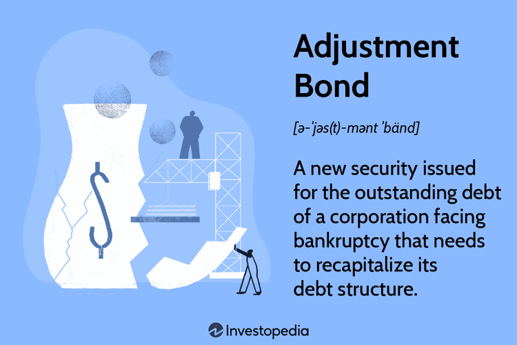

In the intricate and ever-evolving world of finance, understanding the operations and nuances of financial instruments is crucial. Among these instruments, bonds hold a significant position. Bonds are essentially loans made by investors to borrowers such as corporations or governments, in exchange for periodic interest payments and the return of the bond's face value at maturity. While traditionally bonds have offered a stable investment vehicle, their trading mechanisms are far from static.

This article examines how financial instruments, particularly bonds, are adjusted in financial markets and the transformative effect of algorithmic trading in optimizing bond trading. In the past, bond trading relied heavily on human judgment, which increased inefficiencies and the possibility of errors. With the advent of algorithmic trading, these processes have seen significant improvements. Pre-programmed algorithms can process and analyze enormous data sets swiftly, executing trades that might be too complex or time-consuming for human traders.



Algorithmic trading has not only revolutionized trading efficiency but has also opened up a new frontier in reducing human error. Algorithms can incorporate complex statistical models and machine learning to predict market movements, identify trading opportunities, and manage risks more effectively than traditional methods. In fact, the deployment of algorithms in bond markets has allowed for more dynamic and responsive trading strategies. With a foundation in strong risk management practices and compliance with regulatory frameworks, these algorithms ensure trading processes adhere to standards of transparency and fairness.

The article will cover fundamental concepts regarding the architecture of algorithms, their strategic functions in bond markets, and the vital role they play in executing trades with precision. By exploring the intersection of financial instruments and technological advancements, we aim to provide readers with a comprehensive understanding of how bond mechanisms are adjusted and optimized in modern financial markets. This exploration will draw on both the traditional characteristics of bond markets and the latest innovations that are driving financial markets forward.

## Table of Contents

## Understanding Financial Instruments and Bonds

Financial instruments are foundational elements in the world of finance, representing contracts that possess monetary value and are transferrable between parties. A fundamental understanding of these instruments is critical for effective investment and trading strategies. Among these, bonds are a prominent category, functioning as debt securities where an investor lends money to an issuer, typically a corporation or government, in return for periodic interest payments and the principal amount upon maturation.

Bonds come in various forms, each tailored to suit different investment strategies and risk profiles. Corporate bonds are issued by companies and generally offer higher interest rates than government bonds due to increased risk. Municipal bonds, issued by local government entities, often provide tax advantages, making them attractive to taxable investors. Government bonds, considered one of the safest investments, are backed by national governments and are usually employed by risk-averse investors.

The strategic significance of bonds in an investment portfolio lies in their ability to offer diversification. By adding bonds to a portfolio composed primarily of equities, investors can mitigate risks associated with stock market [volatility](/wiki/volatility-trading-strategies). Bonds generally exhibit an inverse relationship with stocks, often appreciating in value during periods of economic downturns when stocks may be declining. This counter-cyclical behavior helps stabilize overall portfolio returns and reduces exposure to market fluctuations.

Understanding the fundamental characteristics and classifications of bonds is essential for engaging with bond trading in financial markets. Bonds are evaluated based on several key parameters: yield, maturity, and credit quality. The yield of a bond, which represents the return on investment, can be calculated as:
$$
\text{Yield} = \frac{\text{Annual Coupon Payment}}{\text{Current Market Price}}
$$

The maturity, or duration, defines the length of time until the bond's principal amount is returned. It plays a crucial role in determining a bond's [interest rate](/wiki/interest-rate-trading-strategies) risk and sensitivity to interest rate changes. Credit quality, evaluated by credit rating agencies, indicates the likelihood of the issuer defaulting on its obligations. High-quality bonds (e.g., AAA-rated government bonds) offer lower yields but greater safety, whereas lower-rated bonds (e.g., junk bonds) come with higher yields and associated risks.

In conclusion, bonds are integral elements of financial markets, providing stability, income, and diversification. Understanding their characteristics and variants equips investors to make informed decisions, optimize their portfolios, and adequately hedge against market uncertainties.

## Adjustment Bonds and Their Mechanism

Adjustment bonds are financial instruments issued by companies experiencing financial distress, allowing them to manage and restructure their debt obligations without the need to file for bankruptcy. This type of bond provides a mechanism for companies to recapitalize their debt by converting existing liabilities into new bonds with altered conditions, such as adjusted interest rates and maturity periods.

The process of issuing adjustment bonds is typically characterized by negotiations between the issuers and the bondholders. These discussions are crucial as they aim to safeguard the company's ongoing viability while ensuring that creditors receive satisfactory returns. The structured agreement aims to align the interests of both parties during challenging financial periods.

One notable feature of adjustment bonds is that their interest payments are often connected to the company's earnings. This linkage is strategic in minimizing the risk of default during times of financial difficulty. By pegging interest obligations to performance, companies are provided with a buffer that allows them to meet financial commitments even when experiencing reduced [liquidity](/wiki/liquidity-risk-premium) or earnings.

Furthermore, there are tax incentives associated with adjustment bonds. The interest payments made on these bonds are typically deductible for tax purposes. This tax deductibility offers businesses a financial rationale to consider adjustment bonds as an alternative to bankruptcy, which can be more disruptive and costly. In doing so, companies can pursue restructuring in a manner that is beneficial to both the corporate entity and the bondholders, promoting a path towards financial stability.

Adjustment bonds serve as a valuable tool for companies navigating through fiscal challenges, assisting them in reorganizing their debt structures effectively. Their strategic placement within financial restructuring efforts is underscored by their flexible terms and potential tax benefits, making them an appealing option for distressed entities.

## Algorithmic Trading in Bond Markets

Algorithmic trading has fundamentally reshaped how bond markets operate, utilizing pre-programmed instructions to execute trades under optimized conditions. This approach enhances efficiency and reduces human bias, largely due to the capacity for high-speed data processing and decision-making. In bond markets, algorithms can process vast datasets to pinpoint trading opportunities, manage associated risks, and optimize portfolio allocations effectively.

### Components of Trading Algorithms

Algorithmic trading systems for bonds typically comprise several key components. The data analysis engine serves as the backbone, tasked with gathering and interpreting large volumes of data to identify market trends and potential trading opportunities. This engine uses inputs like historical market data, interest rate movements, and economic indicators to inform trading decisions.

Integrated into these systems are risk management modules designed to mitigate potential losses. These modules assess risk exposure and ensure compliance with pre-set risk tolerance levels. Features such as stop-loss orders, position size limits, and real-time risk assessments are common aspects of effective risk management strategies within these algorithms.

Order execution systems are another critical element. These systems handle the placement of buy or sell orders in the market. They are designed to minimize transaction costs and market impact while ensuring timely execution. Techniques such as slicing large orders into smaller trades or using time-weighted average price (TWAP) strategies can be employed to achieve this.

### Advanced Algorithms and Trading Effectiveness

Advanced trading algorithms leverage a combination of historical data analysis, predictive analytics, and dynamic strategies. Historical data analysis helps in understanding past market behaviors, which in turn aids in predicting future trends. Predictive analytics uses statistical algorithms and [machine learning](/wiki/machine-learning) techniques to forecast price movements and identify potential trading opportunities.

For example, a simple moving average (SMA) strategy might be employed, where the algorithm buys bonds when the current price exceeds the moving average and sells when it falls below. While simplistic, these strategies can evolve to incorporate complex machine learning models capable of identifying intricate market patterns.

```python
import numpy as np
import pandas as pd

# Example: Simple Moving Average Strategy
def moving_average_strategy(prices, window=20):
    prices['SMA'] = prices['Close'].rolling(window=window).mean()
    buy_signals = prices['Close'] > prices['SMA']
    sell_signals = prices['Close'] < prices['SMA']
    return buy_signals, sell_signals

# Example of usage
# prices = pd.DataFrame({'Close': bond_market_prices})
# buy_signals, sell_signals = moving_average_strategy(prices)
```

Dynamic strategies shift trading approaches based on real-time market conditions, allowing for adaptability. For instance, algorithms might alter their trading frequency or adjust risk exposure in response to increased market volatility, ensuring that the trading strategy remains robust across different market scenarios.

### Architecture of Algorithmic Trading Systems

An efficient [algorithmic trading](/wiki/algorithmic-trading) system is architected to support rapid data throughput and low-latency execution, crucial for capitalizing on transient market opportunities. Key architectural elements include:

1. **Data Feeds:** Reliable and fast data feeds are integral, supplying real-time market data and news essential for informed decision-making.

2. **Strategy Engine:** This component hosts trading algorithms, making decisions based on input data and pre-defined strategies.

3. **Order Management System (OMS):** Facilitates efficient trade execution and monitors orders across different markets or trading venues.

4. **Monitoring and Reporting:** Comprehensive reporting functionalities are vital for tracking performance metrics, ensuring compliance, and optimizing future trading strategies.

### Advantages of Algorithmic Trading

Algorithmic trading in bond markets offers numerous advantages, including increased efficiency in executing trades and the ability to process and analyze large datasets swiftly. By removing the emotional and psychological biases inherent in human trading, algorithms enable more consistent and rational decision-making processes.

Furthermore, these systems can operate 24/7, continuously scanning the markets for opportunities and adjusting positions as required. This persistent engagement ensures that portfolios remain aligned with strategic investment goals, even in rapidly changing market environments.

In summary, algorithmic trading has transformed bond markets by harnessing cutting-edge technology to streamline operations, minimize risks, and maximize returns through sophisticated data analysis and execution strategies.

## Risk Management and Optimization Algorithms

Risk management plays a pivotal role in the successful deployment of trading algorithms, serving as an essential [factor](/wiki/factor-investing) in minimizing potential financial losses and preserving the integrity of trading strategies. One of the primary strategies for risk management within algorithmic frameworks is the diversification of algorithm strategies. By employing a variety of models, each with its unique set of assumptions and market targets, diversification ensures that a failure or setback in one strategy does not disproportionately affect the overall trading performance. This approach helps distribute risk across different strategies, markets, or asset classes, thereby enhancing the resilience of trading operations.

The implementation of real-time risk assessment tools further augments an algorithm's capability to respond appropriately to volatile market conditions. These tools continuously monitor market data, detecting changes and potential risks that may affect trading positions. Additionally, stop-loss parameters are integrated into trading algorithms to automatically terminate a position once a specific price threshold is reached, thereby limiting potential losses.

Stress testing represents another critical component of risk management within algorithmic trading. This process involves simulating various market conditions to evaluate how trading strategies perform under extreme scenarios. Stress testing helps in identifying potential vulnerabilities and informs necessary strategic adjustments to bolster algorithm robustness.

Backtesting against historical market data is indispensable for refining and validating trading algorithms before deploying them in live markets. By analyzing how trading strategies would have performed in past market conditions, traders and developers can optimize algorithm parameters, reduce the likelihood of future errors, and enhance the reliability of algorithms in real trading environments. Python libraries such as `[backtrader](/wiki/backtrader)` and `pandas` provide extensive tools for running backtests, analyzing trading indicators, and fine-tuning algorithmic parameters.

```python
import backtrader as bt
import pandas as pd

# Define a basic moving average crossover strategy
class MovingAverageCrossover(bt.Strategy):
    params = (('short_period', 10), ('long_period', 30), )

    def __init__(self):
        # Short and long moving averages
        self.sma_short = bt.indicators.SimpleMovingAverage(self.data, period=self.params.short_period)
        self.sma_long = bt.indicators.SimpleMovingAverage(self.data, period=self.params.long_period)

    def next(self):
        if self.sma_short > self.sma_long:  # buy signal
            self.buy(size=100)
        elif self.sma_short < self.sma_long:  # sell signal
            self.close()

# Load historical data
data = bt.feeds.PandasData(dataname=pd.read_csv('historical_data.csv', parse_dates=True, index_col=0))

# Initialize cerebro, the backtrader engine
cerebro = bt.Cerebro()
cerebro.addstrategy(MovingAverageCrossover)

# Add data feed to the engine
cerebro.adddata(data)

# Run backtest
cerebro.run()

# Plot results
cerebro.plot()

```

Integrating these risk management practices into algorithmic frameworks facilitates improved trading outcomes by allowing trading strategies to adapt in real-time, remain robust under varying conditions, and consistently align with the user's risk appetite and investment goals. By continuously monitoring, adjusting, and testing these algorithms, traders can sustain optimal performance and capitalize on market opportunities while keeping potential downsides in check.

## Designing the Optimal Bond Portfolio

Bond portfolio optimization is a critical task for investors aiming to maximize returns while managing risk and adhering to specific financial goals. This complex process involves balancing yield, duration, and credit quality.

### Yield Curve Analysis

Understanding and analyzing the yield curve is central to bond portfolio optimization. The yield curve represents the relationship between bond yields and their maturities. It can be upward sloping (normal), downward sloping (inverted), or flat. Each configuration provides insights into economic expectations influencing portfolio strategies:

- **Normal Yield Curve**: Typically suggests economic growth. Investors might opt for short-term bonds for liquidity or long-term bonds expecting future rate hikes.
- **Inverted Yield Curve**: Often signals economic downturns. Investors might prefer safer, shorter maturity bonds.
- **Flat Yield Curve**: Indicates uncertainty. Strategies may involve diversifying across various maturities to manage risk.

### Duration Strategies

Duration measures a bond's price sensitivity to interest rate changes. It is vital for managing interest rate risk:

- **Matching Duration**: Align portfolio duration with the investment horizon to mitigate interest rate fluctuations.
- **Barbell Strategy**: Combine short-term and long-term bonds, offering both liquidity and higher yield potential.
- **Bullet Strategy**: Focus on bonds with similar maturities, targeting a specific interest rate outlook.

### Assessing Credit Quality and Sector Allocation

Credit quality analysis involves evaluating the default risk associated with bonds. Investors often blend different credit ratings to optimize risk-return profiles:

- **Investment-Grade Bonds**: Generally lower risk with stable returns. Suitable for conservative strategies.
- **High-Yield Bonds**: Higher risk with the potential for greater returns. Attractive during economic expansions.

Sector allocation entails distributing investments across industries to enhance diversification:

- **Sector Rotation**: Shifts investments based on economic cycles, capitalizing on sector-specific growth opportunities.

### Optimization Algorithms

Investors use sophisticated optimization algorithms to analyze vast datasets, reflect market conditions, and construct resilient portfolios. These algorithms incorporate linear programming and Monte Carlo simulations to explore numerous scenarios and develop optimal asset allocations. Here's an example of how a Python algorithm could be structured to optimize a bond portfolio considering yield and risk factors:

```python
import numpy as np
from scipy.optimize import minimize

def portfolio_variance(weights, cov_matrix):
    return np.dot(weights.T, np.dot(cov_matrix, weights))

def optimize_portfolio(returns, cov_matrix):
    num_bonds = len(returns)
    constraints = ({'type': 'eq', 'fun': lambda weights: np.sum(weights) - 1})
    bounds = tuple((0, 1) for _ in range(num_bonds))
    initial_guess = num_bonds * [1. / num_bonds]
    result = minimize(portfolio_variance, initial_guess, args=(cov_matrix,), 
                      method='SLSQP', bounds=bounds, constraints=constraints)
    return result.x

# Example data
expected_returns = np.array([0.03, 0.04, 0.05])
cov_matrix = np.array([[0.0001, 0.00005, 0.00002], 
                       [0.00005, 0.0002, 0.00003], 
                       [0.00002, 0.00003, 0.0001]])

optimal_weights = optimize_portfolio(expected_returns, cov_matrix)
print("Optimal Portfolio Weights:", optimal_weights)
```

### Integration of Additional Factors

Incorporating external factors enhances portfolio customization:

- **Liquidity Needs**: Ensure bonds can be easily bought or sold to meet cash flow requirements.
- **Tax Implications**: Consider tax-exempt bonds or those maximizing after-tax returns.
- **Environmental, Social, and Governance (ESG) Considerations**: Align investment strategies with ethical values, increasingly influencing institutional and retail investment decisions.

By integrating these elements into the optimization process, investors can construct a robust bond portfolio aligned with specific financial objectives and market environments, effectively managing risks while capitalizing on growth opportunities.

## Regulatory Considerations in Algorithmic Trading

Regulatory compliance is a critical component of algorithmic trading, essential for preserving market integrity, transparency, and fairness. The fast-paced nature of algorithmic trading makes it vulnerable to errors and potential abuses, necessitating strict regulatory oversight.

Firms engaging in algorithmic trading are mandated to implement comprehensive risk management systems. These systems must include mechanisms for monitoring and controlling trading activities, ensuring that algorithms operate within predefined risk parameters. Transparency is a key requirement, with firms being obligated to maintain detailed records of their trading processes and decisions. This transparency supports market oversight and assists in identifying any inadvertent or deliberate manipulations.

Algorithms are subject to rigorous testing to ensure they adhere to regulatory standards. This testing process includes verifying the reliability and accuracy of the algorithms, ensuring they function as intended without causing market disruptions. In particular, testing aims to prevent unethical practices like market manipulation, which can compromise the fairness and efficiency of financial markets.

Regulations such as the Markets in Financial Instruments Directive II (MiFID II) play a pivotal role in algorithmic trading. MiFID II mandates extensive record-keeping, requiring firms to store detailed data on trades and trading decisions for several years. This record-keeping enables regulatory bodies to reconstruct and analyze trading activities, promoting transparency and accountability in the markets.

The challenge for firms lies in striking the right balance between fostering innovative trading strategies and maintaining regulatory compliance. Innovative algorithms can enhance trading efficiency and profitability. However, firms must ensure these innovations align with regulatory requirements, safeguarding against risks that can arise from unchecked algorithmic trading.

In summary, regulatory considerations in algorithmic trading emphasize the need for robust risk management, transparency, and alignment with directives like MiFID II. These measures are crucial for ensuring that innovative trading practices do not compromise the integrity and fairness of financial markets.

## Trends and Innovations in Bond Trading

The landscape of bond trading is undergoing significant transformation due to the integration of cutting-edge technologies such as machine learning, predictive analytics, and blockchain technology. These innovations are enhancing the efficiency and effectiveness of trading strategies, risk management, and compliance processes, providing traders with tools to adapt to rapidly changing market conditions.

Machine learning and predictive analytics offer a profound impact on bond trading by enabling dynamic trading strategies. Through these tools, traders can analyze real-time data to forecast market trends and optimize decision-making. Algorithms harness historical data and real-time inputs, allowing for adaptive strategies that respond to market fluctuations. The application of machine learning models facilitates the recognition of patterns and anomalies which could indicate potential trading opportunities or risks. For example, regression models, time-series predictions, and classification algorithms are commonly utilized to predict bond prices and yield movements.

Blockchain technology is revolutionizing the settlement and transparency of bond trading. The decentralized and immutable nature of blockchain enhances the efficiency of clearing and settlement processes. Smart contracts, autonomous applications run on blockchain platforms, enable the automatic execution of trade agreements when predefined conditions are met. This automation reduces counterparty risk and enhances the integrity of trades. Additionally, blockchain ensures the traceability of transactions, providing a transparent and auditable record, which is vital for compliance with financial regulations.

Algorithmically-driven risk management is another critical innovation reshaping bond trading. By implementing sophisticated algorithms to assess portfolio risk in real-time, traders can manage liquidity and counterparty exposure more effectively. Algorithms can calculate Value at Risk (VaR), stress-test portfolios under hypothetical scenarios, and adjust portfolios in response to market changes. This proactive risk management approach minimizes potential losses and ensures stability within volatile market environments.

Liquidity provision is significantly enhanced through the use of algorithms capable of accurately predicting and responding to liquidity needs. Market makers and liquidity providers use these algorithms to ensure a continuous flow of trade, minimizing market disruptions. High-frequency trading algorithms facilitate quick entry and [exit](/wiki/exit-strategy) from positions, which maintains liquidity within the market.

The integration of Environmental, Social, and Governance ([ESG](/wiki/esg-investing)) factors into trading strategies reflects an increasing shift towards sustainable investing. Traders and investors are now using ESG metrics as part of their decision-making processes, aligning investment goals with broader societal values. Advanced analytics and data integration allow traders to assess the ESG impact of their bond portfolios and align investments with sustainability objectives.

As the financial industry moves forward, these trends and innovations are reshaping the future of bond trading. By leveraging technology, traders can increase operational efficiencies, ensure compliance, and align trading activities with broader economic and social goals. The ongoing evolution of these technologies promises to further refine and enhance the bond trading landscape, offering increased opportunities for innovation and growth in financial markets.

## References & Further Reading

[1]: Aldridge, I. (2013). ["High-Frequency Trading: A Practical Guide to Algorithmic Strategies and Trading Systems."](https://www.amazon.com/High-Frequency-Trading-Practical-Algorithmic-Strategies/dp/1118343506) Wiley.

[2]: Chincarini, L. B., & Kim, D. (2006). ["Quantitative Equity Portfolio Management: An Active Approach to Portfolio Construction and Management."](https://archive.org/details/quantitativeequi0000chin_c9d6) McGraw-Hill Education.

[3]: Esposito, A. M. (2020). ["The Basics of Algorithmic Trading: Concepts and Examples."](https://www.theinvestorscentre.co.uk/blog/basics-of-algorithmic-trading-concepts-and-examples/)

[4]: Fabozzi, F. J. (2007). ["Bond Markets, Analysis, and Strategies."](https://books.google.com/books/about/Bond_Markets_Analysis_and_Strategies_ten.html?id=bQpNEAAAQBAJ) Prentice Hall.

[5]: Lopez de Prado, M. (2018). ["Advances in Financial Machine Learning."](https://www.amazon.com/Advances-Financial-Machine-Learning-Marcos/dp/1119482089) Wiley.

[6]: Narang, R. K. (2009). ["Inside the Black Box: The Simple Truth About Quantitative Trading."](https://onlinelibrary.wiley.com/doi/book/10.1002/9781118267738) Wiley.

[7]: Treynor, J. L., & Black, F. (1973). ["How to Use Security Analysis to Improve Portfolio Selection."](https://www.semanticscholar.org/paper/How-to-Use-Security-Analysis-to-Improve-Portfolio-Treynor-Black/fd655bf8e1fb8b018c78188d8c32636ec8c7b3b6) The Journal of Business, 46(1), pp. 66-86.