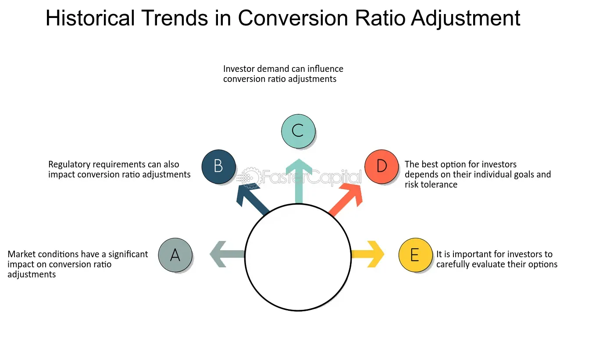

## Table of Contents

## What are conversion terms in financial contexts?

Conversion terms in financial contexts refer to the conditions and rules that apply when one type of financial instrument is converted into another. This often happens with convertible securities, like convertible bonds or preferred stocks, which can be turned into a different form, usually common stock. The terms outline how and when this conversion can happen, including the conversion ratio, which tells you how many shares of the new security you get for each unit of the old one.

These terms are important because they affect the value and attractiveness of the convertible security. For example, if the conversion ratio is favorable, it might make the bond more appealing to investors because they can potentially get more shares. The terms also include details like the conversion price, which is the price at which the conversion happens, and any time limits or triggers that might affect when the conversion can occur. Understanding these terms helps investors make better decisions about buying and holding these securities.

## Why might conversion terms need to be adjusted?

Conversion terms might need to be adjusted to keep the value of the convertible security fair for both the company and the investors. If the company's stock price goes up a lot, the original conversion terms might become too good for investors. They could convert their bonds into a lot more stock than the company planned. To fix this, the company might change the conversion terms to make them less generous. This helps make sure that the company doesn't give away too much of its stock.

On the other hand, if the stock price drops a lot, the original terms might not be attractive enough for investors. They might not want to convert their bonds into stock if the stock isn't worth much. To make the security more appealing, the company could adjust the terms to offer a better deal. This could mean giving more shares for each bond or lowering the price at which conversion happens. Adjusting the terms helps keep the convertible security valuable and interesting to investors, no matter what happens with the stock price.

## What is the basic process for adjusting conversion terms?

Adjusting conversion terms usually starts with the company's board of directors deciding that a change is needed. They might see that the stock price has changed a lot, making the old terms unfair for either the company or the investors. The board will talk about what they want to change and why. They might want to give more shares for each bond or change the price at which conversion happens. Once they agree on the new terms, they'll write them down and get ready to tell everyone who owns the convertible securities.

After the board decides on the new terms, the company has to let the investors know about the changes. They'll send out a notice explaining what's happening and why. The notice will include the new conversion ratio, the new conversion price, and any other important details. The investors will then have a chance to decide if they want to keep their securities with the new terms or if they want to do something else, like sell them. This process helps keep things fair and makes sure everyone knows what's going on.

## How do market conditions influence the adjustment of conversion terms?

Market conditions can really affect how a company decides to change the conversion terms of its securities. If the stock market is doing well and the company's stock price is going up, the old conversion terms might be too good for investors. They could get a lot more stock than the company planned when they convert their bonds. To keep things fair, the company might change the terms to give fewer shares for each bond or raise the price at which conversion happens. This way, the company doesn't give away too much of its stock and keeps the value of the convertible security balanced.

On the other hand, if the market is not doing well and the stock price is going down, the old terms might not be attractive enough for investors. They might not want to convert their bonds into stock if the stock isn't worth much. To make the security more appealing, the company could adjust the terms to offer a better deal. This could mean giving more shares for each bond or lowering the price at which conversion happens. By doing this, the company can keep the convertible security interesting to investors, even when the market is tough.

## What are the common types of conversion terms that can be adjusted?

The main types of conversion terms that can be changed are the conversion ratio and the conversion price. The conversion ratio tells you how many shares of stock you get for each bond or preferred share you convert. If the stock price goes up a lot, the company might lower the conversion ratio so that investors don't get as many shares. On the other hand, if the stock price goes down, the company might raise the conversion ratio to make the deal better for investors, giving them more shares for their bonds.

The conversion price is the price at which the conversion happens. If the stock price is higher than the conversion price, it's a good deal for investors because they can get stock at a lower price. If the stock price goes way up, the company might raise the conversion price to make it less of a bargain. If the stock price drops a lot, the company might lower the conversion price to make the conversion more appealing to investors. Both of these terms help keep the convertible security fair and valuable no matter what the market is doing.

## Can you explain the legal considerations when adjusting conversion terms?

When a company wants to change the conversion terms of its securities, it has to follow certain legal rules. These rules are there to make sure the company does things the right way and treats investors fairly. The company needs to check its own rules, like what's written in the bond or stock agreement, to see if it's allowed to make changes. If the agreement says the company can change the terms, it still has to tell investors about the changes in a clear way. This usually means sending out a notice explaining what's changing and why. The company also needs to make sure it follows any laws or rules from places like the Securities and Exchange Commission (SEC) in the U.S., which can have specific requirements for how companies handle changes to securities.

Sometimes, changing the conversion terms can be tricky because investors might not like the new terms. If the changes are too big or not fair, investors might get upset or even take legal action against the company. To avoid this, the company needs to be very careful and make sure the changes are reasonable. They might need to talk to lawyers who know about securities law to make sure everything is done right. This helps the company avoid legal problems and keeps things fair for everyone involved.

## How do adjustments in conversion terms affect existing investors?

When a company changes the conversion terms of its securities, it can have a big impact on people who already own them. If the company makes the terms better, like giving more shares for each bond or lowering the price to convert, it can be good for investors. They might get more stock or be able to convert at a better price, which could mean more money for them if the stock price goes up. But if the company makes the terms worse, like giving fewer shares or raising the conversion price, investors might not be happy. They could lose out on potential gains and feel like the company is not treating them fairly.

These changes can also affect how investors feel about keeping their securities. If the new terms are not as good, some investors might decide to sell their bonds or preferred shares instead of converting them. This could change the value of the securities in the market. On the other hand, if the terms get better, investors might be more likely to hold onto their securities and convert them when it's a good time. Either way, it's important for the company to talk to investors about the changes and explain why they are happening, so everyone understands what's going on and can make the best decisions for themselves.

## What role does the board of directors play in the adjustment of conversion terms?

The board of directors is really important when it comes to changing the conversion terms of a company's securities. They are the ones who decide if the terms need to be changed. They look at things like how the stock price is doing and if the old terms are still fair for both the company and the investors. If they think a change is needed, they talk about what the new terms should be. They might decide to give more or fewer shares for each bond, or change the price at which conversion happens. Once they agree on the new terms, they write them down and get ready to tell the investors.

After the board decides on the new terms, they have to make sure everyone knows about the changes. They send out a notice to all the investors explaining what's happening and why. This notice includes the new conversion ratio, the new conversion price, and any other important details. The board's job is to make sure the changes are fair and that they follow all the rules and laws. They also need to think about how the changes might affect the investors and the company, so they can keep things balanced and everyone happy.

## How can adjustments in conversion terms impact a company's valuation?

When a company changes the conversion terms of its securities, it can affect how much the company is worth. If the company makes the terms better, like giving more shares for each bond or lowering the conversion price, it might make the securities more attractive to investors. This could lead to more people wanting to buy the securities, which can push up the company's stock price. A higher stock price means the company's overall value goes up, which is good for the company and its shareholders.

On the other hand, if the company makes the terms worse, like giving fewer shares or raising the conversion price, investors might not be as interested. This could make the securities less valuable, and fewer people might want to buy them. If the stock price goes down because of this, it can lower the company's valuation. The company needs to be careful when changing the terms to make sure it doesn't hurt its value too much, while still keeping things fair for everyone involved.

## What are some strategies to communicate changes in conversion terms to stakeholders?

When a company decides to change the conversion terms of its securities, it's really important to let all the stakeholders know about it in a clear and honest way. The company can start by sending out a notice to everyone who owns the securities. This notice should explain what's changing, why it's happening, and how it might affect them. It's a good idea to use simple language in the notice so that everyone can understand it easily. The company might also want to hold a meeting or a webinar where they can talk more about the changes and answer any questions stakeholders might have. This helps make sure everyone feels heard and understood.

Another good strategy is to use different ways to communicate the changes. The company could put the information on its website, send emails, and even use social media to reach more people. It's important to keep the message the same across all these different ways so that there's no confusion. The company should also be ready to talk to the media if they ask about the changes. By being open and clear, the company can help stakeholders feel more comfortable with the new terms and keep trust strong.

## How do different jurisdictions handle the adjustment of conversion terms?

Different places have their own rules about changing conversion terms. In the United States, the company has to follow the rules from the Securities and Exchange Commission (SEC). The SEC makes sure companies do things the right way and tell investors about any changes clearly. If the company doesn't follow these rules, it could get in trouble. Other countries might have their own rules too. For example, in the European Union, companies have to follow rules from the European Securities and Markets Authority (ESMA). These rules can be different from the SEC's rules, but they also want to make sure companies are fair to investors.

In some places, like the UK, the company needs to check its own rules in the bond or stock agreement to see if it can change the terms. If the agreement says it's okay, the company still has to tell investors about the changes in a clear way. The company might need to talk to lawyers who know about the local laws to make sure everything is done right. This helps the company avoid legal problems and keeps things fair for everyone involved. Each place has its own way of making sure companies treat investors fairly when they change conversion terms.

## What advanced modeling techniques can be used to predict the outcomes of adjusting conversion terms?

To predict how changing conversion terms might affect a company, people can use something called Monte Carlo simulations. This is a fancy way of saying they run a lot of different scenarios on a computer to see what might happen. They can change the conversion ratio or the conversion price in these scenarios and see how it might change the stock price or the value of the company. By doing this many times, they can get a good idea of what might happen in real life. This helps the company make smart choices about changing the terms and understand the risks.

Another way to predict the outcomes is by using something called option pricing models, like the Black-Scholes model. These models help figure out the value of the convertible securities before and after the changes. They look at things like the stock price, how much the stock price might change, and how long until the conversion can happen. By using these models, the company can see if the new terms will make the securities more or less valuable. This can help them decide if the changes are a good idea and how they might affect the company's overall value.

## What is the understanding of adjustment in conversion terms?

An adjustment in conversion terms refers to alterations in the conversion price of a security intended to reflect shifts in market conditions or specific events, such as stock splits. This process is crucial for protecting the interests of holders of convertible securities, ensuring they remain unaffected by changes that could potentially devalue their investments.

The adjustment process typically involves recalculating the conversion ratio. For example, suppose a convertible bond initially has a conversion price of $50 per share. If a stock split occurs, the conversion terms need adjustment to reflect the increased number of shares. The formula to recalculate the conversion price after a stock split can be expressed as:

$$
\text{New Conversion Price} = \frac{\text{Old Conversion Price}}{\text{Split Ratio}}
$$

Similarly, if there is a stock dividend of 10%, the conversion price needs adjustment to maintain equivalent value for the security holder. The adjustment can be calculated with:

$$
\text{New Conversion Price} = \frac{\text{Old Conversion Price}}{1 + \text{Stock Dividend Rate}}
$$

These adjustments are often documented and confirmed through an Officer’s Certificate, a formal document that verifies and records these changes to maintain transparency and accuracy.

Adjustments also occur due to stock dividends, splits, or reclassifications, ensuring that equity holders remain protected against dilution. For example, during a stock split, the number of outstanding shares increases, but the total market capitalization remains the same, potentially affecting the value of existing shares if adjustments are not made.

This mechanism of conversion adjustments helps maintain the value and appeal of convertible securities for investors, providing assurance against unpredictable market fluctuations. By recalculating conversion terms, companies can uphold the integrity of investments in convertibles, preserving investor confidence amid dynamic market conditions.

## What is the process of currency conversion?

Currency conversion is a fundamental process in global commerce and finance, involving the determination of the equivalent value of one currency in terms of another. This process is a critical element for individuals and businesses engaged in international transactions, requiring a precise understanding of prevailing exchange rates.

### Manual Currency Conversion

Before the widespread adoption of digital tools, manual currency conversion required individuals to manually identify the current exchange rates, which were often listed by financial institutions and news outlets. The conversion typically involved the formula:

$$
\text{Converted Amount} = \text{Base Amount} \times \text{Exchange Rate}
$$

In addition to the basic conversion, it was necessary to consider transaction fees or spreads which could significantly impact the final converted amount. These fees are often charged by banks or money transfer services as compensation for processing international transactions.

### Digital Tools and APIs

With advancements in technology, digital tools and APIs have emerged, facilitating real-time currency conversion. These tools provide instantaneous updates on exchange rates, enabling faster and more accurate financial transactions. For instance, APIs from services such as Open Exchange Rates or CurrencyLayer allow developers to integrate currency conversion capabilities into their applications, enhancing user experience and efficiency.

### Fintech Innovations

Fintech innovations, including blockchain technology, are transforming the currency conversion landscape by offering more streamlined and cost-effective solutions. Blockchain, known for its decentralized and transparent nature, can facilitate faster cross-border transactions without the need for intermediary banks, thus reducing costs and increasing transparency. The use of cryptocurrencies for cross-border transactions is one example where blockchain technology is being applied to improve currency conversion processes.

### Impacts of Conversion Rates

A thorough understanding of conversion rates is crucial for businesses involved in international trade, as fluctuating exchange rates can significantly impact profitability. Companies must consider exchange rate movements when pricing products, managing revenues, and planning budgets. Businesses can utilize hedging strategies to mitigate the risks associated with currency fluctuations, ensuring stable financial outcomes.

Incorporating technology into currency conversion processes not only facilitates smoother transactions but also provides strategic insights into making informed financial decisions. This can ultimately lead to optimized transactional efficiencies and enhanced global trade opportunities.

## References & Further Reading

[1]: Lopez de Prado, M. (2018). ["Advances in Financial Machine Learning"](https://www.amazon.com/Advances-Financial-Machine-Learning-Marcos/dp/1119482089). Wiley.

[2]: Chan, E. P. (2009). ["Quantitative Trading: How to Build Your Own Algorithmic Trading Business"](https://github.com/ftvision/quant_trading_echan_book). Wiley.

[3]: Aronson, D. R. (2006). ["Evidence-Based Technical Analysis: Applying the Scientific Method and Statistical Inference to Trading Signals"](https://www.amazon.com/Evidence-Based-Technical-Analysis-Scientific-Statistical/dp/0470008741). Wiley.

[4]: Jansen, S. (2020). ["Machine Learning for Algorithmic Trading"](https://github.com/stefan-jansen/machine-learning-for-trading). Packt Publishing Ltd.

[5]: Bergstra, J., Bardenet, R., Bengio, Y., & Kégl, B. (2011). ["Algorithms for Hyper-Parameter Optimization."](https://dl.acm.org/doi/10.5555/2986459.2986743) Advances in Neural Information Processing Systems 24.