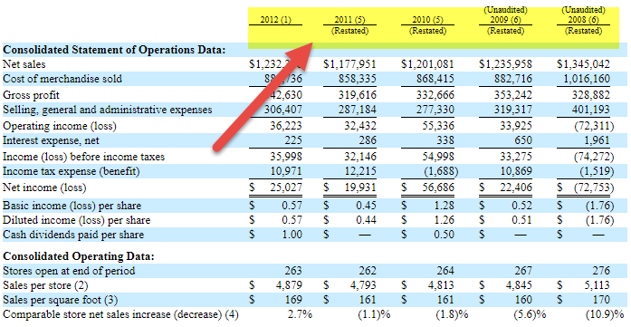

The global financial landscape is a complex system where terms like 'adjustment conversion process' and 'algorithmic trading' have become integral components. As markets continue to evolve, understanding these concepts becomes essential for individuals involved in securities, trading, or investments. These elements substantially influence the dynamics of financial markets, altering how trades are executed and affecting investment outcomes.

This article focuses on unpacking the conversion process of securities and adjustments in conversion terms. These concepts are paramount in safeguarding the interests of investors who hold convertible securities, ensuring that market events such as stock splits do not devalue their investments. Adjustments in conversion terms are particularly crucial as they recalibrate the conversion price of a security to align with current market conditions, thus protecting equity holders from dilution.



Additionally, algorithmic trading is transforming the forex market by automating trading processes and allowing trades to be executed at the most optimal prices. These algorithms leverage historical and real-time market data to forecast currency movements, minimizing emotional biases and enhancing trading precision.

In this article, we explore how these components interact within today's digital trading environment, offering insights into their significance. Whether you are an experienced trader or a newcomer to the financial market, understanding these concepts can significantly enhance your trading and investment strategies. Mastery of this knowledge is increasingly vital in navigating the modern fast-paced financial landscape and in making informed investment decisions for maximizing financial outcomes.

## Table of Contents

## Understanding Adjustment in Conversion Terms

An adjustment in conversion terms refers to alterations in the conversion price of a security intended to reflect shifts in market conditions or specific events, such as stock splits. This process is crucial for protecting the interests of holders of convertible securities, ensuring they remain unaffected by changes that could potentially devalue their investments.

The adjustment process typically involves recalculating the conversion ratio. For example, suppose a convertible bond initially has a conversion price of $50 per share. If a stock split occurs, the conversion terms need adjustment to reflect the increased number of shares. The formula to recalculate the conversion price after a stock split can be expressed as:

$$
\text{New Conversion Price} = \frac{\text{Old Conversion Price}}{\text{Split Ratio}}
$$

Similarly, if there is a stock dividend of 10%, the conversion price needs adjustment to maintain equivalent value for the security holder. The adjustment can be calculated with:

$$
\text{New Conversion Price} = \frac{\text{Old Conversion Price}}{1 + \text{Stock Dividend Rate}}
$$

These adjustments are often documented and confirmed through an Officer’s Certificate, a formal document that verifies and records these changes to maintain transparency and accuracy.

Adjustments also occur due to stock dividends, splits, or reclassifications, ensuring that equity holders remain protected against dilution. For example, during a stock split, the number of outstanding shares increases, but the total market capitalization remains the same, potentially affecting the value of existing shares if adjustments are not made.

This mechanism of conversion adjustments helps maintain the value and appeal of convertible securities for investors, providing assurance against unpredictable market fluctuations. By recalculating conversion terms, companies can uphold the integrity of investments in convertibles, preserving investor confidence amid dynamic market conditions.

## The Process of Currency Conversion

Currency conversion is a fundamental process in global commerce and finance, involving the determination of the equivalent value of one currency in terms of another. This process is a critical element for individuals and businesses engaged in international transactions, requiring a precise understanding of prevailing exchange rates.

### Manual Currency Conversion

Before the widespread adoption of digital tools, manual currency conversion required individuals to manually identify the current exchange rates, which were often listed by financial institutions and news outlets. The conversion typically involved the formula:

$$
\text{Converted Amount} = \text{Base Amount} \times \text{Exchange Rate}
$$

In addition to the basic conversion, it was necessary to consider transaction fees or spreads which could significantly impact the final converted amount. These fees are often charged by banks or money transfer services as compensation for processing international transactions.

### Digital Tools and APIs

With advancements in technology, digital tools and APIs have emerged, facilitating real-time currency conversion. These tools provide instantaneous updates on exchange rates, enabling faster and more accurate financial transactions. For instance, APIs from services such as Open Exchange Rates or CurrencyLayer allow developers to integrate currency conversion capabilities into their applications, enhancing user experience and efficiency.

### Fintech Innovations

Fintech innovations, including blockchain technology, are transforming the currency conversion landscape by offering more streamlined and cost-effective solutions. Blockchain, known for its decentralized and transparent nature, can facilitate faster cross-border transactions without the need for intermediary banks, thus reducing costs and increasing transparency. The use of cryptocurrencies for cross-border transactions is one example where blockchain technology is being applied to improve currency conversion processes.

### Impacts of Conversion Rates

A thorough understanding of conversion rates is crucial for businesses involved in international trade, as fluctuating exchange rates can significantly impact profitability. Companies must consider exchange rate movements when pricing products, managing revenues, and planning budgets. Businesses can utilize hedging strategies to mitigate the risks associated with currency fluctuations, ensuring stable financial outcomes.

Incorporating technology into currency conversion processes not only facilitates smoother transactions but also provides strategic insights into making informed financial decisions. This can ultimately lead to optimized transactional efficiencies and enhanced global trade opportunities.

## Algorithmic Trading in Currency Exchange

Algorithmic trading employs computerized systems to automate transactions in the foreign exchange ([forex](/wiki/forex-system)) market, enhancing the efficiency and precision of executing trades at optimal prices. These algorithms leverage vast datasets and execute trades at speeds far beyond human capability, analyzing market trends and predicting currency movements with remarkable accuracy. This capability is particularly valuable in the highly volatile forex market, where rapid responses to shifting conditions can significantly influence outcomes.

The primary advantage of [algorithmic trading](/wiki/algorithmic-trading) is its ability to mitigate human emotional biases, which often lead to suboptimal decision-making in trading. Algorithms make data-driven decisions devoid of psychological influences such as fear or greed. However, developing and maintaining these systems necessitates substantial technical expertise and financial investment, as the algorithms must be meticulously crafted and continuously updated to accommodate evolving market conditions and maintain their competitive edge.

Yet, algorithmic trading comes with inherent risks, including the potential for flash crashes—sudden, severe drops in security prices that occur in a matter of minutes. These incidents can result from algorithms reacting to market anomalies in unpredictable ways, leading to large-scale automated selling and dramatic price swings. Consequently, regulatory oversight is crucial to maintain market integrity and prevent systemic risks associated with such automated strategies. Regulatory bodies often require algorithms to be thoroughly tested and compliant with specific operational standards before deployment.

Future advancements in [artificial intelligence](/wiki/ai-artificial-intelligence) (AI) and [machine learning](/wiki/machine-learning) hold great promise for further enhancing algorithmic trading. These technologies can improve predictive modeling by recognizing more complex patterns in historical and real-time data sets, leading to more sophisticated trading strategies. Machine learning algorithms can adapt to new information dynamically, improving over time and potentially offering more reliable predictions of currency trends. The continuous evolution of these technologies portends significant improvements in the scope and effectiveness of algorithmic trading solutions.

Example Python code for a simple trading algorithm might include libraries such as Pandas for data manipulation, NumPy for numerical calculations, and Scikit-learn for implementing machine learning models. Here's a basic example of how one might use Python to develop a predictive model for currency trading:

```python
import pandas as pd
from sklearn.model_selection import train_test_split
from sklearn.ensemble import RandomForestClassifier

# Load historical forex market data
data = pd.read_csv('forex_data.csv')

# Preprocess data
features = data[['open', 'high', 'low', 'volume']]
targets = data['price_trend']

# Split data into training and test sets
X_train, X_test, y_train, y_test = train_test_split(features, targets, test_size=0.2, random_state=42)

# Train a RandomForestClassifier as a basic predictive model
model = RandomForestClassifier(n_estimators=100, random_state=42)
model.fit(X_train, y_train)

# Predict future trends
predictions = model.predict(X_test)

# Evaluate model performance
accuracy = model.score(X_test, y_test)
print(f'Model Accuracy: {accuracy * 100:.2f}%')
```

This script illustrates the fundamental steps in constructing a predictive model, from loading data and preprocessing to training a machine learning algorithm and evaluating its accuracy—offering a simplified snapshot of the potential of algorithmic trading systems in the forex market.

## Conclusion

Navigating the financial markets demands a comprehensive understanding of key concepts such as conversion adjustments and algorithmic trading. These elements are integral to participating effectively in securities trading and currency exchange, particularly as digital financial instruments continue to evolve rapidly. The significance of these terms lies in their ability to offer strategies that can assist in mitigating risks associated with market fluctuations, thereby protecting investor capital and maximizing potential returns.

As technology increasingly permeates financial markets, it brings considerable advantages in terms of speed, efficiency, and data processing capabilities. However, these benefits are not without risks. Market participants must remain vigilant about potential pitfalls, such as system errors or unexpected market movements commonly associated with automated trading systems. This vigilance involves a readiness to engage with new technologies and an ongoing commitment to understanding their underlying mechanisms, as well as adhering to regulatory standards that ensure market integrity.

Incorporating technological innovations like algorithmic trading into one's strategy, alongside a solid grasp of traditional trading methods, can significantly enhance success rates in trading activities. Utilizing these advancements allows traders to make more informed decisions, react swiftly to market changes, and optimize trading strategies for improved outcomes.

In our interconnected global economy, staying informed about the latest developments in conversion adjustments and algorithmic trading is essential for making astute investment choices. As financial markets change and grow, ensuring an up-to-date understanding of these elements can aid in achieving favorable financial results and sustaining investment growth. By embracing both technological progress and fundamental trading principles, investors can position themselves advantageously within the dynamic landscape of global finance.

## Additional Resources

To broaden understanding, engaging with resources on forex trading, exchange systems, and algorithmic trading strategies is recommended. These tools and materials can offer comprehensive insights into contemporary trading practices and enhance practical skills.

Online platforms such as Forex.com and [Interactive Brokers](/wiki/interactive-brokers-api) provide essential tools to practice and implement forex trading strategies. These platforms offer demo accounts that allow users to simulate real-world trading scenarios without financial risk. They also feature educational resources and tutorials that can help users deepen their knowledge of market mechanics and refine their strategies.

Books such as "Currency Trading for Dummies" and "Algorithmic Trading: Winning Strategies and Their Rationale" offer in-depth looks at market tactics. "Currency Trading for Dummies" is ideal for those new to forex trading, offering foundational knowledge and practical tips. On the other hand, "Algorithmic Trading: Winning Strategies and Their Rationale" is suited for traders looking to leverage technology, providing insight into developing and implementing algorithmic strategies.

Innovative fintech tools and tutorials are increasingly valuable for providing real-time insights and learning opportunities. Platforms that offer algorithmic trading capabilities often come equipped with [backtesting](/wiki/backtesting) features and API access, allowing traders to test strategies against historical data. This feature can be particularly beneficial for refining trading approaches. Python libraries like NumPy and pandas facilitate data analysis and can be instrumental in developing trading algorithms. A simple example of calculating moving averages in Python is shown below:

```python
import pandas as pd

# Assuming `data` is a DataFrame containing historical price data with a 'Close' column
data['SMA_20'] = data['Close'].rolling(window=20).mean()  # 20-day Simple Moving Average
data['SMA_50'] = data['Close'].rolling(window=50).mean()  # 50-day Simple Moving Average
```

Engaging with online communities is also recommended. Platforms like Reddit and specialized trading forums provide a wealth of collective knowledge, with members sharing insights, strategies, and analysis of market trends. Engaging with these communities can offer fresh perspectives and keep traders informed about evolving trading trends and strategies.

In summary, utilizing these resources can significantly enhance one's understanding and application of trading strategies in the dynamic financial markets.

## References & Further Reading

[1]: Lopez de Prado, M. (2018). ["Advances in Financial Machine Learning"](https://www.amazon.com/Advances-Financial-Machine-Learning-Marcos/dp/1119482089). Wiley.

[2]: Chan, E. P. (2009). ["Quantitative Trading: How to Build Your Own Algorithmic Trading Business"](https://github.com/ftvision/quant_trading_echan_book). Wiley.

[3]: Aronson, D. R. (2006). ["Evidence-Based Technical Analysis: Applying the Scientific Method and Statistical Inference to Trading Signals"](https://www.amazon.com/Evidence-Based-Technical-Analysis-Scientific-Statistical/dp/0470008741). Wiley.

[4]: Jansen, S. (2020). ["Machine Learning for Algorithmic Trading"](https://github.com/stefan-jansen/machine-learning-for-trading). Packt Publishing Ltd.

[5]: Bergstra, J., Bardenet, R., Bengio, Y., & Kégl, B. (2011). ["Algorithms for Hyper-Parameter Optimization."](https://dl.acm.org/doi/10.5555/2986459.2986743) Advances in Neural Information Processing Systems 24.