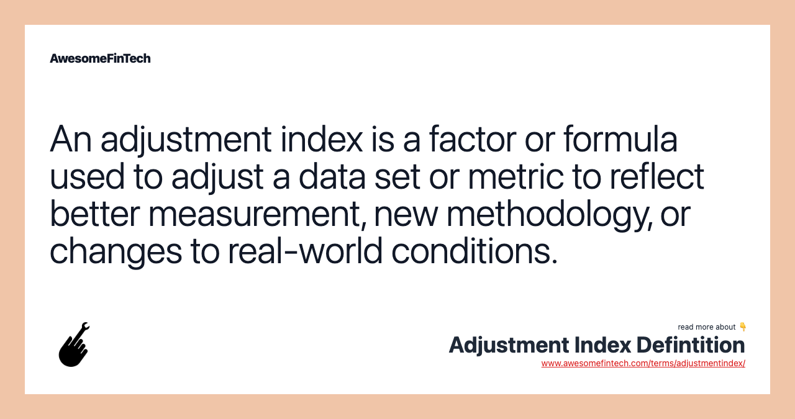

## Table of Contents

## What is an Adjustment Index?

An Adjustment Index is a tool used to measure how much something changes over time. It helps people understand if things are getting better or worse. For example, if you want to know if prices are going up or down, you can use an Adjustment Index to see the changes.

This index is often used in economics to track inflation or the cost of living. It takes a bunch of different things, like the price of food, housing, and other goods, and puts them together to see the overall change. By using an Adjustment Index, people can make better decisions about money and planning for the future.

## Why is the Adjustment Index important?

The Adjustment Index is important because it helps us see how things are changing over time. For example, if we want to know if the prices of things we buy every day are going up or down, we can look at the Adjustment Index. This helps us understand if we need to spend more or less money on things like food, gas, and rent. By knowing these changes, we can plan better and make smarter choices about how we use our money.

In economics, the Adjustment Index is used to measure inflation or the cost of living. It takes many different things into account, like the price of groceries, housing, and other goods, and combines them to show the overall change. This is really helpful for governments, businesses, and families because it gives them a clear picture of what's happening with the economy. It helps them decide if they need to change prices, wages, or budgets to keep up with the changes.

## How is the Adjustment Index calculated?

The Adjustment Index is calculated by looking at a bunch of different things and seeing how their prices change over time. For example, if you want to know about the cost of living, you might look at the prices of things like food, housing, and clothes. You start by choosing a starting point, called the base period, and you give it a value, usually 100. Then, you keep track of the prices of these things over time and compare them to the base period.

To figure out the new index value, you take the new prices of all the things you're looking at and compare them to the prices in the base period. You do this by finding the percentage change for each item, then you add up all these changes and divide by the total number of items. This gives you the new index value. If the new value is higher than 100, it means prices have gone up since the base period. If it's lower, it means prices have gone down.

## What are the key components of the Adjustment Index?

The key components of the Adjustment Index include the items that are being tracked, like food, housing, and other goods. These items are chosen because they represent what people spend money on every day. Each item has a weight, which shows how important it is compared to the others. For example, if people spend a lot more on housing than on clothes, housing will have a bigger weight in the index.

To calculate the Adjustment Index, you start with a base period and give it a value, usually 100. Then, you keep track of the prices of all the items over time. You find out how much the price of each item has changed since the base period and use these changes to figure out the new index value. If the new value is higher than 100, it means prices have gone up. If it's lower, it means prices have gone down. This helps people understand if things are getting more or less expensive.

## Can you explain the basic formula used in the Adjustment Index?

The basic formula for the Adjustment Index is pretty simple. You start with a list of things you want to track, like food, housing, and other stuff people buy. Each thing has a weight, which shows how important it is. You pick a starting point, called the base period, and give it a value of 100. Then, you look at the prices of all these things over time and see how they've changed compared to the base period.

To find the new index value, you figure out the percentage change for each item from the base period to now. You multiply each percentage change by the item's weight and add all these numbers together. The total you get is the new index value. If it's higher than 100, it means prices have gone up since the base period. If it's lower, it means prices have gone down. This helps people understand if things are getting more or less expensive over time.

## What are some common applications of the Adjustment Index?

One common use of the Adjustment Index is to track inflation. This helps people see if the prices of things they buy every day, like food and gas, are going up or down. If the index goes up, it means things are getting more expensive. Governments and businesses use this information to make decisions about things like raising wages or changing prices. Families also use it to plan their budgets and understand if they need to spend more or less money on different things.

Another application is in measuring the cost of living. This helps people understand how much it costs to live in different places. For example, if you're thinking about moving to a new city, you can use the Adjustment Index to see if it will be more or less expensive than where you live now. This can help you decide if you can afford to move. It's also useful for businesses that want to know how much it will cost to pay their workers in different locations.

Lastly, the Adjustment Index is used in economic planning and policy-making. Governments use it to set economic goals and make policies that help keep the economy stable. For example, if the index shows that prices are going up too fast, the government might decide to do something to slow down inflation. This helps make sure that people can still afford the things they need, and the economy stays healthy.

## How does the Adjustment Index differ from other indices?

The Adjustment Index is different from other indices because it focuses on tracking changes over time. For example, while the Consumer Price Index (CPI) measures the average change in prices paid by urban consumers for a market basket of goods and services, the Adjustment Index can be used for a wider variety of items and purposes, like tracking the cost of living or inflation in different regions. The Adjustment Index gives a value of 100 to a base period and then calculates how much prices have changed from that point, helping people understand if things are getting more or less expensive.

Another way the Adjustment Index differs is in its flexibility. Other indices, like the Producer Price Index (PPI), focus on specific sectors, such as the prices received by domestic producers for their output. In contrast, the Adjustment Index can be tailored to include a range of goods and services relevant to different groups of people or economic situations. This makes it a versatile tool for understanding economic changes and making decisions based on those changes.

## What are the limitations of using the Adjustment Index?

One limitation of the Adjustment Index is that it might not include everything that affects people's lives. For example, if the index only looks at food and housing prices, it might miss other important costs like healthcare or education. This can make the index less useful for people who need to consider these other expenses. Also, the weights given to different items might not match everyone's spending habits. If someone spends a lot more on transportation than the average person, the index might not show the right changes for them.

Another limitation is that the Adjustment Index can be affected by how often prices are checked. If prices are only looked at once a year, the index might miss big changes that happen in between. This can make the index less accurate. Also, the base period chosen can affect how useful the index is. If the base period was a time when prices were unusually high or low, the index might not give a good picture of what's happening now. This can make it harder for people to use the index to plan their budgets or make decisions.

## How can the Adjustment Index be used in financial analysis?

The Adjustment Index can be really helpful in financial analysis because it shows how prices change over time. For example, if you're a business owner, you can use the Adjustment Index to see if the things you need to buy, like supplies or equipment, are getting more or less expensive. This helps you decide if you need to change your prices or find cheaper options. If you're an investor, the Adjustment Index can help you understand if inflation is going up, which might affect the value of your investments. By keeping an eye on the index, you can make smarter choices about where to put your money.

Another way the Adjustment Index is used in financial analysis is to help people plan their budgets. If you're a family trying to figure out how much money you'll need in the future, you can use the index to see if the cost of living is going up or down. This can help you save more money or change your spending habits. For example, if the index shows that food prices are going up, you might decide to buy less expensive food or cook more at home. By using the Adjustment Index, you can make better financial plans and be ready for changes in the economy.

## What advanced techniques can enhance the accuracy of the Adjustment Index?

One way to make the Adjustment Index more accurate is by using something called "seasonal adjustment." This means looking at how prices change at different times of the year, like how they might go up during holidays or down in the summer. By taking these regular changes into account, the index can show a clearer picture of what's really happening with prices over time. Another technique is to update the list of items the index tracks more often. Prices for things like technology can change a lot, so if the index doesn't include the latest gadgets, it might not be as accurate. By keeping the list up to date, the index can better reflect what people are actually spending money on.

Another advanced technique is using "hedonic regression." This sounds fancy, but it just means looking at how the quality of items changes over time. For example, if a new phone comes out with better features but costs the same as the old one, the price might look the same, but you're actually getting more for your money. By using hedonic regression, the Adjustment Index can account for these quality changes and give a more accurate picture of price changes. These methods help make the index a better tool for understanding how the cost of living and inflation are changing.

## How have recent studies improved the methodology of the Adjustment Index?

Recent studies have made the Adjustment Index better by using new ways to gather and analyze data. One big change is using more real-time data, which means looking at prices more often than just once a year. This helps the index show changes faster and more accurately. Another improvement is using something called "big data." This means looking at lots of information from places like online shopping and social media to see what people are really spending money on. By using this data, the index can be more up-to-date and reflect what's happening in the real world.

Also, researchers have started using better math to make the Adjustment Index more accurate. They use techniques like "machine learning" to find patterns in the data that might be hard to see otherwise. This can help the index predict future changes better. Another method is called "multivariate analysis," which looks at how different things, like the price of food and the cost of housing, affect each other. By understanding these connections, the index can give a clearer picture of how the cost of living is changing. These improvements help make the Adjustment Index a more useful tool for everyone.

## What future developments are expected in the field of Adjustment Index research?

In the future, researchers are expected to keep making the Adjustment Index better by using even more advanced technology and data. One big change might be using artificial intelligence (AI) to help predict how prices will change. AI can look at huge amounts of data really quickly and find patterns that humans might miss. This could make the index more accurate and help people plan better for the future. Also, as more people use online shopping and digital payments, researchers will be able to use this data to see what people are spending money on in real-time, making the index more up-to-date.

Another development might be making the Adjustment Index more personalized. Right now, the index looks at average prices for everyone, but in the future, it could be tailored to different groups of people. For example, there could be different indices for families, single people, or people living in different areas. This would help people see how the cost of living is changing in a way that's more relevant to their own lives. By using these new methods, the Adjustment Index will become an even better tool for understanding and planning for economic changes.

## What is the impact of Algorithmic Trading on the Financial Market?

Algorithmic trading, often known as algo trading, utilizes computer algorithms to automate financial trading. These algorithms execute trades at speeds and frequencies that exceed human capabilities, transforming how the financial markets operate. By leveraging technological advancements, [algorithmic trading](/wiki/algorithmic-trading) allows market participants to process large volumes of data, employ complex trading strategies, and gain competitive advantages.

Economic indicators are integral to algorithmic trading systems, providing essential data that informs trading decisions. Algorithms analyze indicators such as GDP growth, employment rates, inflation, and interest rates to assess market conditions and predict future movements. This data-driven approach helps traders anticipate market trends and opportunities, enabling more informed and timely decision-making.

In addition to economic indicators, algorithmic trading employs a variety of technical indicators to guide trading strategies. Technical indicators like moving averages and the Relative Strength Index (RSI) offer insights into price trends and potential reversals. For example, a simple moving average (SMA) is calculated by summing the closing prices of an asset over a defined period and dividing by the number of observations in that period:

$$
\text{SMA} = \frac{\sum_{i=1}^{n} P_i}{n}
$$

Where $P_i$ represents the price at each time period $i$ and $n$ is the total number of periods.

The integration of adjustment indexes into algorithmic trading strategies further enhances data accuracy. Adjustment indexes correct raw data for anomalies such as seasonal fluctuations and sample size discrepancies, ensuring that the data inputs used by algorithms are accurate reflections of current market conditions. This precision is critical, as inaccurate data can lead to erroneous trading signals and, consequently, financial losses.

Algorithmic trading strategies, depending on their complexity, might incorporate multiple economic and technical indicators, used in conjunction with adjustment indexes, to optimize trading outcomes. For example, a programmatic strategy could use Python to implement a simple trading algorithm that buys or sells based on moving averages:

```python
import pandas as pd

def simple_moving_average(data, window):
    return data.rolling(window=window).mean()

def trading_strategy(prices, short_window, long_window):
    signals = pd.DataFrame(index=prices.index)
    signals['price'] = prices

    signals['short_mavg'] = simple_moving_average(prices['close'], short_window)
    signals['long_mavg'] = simple_moving_average(prices['close'], long_window)

    signals['signal'] = 0.0
    signals['signal'][short_window:] = \
        np.where(signals['short_mavg'][short_window:] > signals['long_mavg'][short_window:], 1.0, 0.0)

    signals['positions'] = signals['signal'].diff()

    return signals

# Apply the strategy
data = pd.read_csv('daily_prices.csv')
signals = trading_strategy(data, 40, 100)
```

This script demonstrates a basic form of algorithmic trading—employing short-term and long-term moving averages to generate buy or sell signals.

As algorithmic trading continues to evolve, its utilization of technology and data will undoubtedly expand, providing increasingly sophisticated tools and strategies to navigate the financial markets. The integration of high-frequency trading, [artificial intelligence](/wiki/ai-artificial-intelligence), and [machine learning](/wiki/machine-learning) is expected to further revolutionize the industry, reinforcing algorithmic trading's pivotal role in modern finance.

## References & Further Reading

[1]: Bergstra, J., Bardenet, R., Bengio, Y., & Kégl, B. (2011). ["Algorithms for Hyper-Parameter Optimization."](https://dl.acm.org/doi/10.5555/2986459.2986743) Advances in Neural Information Processing Systems 24.

[2]: ["Advances in Financial Machine Learning"](https://www.amazon.com/Advances-Financial-Machine-Learning-Marcos/dp/1119482089) by Marcos Lopez de Prado

[3]: ["Evidence-Based Technical Analysis: Applying the Scientific Method and Statistical Inference to Trading Signals"](https://www.amazon.com/Evidence-Based-Technical-Analysis-Scientific-Statistical/dp/0470008741) by David Aronson

[4]: ["Machine Learning for Algorithmic Trading"](https://github.com/stefan-jansen/machine-learning-for-trading) by Stefan Jansen

[5]: ["Quantitative Trading: How to Build Your Own Algorithmic Trading Business"](https://www.amazon.com/Quantitative-Trading-Build-Algorithmic-Business/dp/1119800064) by Ernest P. Chan

[6]: Census Bureau. (n.d.). ["X-12-ARIMA Seasonal Adjustment Program"](https://www.census.gov/library/working-papers/1998/adrm/findley-01.html). U.S. Census Bureau. 

[7]: Gómez, V., & Maravall, A. (1996). ["Programs TRAMO (Time Series Regression with ARIMA Noise, Missing Observations, and Outliers) and SEATS (Signal Extraction in ARIMA Time Series): Instructions for the User"](https://link.springer.com/article/10.1007/s13209-011-0078-z). Bank of Spain. 

[8]: Hull, J. C. (2009). ["Options, Futures, and Other Derivatives"](https://archive.org/download/economia-usp/Hull%20J.C.-Options%2C%20Futures%20and%20Other%20Derivatives_9th%20edition.pdf). Pearson.