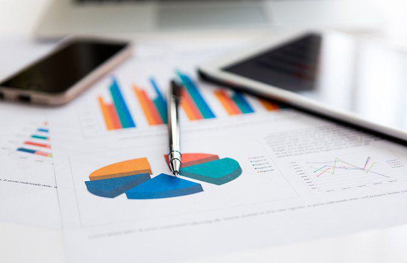

In the dynamic landscape of modern finance, understanding economic indicators and financial tools is crucial. These elements serve as the foundation upon which informed investment strategies are built. With the advent of algorithmic trading, investors have altered their approach to navigating the trading landscape significantly. This advanced method leverages computer algorithms to process vast amounts of data swiftly and execute trades with precision, thereby revolutionizing traditional trading methods.

An integral component of this evolving financial environment is the adjustment index. This statistical tool is essential for refining raw economic data to more accurately reflect real-world economic conditions. Adjustment indexes correct for anomalies such as seasonal fluctuations and sample size discrepancies, rendering data more reliable and useful for analysis.



This article explores the interconnectedness between economic indicators, financial tools, adjustment indexes, and algorithmic trading. A comprehensive understanding of these concepts can significantly enhance decision-making and strategic planning within the financial realm. By examining the essential components and their interactions, investors and financial analysts can gain a more profound insight into crafting effective strategies.

Economic indicators such as GDP, employment rates, and inflation levels offer critical insights into a country's economic health. These indicators, alongside financial instruments like stocks, bonds, and derivatives, form the basis for designing investment strategies. Understanding the mechanics behind these tools, as well as the economic indicators that influence them, is vital for optimizing investments and managing risks.

Algorithmic trading harnesses these refined datasets to develop and execute trading strategies with increased accuracy. The integration of economic indicators and adjustment indexes ensures that the data driving these algorithms is both accurate and reflective of current market dynamics. This synergy results in more precise trading operations and, ultimately, better financial outcomes.

In conclusion, the intersection of economic indicators, financial tools, adjustment indexes, and algorithmic trading is reshaping the financial landscape. By mastering these components, investors can navigate the complexities of modern finance with greater precision and confidence. As technology and data analysis continue to evolve, staying informed about these elements today is crucial for preparing for tomorrow's economic challenges.

## Table of Contents

## Economic Indicators: The Foundation of Financial Analysis

Economic indicators are essential for evaluating the economic performance of a country by providing quantitative data that reflect various facets of the economy. These indicators, such as Gross Domestic Product (GDP), employment rates, and inflation levels, are pivotal in guiding investors and policymakers in making informed decisions. 

GDP measures the total value of all goods and services produced within a country over a specific period, typically expressed on an annual basis. It serves as a comprehensive gauge of a country's economic output and activity. Higher GDP values generally indicate robust economic performance, which can attract investors seeking growth opportunities.

Employment rates, another crucial indicator, offer insights into the labor market's health. Higher employment rates generally signify better economic conditions, as more individuals are gainfully employed, contributing to economic productivity. Conversely, rising unemployment might indicate economic slowing, prompting investors to adjust their strategies accordingly.

Inflation levels reflect the rate at which the general level of prices for goods and services rises, eroding purchasing power. Tracking inflation is vital for investors as it impacts interest rates and monetary policy. For example, if inflation rises above target levels set by central banks, interest rates might be increased to curb spending, affecting investment returns and strategies.

Economic indicators are indispensable for [algorithmic trading](/wiki/algorithmic-trading) strategies, serving as the backbone by providing the data necessary for analysis and model training. Algorithms leverage these indicators to predict market movements and identify trading opportunities. The ability to anticipate such market dynamics allows for proactive decision-making, aiding investors in optimizing their portfolios and capitalizing on market trends.

Understanding economic indicators goes beyond mere data collection; it involves a comprehensive analysis to discern trends and patterns that can forecast future economic conditions. This knowledge is crucial in anticipating market shifts and identifying potential trading opportunities. Such foresight is invaluable in the financial markets, where timing and precision can significantly influence investment outcomes.

## Financial Tools: Empowering Investors

Financial tools are essential instruments for investors, enabling them to navigate the complexities of the financial markets. These instruments include a diverse array of options such as stocks, bonds, exchange-traded funds (ETFs), and derivatives. Each of these tools serves a distinct purpose in an investor's portfolio, facilitating diversification, risk management, and the optimization of returns.

**Diversification** is a fundamental principle in investing, aimed at reducing risk by spreading investments across different assets or asset classes. For instance, investors can achieve diversification by allocating capital to both stocks and bonds. Stocks offer the potential for high returns but come with higher volatility, while bonds typically provide lower returns with greater stability. ETFs further enhance diversification by allowing investors to hold a diversified portfolio of assets through a single investment vehicle.

**Hedging risks** is another critical function of financial tools. Derivatives such as options and futures contracts are commonly used for this purpose. These financial instruments allow investors to protect their portfolios against adverse price movements. For example, a put option gives the holder the right to sell an asset at a predetermined price, providing insurance against a decline in the asset's value. Similarly, futures contracts can lock in prices for future transactions, shielding investors from price volatility.

The choice of financial tools is heavily influenced by **market analysis** and the prevailing **economic conditions**. For instance, in a low-interest-rate environment, investors might lean towards stocks to capitalize on potentially higher returns, whereas, in uncertain or bearish markets, they might prefer bonds for their relative safety. Economic indicators, such as inflation rates, GDP growth, and employment levels, play a significant role in shaping these decisions by offering insights into market trends and potential future movements.

To use financial tools effectively, investors must possess a thorough understanding of their mechanics and the economic indicators that impact them. This involves not only understanding the theoretical underpinnings of each instrument but also practical knowledge of how they respond to market changes. For instance, the pricing of options is influenced by factors such as the underlying asset's price, [volatility](/wiki/volatility-trading-strategies), and time to expiration. Understanding these factors allows investors to make informed decisions about when and how to use options in their portfolios.

Moreover, modern technological advancements and data analytics have further empowered investors by providing sophisticated tools and platforms for analyzing financial data and executing trades. Algorithmic trading, which relies on pre-programmed instructions to execute trades at optimal conditions, exemplifies how technology is intertwined with financial tools to enhance investment strategies.

In summary, financial tools are indispensable for investors seeking to achieve their financial goals. They offer a variety of options for diversification, risk management, and return optimization. The effective use of these tools is contingent upon a deep understanding of their mechanics and the economic indicators that influence their performance. As technology continues to advance, the integration of data analytics and algorithmic strategies will further augment the capabilities of these financial instruments, offering investors greater opportunities to navigate the markets successfully.

## The Role of Adjustment Indexes in Data Accuracy

Adjustment indexes serve as essential tools in ensuring data accuracy by modifying datasets to align with real-world conditions. These indexes are crucial for refining economic data, thereby enhancing the reliability of financial analysis and decision-making processes.

One primary function of adjustment indexes is to sanitize datasets from anomalies that may distort true values. For instance, seasonal fluctuations can drastically affect certain economic indicators, such as retail sales or employment numbers. By applying seasonal adjustment methods, analysts can strip away these fluctuations to reveal underlying trends. This is often achieved using statistical techniques like X-12-ARIMA from the Bureau of the Census (U.S.) or the TRAMO/SEATS package, which are designed to remove seasonal effects from time series data.

Another important task of adjustment indexes is to correct for issues related to sample size or data collection inconsistencies. In surveys or economic measurements, variations in sample size can introduce biases or variances that do not accurately represent the population or economic conditions. For example, when analyzing Consumer Price Index (CPI) data, researchers might apply a sample adjustment index to accommodate discrepancies arising from changing basket components over time.

By applying adjustment indexes, the true picture of economic indicators is presented, allowing for more informed decisions. Without such corrections, datasets could be misleading. For example, interpreting raw unemployment figures without seasonal adjustments might suggest erroneous economic conditions due to temporary factors like holiday employment surges. Similarly, GDP growth figures without adjustments for inflation or seasonal variances could misguide policy-making and investment strategies.

In conclusion, adjustment indexes play a pivotal role in ensuring the accuracy of economic data. By improving data integrity, they contribute to more reliable analysis and sound decision-making, ultimately aiding in the strategic planning and execution of financial activities.

## Algorithmic Trading: A Revolution in the Financial Market

Algorithmic trading, often known as algo trading, utilizes computer algorithms to automate financial trading. These algorithms execute trades at speeds and frequencies that exceed human capabilities, transforming how the financial markets operate. By leveraging technological advancements, algorithmic trading allows market participants to process large volumes of data, employ complex trading strategies, and gain competitive advantages.

Economic indicators are integral to algorithmic trading systems, providing essential data that informs trading decisions. Algorithms analyze indicators such as GDP growth, employment rates, inflation, and interest rates to assess market conditions and predict future movements. This data-driven approach helps traders anticipate market trends and opportunities, enabling more informed and timely decision-making.

In addition to economic indicators, algorithmic trading employs a variety of technical indicators to guide trading strategies. Technical indicators like moving averages and the Relative Strength Index (RSI) offer insights into price trends and potential reversals. For example, a simple moving average (SMA) is calculated by summing the closing prices of an asset over a defined period and dividing by the number of observations in that period:

$$
\text{SMA} = \frac{\sum_{i=1}^{n} P_i}{n}
$$

Where $P_i$ represents the price at each time period $i$ and $n$ is the total number of periods.

The integration of adjustment indexes into algorithmic trading strategies further enhances data accuracy. Adjustment indexes correct raw data for anomalies such as seasonal fluctuations and sample size discrepancies, ensuring that the data inputs used by algorithms are accurate reflections of current market conditions. This precision is critical, as inaccurate data can lead to erroneous trading signals and, consequently, financial losses.

Algorithmic trading strategies, depending on their complexity, might incorporate multiple economic and technical indicators, used in conjunction with adjustment indexes, to optimize trading outcomes. For example, a programmatic strategy could use Python to implement a simple trading algorithm that buys or sells based on moving averages:

```python
import pandas as pd

def simple_moving_average(data, window):
    return data.rolling(window=window).mean()

def trading_strategy(prices, short_window, long_window):
    signals = pd.DataFrame(index=prices.index)
    signals['price'] = prices

    signals['short_mavg'] = simple_moving_average(prices['close'], short_window)
    signals['long_mavg'] = simple_moving_average(prices['close'], long_window)

    signals['signal'] = 0.0
    signals['signal'][short_window:] = \
        np.where(signals['short_mavg'][short_window:] > signals['long_mavg'][short_window:], 1.0, 0.0)

    signals['positions'] = signals['signal'].diff()

    return signals

# Apply the strategy
data = pd.read_csv('daily_prices.csv')
signals = trading_strategy(data, 40, 100)
```

This script demonstrates a basic form of algorithmic trading—employing short-term and long-term moving averages to generate buy or sell signals.

As algorithmic trading continues to evolve, its utilization of technology and data will undoubtedly expand, providing increasingly sophisticated tools and strategies to navigate the financial markets. The integration of high-frequency trading, [artificial intelligence](/wiki/ai-artificial-intelligence), and [machine learning](/wiki/machine-learning) is expected to further revolutionize the industry, reinforcing algorithmic trading's pivotal role in modern finance.

## Bridging the Concepts: Using Economic Indicators and Adjustment Indexes in Algo Trading

Economic indicators are pivotal for developing robust algorithmic trading strategies. By analyzing data such as GDP growth rates, unemployment figures, and inflation, algorithms can identify market trends and potential opportunities for trades. For instance, a rise in unemployment might indicate a weakening economy, prompting algorithms to short-sell certain stocks. Conversely, robust GDP growth could trigger trades favoring sectors expected to benefit from economic expansion.

However, raw economic data often contains biases and anomalies, such as seasonal effects or irregularities in data collection. This is where adjustment indexes play an essential role. By calibrating data to reflect current market realities, adjustment indexes refine datasets, making them more reliable for analysis and decision-making. For example, a seasonal adjustment index can modify employment data to account for temporary spikes in retail jobs during the holiday season, ensuring algorithms don't misinterpret temporary changes as long-term trends. 

Consider the following Python snippet for applying a seasonal adjustment to a dataset:

```python
import pandas as pd
from statsmodels.tsa.seasonal import seasonal_decompose

# Sample dataset of monthly economic indicators
data = pd.Series([120, 150, 130, 170, 160, 180, 150, 190, 170, 200, 180, 210], 
                 index=pd.date_range(start='2022-01', periods=12, freq='M'))

# Seasonal adjustment
decomposition = seasonal_decompose(data, model='multiplicative')
adjusted_data = data / decomposition.seasonal

print(adjusted_data)
```

This example demonstrates how employing a seasonal decomposition can help clean data inputs used in trading algorithms.

Once data is refined through adjustment indexes, financial tools execute trading strategies based on this precise data. Stocks, options, and futures contracts allow investors to act on the insights delivered by algorithms, managing portfolios and orders with speed and accuracy. The synergy created by the integration of economic indicators, adjustment indexes, and financial tools results in precise and efficient trading operations. Algorithms not only respond swiftly to market movements but also adapt more accurately to data-driven insights, minimizing risks associated with misinformation or misjudged market conditions.

In conclusion, economic indicators provide the data foundation, adjustment indexes ensure accuracy, and financial tools realize trading strategies, creating a holistic and effective framework for contemporary algorithmic trading systems.

## Conclusion: The Future of Financial Analysis and Trading

The integration of economic indicators, financial tools, adjustment indexes, and algorithmic trading is progressively transforming the financial industry. This amalgamation facilitates investors and traders to engage in the market with enhanced precision and confidence, offering them a robust framework to analyze data and execute strategies effectively.

Economic indicators serve as the foundation, offering critical insights into market conditions, helping traders anticipate shifts in the economy. When these indicators are combined with sophisticated financial tools, investors can diversify, hedge risks, and optimize returns through informed decision-making. Adding adjustment indexes into the mix further ensures that the data reflects true market conditions by correcting for anomalies and distortions. This refined data enables more accurate predictions and strategic planning.

Algorithmic trading represents a significant leap in trading methodologies by using computer algorithms to execute trades. Algorithms designed with accurate, adjusted data make data-driven decisions that increase efficiency, reduce human error, and execute trades at speeds that are not possible through traditional methods. As technology advances, so do data analysis techniques and methods, leading to more refined and innovative algorithmic trading strategies.

The ongoing evolution of these components is indicative of a broader trend toward increased reliance on precision tools in finance. As technology and analytical methods continue to advance, they unlock new potential in strategy development, fundamentally reshaping the landscape of financial analysis and trading. A deep understanding of economic indicators, financial tools, adjustment indexes, and algorithmic trading not only empowers market participants today but also equips them to navigate the uncertain and dynamic economic landscapes of tomorrow. Embracing these tools and concepts ensures readiness for future shifts and the potential for maximized financial outcomes in an ever-changing environment.

## References & Further Reading

[1]: Bergstra, J., Bardenet, R., Bengio, Y., & Kégl, B. (2011). ["Algorithms for Hyper-Parameter Optimization."](https://dl.acm.org/doi/10.5555/2986459.2986743) Advances in Neural Information Processing Systems 24.

[2]: ["Advances in Financial Machine Learning"](https://www.amazon.com/Advances-Financial-Machine-Learning-Marcos/dp/1119482089) by Marcos Lopez de Prado

[3]: ["Evidence-Based Technical Analysis: Applying the Scientific Method and Statistical Inference to Trading Signals"](https://www.amazon.com/Evidence-Based-Technical-Analysis-Scientific-Statistical/dp/0470008741) by David Aronson

[4]: ["Machine Learning for Algorithmic Trading"](https://github.com/stefan-jansen/machine-learning-for-trading) by Stefan Jansen

[5]: ["Quantitative Trading: How to Build Your Own Algorithmic Trading Business"](https://www.amazon.com/Quantitative-Trading-Build-Algorithmic-Business/dp/1119800064) by Ernest P. Chan

[6]: Census Bureau. (n.d.). ["X-12-ARIMA Seasonal Adjustment Program"](https://www.census.gov/library/working-papers/1998/adrm/findley-01.html). U.S. Census Bureau. 

[7]: Gómez, V., & Maravall, A. (1996). ["Programs TRAMO (Time Series Regression with ARIMA Noise, Missing Observations, and Outliers) and SEATS (Signal Extraction in ARIMA Time Series): Instructions for the User"](https://link.springer.com/article/10.1007/s13209-011-0078-z). Bank of Spain. 

[8]: Hull, J. C. (2009). ["Options, Futures, and Other Derivatives"](https://archive.org/download/economia-usp/Hull%20J.C.-Options%2C%20Futures%20and%20Other%20Derivatives_9th%20edition.pdf). Pearson.