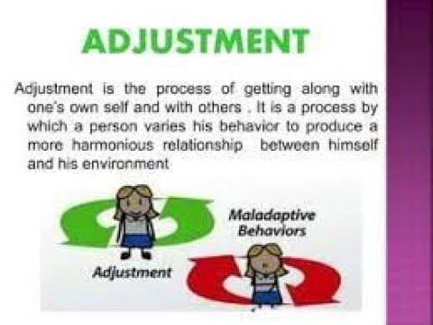

## Table of Contents

## What is the basic definition of adjustment in psychology?

In psychology, adjustment refers to how well a person can adapt to changes and challenges in their life. It involves changing behaviors, thoughts, and emotions to better fit new situations or to solve problems. Good adjustment helps people to cope with stress and maintain mental health.

Adjustment is important because life is full of changes, like moving to a new place, starting a new job, or dealing with a loss. When people adjust well, they can handle these changes without becoming too stressed or unhappy. If someone struggles with adjustment, they might feel anxious, depressed, or overwhelmed, and might need help from a psychologist or counselor.

## How does adjustment differ from adaptation?

Adjustment and adaptation are similar because they both involve changing to fit new situations. But they are a bit different. Adjustment is more about how a person deals with changes in their life, like how they handle stress or new challenges. It's about changing your behavior, thoughts, or feelings to make things work better. For example, if you move to a new city, adjustment would be about how you learn to live there and feel okay.

Adaptation, on the other hand, is a broader term. It can mean how any living thing, not just people, changes to survive in its environment. In psychology, adaptation can be about how people change over time to fit their world better. It's a bigger picture of change that might include many adjustments. For example, if you move to a new country, adaptation would be about how you learn the language, customs, and way of life over time.

So, adjustment is more about the immediate changes a person makes to cope with a specific situation, while adaptation is about the overall process of changing to fit into a new environment over time. Both are important for dealing with life's challenges, but they focus on different parts of the change process.

## What are the common types of adjustments individuals may face in life?

People often face different kinds of adjustments in life. One common type is social adjustment, which happens when people need to fit into new social groups or situations. This can happen when someone starts a new school, job, or moves to a new place. They need to make new friends, understand new social rules, and feel comfortable in the new setting. Another type is occupational adjustment, which involves changes in work or career. This can include getting a new job, changing careers, or dealing with new responsibilities at work. People need to learn new skills, adapt to different work cultures, and manage new challenges.

Another type of adjustment is emotional adjustment, which is about handling feelings and emotions during changes. This can happen after big life events like losing a loved one, getting divorced, or having a baby. People need to find ways to cope with their feelings, like sadness, stress, or happiness, and learn to feel okay again. Lastly, there's physical adjustment, which involves changes to the body or health. This can include getting older, dealing with an illness, or recovering from an injury. People need to adapt to these changes, which might mean changing their daily routines, getting help from doctors, or finding new ways to stay active and healthy.

All these types of adjustments are normal parts of life. They can be hard, but with time and effort, people can learn to handle them and feel better. Sometimes, talking to friends, family, or a counselor can help make the adjustment process easier.

## What are the psychological mechanisms involved in the process of adjustment?

When people go through changes, they use different ways to adjust. One way is called coping, which is about dealing with stress and problems. There are two main kinds of coping: problem-focused coping, where people try to fix the problem, like finding a new job if they lost their old one, and emotion-focused coping, where people try to feel better about the situation, like talking to a friend about their feelings. Another way is called cognitive restructuring, which means changing how you think about a situation to make it less stressful. For example, if someone moves to a new city, they might think about it as a chance to explore new places instead of feeling sad about leaving their old home.

Another important mechanism is social support, which is about getting help from other people. Friends, family, or even counselors can give advice, listen, or just be there to help someone feel better during tough times. This support can make a big difference in how well someone adjusts. Lastly, there's behavioral change, where people change what they do to fit the new situation. This can mean learning new skills, like cooking new types of food if they move to a new country, or changing daily routines, like waking up earlier for a new job. All these mechanisms help people adjust to changes and feel better about them.

## How does adjustment impact mental health and well-being?

Adjustment plays a big role in how people feel mentally and emotionally. When people can adjust well to changes in life, like moving to a new place or starting a new job, they usually feel better and more in control. They can handle stress and problems without getting too upset or overwhelmed. This helps keep their mental health strong and can make them feel happier and more at peace. Good adjustment means finding ways to cope with challenges, getting support from others, and changing thoughts and behaviors to fit the new situation.

On the other hand, if someone struggles to adjust, it can hurt their mental health and well-being. They might feel stressed, anxious, or sad because they can't handle the changes well. This can lead to bigger problems like depression or feeling burnt out. When people can't adjust, they might feel stuck or like they can't move forward in life. It's important for them to find help, like talking to a counselor, to learn better ways to adjust and take care of their mental health.

## What role does personality play in the adjustment process?

Personality plays a big part in how people adjust to changes. Some people have personalities that help them adjust easily. They might be more flexible, optimistic, or good at solving problems. These traits make it easier for them to handle new situations without getting too stressed. For example, someone who is naturally outgoing might find it easier to make new friends after moving to a new city. Their personality helps them see changes as chances to grow and learn, which makes the adjustment process smoother.

On the other hand, some people have personalities that make adjustment harder. They might be more anxious, shy, or resistant to change. These traits can make it tougher for them to adapt to new situations. For instance, someone who is very set in their ways might struggle a lot with a new job because they find it hard to learn new routines. But, even if their personality makes adjustment harder, they can still learn ways to cope better, like getting support from friends or working on changing their thoughts about change. Personality doesn't decide everything, but it does shape how people go through the adjustment process.

## How can environmental factors influence an individual's ability to adjust?

Environmental factors can really change how well someone adjusts to new situations. For example, if someone lives in a supportive community, it's easier for them to adjust. They can get help from neighbors or friends, which makes big changes feel less scary. Also, if someone has a stable home and enough money, they don't have to worry about basic needs, so they can focus on adjusting to other changes in life. On the other hand, if someone lives in a place where they don't feel safe or supported, adjusting to new things can be much harder. They might feel stressed all the time, which makes it tough to handle new challenges.

Another way the environment affects adjustment is through the culture and social norms around them. If someone moves to a place with very different customs and ways of life, it can be hard to fit in and feel comfortable. They might need to learn a new language or understand new rules, which takes time and effort. But, if the environment is welcoming and open to newcomers, it can make the adjustment process easier. People who live there might be more willing to help and be patient while someone learns and adjusts. So, the environment someone is in can either help them adjust smoothly or make it a lot harder.

## What are some effective strategies for coping with adjustment difficulties?

When someone is having a hard time adjusting, one good strategy is to talk to others about it. Friends, family, or even a counselor can listen and give advice. They can help someone feel less alone and more supported. Another strategy is to take small steps. Big changes can feel overwhelming, but breaking them down into smaller parts can make them easier to handle. For example, if someone is starting a new job, they could focus on learning one thing at a time instead of trying to know everything right away.

Another helpful approach is to change how you think about the situation. Instead of seeing change as a bad thing, try to see it as a chance to learn and grow. This can make the adjustment feel less scary. Also, taking care of yourself is important. Eating well, getting enough sleep, and doing things you enjoy can help you feel better and more able to handle stress. Sometimes, it's okay to take a break and do something fun to clear your mind and recharge.

Lastly, learning new skills can make adjustment easier. If someone is moving to a new place, learning about the culture and language can help them feel more at home. If someone is starting a new job, learning about the work and the people there can make it less stressful. By using these strategies, people can cope better with adjustment difficulties and feel more in control of their lives.

## How do different theoretical models explain the concept of adjustment?

Different theories in psychology explain adjustment in their own ways. One popular theory is the cognitive theory, which says that how we think about things affects how we adjust. If someone sees a change as a chance to learn and grow, they'll adjust better than someone who sees it as a problem. This theory suggests that changing our thoughts can help us handle changes better. Another theory is the behavioral theory, which focuses on what people do. It says that if someone learns new behaviors that fit the new situation, they can adjust well. For example, if someone moves to a new country, learning the language and customs there can help them feel more at home.

Another important theory is the psychodynamic theory, which looks at how past experiences and unconscious feelings affect adjustment. It suggests that understanding and dealing with these feelings can help people adjust to new situations. For example, if someone feels scared of change because of something that happened in the past, talking about those feelings with a therapist can help them feel better about the change. The humanistic theory also has its take on adjustment. It says that everyone has the power to grow and become their best self. When people face changes, they can use this power to adjust and feel good about themselves. This theory encourages people to focus on their own growth and well-being during the adjustment process.

## What are the long-term effects of successful versus unsuccessful adjustment?

When someone successfully adjusts to changes in their life, they usually feel happier and more in control. They can handle stress better and don't get too upset or overwhelmed by new situations. Over time, this can lead to better mental health and well-being. They might also do better at work or school because they can focus on learning and growing instead of worrying about the change. Good adjustment helps people build strong relationships and feel more connected to others, which makes life more enjoyable and fulfilling.

On the other hand, if someone struggles to adjust, it can have negative long-term effects. They might feel stressed, anxious, or sad all the time, which can lead to bigger problems like depression or feeling burnt out. This can make it hard for them to do well at work or school because they're always worried about the change. Over time, they might feel stuck and like they can't move forward in life. It's important for them to find help, like talking to a counselor, to learn better ways to adjust and take care of their mental health.

## How can professionals assess and measure adjustment in clinical settings?

In clinical settings, professionals can assess and measure adjustment by using different tools and methods. One common way is through interviews and questionnaires. They might ask someone about how they're feeling and what's been hard for them to adjust to. There are also special questionnaires that can measure how well someone is adjusting to changes. These questionnaires ask about things like stress, mood, and how well someone is coping. By looking at the answers, professionals can see if someone is adjusting well or if they need more help.

Another way professionals measure adjustment is by observing behavior and looking at how someone is doing in their daily life. They might watch how someone interacts with others, how they handle stress, and if they're able to do things they need to do, like going to work or taking care of themselves. Sometimes, they use scales and checklists to keep track of these things over time. This helps them see if someone's adjustment is getting better or worse. By using all these methods together, professionals can get a good picture of how well someone is adjusting and what kind of help they might need.

## What are the latest research findings on adjustment and its implications for therapy?

Recent research on adjustment has shown that it's really important for therapy to focus on helping people change how they think about changes. Studies have found that when people see changes as chances to learn and grow, they adjust better. Therapists can help by teaching people to look at things in a more positive way. For example, if someone is upset about moving to a new city, a therapist might help them see it as an adventure and a chance to make new friends. This kind of therapy, called cognitive-behavioral therapy, has been shown to be very effective in helping people adjust to new situations.

Another important finding is that social support plays a big role in adjustment. Research has shown that people who have friends, family, or a therapist to talk to adjust better than those who feel alone. Therapists can help by encouraging people to build strong relationships and get support from others. This can make a big difference in how well someone adjusts to changes. So, therapy that focuses on both changing thoughts and building support can really help people feel better and handle life's challenges more easily.

## What are Adjustment Mechanisms?

Various methods and tools are utilized in the adjustment of [algorithmic trading](/wiki/algorithmic-trading) strategies, with skewness and [liquidity](/wiki/liquidity-risk-premium) adjustments being particularly notable for their roles in optimizing algorithmic performance.

Skewness adjustment is a technique employed to address the asymmetry observed in the distributions of asset returns. In the financial context, skewness refers to the degree to which returns deviate from the normal distribution, indicating potential risks and opportunities beyond those predicted by standard models like the Gaussian distribution. Positive skewness suggests a distribution with potential for higher-than-average gains at the expense of occasional large losses, while negative skewness indicates the opposite. By accounting for skewness, traders can more accurately assess risk and reward profiles, enabling the refinement of trading strategies to better align with their risk appetites. Mathematically, skewness ($\gamma$) can be defined as:

$$
\gamma = \frac{E[(X - \mu)^3]}{\sigma^3}
$$

where $X$ is the return, $\mu$ is the mean, $\sigma$ is the standard deviation, and $E$ is the expected value operator. Adjusting for skewness requires modifying algorithm parameters to ensure that the trading strategy remains robust against asymmetric risk distributions.

Liquidity adjustment involves optimizing algorithmic strategies to minimize their impact on asset prices by accounting for variations in market depth and trading [volume](/wiki/volume-trading-strategy). Liquidity, defined as the ability to execute large orders quickly without significant price changes, is crucial in high-frequency and large-scale trading environments. A well-calibrated algorithm must account for liquidity to ensure that trades are executed efficiently and cost-effectively.

Trading algorithms often incorporate liquidity considerations by dynamically adjusting order sizes and execution speeds based on prevailing market conditions. For instance, if volume is low, an algorithm may stagger trades or employ limit orders to avoid price slippage. Calculating the impact cost $(C_i)$ of a trade as a function of market liquidity can be expressed as:

$$
C_i = V_i \times P_i \times \lambda
$$

where $V_i$ is the volume of the trade, $P_i$ is the price of the asset, and $\lambda$ is a liquidity measure, typically derived from bid-ask spreads and order book depth. By incorporating such considerations, liquidity adjustments help maintain the efficiency and effectiveness of trading strategies under varying market conditions.

Incorporating skewness and liquidity adjustments into algorithmic trading frameworks enables traders to better mitigate risks and capitalize on market opportunities. Through continuous monitoring and adaptation of these adjustments, trading algorithms can remain aligned with both targeted financial objectives and shifting market dynamics.

## References & Further Reading

[1]: Bergstra, J., Bardenet, R., Bengio, Y., & Kégl, B. (2011). ["Algorithms for Hyper-Parameter Optimization."](https://dl.acm.org/doi/10.5555/2986459.2986743) Advances in Neural Information Processing Systems 24.

[2]: ["Advances in Financial Machine Learning"](https://www.amazon.com/Advances-Financial-Machine-Learning-Marcos/dp/1119482089) by Marcos Lopez de Prado.

[3]: ["Evidence-Based Technical Analysis: Applying the Scientific Method and Statistical Inference to Trading Signals"](https://www.amazon.com/Evidence-Based-Technical-Analysis-Scientific-Statistical/dp/0470008741) by David Aronson.

[4]: ["Machine Learning for Algorithmic Trading"](https://github.com/stefan-jansen/machine-learning-for-trading) by Stefan Jansen.

[5]: ["Quantitative Trading: How to Build Your Own Algorithmic Trading Business"](https://www.amazon.com/Quantitative-Trading-Build-Algorithmic-Business/dp/1119800064) by Ernest P. Chan.