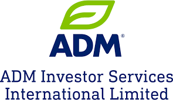

## Table of Contents

## What is ADM Investor Services?

ADM Investor Services is a company that helps people and businesses invest their money. They offer different ways to invest, like trading futures and options, which are agreements to buy or sell things at a future date. They also provide services for managing money and giving advice on investments. The company is part of a bigger company called Archer Daniels Midland, which is involved in agriculture and food.

People use ADM Investor Services to help them make smart choices about where to put their money. The company has experts who know a lot about markets and can help clients understand how to invest safely and profitably. They also have tools and technology to make trading easier and more efficient. This can be helpful for both new investors and experienced ones who want to grow their money.

## What types of services does ADM Investor Services offer?

ADM Investor Services offers different services to help people and businesses with their money. They help with trading futures and options. Futures and options are agreements to buy or sell things later. This can be useful for farmers who want to know what price they will get for their crops, or for companies that need certain materials.

They also offer services for managing money. This means they can help you decide where to put your money to make it grow. They have experts who know a lot about markets and can give you advice. This can be helpful if you are new to investing or if you have been doing it for a long time and want to do better.

ADM Investor Services also has tools and technology to make trading easier. They have systems that let you see what is happening in the markets and make trades quickly. This can help you make decisions faster and maybe make more money. They are part of a big company called Archer Daniels Midland, which helps them understand agriculture and food markets well.

## How can one start an account with ADM Investor Services?

To start an account with ADM Investor Services, you need to visit their website or call them. On their website, you will find a section where you can apply for an account. You will need to fill out some forms with your personal information, like your name, address, and social security number. They will also ask about your experience with investing and what you want to achieve with your money. It's important to be honest and clear about your goals so they can help you better.

After you submit your application, ADM Investor Services will review it. They might call you to ask more questions or to explain things. Once they approve your application, you will need to deposit some money into your new account. This money is what you will use to start trading futures, options, or other investments. They will guide you through the process and make sure you understand everything before you start trading.

## What are the fees associated with using ADM Investor Services?

When you use ADM Investor Services, you will need to pay some fees. They charge a fee for each trade you make. This fee can change depending on what you are trading and how much you are trading. They also have fees for keeping your account open, like a monthly or yearly fee. These fees help them cover the costs of running their business and providing you with their services.

Besides the trading and account fees, there might be other costs. For example, if you need help from their experts or use special tools, there could be extra charges. It's important to read all the information they give you carefully so you know exactly what you will be paying. If you have any questions about the fees, you can always call them and ask. They will explain everything to you so you can make a good decision about using their services.

## What markets does ADM Investor Services cover?

ADM Investor Services covers many different markets. They help people trade in markets like agriculture, where you can buy and sell things like corn, wheat, and soybeans. They also work with energy markets, where you can trade things like oil and natural gas. Besides these, they cover metals like gold and silver, and even financial products like interest rates and stock indexes.

These markets are important because they help people manage risk and plan for the future. For example, a farmer can use ADM Investor Services to lock in a price for their crops before they are even harvested. This helps them know how much money they will make. Companies that need oil or gas can do the same thing to make sure they can buy what they need at a good price. ADM Investor Services helps people understand and use these markets to make smart decisions about their money.

## How does ADM Investor Services support its clients in making investment decisions?

ADM Investor Services helps its clients make smart investment choices by giving them good advice and information. They have experts who know a lot about different markets like agriculture, energy, and metals. These experts can talk to clients and help them understand what is happening in these markets. They also give advice on what to buy or sell and when to do it. This can be really helpful for people who are new to investing or for those who want to do better.

The company also has special tools and technology that make it easier for clients to make decisions. They have systems that show what is happening in the markets in real-time. This means clients can see prices and trends as they happen. ADM Investor Services also lets clients trade quickly and easily using these tools. By giving clients all this information and help, ADM Investor Services makes it easier for them to make good choices about where to put their money.

## What is the history and background of ADM Investor Services?

ADM Investor Services started as part of Archer Daniels Midland, a big company that works with agriculture and food. Archer Daniels Midland began in 1902 and has grown a lot since then. ADM Investor Services was created to help people and businesses invest their money in different markets. They wanted to use their knowledge of agriculture and other markets to help others make good investment choices.

Over the years, ADM Investor Services has become a trusted name in the world of investing. They offer services like trading futures and options, which are agreements to buy or sell things later. They also help with managing money and giving advice. Their experts know a lot about markets like agriculture, energy, and metals. This helps them give good advice to their clients. ADM Investor Services keeps growing and finding new ways to help people invest their money wisely.

## How does ADM Investor Services ensure the security of client investments?

ADM Investor Services works hard to keep client investments safe. They use strong security systems to protect the information and money of their clients. They have rules and checks in place to make sure that only people who should be able to see and use client information can do so. This helps stop anyone from stealing or misusing the money and data.

They also follow strict rules set by the government and other groups that watch over investments. These rules help make sure that ADM Investor Services does everything the right way. They regularly check their own systems to make sure they are working well and to fix any problems quickly. This way, clients can feel confident that their investments are safe with ADM Investor Services.

## What are the technological tools provided by ADM Investor Services for trading?

ADM Investor Services gives clients special tools to help them trade easily. They have a system that shows what is happening in the markets right now. This means clients can see prices and trends as they happen. They can use this information to decide when to buy or sell. The system also lets clients make trades quickly and easily, so they don't miss out on good opportunities.

These tools are made to be simple to use, even if you are new to trading. ADM Investor Services also has a website and apps that clients can use on their computers or phones. This makes it easy to keep an eye on investments and make trades from anywhere. By using these tools, clients can feel more confident and in control of their money.

## How does ADM Investor Services comply with financial regulations?

ADM Investor Services follows strict rules to make sure they do things the right way. They are watched over by groups like the Commodity Futures Trading Commission (CFTC) and the National Futures Association (NFA). These groups set rules that ADM Investor Services has to follow to keep their clients' money and information safe. They check regularly to make sure ADM Investor Services is doing everything correctly.

By following these rules, ADM Investor Services helps protect their clients and keeps their business honest. They have systems in place to make sure they meet all the requirements. This includes keeping good records, reporting information correctly, and making sure their employees know and follow the rules. This way, clients can trust that ADM Investor Services is working hard to do things right and keep their investments safe.

## What are some case studies or success stories of clients using ADM Investor Services?

One success story is about a farmer named John who used ADM Investor Services to protect his crops. John grows corn and wanted to make sure he would get a good price for his harvest. He used the futures market to lock in a price before his corn was even ready. With help from ADM Investor Services, John was able to make a good profit even when the market prices went down. He was happy because he felt more secure about his income.

Another client, a small business owner named Sarah, used ADM Investor Services to manage her company's energy costs. Sarah's business needed a lot of natural gas, and the prices were always changing. She used the options market to buy natural gas at a set price in the future. This helped her save money when the prices went up. Sarah said that the tools and advice from ADM Investor Services made a big difference for her business.

## What advanced trading strategies can be implemented using ADM Investor Services' platform?

Using ADM Investor Services' platform, clients can use advanced trading strategies like hedging. Hedging means making trades that protect against price changes. For example, a farmer might sell futures contracts to lock in a price for their crops before they are harvested. This way, if the market price drops, they still get the price they agreed on. ADM Investor Services provides real-time data and tools to help clients set up these hedges quickly and easily. They can also talk to experts who can give advice on the best times to hedge and how to do it.

Another strategy is spread trading, which involves buying and selling related contracts at the same time. For example, someone might buy corn futures for one month and sell corn futures for another month. The goal is to make money from the difference in prices between the two contracts. ADM Investor Services' platform makes it easy to see these price differences and make the trades. Clients can use the platform's charts and data to find good opportunities for spread trading. With the help of ADM Investor Services' tools and experts, clients can use these advanced strategies to manage their investments better.

## References & Further Reading

[1]: ["Introduction to Algorithms, Fourth Edition"](https://www.amazon.com/Introduction-Algorithms-fourth-Thomas-Cormen/dp/026204630X) by Thomas H. Cormen, Charles E. Leiserson, Ronald L. Rivest, and Clifford Stein 

[2]: ["Algorithmic Trading and DMA: An introduction to direct access trading strategies"](https://www.amazon.com/Algorithmic-Trading-DMA-introduction-strategies/dp/0956399207) by Barry Johnson

[3]: ["High-Frequency Trading: A Practical Guide to Algorithmic Strategies and Trading Systems"](https://www.amazon.com/High-Frequency-Trading-Practical-Algorithmic-Strategies/dp/1118343506) by Irene Aldridge

[4]: ["Building Winning Algorithmic Trading Systems: A Trader's Journey From Data Mining to Monte Carlo Simulation to Live Trading"](https://www.amazon.com/Building-Winning-Algorithmic-Trading-Systems/dp/1118778987) by Kevin Davey

[5]: Aldridge, I. (2013). ["High-Frequency Trading: A Practical Guide to Algorithmic Strategies and Trading Systems, 2nd Edition"](https://www.amazon.com/High-Frequency-Trading-Practical-Algorithmic-Strategies/dp/1118343506). Wiley.