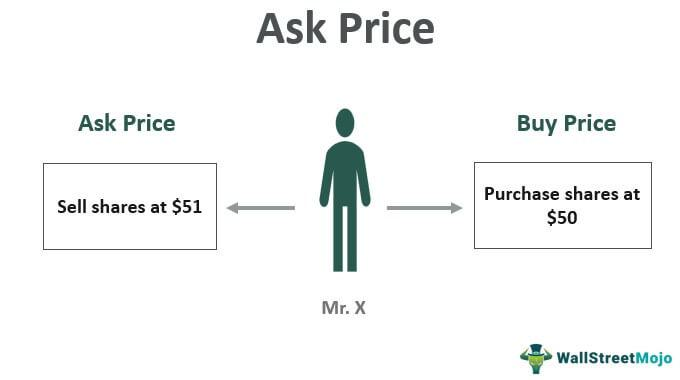

Administered price controls play a crucial role in shaping economic systems, particularly in how they influence the dynamics between supply and demand. These controls involve government or authoritative intervention in setting prices for goods and services rather than allowing natural market forces to dictate them. The primary rationale behind implementing such controls is to achieve specific policy objectives, mitigate market failures, and ensure affordable access or stability during economic disruptions. Understanding these mechanisms is vital for stakeholders such as investors and policymakers, as they affect market behavior, resource allocation, and investment decisions.

Price controls can manifest as price ceilings, which limit how high a price can be charged, or price floors, which set a minimum threshold. These interventions can produce profound ramifications in market dynamics, often leading to shortages, surpluses, or even unintended consequences like black markets. Moreover, they challenge the natural equilibrium that laissez-faire markets strive to achieve.



In contemporary markets, algorithmic trading represents a significant development influencing market behavior. This technologically advanced practice leverages complex algorithms and high-frequency trading to execute transactions at speeds and volumes human traders cannot match. Algorithmic trading contributes to market liquidity and efficiency but also introduces risks like flash crashes and challenges in price discovery. The interplay between administered price controls and algorithmic trading in modern markets is a domain of increasing interest.

As economic systems become more complex, the implications of price controls and algorithmic trading intensify. Policymakers must grapple with regulating these controls while fostering a competitive landscape that does not stifle innovation or market efficiency. Investors, on the other hand, must incorporate the understanding of these elements into their strategies to navigate and anticipate market movements effectively.

This article aims to explore these elements thoroughly, providing a comprehensive overview of administered price controls, their economic examples, and the influence of algorithmic trading. By doing so, it lays the groundwork for stakeholders to comprehend the nuances of these mechanisms and their implications for maintaining balanced economic environments. This knowledge is essential for informed decision-making and the formulation of strategies that align with both market realities and regulatory environments.

## Table of Contents

## Understanding Administered Prices

Administered prices are those established by a governmental or centralized authority rather than being determined by the natural interactions of supply and demand in a competitive market. This form of price setting is typically employed to achieve specific policy goals, such as stabilizing an economy, controlling inflation, or ensuring the affordability of essential goods and services for the population. By intervening in the market, governments can address market inefficiencies that may arise due to monopolistic practices, externalities, or information asymmetries.

Administered prices are often used in centrally planned economies, where the state plays a pivotal role in economic decision-making. In such systems, prices for most goods and services are set by the government to align with broader economic objectives, such as balancing industrial production or managing resource allocation. For instance, the former Soviet Union exemplified a centrally planned economy where the government controlled prices extensively.

In contrast, mixed economies, which combine elements of both free-market and state intervention, use administered prices more selectively. Governments in these systems may set prices for essential goods such as utilities, healthcare, and public transportation. For example, many countries implement administered prices for medications to make healthcare more accessible to their citizens.

Administered prices differ from natural market-driven prices, which are determined by the interaction of supply and demand without governmental interference. In a free market, the price of a good or service tends to reach an equilibrium where the quantity demanded by consumers equals the quantity supplied by producers. However, administered prices disrupt this equilibrium by setting prices above or below the natural market level, which can lead to various outcomes such as shortages or surpluses.

Shortages occur when administered prices are set below the market equilibrium. Consumers demand more of the product at the lower price, but producers are less willing to supply it, leading to scarcity. Conversely, when prices are set above the equilibrium, surpluses can result, where producers are willing to supply more than what consumers are willing to purchase at the administered price.

Understanding administered prices involves recognizing their dual role in policy implementation and market correction. While they can be effective tools for achieving social and economic objectives, they also necessitate careful management to avoid unintended consequences like black markets or reduced incentives for producers to invest and innovate. Further exploration of this concept reveals its complexity and importance in shaping both centrally planned and mixed economies.

## Economic Examples of Price Controls

Price controls have been a prominent feature in various economic systems, particularly during times of economic instability or crisis. Their implementation can significantly affect the equilibrium between supply and demand, often leading to unintended economic consequences.

One classic example of administered price controls is rent control, which has been implemented in various countries to provide affordable housing during times of shortage or economic downturn. Rent control can cap the amount landlords can charge tenants, stabilizing housing costs. However, while it aims to protect renters, this control can result in reduced incentives for landlords to maintain and invest in properties, potentially leading to housing shortages and deteriorations in housing quality.

Another widespread form of price control is the imposition of price ceilings, which limit the maximum price a seller can charge for a good or service. Price ceilings are often used in times of war or crisis to make essential goods accessible to the general public. During World War II, for instance, many countries instituted price ceilings on essential goods like fuel and food to ensure equitable distribution. While price ceilings can improve access to crucial goods, they may also lead to shortages as producers may not find it profitable to supply goods at artificially low prices. This can lead to black markets or decreased supply as producers [exit](/wiki/exit-strategy) the market or scale back production.

Historical instances further illustrate the impact of price controls. During the 1970s, the United States grappled with an energy crisis, leading to the implementation of price controls on oil and gasoline. While intended to shield consumers from rising prices, these controls resulted in long queues at gasoline stations and significant market distortions, as demand exceeded the constrained supply.

Wartime economies provide additional context. In the post-World War I era, several European countries maintained price controls to manage food shortages and economic recovery. Similarly, during World War II, the United States established the Office of Price Administration to control money (inflation) and rents after the outbreak of the war. These controls were essential in redistributing resources and stabilizing the economy amidst the turmoil but often required a delicate balance to minimize negative side effects like shortages or black market developments.

Administered price controls illustrate the complex interplay between regulation and market dynamics. While they can stabilize or protect consumers during critical periods, they often require careful implementation and monitoring to avoid adverse effects such as shortages, reduced quality, or market dislocations. The historical lessons from implemented price controls underscore the need for adaptive and carefully crafted economic policies.

## Algorithmic Trading and Market Dynamics

Algorithmic trading, a product of technological advancement, employs computer algorithms to execute trades at speeds and frequencies humans cannot match. These algorithms analyze market data, identify trading opportunities, and execute orders based on predefined criteria. This practice enhances market [liquidity](/wiki/liquidity-risk-premium) by increasing the [volume](/wiki/volume-trading-strategy) of trades executed within a short timeframe. As a result, [algorithmic trading](/wiki/algorithmic-trading) plays a crucial role in price discovery, the process through which market prices adjust to reflect new information.

The execution of algorithmic trading strategies includes [market making](/wiki/market-making), [arbitrage](/wiki/arbitrage), [trend following](/wiki/trend-following), and [statistical arbitrage](/wiki/statistical-arbitrage), among other techniques. Market making involves placing buy and sell orders for the same asset to capture the bid-ask spread, thereby providing liquidity to the markets. Arbitrage strategies exploit price discrepancies of the same asset across different markets or platforms, ensuring price alignment and market efficiency. Trend following strategies seek to capitalize on upward or downward market trends by executing trades in the direction of the trend. Statistical arbitrage uses quantitative models to identify price deviations from expected values, with trades made to earn profit when prices revert to their mean.

Despite the benefits algorithmic trading provides, it introduces significant risks, most notably flash crashes. These are sharp, rapid market price declines, partially attributed to algorithmic trading systems executing large volumes of trades in minutes, triggering a vicious cycle of selling. The most infamous example occurred on May 6, 2010, when the U.S. stock market lost nearly $1 trillion in market value within minutes before rebounding just as quickly. This event highlighted the systemic risk posed by high-frequency trading algorithms operating without sufficiently robust controls.

Regulatory challenges arise as algorithmic trading can potentially undermine market stability. The complexity and speed of trading necessitate regulation to prevent manipulative practices like quote stuffing, where an overwhelming number of orders are placed and canceled quickly, disrupting the market. Furthermore, algorithmic trading systems must be constantly monitored to prevent unintended consequences from errors in programming or logic.

Regulatory bodies such as the U.S. Securities and Exchange Commission (SEC) and the European Securities and Markets Authority (ESMA) strive to address these challenges by implementing reforms that enhance market resilience. Measures include introducing circuit breakers that temporarily halt trading upon significant price movements and mandating that trading firms establish comprehensive risk management and control systems to detect and mitigate the adverse effects of algorithmic activities.

Effective regulation balances the innovative and efficiency-enhancing benefits of algorithmic trading with the need for maintaining market integrity and stability. Continued cooperation between financial markets, technology providers, and regulatory agencies is essential to adapt to the evolving landscape of algorithmic trading.

## Interplay between Price Controls and Algorithmic Trading

The intersection of price controls and algorithmic trading presents a complex yet intriguing aspect of modern financial markets. Price controls, when imposed by regulatory bodies, aim to stabilize or manipulate market prices of specific goods, but they can inadvertently become focal points for algorithmic trading strategies. Algorithms, designed to operate at speeds and efficiencies beyond human capability, can identify and exploit discrepancies created by these fixed prices. This potential exploitation calls for regulatory vigilance to preserve market equilibrium.

Algorithmic trading systems can capitalize on fixed prices by engaging in arbitrage, a strategy that involves buying in a lower-priced market and selling in a higher-priced one, thus profiting from the price differential. In markets with imposed price ceilings or floors, these algorithms might spot opportunities where manual traders cannot, executing trades that capitalize on transient pricing inefficiencies. However, this can lead to unintended consequences that disrupt intended economic policies by either circumventing price regulations or exacerbating supply-demand imbalances. 

For regulators, this necessitates enhancing current frameworks to mitigate the risks posed by algorithmic exploitation of administered prices. Incorporating advanced technological solutions like [machine learning](/wiki/machine-learning) algorithms to monitor and analyze trading patterns in real-time could provide a robust mechanism for detecting manipulative strategies. For instance, the concept of real-time trade surveillance can be implemented using sophisticated algorithms. A basic framework in Python could look like:

```python
def detect_manipulative_trade(trades):
    for trade in trades:
        if trade.price_deviation() > threshold:
            flag_suspicious_activity(trade)

def price_deviation(trade):
    expected_price = calculate_expected_price(trade.market_data)
    return abs(trade.price - expected_price)

def flag_suspicious_activity(trade):
    # Logic to alert regulators
    pass
```

This hypothetical example underscores the necessity for dynamic trading oversight to counteract the capabilities of algorithmic systems. As these systems evolve, they challenge the adequacy of current regulations, highlighting the importance of continuous refinement of policy measures to keep pace with technological advancements. 

Moreover, the regulatory focus extends beyond merely curbing manipulative activities; it involves ensuring that trading technologies contribute positively to market stability. Tools like circuit breakers and algorithm testing scenarios help buffer markets against extreme [volatility](/wiki/volatility-trading-strategies) potentially induced by algorithmic trading. Circuit breakers pause trading temporarily to allow markets to rationalize extreme movements, while pre-market tests ensure that new algorithms do not disrupt market order.

Ultimately, the prudent use of technology in regulatory frameworks is pivotal in sustaining an equilibrium between innovation and market integrity. Effective regulation not only addresses exploitation risks but also encourages the development of technologies that uphold the objectives of both administered price controls and fair market practices, thus maintaining trust and efficiency in financial systems.

## Implications for Investors and Policymakers

Price controls and algorithmic trading are two influential forces shaping modern investment strategies. For investors, understanding the interplay between these elements is essential to navigate market trends effectively and make informed decisions. Price controls, such as rent caps and price floors, can distort natural market signals, leading to a re-evaluation of asset values and risk assessments. These controls often result in shortages or surpluses, affecting the supply-demand balance, which investors must consider when forecasting market movements.

Algorithmic trading, characterized by high-speed and data-driven decision-making processes, further complicates the market landscape. It enhances market liquidity and facilitates rapid price discovery but also introduces volatility through phenomena such as flash crashes. Investors need to incorporate these dynamics into their strategies, leveraging advanced analytical tools and algorithms to anticipate and respond to market fluctuations effectively.

Policymakers, on the other hand, face the dual challenge of fostering economic stability while maintaining market freedom. Price controls are often implemented to achieve policy objectives, such as reducing inflationary pressures or ensuring affordability of essential goods. However, these interventions can lead to unintended consequences, necessitating careful calibration and monitoring. Policymakers must engage with stakeholders to balance these objectives, adapting policies to respond to evolving market conditions.

Adaptive policymaking is crucial, as static regulatory measures may fail to address the rapidly changing economic environment. Engaging with investors, financial institutions, and technology providers ensures that policies are robust enough to manage the risks associated with both price controls and algorithmic trading. This engagement is essential for designing effective regulatory frameworks that maintain market integrity and promote economic stability.

In conclusion, the integration of price controls and algorithmic trading into investment strategies and policymaking requires continuous analysis and adaptation. Stakeholders must remain vigilant and informed of the latest developments in economic controls and trading technologies to safeguard against potential disruptions and capitalize on emerging opportunities.

## Conclusion

Administered price controls and algorithmic trading are two significant elements shaping modern economic environments. Administered price controls, set by governmental or centralized authorities, play a crucial role in achieving policy objectives and addressing market inefficiencies. They help maintain economic stability during periods of crisis but can also lead to market distortions such as shortages or surpluses when not implemented judiciously. In contrast, algorithmic trading, characterized by the use of advanced computer algorithms for executing trading orders at high speed, influences market dynamics by enhancing liquidity and efficiency. However, it also poses risks such as flash crashes and market manipulations that challenge existing regulatory frameworks.

The coexistence of these elements necessitates ongoing analysis and adaptation in investment strategies and policy-making processes. Investors must remain vigilant about how price controls and algorithmic trading mechanisms influence market trends to make informed decisions. Policymakers are tasked with the complex challenge of fostering market freedom while ensuring economic stability, requiring adaptive regulatory measures that accommodate evolving market landscapes.

Regulatory frameworks are paramount in maintaining market integrity and stability in this complex interplay of administered controls and technological advancements in trading. Effective regulation can mitigate the risks associated with algorithmic trading, such as market manipulation and volatility, while ensuring that administered price controls are not exploited to the detriment of overall market health.

Stakeholders, including investors, policymakers, and regulatory bodies, must remain informed and responsive to the continuous developments in economic controls and trading technologies. This proactive approach is essential for safeguarding the resilience and efficiency of financial markets, ensuring they serve the broader economic needs effectively.

## References & Further Reading

[1]: ["The Impact of Price Controls on Supply and Demand"](https://www.principlesofeconomics.net/applications-of-supply-and-demand-price-controls) - Investopedia

[2]: O'Hara, M. (2015). ["High Frequency Market Microstructure."](https://www.sciencedirect.com/science/article/pii/S0304405X15000045) The Review of Financial Studies, 28(7), 1238–1276.

[3]: Cohen, A.J. (1995). ["Price Controls: Miracle Cure or Poison by Prescription?"](https://www.amazon.com/Right-Price-Value-Based-Prescription-Costs-ebook/dp/B0937GQ9GH) Cato Institute

[4]: ["Algorithmic Trading: The Basics"](https://www.investopedia.com/articles/active-trading/101014/basics-algorithmic-trading-concepts-and-examples.asp) - Forbes Advisor

[5]: Hasbrouck, J., & Saar, G. (2013). ["Low-latency trading."](https://www.sciencedirect.com/science/article/abs/pii/S1386418113000165) Journal of Financial Markets, 16(4), 646-679.

[6]: Schotten, G., & Van Ewijk, C. (1997). ["Price Controls in Practice and Theory."](https://www.semanticscholar.org/paper/Time-for-Transition-an-exploratory-study-of-the-to-Dicou-Ewijk/aed6abb82e5dcbb90391590b039c2eb0d0ddb1d7) De Economist, 145(4), 487-513.