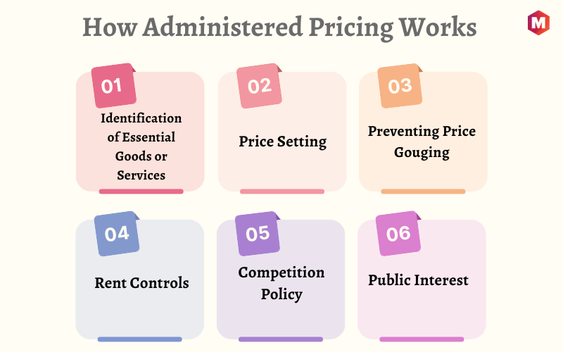

## Table of Contents

## What are administered prices?

Administered prices are prices that are set by someone other than the forces of supply and demand. Instead of letting the market decide, a government, a regulatory body, or sometimes even a company can set these prices. This can happen in industries like utilities, where the government might set the price of electricity or water to make sure everyone can afford it, or in healthcare, where drug prices might be controlled.

The idea behind administered prices is to protect consumers and sometimes producers from the ups and downs of the market. For example, if the price of a necessary medicine goes up a lot because of high demand, the government might step in to keep the price lower so people can still afford it. But, setting prices this way can also have downsides. It might lead to shortages if the price is set too low, or it might discourage companies from making certain products if they can't make enough money.

## Who typically sets administered prices?

Administered prices are usually set by governments or regulatory agencies. These groups decide on the prices to make sure that important goods and services, like electricity, water, or medicine, stay affordable for everyone. They might do this because they think the market isn't working fairly, or because they want to help people who can't afford high prices.

Sometimes, big companies can also set administered prices, especially if they have a lot of control over a market. For example, a company that is the only one selling a certain product might decide the price without much competition. But even in these cases, governments might step in to make sure the prices are fair and don't hurt consumers.

## Can you provide a simple example of an administered price?

Imagine you live in a town where the government decides how much people have to pay for water. Instead of letting water companies charge whatever they want, the government says, "Everyone will pay $2 for every 1,000 gallons of water." This is an example of an administered price. The government sets it to make sure that everyone can afford water, even if it's expensive for the water company to provide it.

This kind of price control can help people who don't have a lot of money. They won't have to worry about the price of water going up and up. But, if the government sets the price too low, the water company might not make enough money to keep the water flowing. So, setting the right price is important to make sure everyone is happy and has what they need.

## How do administered prices differ from market-determined prices?

Administered prices are set by someone other than the market, like a government or a big company. They decide what the price should be to make sure it's fair or to help people afford important things like medicine or water. For example, if medicine prices go up a lot, the government might say, "This medicine can only cost $10," so everyone can buy it.

Market-determined prices, on the other hand, are set by how much people want something and how much of it is available. If lots of people want something and there's not much of it, the price goes up. If nobody wants something or there's a lot of it, the price goes down. For example, if there are lots of apples and not many people want them, the price of apples will be low.

The big difference is who decides the price. With administered prices, it's not up to buyers and sellers; someone else makes the call. With market-determined prices, it's all about what people are willing to pay and what sellers are willing to sell for. Both ways have good and bad points, and it depends on the situation which one works better.

## What are the advantages of using administered prices?

Administered prices can help make sure that important things like medicine, water, and electricity are affordable for everyone. When the government or a regulatory body sets the price, they can keep it low so that even people who don't have a lot of money can afford these necessities. This can be really important in times when the market prices might go up a lot, like during a crisis or when there's not enough of something. By keeping prices under control, the government can help make sure that everyone has access to what they need.

Another advantage of administered prices is that they can help prevent big companies from charging too much. Sometimes, if a company has a lot of control over a product, they might set the price really high to make more money. Administered prices can stop this from happening, making sure that prices stay fair for everyone. This can be good for both consumers, who don't have to pay too much, and for the economy, as it keeps things stable and helps people trust that prices won't suddenly go up.

## What are the potential disadvantages or criticisms of administered prices?

One big problem with administered prices is that they can lead to shortages. If the government sets the price too low, companies might not want to make or sell as much of the product because they're not making enough money. For example, if the price of medicine is set really low, the company might decide to make less of it or stop making it altogether. This can mean that there's not enough medicine for everyone who needs it, which can be really bad.

Another criticism is that administered prices can mess up the market. When prices are set by the government instead of by what people want and what's available, it can stop the market from working the way it's supposed to. This can lead to companies not wanting to invest in new products or services because they're not sure if they'll be able to make money. It can also mean that people don't get to choose from as many options, because companies might not want to compete if they can't set their own prices.

Overall, while administered prices can help keep things affordable, they can also cause problems like shortages and mess up how the market works. It's a tricky balance to get right, and governments have to be careful about how they set these prices to make sure they're helping more than they're hurting.

## In what sectors are administered prices most commonly found?

Administered prices are most commonly found in sectors where the government wants to make sure that everyone can afford important things. This includes the healthcare sector, where governments might set prices for medicines or medical services to keep them affordable. For example, in some countries, the price of essential drugs is controlled to make sure people don't have to pay too much. The same goes for utilities like electricity and water. Governments often set prices for these services to make sure everyone can have them, even if the cost to provide them goes up.

Another sector where administered prices are common is public transportation. Governments might set the price of bus or train tickets to make sure people can get around without spending too much money. This can be really important in big cities where people rely on public transport to go to work or school. Sometimes, administered prices are also used in the agriculture sector, especially for staple foods like bread or rice. By controlling the price of these foods, governments can help make sure that everyone can afford to eat, even during tough times.

## How do governments justify the use of administered prices?

Governments use administered prices to make sure that everyone can afford important things like medicine, water, and electricity. They think it's not fair if prices go up a lot because of the market, especially when people need these things to live. By setting the prices themselves, governments can keep them low so that even people who don't have much money can still get what they need. This is really important during emergencies or when there's not enough of something, because it helps keep things stable and makes sure everyone has access to the basics.

Another reason governments use administered prices is to stop big companies from charging too much. If a company has a lot of control over a product, they might set a really high price to make more money. Governments don't want this to happen, so they set the prices to keep them fair for everyone. This can help protect consumers and make sure the economy stays stable, because people won't have to worry about prices suddenly going up. It also helps people trust that they won't be taken advantage of by big businesses.

## What is the impact of administered prices on inflation?

Administered prices can help keep inflation under control. When the government sets the prices of important things like medicine, water, and electricity, they can keep these prices from going up too fast. This means that even if other prices in the economy are going up, the prices of these important things stay the same or go up more slowly. By doing this, the government can help keep overall inflation lower, because these things are a big part of what people spend their money on.

But, administered prices can also make inflation worse in some ways. If the government sets prices too low, companies might not want to make or sell as much of the product because they're not making enough money. This can lead to shortages, where there's not enough of something for everyone who needs it. When there are shortages, people might have to pay more to get what they need, which can push prices up and make inflation worse. So, while administered prices can help control inflation, they need to be set carefully to avoid causing other problems.

## How can administered prices affect competition within an industry?

Administered prices can make it harder for companies to compete with each other. When the government sets the price of something, companies can't change it to try to get more customers. This means they can't lower their prices to beat their competitors or raise them to make more money. Instead, they have to find other ways to stand out, like making their product better or giving better service. But this can be tough, especially for smaller companies that might not have as much money to spend on making their product different.

On the other hand, administered prices can also help keep big companies from taking over the whole market. If a big company could set prices really high, they might be able to push smaller companies out of business. But with administered prices, everyone has to charge the same amount, so smaller companies have a better chance of staying in the game. This can help keep the market more balanced and give consumers more choices. So, while administered prices can limit how companies compete on price, they can also help make sure the competition stays fair.

## What are some international examples of administered prices and their effects?

In Venezuela, the government set the price of basic foods like bread and milk to make sure everyone could afford them. They did this because they wanted to help people who didn't have much money. But, setting the prices too low made it hard for farmers and shops to make enough money. So, they started selling less food, and there were big lines and shortages. People had a hard time finding enough to eat, even though the prices were low. This shows how administered prices can cause problems if they're not set right.

In Germany, the government controls the price of some medicines to keep them affordable for everyone. This helps people who need these medicines to stay healthy without spending too much money. Because the prices are set, companies can't charge more, so everyone can get the medicine they need. This has helped keep healthcare costs down and made sure more people can afford their medicine. But, some companies say it's hard to make new medicines because they can't charge enough to cover their costs. So, while it helps people now, it might make it harder to have new medicines in the future.

## How do economic theories evaluate the efficiency of administered prices?

Economic theories often say that administered prices can make markets less efficient. When the government sets the price of something instead of letting the market decide, it can mess up how much of that thing is made and how much people want it. If the price is set too low, companies might not want to make as much because they're not making enough money. This can lead to shortages, where there's not enough of something for everyone who needs it. On the other hand, if the price is set too high, people might not want to buy as much, and there could be too much of the product sitting around. This means the market isn't working as well as it could, and resources aren't being used in the best way.

But some economic theories also say that administered prices can be good in certain situations. For example, if a company has a lot of control over a product and can set the price really high, the government might step in to keep the price fair for everyone. This can help make sure that important things like medicine and water stay affordable, even if the market would make them more expensive. While this might make the market less efficient in some ways, it can help protect people and make sure they have what they need. So, it's a balance between letting the market work and making sure everyone is taken care of.

## References & Further Reading

[1]: ["The Impact of Price Controls on Supply and Demand"](https://www.principlesofeconomics.net/applications-of-supply-and-demand-price-controls) - Investopedia

[2]: O'Hara, M. (2015). ["High Frequency Market Microstructure."](https://www.sciencedirect.com/science/article/pii/S0304405X15000045) The Review of Financial Studies, 28(7), 1238–1276.

[3]: Cohen, A.J. (1995). ["Price Controls: Miracle Cure or Poison by Prescription?"](https://www.amazon.com/Right-Price-Value-Based-Prescription-Costs-ebook/dp/B0937GQ9GH) Cato Institute

[4]: ["Algorithmic Trading: The Basics"](https://www.investopedia.com/articles/active-trading/101014/basics-algorithmic-trading-concepts-and-examples.asp) - Forbes Advisor

[5]: Hasbrouck, J., & Saar, G. (2013). ["Low-latency trading."](https://www.sciencedirect.com/science/article/abs/pii/S1386418113000165) Journal of Financial Markets, 16(4), 646-679.

[6]: Schotten, G., & Van Ewijk, C. (1997). ["Price Controls in Practice and Theory."](https://www.semanticscholar.org/paper/Time-for-Transition-an-exploratory-study-of-the-to-Dicou-Ewijk/aed6abb82e5dcbb90391590b039c2eb0d0ddb1d7) De Economist, 145(4), 487-513.