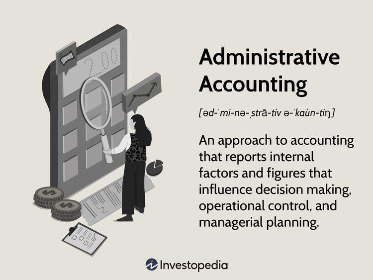

In today's dynamic business environment, effective financial management is crucial for the success and sustainability of any enterprise. This article explores key accounting methods that play a significant role in business management, administrative accounting, and algorithmic trading. These methods are fundamental in ensuring the accuracy and compliance of financial reporting, which directly impacts strategic decision-making processes.

Accounting methods such as cash basis, accrual basis, and mark-to-market accounting are integral to financial reporting and compliance. Cash basis accounting records transactions when cash changes hands, capturing financial activities in their simplest form but potentially obscuring a company's true financial condition. In contrast, accrual basis accounting records revenues and expenses as they are incurred, regardless of the cash transactions, providing a more accurate representation of a company's financial health over time. Meanwhile, mark-to-market accounting assesses the value of assets based on current market prices, which is essential in highly dynamic and volatile markets such as finance. Each method serves as a tool to meet specific business needs and regulatory requirements, significantly influencing strategic financial decisions.

Administrative accounting is another critical aspect, assisting managerial decision-making and operational control. This form of accounting deals with internal financial information, such as payroll, tax management, and asset tracking, facilitating effective resource management within organizations. It differs from financial accounting by focusing on internal processes, often bridging the finance and human resources departments, thereby streamlining budgeting and operational efficiency.

The article further discusses the vital role of accounting in algorithmic trading, a sophisticated approach that uses computer algorithms to execute trades at high speeds and volumes. This introduces unique accounting challenges, particularly regarding the management of high-frequency transactions. Addressing these challenges necessitates precise and real-time financial record-keeping, with accounting systems integrating seamlessly with trading platforms to ensure compliance and accuracy in transaction records.

Understanding these concepts allows businesses to align their accounting practices with strategic objectives while adapting to technological advancements. By leveraging these accounting methods and practices, businesses can enhance their operational efficiency and maintain competitiveness in an ever-evolving financial landscape.

## Table of Contents

## Understanding Accounting Methods

Accounting methods are foundational tools in the accurate capture and dissemination of financial data, influencing an entity's decision-making, taxation, and regulatory compliance. These methods define the timing and manner in which income and expenses are recognized, significantly affecting financial reporting and the subsequent analysis of a business's financial health.

**Cash Basis Accounting**

Cash basis accounting is one of the simplest methods, where transactions are recorded only when cash is actually received or paid. This method offers the advantage of straightforward financial tracking and can be beneficial for small businesses due to its simplicity. However, it may obscure a company's true financial performance and position, as it does not account for outstanding receivables or payables. The risk here is that financial statements might not accurately reflect the entity's economic activities during the period, potentially leading to misguided financial decisions if not carefully considered.

**Accrual Basis Accounting**

In contrast, accrual basis accounting recognizes revenues and expenses when they are earned or incurred, irrespective of when the cash transactions occur. This approach provides a more accurate picture of a company's financial status and operations by matching expenses with the revenues they generate in the same period. For example, if a company delivers a service in December but receives payment in January, the revenue is recorded in December under accrual accounting. This method is generally accepted under both Generally Accepted Accounting Principles (GAAP) and International Financial Reporting Standards (IFRS), as it aligns closely with the principles of revenue recognition and expense matching.

**Mark-to-Market Accounting**

Mark-to-market accounting, also known as fair value accounting, involves the valuation of assets and liabilities based on current market prices. This is particularly applicable in volatile markets, such as financial industries, where asset values can fluctuate significantly over short periods. Mark-to-market accounting ensures that financial statements reflect the most current value of assets, providing more relevance in financial analysis. However, it also introduces [volatility](/wiki/volatility-trading-strategies) into financial results, which can complicate performance assessment and planning.

**Choosing the Right Method**

Selecting the appropriate accounting method hinges on several factors, including the nature of the business, regulatory requirements, and the decision's potential impact on financial statements. Businesses must consider the strategic implications of each method: cash basis may be appropriate for simpler operations with straightforward financial activities, while accrual basis might be necessary for larger entities where timely revenue and expense recognition can affect covenant compliance and management decisions. Moreover, adopting mark-to-market accounting could be critical for financial institutions where asset valuations impact reporting and strategic decisions significantly.

In summary, the choice of an accounting method can dramatically affect an entity’s perceived performance and financial health, necessitating a thoughtful approach to align accounting with strategic business needs and regulatory realities.

## Administrative Accounting and its Role in Business Management

Administrative accounting is a vital component in business management, emphasizing the collection and analysis of internal financial information to facilitate managerial planning, decision-making, and operational control. It is distinguished from financial accounting, which focuses on external reporting and compliance. Instead, administrative accounting aims to support internal stakeholders by providing detailed financial insights that drive strategic actions within the organization.

One of the primary functions of administrative accounting is managing tasks such as payroll, tax management, and asset tracking. Efficient handling of these aspects ensures optimal utilization of resources. For instance, accurate payroll processing not only ensures timely employee compensation but also helps in budgeting and forecasting workforce costs. Similarly, effective tax management can optimize an organization's tax liabilities, while comprehensive asset tracking ensures the proper allocation and utilization of company resources, preventing both underutilization and obsolescence.

Administrative accounting often acts as a bridge between the human resources and finance departments. This role is paramount in processes like budgeting, where administrative accountants collaborate with various departments to predict future expenses and revenues, thereby aligning the budget with organizational goals. Through this collaboration, companies can establish expenditure controls and maintain financial discipline.

Furthermore, administrative accountants produce detailed reports that are crucial for operational efficiency. These reports offer granular insights into various aspects of company operations, enabling managers to monitor performance against strategic objectives. By maintaining detailed records, businesses enhance accountability, as every financial transaction and resource allocation can be traced back and audited. This transparency builds trust with stakeholders and supports informed decision-making.

The ability to maintain such detailed records also positions companies to respond agilely to changes in the market or regulatory environment. Informed strategic decisions, backed by reliable financial data, enable organizations to adjust their strategies proactively and maintain competitive advantage. By focusing on both the macro and micro aspects of internal financial management, administrative accounting serves as a cornerstone for sustainable business growth and operational excellence.

## Algorithmic Trading and Accounting Practices

Algorithmic trading, commonly known as algo trading, leverages sophisticated computer algorithms to execute trades with remarkable speed and precision, often in large volumes. This trading methodology presents distinctive challenges for accounting due to the [high frequency](/wiki/high-frequency-trading) and [volume](/wiki/volume-trading-strategy) of transactions, necessitating meticulous financial record-keeping and real-time data processing.

### High-Frequency Trading Data Management

In [algorithmic trading](/wiki/algorithmic-trading), high-frequency trading ([HFT](/wiki/high-frequency-trading-strategies)) can generate an astonishing amount of transaction data within mere seconds. The sheer volume requires accounting systems that are not only robust but also capable of processing this data promptly to offer a snapshot of financial positions at any given moment. Traditional accounting systems often lag in this respect; hence, there's a critical need for systems that support real-time data entry and analysis, ensuring that businesses maintain an accurate and up-to-date ledger.

### Integration with Trading Platforms

Modern accounting systems must seamlessly integrate with various trading platforms to achieve compliance with stringent financial regulations. This integration ensures that all transactions, irrespective of their frequency, are accurately recorded and categorized. An integrated system forms a comprehensive audit trail, which is essential for compliance with domestic and international financial regulations such as the Securities and Exchange Commission’s (SEC) requirements in the United States or the European Union's Markets in Financial Instruments Directive (MiFID II).

### Real-time Reconciliation and Data Analysis

Automated accounting systems are at the forefront of managing the complexities inherent in algo trading. These systems facilitate real-time reconciliation, allowing discrepancies between expected and actual transactions to be identified and corrected swiftly. This real-time capability is vital for mitigating financial risk and ensuring that trading strategies remain aligned with the institution's financial objectives. Additionally, automated systems enhance data analytics processes, permitting traders and accountants to derive actionable insights from transaction data to optimize trading strategies continuously.

### Efficiency and Compliance through Advanced Systems

The integration of advanced accounting systems in algorithmic trading brings about dual benefits: heightened efficiency and strengthened compliance. By automating routine tasks such as data entry, categorization, and reconciliation, businesses can allocate their human resources towards strategic decision-making and risk management. This automation reduces the margin for human error, thereby ensuring that financial statements and reports are precise and reliable.

In conclusion, the intersection of algorithmic trading and accounting practices is characterized by the necessity for enhanced data processing capabilities, robust system integration, and real-time analytics. As the financial markets continue to evolve rapidly, the alignment of accounting frameworks with trading technologies is crucial. This alignment ensures sustained operational efficiency and regulatory compliance, thereby facilitating strategic business growth and competitiveness in the financial sector.

## Synergies Between Accounting, Financial Management, and Algo Trading

The synergy between accounting methods, financial management, and algorithmic trading is increasingly becoming a cornerstone for achieving strategic business success. This integration is vital as it helps ensure that financial data is accurate, reliable, and compliant, facilitating informed decision-making within trading strategies. 

Accurate accounting practices are essential for providing credible financial data, which underpins sound decision-making in algorithmic trading. For instance, the use of accrual basis accounting helps in capturing the financial activities of a business more comprehensively, thereby offering a clearer picture of financial health and performance. This level of precision is particularly critical in algorithmic trading, where vast amounts of data are processed at high speeds. High-frequency trading demands the precise record-keeping that modern accounting systems can provide, ensuring both efficiency and compliance with financial regulations.

Financial management aligns accounting with broader business goals, acting as a bridge between accounting data and strategic objectives such as profitability, growth, and regulatory compliance. In the context of algorithmic trading, this alignment enables businesses to craft strategies that are not only profitable but also sustainable in the long term. This involves utilizing financial insights to modulate trading algorithms, adjusting them to respond to changes in market conditions effectively.

Leading firms have successfully integrated accounting systems with trading platforms, showcasing the harmony between these domains. For instance, firms employing real-time reconciliation processes and automated accounting systems demonstrate how tight integration can enhance operational efficiency. These examples highlight the tangible benefits of synergy, such as reduced errors, quicker decision cycles, and improved adaptability to market shifts.

Emphasizing this synergy is crucial, as it collectively optimizes financial performance and strategic competitiveness. By aligning accounting practices with financial management strategies and trading systems, businesses can harness a comprehensive view of their operations, enabling them to navigate the complexities of modern financial landscapes successfully. This holistic approach not only supports current business objectives but also prepares firms to adapt to future technological and market developments, fostering long-term resilience and growth.

## Conclusion

Selecting appropriate accounting methods is vital for ensuring accurate financial reporting and informed strategic decision-making. The choice between cash basis, accrual basis, and mark-to-market accounting directly influences how a business portrays its financial health and complies with regulatory requirements. Each method offers distinct advantages and may be more suitable depending on the organization's operational environment and regulatory framework. Accurate financial reports enhance transparency, enabling businesses to better allocate resources and support strategic growth, particularly in decentralized organizations through branch accounting. This approach allows companies to monitor performance across various segments and optimize their financial strategies accordingly.

In today's rapidly changing business landscape, adapting accounting and financial practices to incorporate technological advancements is critical for maintaining a competitive edge. Technologies such as automated accounting systems not only streamline operations but also improve the accuracy and efficiency of financial data management. This technological integration is particularly significant in sectors like algorithmic trading, where high-frequency transactions demand real-time financial record-keeping and reconciliation.

A comprehensive understanding of accounting principles, financial management, and emerging technologies empowers organizations to navigate market volatility and achieve resilience. Businesses that can harmonize robust accounting frameworks with innovative trading practices are better positioned to sustain growth amidst complex financial environments. This synergy not only enhances financial performance but also strengthens the strategic competitiveness of the organization. By staying abreast of technological and methodological advancements, companies ensure they remain agile and responsive to market dynamics.

## References & Further Reading

For those interested in expanding their knowledge on the intricacies of accounting, financial management, and algorithmic trading, several comprehensive resources are available. In "High-Frequency Trading: A Practical Guide to Algorithmic Strategies and Trading Systems," Irene Aldridge provides an insightful examination of algorithmic trading strategies, offering practical guidance for navigating this complex field. This book is essential for understanding the technological and strategic aspects of high-frequency trading, including the integration of accounting practices to ensure accurate financial reporting within dynamic trading environments.

Another valuable resource is "Accounting for Investments, Equities, Futures, and Options" by R. Venkata Subramani, which covers a wide range of financial instruments. This text is instrumental in grasping the accounting treatments and challenges associated with equities, futures, and options, providing clarity on investment accounting practices and their relevance in financial markets.

An exploration of the International Financial Reporting Standards (IFRS) is also recommended, as these standards significantly influence contemporary accounting practices. Understanding IFRS is crucial for complying with global financial reporting requirements and for implementing transparent and consistent accounting methodologies across international operations.

Engaging with these materials will enhance your ability to manage financial complexities, adapt to regulatory standards, and implement strategic financial practices effectively. Through these readings, individuals and businesses can equip themselves with the necessary knowledge to excel in today’s competitive financial landscape.

