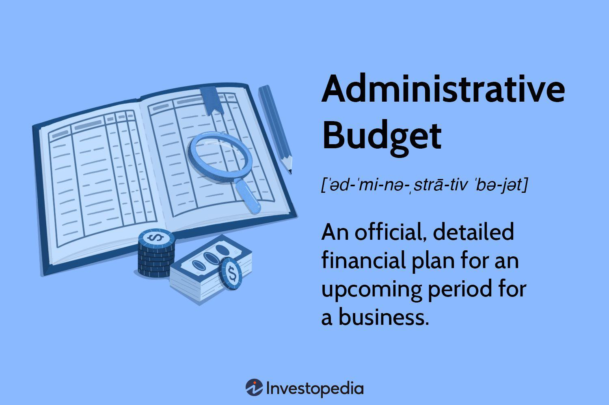

The rapidly evolving world of finance is shaped by various dynamic elements, including administrative budgets and algorithmic trading. Administrative budgets are essential tools for both businesses and government agencies, serving as comprehensive financial plans that guide non-production related expenditures such as marketing, payroll, and legal fees. These budgets are pivotal in ensuring the efficient allocation of resources to sustain day-to-day operations without diverting attention from an entity's core objectives.

Algorithmic trading, on the other hand, represents a significant technological advancement in financial markets. It employs complex algorithms and high-speed computing to execute trades with precision and efficiency, optimizing transaction timing and minimizing human error. The rise of algorithmic trading has transformed market dynamics, introducing new levels of volatility, which in turn influences the planning and structuring of budgets.



Understanding these financial instruments is critical for optimizing financial management. Administrative budgets and algorithmic trading not only interact but also present unique challenges and opportunities for innovation. By comprehending the nuances of these concepts, businesses and government agencies can improve economic forecasting, resource management, and financial decision-making processes, ultimately enhancing their operational effectiveness in an increasingly complex financial landscape.

## Table of Contents

## Understanding Administrative Budget

An administrative budget serves as a comprehensive financial framework that details the expected non-production-related expenses for a business or organization. This budgeting type encompasses a variety of costs, including marketing, payroll, legal fees, and other operational expenses that support the organization’s core activities without contributing directly to product creation or service provision.

The formulation of an administrative budget is essential for sustaining effective day-to-day operations. Typically, it begins with a thorough assessment of past financial data, allowing organizations to forecast future expenses accurately. This approach helps in identifying trends and anticipating any upcoming financial requirements, thereby equipping the organization to manage its cash flow efficiently.

To craft an administrative budget, organizations often follow a systematic process. Initially, they gather data from previous budgeting periods to inform their estimates. This historical data provides an empirical basis for predicting future expenditures. Next, they assess their strategic objectives and operational needs to forecast potential costs. This assessment helps ensure that the budget aligns with the organization’s goals.

Once the data collection and analysis are complete, organizations establish budgetary limits for each expense category. These limits must be realistic and grounded in the historical data and strategic objectives. Often, organizations prioritize certain expenses based on their strategic impact, meaning the budget might allocate more resources to marketing during a product launch or to legal fees during an acquisition phase.

Moreover, modern administrative budgeting incorporates advanced analytical tools and software that enable dynamic budgeting processes. These tools facilitate real-time tracking of expenses and can also predict potential deviations, allowing for timely adjustments. This adaptability is vital in a rapidly changing business environment, where unexpected challenges and opportunities often arise.

The role of administrative budgets in financial management is multifaceted. Primarily, they provide a structured allocation of financial resources, ensuring all departments have the necessary funds to operate effectively. Furthermore, these budgets aid in controlling costs and enhancing strategic planning by clearly outlining financial expectations and constraints. Consequently, they serve as a vital tool for financial accountability within the organization.

By integrating these practices, organizations not only maintain financial discipline but also create a responsive budgeting framework that supports proactive decision-making and strategic agility.

## Criticisms of Administrative Budgets

Administrative budgets, designed to outline non-production expenses, are not without their criticisms. One prevalent issue is their common reliance on historical data for forecasting future financial allocations. While historical data can offer a basis for consistency, it can lead to the perpetuation of outdated spending patterns. Relying solely on historical precedents without considering contemporary shifts in economic conditions, market demands, or organizational priorities can hinder the effective allocation of resources. This approach may result in certain budget components becoming rigid, thus failing to adapt to the organization’s current and future financial landscape.

Critics also highlight the risk of administrative budgets becoming excessively bloated if they are not subjected to regular and thorough scrutiny. Over time, unchecked budgets can accumulate inefficiencies as expenditures that were once critical may no longer serve their intended purpose but continue to consume resources. For example, ongoing subscriptions for tools or services not actively used lead to unnecessary financial burdens, diverting funds from critical business functions such as innovation and development.

Addressing the criticisms associated with administrative budgets involves implementing a process of regular reviews and adjustments. By routinely revisiting budget allocations, organizations can identify areas of redundancy, align expenses with strategic goals, and incorporate flexibility to respond to changing circumstances. For effective modification, it is essential to incorporate both qualitative assessments and quantitative metrics. This process not only validates the relevance of current expenditures but also facilitates a proactive approach to budgeting.

For example, the implementation of zero-based budgeting practices, where each budget cycle starts from a 'zero base' and every function within an organization is analyzed for its needs and costs, could be a potential strategy. By justifying every budget component anew, organizations ensure that each expenditure adds value, promoting efficient resource management. Regular audits and performance evaluations also support dynamic adjustments, reinforcing a budget's relevance across different fiscal periods.

Ultimately, by evolving beyond historic data reliance and emphasizing regular, critical evaluation, organizations can optimize administrative budgets to better support strategic objectives and operational efficiency.

## Algorithmic Trading: An Overview

Algorithmic trading, commonly referred to as algo trading, involves the use of computer algorithms to execute trades at speeds and frequencies that are beyond the capability of human traders. These algorithms follow a predefined set of rules and criteria, enabling swift and efficient trading decisions. The proliferation of algo trading has notably transformed financial markets by facilitating high-frequency trading ([HFT](/wiki/high-frequency-trading-strategies)), reducing the necessity for human intervention, and increasing the precision and [volume](/wiki/volume-trading-strategy) of trades executed.

The core mechanics of [algorithmic trading](/wiki/algorithmic-trading) include the automation of trading instructions such as timing, price, and volume, thereby executing trades at optimal instances. A typical algorithm, for instance, might be programmed to follow a strategy like moving average crossover, wherein it buys a stock when its short-term moving average exceeds the long-term moving average, and sells it when the opposite occurs. This strategy can be expressed with the following Python pseudo-code:

```python
# Python pseudo-code for a moving average crossover strategy
def moving_average_crossover(prices, short_window, long_window):
    short_mavg = prices.rolling(window=short_window).mean()
    long_mavg = prices.rolling(window=long_window).mean()

    signals = short_mavg > long_mavg
    return signals

# Example usage
prices = get_data('AAPL')  # hypothetical function to get price data
buy_signals = moving_average_crossover(prices, short_window=40, long_window=100)
```

Historically, algo trading has enabled the growth of high-frequency trading, a subset of algorithmic strategies that aims to capitalize on minute price discrepancies that exist for very brief periods. These trades are executed within milliseconds, leveraging advanced technologies and direct market access to achieve significant economies of scale with minuscule profit margins per trade.

In addition to speed and efficiency, algo trading is instrumental in reducing transaction costs and navigating complex market structures across numerous financial markets, including equities, [forex](/wiki/forex-system), and commodities. Its ability to process large volumes of data at unparalleled speeds facilitates the analysis of multiple variables, fostering decisions that align with comprehensive trading strategies.

Despite its advantages, the widespread application of algorithmic trading necessitates sophisticated infrastructure and entails potential market risks such as triggering flash crashes due to erroneous algorithms or lack of [liquidity](/wiki/liquidity-risk-premium). Nevertheless, its impact on global financial markets is profound, shaping contemporary trading landscape and informing future developments within the industry. 

This landscape highlights the critical role that technology continues to play in advancing trading capabilities and redefining the boundaries of what's achievable in modern market environments.

## Impact of Algorithmic Trading on Administrative Budgets

Algorithmic trading has considerably transformed financial markets by introducing enhanced speed and efficiency, but this transformation also brings [volatility](/wiki/volatility-trading-strategies) that imposes new challenges on administrative budget planning, especially for entities like the federal government. The substantial price swings and rapid market movements inherent to algorithmic trading necessitate a more dynamic approach to budget planning.

Fluctuating market conditions, driven by algorithms capable of executing thousands of trades in milliseconds, can influence economic indicators and forecast models, adding complexity to budgetary decisions. This complexity arises due to the difficulty in predicting revenue streams and expenditure needs when market conditions are unstable. Traditional budget forecasts, often reliant on historical data and stable market assumptions, are less effective when markets are subject to extreme algorithmic trading-driven fluctuations.

For more effective budget planning, these market variations must be carefully accounted for by incorporating insights derived from algorithmic trading trends. This can involve utilizing advanced data analytics and incorporating real-time market data into economic forecasts. Budget planners are encouraged to adopt strategies that allow for greater flexibility and rapid adaptation, moving away from rigid budget frameworks. They may also benefit from employing automated systems that can adjust budgetary allocations based on real-time trading data and market analyses.

Furthermore, government fiscal policies might need reevaluation to better synchronize with the fast-paced nature of algorithmically-driven markets. As these technologies evolve, developing a deeper understanding of their impacts will be key to optimizing administrative budget planning and ensuring that fiscal policies remain effective amidst the shifting financial landscape induced by algorithmic trading.

## Regulatory Considerations and Challenges

Algorithmic trading has rapidly transformed financial markets, thanks to advancements in technology. However, these changes bring significant regulatory challenges as authorities strive to prevent systemic risks. The primary concern is ensuring that algorithmic trading does not destabilize financial markets. To address this, regulatory bodies, such as the U.S. Securities and Exchange Commission (SEC), have implemented policies aimed at maintaining market stability and fairness.

The SEC, for instance, monitors trading activities to prevent practices that could manipulate market conditions or disadvantage investors. Initiatives include implementing measures to curb market volatility, such as circuit breakers and the 'limit up-limit down' system, which are designed to pause trading if prices fluctuate excessively within a short period. These mechanisms help maintain structured and predictable trading conditions while protecting investors from erratic price swings.

One of the major challenges in regulating algorithmic trading is balancing innovation with investor protection. Regulators must address potential risks that could arise from high-speed trading without stifling technological advancement. This paradox necessitates a dynamic regulatory approach that can adapt to rapid technological changes while ensuring that new trading algorithms comply with existing laws and ethical standards.

In addition to domestic regulatory efforts, algorithmic trading faces scrutiny on a global scale. International collaboration among regulatory bodies is crucial to establish cohesive standards and practices that mitigate cross-border trading risks. As trading systems and financial markets become increasingly interconnected, joint efforts are essential to ensure comprehensive oversight.

Moreover, regulatory bodies must remain vigilant in the face of new trading strategies that leverage [artificial intelligence](/wiki/ai-artificial-intelligence) and [machine learning](/wiki/machine-learning). These technologies present additional layers of complexity in enforcing existing regulations and crafting new ones. Continuous rule adaptation is required to address emerging threats such as market manipulation techniques that evade traditional surveillance systems.

In conclusion, while algorithmic trading brings efficiency and liquidity benefits to financial markets, it also introduces regulatory challenges. Through ongoing policy updates, vigilant monitoring, and international cooperation, regulatory bodies like the SEC aim to maintain market integrity and protect investors, ensuring that the benefits of algorithmic trading are not overshadowed by potential risks.

## The Future of Administrative Budgets and Algorithmic Trading

Emerging technologies, particularly artificial intelligence (AI) and machine learning (ML), are poised to significantly influence both administrative budgets and trading strategies. These advanced tools offer the ability to analyze vast datasets efficiently, leading to more accurate budget forecasts and informed financial decisions. 

For administrative budgets, integrating AI-driven analytics can streamline expense categorization, identify potential cost-saving opportunities, and enhance resource allocation. By utilizing predictive modeling, organizations can anticipate future financial requirements and adjust plans accordingly. For example, machine learning algorithms can process historical expenditure data to predict future budgetary needs, reducing reliance on traditional static budget models. This transition could be facilitated by employing Python's robust data analysis libraries such as Pandas and Scikit-learn to build scalable and accurate forecasting models.

In algorithmic trading, AI and ML are already revolutionizing how financial markets operate by optimizing trading strategies through pattern recognition and anomaly detection. These technologies can adapt to market conditions in real-time, allowing traders to execute orders with superior precision and speed. The implementation of [deep learning](/wiki/deep-learning) frameworks in trading systems can further refine these strategies by learning from market data and predicting price movements with higher accuracy.

However, the integration of these technologies requires proactive collaboration between financial experts and regulators. The complexities introduced by AI and ML necessitate continuous oversight to mitigate risks, such as market volatility and unfair trading practices. Regulatory bodies must work closely with industry stakeholders to establish guidelines that ensure market integrity while promoting innovation. This involves developing adaptive regulatory frameworks that keep pace with technological advancements without stifling creative financial solutions.

In conclusion, the future of administrative budgets and algorithmic trading is closely tied to the evolution of AI and machine learning technologies. By embracing these advancements, entities can achieve enhanced financial management and more informed decision-making. The key to navigating these changes lies in fostering an environment of continuous learning and collaboration between all parties involved.

## Conclusion

The intersection of administrative budgets and algorithmic trading embodies a dynamic arena filled with both challenges and opportunities. As financial institutions and government agencies navigate these intricacies, embracing technological advancements and adaptive strategies becomes imperative. Algorithmic trading, characterized by rapid and automated decision-making processes, necessitates a recalibration of traditional financial management practices. Administrative budgets, on the other hand, require an agile approach to accommodate the swift fluctuations and complexity introduced by these trading mechanisms.

Entities can significantly enhance their financial management processes by integrating real-time data analytics and machine learning to refine budget forecasts and decision-making. For instance, predictive analytics can be utilized to anticipate market trends, allowing for more precise budget allocations. The adaptability of these financial tools ensures that administrative frameworks remain robust and responsive to emerging market dynamics.

Continuous learning and evolution are critical to maneuvering these evolving financial landscapes successfully. As technological innovations continue to disrupt traditional paradigms, financial actors must pursue ongoing education and agile strategies to maintain competitiveness. This proactive approach not only mitigates potential risks but also capitalizes on new opportunities that arise from the synergy between administrative budgeting and algorithmic trading. With the commitment to innovation and flexibility, stakeholders are well-positioned to thrive in the rapidly transforming financial environment.

## References & Further Reading

Comprehensive insights and further reading materials on administrative budgets and algorithmic trading are essential for in-depth understanding. Below are key references that provide foundational and advanced knowledge in these areas:

- [1]: Mathias, M. (2015). *Automated Trading with R: Quantitative Research and Platform Development*. This book offers a practical guide to implementing algorithmic trading strategies using R, focusing on quantitative research and software development.

- [2]: Hasbrouck, J. (2018). *The New York Stock Exchange and Flow of Orders*. This work explores the complexities of order flow and the mechanics of the NYSE, providing valuable context for understanding the infrastructure that supports algorithmic trading.

For additional insights into the mechanisms and regulatory frameworks surrounding algorithmic trading, the following references are recommended:

- O'Hara, M. (2015). *High-Frequency Trading: Its Impact on Markets and Investors*. This publication examines how high-frequency trading affects market dynamics and investor behavior, providing a balanced perspective on its pros and cons.

- Cartea, Á., Jaimungal, S., & Penalva, J. (2015). *Algorithmic and High-Frequency Trading*. This book investigates into the strategic tools and risk management techniques employed in high-frequency trading, offering a comprehensive overview of the quantitative methods used in this field.

- U.S. Securities and Exchange Commission (SEC). *Rulemaking and Regulations on Algorithmic Trading*. The SEC's official resources outline the regulatory framework designed to ensure market integrity and protect investors amid the rapid advancements in trading technology.

For those interested in the intersection of emerging technologies and financial forecasting, further exploration of AI and machine learning applications in financial management can be found in scholarly articles and conferences on computational finance and fintech innovations.

These resources serve as a solid foundation for anyone looking to deepen their understanding of the complex interactions between administrative budgets and algorithmic trading while considering future developments in the field.

