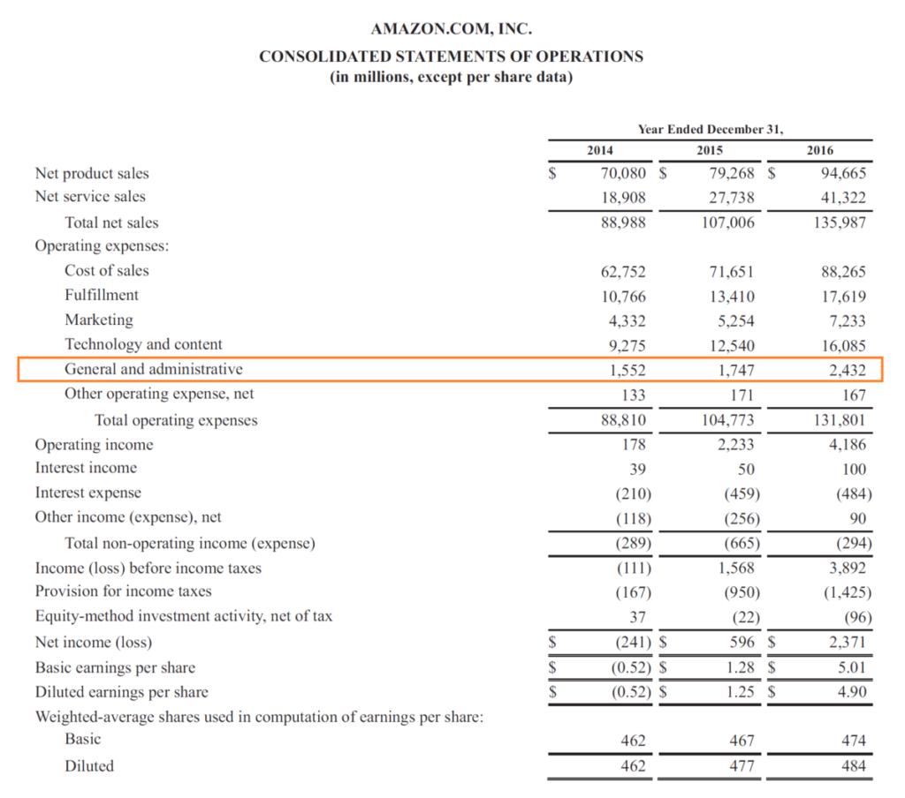

## Table of Contents

## What are administrative expenses?

Administrative expenses are the costs a business has to pay to keep things running smoothly. These are the expenses that help with the day-to-day operations of the company, but they are not directly related to making the product or service. Things like office supplies, salaries for administrative staff, and rent for office space are all examples of administrative expenses.

These costs are important because they help the business function properly, but they can also add up quickly. It's important for a business to keep track of these expenses and try to manage them well. If administrative expenses get too high, it can eat into the company's profits and make it harder to grow or stay competitive.

## How do administrative expenses differ from other types of expenses?

Administrative expenses are different from other types of expenses because they are the costs that help run the business but don't directly make the product or service. For example, the salary of the office manager or the cost of office supplies are administrative expenses. These costs are necessary for the business to operate smoothly, but they don't directly contribute to what the business sells.

On the other hand, other types of expenses like production costs or cost of goods sold (COGS) are directly related to making the product or service. Production costs might include raw materials and labor used in manufacturing, while COGS includes the cost of inventory that is sold. These expenses are more closely tied to the revenue the business earns from selling its products or services.

Lastly, there are also selling expenses, which are costs related to marketing and selling the product, like advertising and sales commissions. While these expenses help generate sales, they are different from administrative expenses because they are more focused on promoting and selling the product rather than supporting the overall operations of the business.

## Can you provide examples of common administrative expenses?

Common administrative expenses include things like the salaries of office staff, such as secretaries or administrative assistants. These are the people who help keep the office running smoothly by doing tasks like answering phones, managing schedules, and handling paperwork. Another big administrative expense is rent for office space. If a business needs a place for its employees to work, it has to pay for that space, and that cost is considered an administrative expense.

Other common administrative expenses are office supplies, like paper, pens, and printer ink. These might seem small, but they can add up over time. Utilities, like electricity and water, are also administrative expenses because they are needed to keep the office running. Finally, there are costs like accounting and legal fees. These are services that help the business stay compliant with laws and manage its finances, but they don't directly contribute to making the product or service.

In summary, administrative expenses cover a wide range of costs that are essential for the day-to-day operations of a business. They include salaries for administrative staff, rent for office space, office supplies, utilities, and professional services like accounting and legal fees. While these expenses are necessary, they are different from costs directly related to producing or selling the business's products or services.

## Why are administrative expenses important for a business to track?

Administrative expenses are important for a business to track because they help the business understand how much it costs to keep things running smoothly. These expenses are not directly related to making the product or service, but they are still necessary for the business to operate. By keeping track of administrative expenses, a business can see if these costs are getting too high and if they need to be managed better.

If administrative expenses are not tracked, they can grow out of control and eat into the company's profits. This can make it harder for the business to grow or stay competitive. By keeping a close eye on these expenses, a business can make smart decisions about where to cut costs or where to invest more money. This helps the business stay healthy and successful in the long run.

## How are administrative expenses typically reported in financial statements?

Administrative expenses are usually shown on a company's income statement. This is a financial document that shows how much money the business made and spent over a certain period of time. On the income statement, you will see a section called "operating expenses," which includes administrative expenses. These expenses are listed along with other costs like selling expenses and general expenses. By looking at this part of the income statement, you can see how much the business is spending on things like office supplies, rent, and salaries for administrative staff.

Sometimes, a business might also show administrative expenses in more detail in the notes to the financial statements. These notes give extra information about the numbers in the financial statements. For example, a company might break down its administrative expenses into different categories, like salaries, office supplies, and utilities. This can help people who are looking at the financial statements understand exactly where the money is going. By being clear about administrative expenses, a business can show that it is managing its costs well and keeping its operations running smoothly.

## What strategies can businesses use to manage and reduce administrative expenses?

Businesses can manage and reduce administrative expenses by looking at their costs closely and finding ways to spend less. One way to do this is by using technology to automate tasks that people used to do by hand. For example, instead of having someone manually enter data, a business can use software to do it faster and without mistakes. This can save money on salaries and make things run more smoothly. Another way is to check if they are paying too much for things like office supplies or rent. Sometimes, businesses can find cheaper options or negotiate better deals with their suppliers.

Another strategy is to make sure that the business is using its resources wisely. This means looking at how office space is used and seeing if there is any space that isn't needed. If a business has empty offices, it might be able to move to a smaller place and save on rent. Also, businesses can train their employees to do multiple jobs. This way, they don't need as many people, and they can save on salaries. By being smart about how they spend money, businesses can keep their administrative expenses under control and use that money for other important things.

## How do administrative expenses impact the profitability of a business?

Administrative expenses can have a big impact on a business's profitability. These are the costs that help keep the business running smoothly, but they don't directly make the product or service. If these expenses get too high, they can eat into the profits of the business. For example, if a company spends a lot of money on office rent, supplies, and salaries for administrative staff, it might not have as much money left over after paying for everything else. This means the business might not make as much profit as it could if it managed these costs better.

To stay profitable, a business needs to keep a close eye on its administrative expenses. By finding ways to reduce these costs, like using technology to automate tasks or negotiating better deals with suppliers, a business can save money. This extra money can then be used to grow the business or invest in other areas that can help it make more profit. Keeping administrative expenses under control is important for making sure the business stays healthy and successful in the long run.

## What are the tax implications of administrative expenses for a company?

Administrative expenses can affect a company's taxes because they are usually tax-deductible. This means a business can subtract these costs from its income before calculating how much tax it needs to pay. For example, if a company spends money on office supplies, rent, and salaries for administrative staff, it can deduct these expenses from its total income. This lowers the amount of income that is taxed, which can save the business money on its tax bill.

However, there are rules about what can be deducted and how to report these expenses correctly. A business needs to keep good records of all its administrative expenses and follow the tax laws in its country. If a company doesn't do this properly, it might not get the full tax benefit it could, or it might even get in trouble for not following the rules. So, it's important for businesses to understand the tax implications of their administrative expenses and manage them carefully.

## How do administrative expenses vary across different industries?

Administrative expenses can be different for businesses in different industries. Some industries, like tech companies, might spend more on things like software and IT support because they need these to run their business. On the other hand, a manufacturing company might spend more on office space and supplies because they need a place to manage their production and keep track of their inventory. Each industry has its own needs, so the types and amounts of administrative expenses can vary a lot.

For example, in the healthcare industry, administrative expenses might include costs for managing patient records and complying with health regulations. These can be pretty high because there are a lot of rules to follow. In contrast, a retail business might have lower administrative expenses because it doesn't need as much specialized staff or equipment. But it might still spend a lot on things like store rent and employee salaries. So, understanding the specific needs of each industry helps businesses manage their administrative expenses better.

## What role do administrative expenses play in budgeting and financial planning?

Administrative expenses are a big part of budgeting and financial planning for a business. They are the costs that help keep the business running smoothly, like paying for office supplies, rent, and salaries for administrative staff. When a business makes a budget, it needs to guess how much it will spend on these expenses. This helps the business plan how much money it will need to cover all its costs and still make a profit. By keeping track of administrative expenses, a business can see if it is spending too much in some areas and make changes to save money.

In financial planning, administrative expenses help a business look at its future. The business can use what it knows about its past expenses to guess how much it will need to spend in the future. This is important for making long-term plans, like growing the business or investing in new projects. If a business can manage its administrative expenses well, it can have more money to use for other things that can help it grow and stay successful.

## How can technology and automation affect administrative expenses?

Technology and automation can help businesses save money on administrative expenses. By using software and machines to do tasks that people used to do by hand, a business can spend less on salaries for administrative staff. For example, instead of hiring someone to enter data, a business can use a computer program to do it faster and without mistakes. This not only cuts down on the cost of paying someone to do the job, but it also makes the business run more smoothly and efficiently.

Another way technology can help is by making it easier to manage other administrative costs. For example, businesses can use online tools to find cheaper office supplies or negotiate better deals with suppliers. They can also use software to keep track of their expenses and see where they might be spending too much money. By using technology to keep administrative expenses under control, a business can save money and use those savings for other important things like growing the business or investing in new projects.

## What advanced metrics or ratios can be used to analyze administrative expenses in depth?

To understand how well a business is managing its administrative expenses, you can look at some special numbers and ratios. One important ratio is the administrative expense ratio, which you find by dividing the total administrative expenses by the total revenue. This tells you what percentage of the money the business makes is being spent on things like office supplies, rent, and salaries for administrative staff. A lower ratio means the business is doing a good job of keeping these costs under control. Another useful number is the operating expense ratio, which includes administrative expenses along with other costs like selling expenses. This ratio shows how much of the business's revenue is being used for all its operating costs, not just administrative ones.

Another helpful metric is the administrative expense per employee. This is found by dividing the total administrative expenses by the number of employees. It helps show how much the business is spending on administrative costs for each person who works there. If this number is high, it might mean the business needs to find ways to cut these costs, like using technology to automate tasks. By looking at these metrics and ratios, a business can get a better idea of how its administrative expenses are affecting its overall financial health and make smarter decisions about how to manage these costs.

## What is the impact of administrative costs on algo trading performance?

Administrative costs can significantly influence the profitability and efficiency of [algorithmic trading](/wiki/algorithmic-trading) operations. These expenses, including salaries of non-trading staff, office rent, and utility bills, are essential for the smooth functioning of any trading firm. However, if not carefully managed, they can rapidly erode profit margins.

### Analyzing the Impact

Administrative costs may not directly generate revenue, but they support fundamental business operations. For algo trading firms, the critical challenge is to determine the optimal level of these costs to ensure trading activities are thoroughly supported without becoming financially burdensome. Excessive administrative expenditures can result in reduced net profits, ultimately impacting the firm's capability to reinvest in trading technology or pursue additional trading strategies. Conversely, overly reducing these costs can leave essential operations undermanned or inadequately resourced, impairing overall efficiency.

### Balancing Investment and Cost-Efficiency

Investing in robust administrative systems is crucial in maintaining a competitive edge, especially in an industry as dynamic as algorithmic trading. Efficient systems can streamline operations, ensuring timely data processing and reducing errors. The balance lies in evaluating the cost-benefit ratio of such investments. Firms might choose to invest in automated payroll systems, advanced CRM software, or IT support to enhance operational efficiency, yet these decisions should be backed by detailed cost analysis.

Here's a simplified model that illustrates such a balance:

$$
\text{Net Profit} = \text{Gross Revenue} - (\text{Trading Costs} + \text{Administrative Costs})
$$

Where trading costs encompass execution fees and algorithm development costs, while administrative costs cover all non-trading expenses.

### Hypothetical Scenarios

1. **Scenario 1: Over-investment in Administration**
   - A medium-sized algo trading firm invests heavily in state-of-the-art office facilities and a large administrative staff. While the immediate work environment improves and some operational processes become more streamlined, the administrative costs balloon. As a result, the firm finds itself constrained financially, with limited resources available to upgrade its trading algorithms or to respond to new market opportunities.

2. **Scenario 2: Strategic Cost Management**
   - Another firm uses a combination of remote work policies and cloud-based solutions, optimizing its administrative processes. By leveraging cost-effective technologies, it maintains its administrative expenditure at a lean level. Freed resources are reallocated to enhance algorithmic models, resulting in improved trading performance and increased profitability.

### Case Study Example

A study of a successful algo trading firm demonstrated that by conducting quarterly audits of its administrative expenses, they identified redundant processes and excessive software licenses. By optimizing their usage of tech resources and outsourcing certain non-core administrative functions, they achieved administrative cost savings of over 15%, which was then reinvested into expanding their trading strategies. This strategic management of administrative costs led directly to an increase in trading performance by 10%.

In conclusion, while administrative costs are a necessary aspect of algorithmic trading operations, careful management and strategic investments in administrative systems can enhance profitability and efficiency. Trading firms must continuously evaluate and adjust these costs to maintain a competitive position in the market.

## References & Further Reading

[1]: Bergstra, J., Bardenet, R., Bengio, Y., & Kégl, B. (2011). ["Algorithms for Hyper-Parameter Optimization."](https://papers.nips.cc/paper/4443-algorithms-for-hyper-parameter-optimization) Advances in Neural Information Processing Systems 24.

[2]: ["Advances in Financial Machine Learning"](https://www.amazon.com/Advances-Financial-Machine-Learning-Marcos/dp/1119482089) by Marcos Lopez de Prado

[3]: ["Evidence-Based Technical Analysis: Applying the Scientific Method and Statistical Inference to Trading Signals"](https://books.google.com/books/about/Evidence_Based_Technical_Analysis.html?id=MeoJAQAAMAAJ) by David Aronson

[4]: ["Machine Learning for Algorithmic Trading"](https://github.com/stefan-jansen/machine-learning-for-trading) by Stefan Jansen

[5]: ["Quantitative Trading: How to Build Your Own Algorithmic Trading Business"](https://www.amazon.com/Quantitative-Trading-Build-Algorithmic-Business/dp/1119800064) by Ernest P. Chan