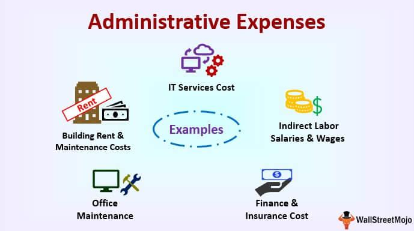

Understanding business expenses is crucial for any enterprise aiming to maximize profitability, as effective expense management can directly influence a company's bottom line. In the competitive field of algorithmic trading, where the margins can be razor-thin and efficiency is paramount, a comprehensive understanding of business costs is essential. Business expenses encompass all costs incurred during the course of operations and can be categorized into various types, including fixed, variable, direct, and indirect costs. Among these, administrative expenses play a pivotal role in day-to-day business operations.

Administrative expenses are non-production costs associated with the general operations of a company and include costs such as salaries of administrative staff, office supplies, and rent. In the context of algorithmic trading, administrative expenses are particularly relevant as they can significantly impact operational efficiency and profit margins. Algorithmic trading relies heavily on technology and skilled personnel, making the management of these expenses critical to maintaining competitiveness and ensuring sustainable growth.

The goal of this article is to provide insight into various business costs with a particular focus on administrative expenses within algorithmic trading firms. By examining examples of administrative expenses specific to algorithmic trading, such as office and employee-related costs, readers will gain a better understanding of the integral role these costs play in the financial health and operational performance of a trading firm. Additionally, strategies for managing and optimizing these expenses will be explored to help organizations minimize unnecessary expenditures and enhance profitability.

## Table of Contents

## Understanding Business Costs

Business expenses are the costs incurred during the operation of a company and are crucial to determining its profitability and sustainability. Understanding these expenses is vital as they directly influence an organization's financial health and its ability to invest or manage resources for growth. 

Business expenses can be broadly categorized into several types, each with distinct characteristics:

1. **Fixed Costs**: These are expenses that do not fluctuate with the level of goods or services produced by a business. Common examples include rent, salaries, and insurance. Fixed costs remain constant even if the company's output increases or decreases.

2. **Variable Costs**: Unlike fixed costs, variable costs vary directly with the level of production. They include raw materials, utility costs attributable directly to production, and sales commissions. For example, in an algorithmic trading firm, transaction fees could be considered variable costs since they increase with the volume of trades.

3. **Direct Costs**: These expenses can be attributed directly to a specific product or service. In manufacturing, direct costs include raw materials and labor costs. In algorithmic trading, direct costs could comprise the fees charged per transaction by brokerage firms.

4. **Indirect Costs**: Also known as overheads, these are not directly attributable to a single product or service. Examples include administrative expenses such as office utilities, managerial salaries, and general office supplies. For algo trading firms, indirect costs also encompass the infrastructure necessary to operate trading algorithms.

Effective cost management is critical for [algorithmic trading](/wiki/algorithmic-trading) firms to maintain profitability and competitiveness. Given the high-frequency and often low-margin nature of algo trading, expenses must be closely managed to enhance cost efficiency. Unmanaged costs can quickly erode profit margins, potentially leading to unsustainable operations.

In the specific context of algorithmic trading firms, cost management encompasses several important aspects:

- **Capital Allocation**: Allocating resources effectively, especially in technology and personnel, can significantly affect a firm's profitability. High costs associated with acquiring and maintaining sophisticated trading platforms and networks need careful management.

- **Risk Assessment and Management**: Since costs are closely tied to risk, understanding and controlling potential financial and operational risks reduce unnecessary expenses. 

- **Operational Efficiency**: Streamlining operations, such as optimizing technology infrastructure and reducing redundant processes, lowers indirect costs. Implementing cost-effective technologies and adopting innovative solutions like cloud computing can further drive down overhead.

Overall, careful classification and management of business expenses are pivotal for algo trading firms to ensure they remain agile and profitable in a highly dynamic financial environment. Efficient cost management strategies enable these firms to navigate market complexities while optimizing their financial performance.

## What are Administrative Expenses?

Administrative expenses are a subset of business costs that are essential for the general operation of a company but do not directly contribute to the production of goods or services. These expenses encompass costs related to the administrative functions of a business such as overhead costs, management salaries, and office supplies. Unlike direct costs, which can be attributed to specific projects or production activities, administrative expenses are typically indirect costs, supporting the overall business infrastructure.

Differentiating between administrative expenses and other types of business costs is crucial for accurate financial management and decision-making. Business costs are generally categorized into fixed, variable, direct, and indirect costs. Fixed costs, like rent and salaries, remain constant over time regardless of business activity levels. Variable costs fluctuate with the level of production or business activity, such as raw materials and sales commissions. Direct costs can be directly traced to a specific product, service, or project, whereas indirect costs, which include administrative expenses, benefit multiple cost objects and are not easily attributable to a single one.

In terms of financial health, administrative expenses play a pivotal role. They are necessary for maintaining the core functions of a business, including personnel management, legal compliance, and corporate governance. While these expenses do not generate direct revenue, they provide the necessary support structure for a company to operate efficiently and effectively. A well-managed administrative cost structure helps a company remain agile and competitive by ensuring that resources are allocated to areas that drive growth.

The financial sector is known for relatively high administrative expenses due in part to stringent regulatory requirements and the need for sophisticated information systems. According to data from various financial analyses, administrative expenses in financial firms range from 15% to 25% of total overhead costs. This percentage is indicative of the critical investment in administration necessary to ensure compliance, risk management, and effective client relationship management.

Efficient oversight and optimization of administrative expenses are thus necessary to ensure they do not erode profitability. While necessary, these expenses should be regularly reviewed to align with the company's strategic goals, allowing firms to maintain a healthy balance between function support and cost-effectiveness.

## Examples of Administrative Expenses in Algo Trading

Algorithmic trading firms, often at the forefront of financial innovation, incur various administrative expenses critical to their operations. Understanding these expenses is vital for financial planning and maintaining competitiveness. Here are some examples of administrative expenses specific to algorithmic trading:

**1. Rent for Office Space and Utilities:** Despite the digital nature of algorithmic trading, physical office spaces are still necessary for operations. Costs associated with renting these spaces vary by location but are a significant part of administrative expenses. Utilities such as electricity, water, and internet services are essential for maintaining daily operations, ensuring that trading algorithms operate without interruption.

**2. Office Supplies and Equipment:** Algorithmic trading firms require office supplies such as stationery, furniture, computers, and servers. These items, though often seen as minor expenses, accumulate to form a substantial portion of administrative costs.

**3. Employee-Related Costs:** 
   - **Salaries and Benefits:** Algorithmic trading relies heavily on talent, including quantitative analysts, developers, and data scientists. Competitive salaries are necessary to attract and retain high-caliber professionals. Benefits such as health insurance, retirement plans, and bonuses also form a part of these expenses.
   - **Training and Development:** Given the rapidly evolving nature of trading technologies and strategies, ongoing training is crucial. Investing in workshops, seminars, and online courses enhances personnel skills, ensuring they stay abreast of industry developments.

**4. Technology-Related Administrative Expenses:** 
   - **Software Licenses:** Licenses for trading platforms, data analysis tools, and specialized software represent a significant cost. These tools are integral for developing and executing trading strategies effectively.
   - **IT Support:** Maintaining a robust IT infrastructure is crucial for seamless trading operations. Expenses related to IT support services include troubleshooting, system updates, and network security measures to protect sensitive data.
   - **Hardware Maintenance:** Regular maintenance of computers, servers, and networking equipment is vital to minimize disruptions. This includes periodic upgrades and replacements to keep up with technological advancements.

The management of these administrative expenses directly impacts the operational efficiency and profitability of algorithmic trading firms. Effective cost control strategies can enhance financial health and provide a competitive edge in a fast-paced trading environment.

## Managing and Optimizing Administrative Costs

Effectively managing administrative expenses is crucial for algorithmic trading firms to maintain profitability and competitiveness. Administrative costs, if not controlled, can erode profit margins and reduce overall efficiency. Hence, implementing strategies to manage these expenses efficiently is essential.

Regularly reviewing and auditing administrative expenses is a fundamental strategy. Continuous monitoring ensures that all expenditures are necessary and aligned with the firm's strategic goals. Audits help identify areas of overspending or inefficiencies, allowing for corrective measures to be taken promptly. This proactive approach can lead to significant cost savings and improved allocation of resources over time.

One effective method to optimize administrative costs is by leveraging cost-effective technology solutions. Technology, specifically cloud-based services and open-source software, can significantly reduce expenditure on infrastructure and software licensing. Cloud solutions offer scalability and flexibility, allowing firms to adjust their usage and costs as per their requirements. Open-source software provides another avenue for reducing costs while maintaining high functionality.

Another strategy is the adoption of remote work arrangements. By allowing employees to work from home, firms can reduce expenditure on office space, utilities, and commuting subsidies. This approach not only lowers direct costs associated with maintaining office premises but also can increase employee satisfaction and productivity, leading to indirect benefits.

Optimizing administrative costs also involves negotiating better terms with vendors and service providers. Bulk purchasing agreements or long-term contracts can sometimes secure favorable pricing. Similarly, periodic renegotiations can ensure that the terms are still competitive and reflect current market conditions.

Waste reduction is also essential. Implementing automated processes can streamline operations, reduce manual workloads, and minimize errors that might otherwise lead to cost overruns. Automation in administrative tasks, such as report generation or data entry, increases efficiency and ensures consistency, further contributing to cost optimization.

Overall, managing and optimizing administrative costs in algorithmic trading involves a combination of regular audits, strategic use of technology, remote work facilitation, skillful negotiation, and process automation. These strategies are not only instrumental in controlling expenses but also ensure the firm remains agile and competitive in the fast-paced algorithmic trading landscape.

## The Impact of Administrative Costs on Algo Trading Performance

Administrative costs can significantly influence the profitability and efficiency of algorithmic trading operations. These expenses, including salaries of non-trading staff, office rent, and utility bills, are essential for the smooth functioning of any trading firm. However, if not carefully managed, they can rapidly erode profit margins.

### Analyzing the Impact

Administrative costs may not directly generate revenue, but they support fundamental business operations. For algo trading firms, the critical challenge is to determine the optimal level of these costs to ensure trading activities are thoroughly supported without becoming financially burdensome. Excessive administrative expenditures can result in reduced net profits, ultimately impacting the firm's capability to reinvest in trading technology or pursue additional trading strategies. Conversely, overly reducing these costs can leave essential operations undermanned or inadequately resourced, impairing overall efficiency.

### Balancing Investment and Cost-Efficiency

Investing in robust administrative systems is crucial in maintaining a competitive edge, especially in an industry as dynamic as algorithmic trading. Efficient systems can streamline operations, ensuring timely data processing and reducing errors. The balance lies in evaluating the cost-benefit ratio of such investments. Firms might choose to invest in automated payroll systems, advanced CRM software, or IT support to enhance operational efficiency, yet these decisions should be backed by detailed cost analysis.

Here's a simplified model that illustrates such a balance:

$$
\text{Net Profit} = \text{Gross Revenue} - (\text{Trading Costs} + \text{Administrative Costs})
$$

Where trading costs encompass execution fees and algorithm development costs, while administrative costs cover all non-trading expenses.

### Hypothetical Scenarios

1. **Scenario 1: Over-investment in Administration**
   - A medium-sized algo trading firm invests heavily in state-of-the-art office facilities and a large administrative staff. While the immediate work environment improves and some operational processes become more streamlined, the administrative costs balloon. As a result, the firm finds itself constrained financially, with limited resources available to upgrade its trading algorithms or to respond to new market opportunities.

2. **Scenario 2: Strategic Cost Management**
   - Another firm uses a combination of remote work policies and cloud-based solutions, optimizing its administrative processes. By leveraging cost-effective technologies, it maintains its administrative expenditure at a lean level. Freed resources are reallocated to enhance algorithmic models, resulting in improved trading performance and increased profitability.

### Case Study Example

A study of a successful algo trading firm demonstrated that by conducting quarterly audits of its administrative expenses, they identified redundant processes and excessive software licenses. By optimizing their usage of tech resources and outsourcing certain non-core administrative functions, they achieved administrative cost savings of over 15%, which was then reinvested into expanding their trading strategies. This strategic management of administrative costs led directly to an increase in trading performance by 10%.

In conclusion, while administrative costs are a necessary aspect of algorithmic trading operations, careful management and strategic investments in administrative systems can enhance profitability and efficiency. Trading firms must continuously evaluate and adjust these costs to maintain a competitive position in the market.

## Conclusion

In summary, a comprehensive understanding of business expenses, particularly administrative costs, is crucial for maximizing profitability in algorithmic trading. Administrative expenses encompass a range of costs such as office rent, utilities, employee salaries, and technology-related expenses. Effectively managing these costs is vital as they directly influence the operational efficiency and financial health of trading firms.

Efficient administrative cost management involves strategies like regular auditing, adopting cost-effective technology solutions, and leveraging remote work arrangements where feasible. These tactics not only reduce unnecessary expenses but also enhance operational agility, allowing firms to adapt swiftly to market changes.

Continuous evaluation of expenses is imperative to maintain competitiveness. As the algorithmic trading landscape evolves, firms must continually reassess their cost structures to ensure they align with strategic objectives and market demands. By prioritizing cost management, algorithmic trading businesses can sustain profitability, bolster resilience, and secure a competitive edge in an increasingly dynamic industry.

## References & Further Reading

[1]: Bergstra, J., Bardenet, R., Bengio, Y., & Kégl, B. (2011). ["Algorithms for Hyper-Parameter Optimization."](https://papers.nips.cc/paper/4443-algorithms-for-hyper-parameter-optimization) Advances in Neural Information Processing Systems 24.

[2]: ["Advances in Financial Machine Learning"](https://www.amazon.com/Advances-Financial-Machine-Learning-Marcos/dp/1119482089) by Marcos Lopez de Prado

[3]: ["Evidence-Based Technical Analysis: Applying the Scientific Method and Statistical Inference to Trading Signals"](https://books.google.com/books/about/Evidence_Based_Technical_Analysis.html?id=MeoJAQAAMAAJ) by David Aronson

[4]: ["Machine Learning for Algorithmic Trading"](https://github.com/stefan-jansen/machine-learning-for-trading) by Stefan Jansen

[5]: ["Quantitative Trading: How to Build Your Own Algorithmic Trading Business"](https://www.amazon.com/Quantitative-Trading-Build-Algorithmic-Business/dp/1119800064) by Ernest P. Chan