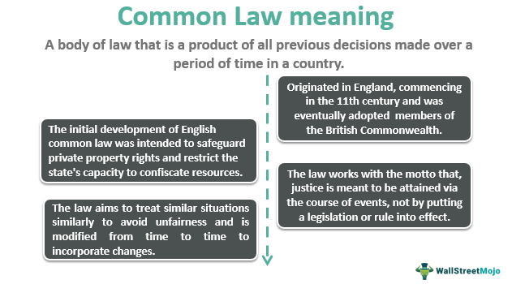

Administrative law serves as a vital mechanism within legal systems, ensuring the implementation, regulation, and enforcement of enacted statutes by governmental agencies. It operates as an essential bridge between the will of legislatures and agencies tasked with their application, playing a pivotal role in maintaining order, ensuring justice, and safeguarding public interests. Through guidance, oversight, and enforcement, administrative law provides the necessary framework for agencies to effectively execute legislative intent while protecting individuals against arbitrary governance. The significance of administrative law is heightened in complex sectors such as finance, healthcare, and telecommunications, where precise regulatory measures are required to maintain systemic integrity and public confidence. 

Algorithmic trading represents an evolution in the financial markets, utilizing automated systems to execute trading decisions at speeds and frequencies human traders cannot achieve. This form of trading relies on pre-programmed instructions, or algorithms, which determine the timing, price, and quantity of trades. Algorithmic trading is particularly influential due to its ability to process vast amounts of data and execute complex trading strategies with precision. This technology-driven methodology has become increasingly relevant as it contributes to market liquidity, efficiency, and price discovery, while also posing new risks and challenges, including those related to market manipulation and systemic risk.



The intersection between administrative law and algorithmic trading is an area of growing significance. As financial markets have embraced technological advancements, administrative law has had to adapt to address the unique challenges presented by algorithmic trading practices. Regulatory bodies, such as the Securities and Exchange Commission (SEC) in the United States, must ensure that algorithms used in the trading environment adhere to established legal norms and do not compromise market integrity. This interaction mandates a robust regulatory framework capable of overseeing the complexities introduced by high-speed and high-frequency trading. Administrative law provides the structure through which algorithms are scrutinized to ensure compliance with ethical standards, market fairness, and investor protection. This regulation is essential to mitigate adverse outcomes like flash crashes and to prevent financial instability provoked by unregulated algorithmic practices. 

Thus, administrative law's oversight of algorithmic trading is crucial for sustaining trust in financial markets and promoting a fair, transparent, and equitable trading environment.

## Table of Contents

## Understanding Administrative Law

Administrative law is a branch of public law that governs the activities of administrative agencies of government. This field of law focuses on the procedures, rules, and regulations that these agencies must follow. Administrative law bridges the operations of government agencies and the public, ensuring that these agencies uphold the law and operate within their prescribed mandates.

Key components of administrative law include rulemaking, enforcement, and adjudication. Rulemaking refers to the process by which government agencies create regulations that have the force of law. Enforcement involves the implementation and monitoring of these rules to ensure compliance. Adjudication encompasses the legal processes by which agencies resolve disputes and impose penalties for non-compliance.

Government agencies play a pivotal role in the regulatory framework through their capacity to create and enforce laws. These agencies operate at various governmental levels, including federal, state, and local levels, and they are tasked with implementing specific substantive laws enacted by legislatures. These agencies wield significant influence in shaping policy and guiding industry practices.

In the context of trading regulation, several key agencies are involved. The U.S. Securities and Exchange Commission (SEC) is the principal federal agency responsible for enforcing the federal securities laws, proposing securities rules, and regulating the securities industry, the nation’s stock and options exchanges, and other related activities and organizations. The SEC works to protect investors, maintain fair, orderly, and efficient markets, and facilitate capital formation.

In addition to the SEC, the Commodity Futures Trading Commission (CFTC) regulates the U.S. derivatives markets, which include futures, swaps, and certain options. It strives to protect market participants from fraud, manipulation, abusive practices, and systemic risk. Together, these agencies help ensure the integrity and transparency of financial markets, which is crucial for maintaining investor confidence and promoting economic stability.

Overall, administrative law's role in regulating trading practices highlights the importance of structured oversight in financial markets. By providing clear legal frameworks through regulatory bodies like the SEC and CFTC, administrative law strives to promote fair trading conditions and protect market participants from potential malfeasance.

## Legal Processes in Administrative Law

Administrative law involves a structured process through which regulations are both proposed and enforced, typically by government agencies. This process is designed to ensure that regulations are created and implemented in a fair, transparent, and consistent manner. The key components involve the following steps: rulemaking, enforcement, and adjudication.

### Rulemaking Process

The rulemaking process is the formal procedure undertaken by administrative agencies to create new regulations. This process often follows these steps:

1. **Notice of Proposed Rulemaking (NPRM):** Agencies must issue a public notice of intent to create a new rule or modify an existing one. This notice provides details about the proposed rule and invites stakeholders to submit comments.

2. **Public Comment Period:** During this period, interested parties—such as individuals, businesses, and advocacy groups—can express support, concerns, or suggest modifications to the proposed rule. This phase ensures transparency and public participation, critical for democratic governance.

3. **Review and Finalization:** The agency reviews the comments received and may make revisions to the proposed rule. Following this, the final rule is published. Agencies are required to justify their decisions and explain how they considered the public's input.

4. **Implementation and Publication:** The finalized rule is codified and implemented as part of the agency's regulatory framework. It is then made publicly accessible, often in the Federal Register in the United States.

### Enforcement Mechanisms

Regulatory enforcement involves monitoring compliance with established rules. Administrative agencies have various tools at their disposal:

- **Inspections and Audits:** Agencies regularly inspect business operations to ensure they comply with regulations.
- **Fines and Penalties:** Non-compliance can result in financial penalties or other sanctions.
- **Licensing and Permits:** Agencies may have the authority to grant or revoke licenses, thereby controlling which entities are authorized to operate under regulated conditions.

### Decision-Making Processes

In administrative settings, decision-making processes are typically characterized by adjudicative procedures. These include:

- **Administrative Hearings:** When a dispute arises, an administrative law judge (ALJ) may conduct a hearing to resolve the issue. These hearings are less formal than court trials but still adhere to principles of fairness and procedural justice.

- **Declaratory Orders:** Agencies may issue binding orders that clarify rights or obligations under existing regulations.

- **Internal Appeals:** Many agencies provide an internal mechanism for appealing decisions or sanctions, allowing affected parties to seek further review before resorting to judicial courts.

These legal processes are critical to maintaining the rule of law within the context of administrative governance. They provide a framework through which regulations can be justly proposed, enforced, and contested, ensuring that agencies fulfill their mandate to regulate effectively while respecting the rights of individuals and organizations involved.

## Case Studies and Legal Examples

Administrative actions have significantly impacted the trading landscape, leading to widespread discussions and legal reforms. The intersection of trading and regulatory oversight can be best understood by examining specific case studies and legal examples that highlight the dynamic between innovation, regulation, and compliance.

### Examples of Administrative Actions Impacting Trading

1. **Dodd-Frank Wall Street Reform and Consumer Protection Act**: Enacted in response to the 2008 financial crisis, the Dodd-Frank Act significantly impacted trading by increasing regulation over financial markets and trading practices. It established the Financial Stability Oversight Council and the Consumer Financial Protection Bureau, aiming to reduce risks in the financial system. It affected algorithmic trading by imposing stricter rules on derivatives and ensuring greater transparency in various trading activities.

2. **Volcker Rule**: Part of the Dodd-Frank Act, the Volcker Rule restricts U.S. banks from making certain kinds of speculative investments that do not benefit their customers. Named after former Federal Reserve Chairman Paul Volcker, this rule aims to prevent banks from engaging in proprietary trading, thereby reducing risky behavior that could impact financial stability.

### Internet Neutrality as a Case Study

Internet neutrality, though not directly linked to trading, has implications on the data landscape that informs [algorithmic trading](/wiki/algorithmic-trading) strategies. Net neutrality requires Internet service providers to treat all data equally, preventing them from discriminating against or charging differently by user, content, website, or application. The Federal Communications Commission (FCC) embraced net neutrality regulations in 2015 but rolled them back in 2017 under a new administration, creating significant legal discourse and implications for data-reliant sectors like algorithmic trading.

The rollback of net neutrality may affect the speed and accessibility of data required for high-frequency trading, impacting the efficiency and equity of trading operations. Algorithmic traders rely on fast and reliable internet connections to execute trades within milliseconds, and any bias or throttling in data transmission could skew trading outcomes and strategies.

### Other Regulatory Actions Involving Financial Markets

1. **Securities and Exchange Commission (SEC) Actions**: The SEC plays a pivotal role in overseeing market activities and has taken numerous actions impacting trading. For instance, regulations requiring greater transparency in trade reporting and stronger measures against market manipulation directly affect algorithmic trading operations.

2. **MiFID II**: The Markets in Financial Instruments Directive II (MiFID II), effective in the European Union from January 3, 2018, brought extensive reforms to financial markets in the EU and introduced significant changes to trading operations globally. It necessitates higher transparency in trading activities, including pre- and post-trade transparency requirements, which directly impact algorithmic trading strategies.

3. **Commodity Futures Trading Commission (CFTC) Regulations**: As the federal regulatory body overseeing U.S. derivatives markets, the CFTC's regulations play an essential role in shaping trading activities. Its rules on swaps transactions and high-frequency trading oversight impact how algorithmic trades are executed and reported.

These case studies and legal examples illustrate the significant impact of administrative actions on the trading environment, emphasizing the need for regulatory compliance and the ongoing dialogue between technological advancement and legal frameworks.

## The Intersection of Algo Trading and Administrative Law

Algorithmic trading, also known as algo trading, refers to the use of computer algorithms to automate trading strategies. These algorithms analyze market data and execute orders at speeds and frequencies that are impossible for human traders. The growth of algorithmic trading has been exponential, driven by technological advancements and the increasing complexity of financial markets. It accounts for a significant portion of trading [volume](/wiki/volume-trading-strategy) across several asset classes, including equities, commodities, and currencies.

Algorithmic trading offers numerous advantages, such as greater precision in order execution, minimization of market impact, and enhanced risk management. However, it also presents significant legal challenges that are particularly relevant to administrative law. One major concern is the potential for algorithms to inadvertently engage in unfair or manipulative market practices. In response to these challenges, regulators have been tasked with ensuring that automated trading systems comply with existing laws and promote fair, efficient, and transparent markets.

Regulatory frameworks have evolved to manage the unique aspects of algorithmic trading. Agencies such as the U.S. Securities and Exchange Commission (SEC) and the Commodity Futures Trading Commission (CFTC) have developed specific rules and guidelines. Notable regulations include the requirement for traders to implement effective risk management controls, the obligation to provide audit trails for trade activities, and pre- and post-trade transparency requirements. 

Furthermore, there is growing emphasis on the need for algo traders to establish robust testing and compliance systems to prevent illegal activities, such as spoofing and layering. Spoofing involves placing orders with the intent to cancel them before execution, creating a misleading impression of market demand. Regulatory bodies have been proactive in detecting and penalizing such activities through sophisticated surveillance technologies and stringent penalties.

As algorithmic trading continues to advance, regulatory frameworks must remain adaptable. Agencies may consider the potential role of [machine learning](/wiki/machine-learning) and [artificial intelligence](/wiki/ai-artificial-intelligence) in trading, which could introduce additional complexities in monitoring and regulation. Consequently, regulatory bodies need to foster a dialogue with technologists and market participants to create a balanced approach that encourages innovation while safeguarding market integrity.

## Significance of Regulatory Compliance in Trading

Regulatory compliance in trading is crucial for maintaining integrity and stability within financial markets. Adhering to administrative guidelines ensures that trading activities align with legal standards designed to protect investors, ensure fair practices, and enhance market transparency. Regulatory bodies like the Securities and Exchange Commission (SEC) and the Commodity Futures Trading Commission (CFTC) in the United States, or the Financial Conduct Authority (FCA) in the United Kingdom, establish rules and regulations that traders and financial firms must follow.

Adherence to these guidelines is critical for several reasons. Firstly, it mitigates the risk of market manipulation and fraud, which can be exacerbated in environments where automated traders operate at high speeds. Secondly, compliance ensures that markets remain competitive and accessible to all participants, maintaining a level playing field. Lastly, it safeguards the financial system against systemic risks that may arise from unchecked trading practices.

To ensure compliance with established legal standards, automated trading firms can implement several steps:

1. **Robust Compliance Programs**: Establishing comprehensive internal compliance programs is fundamental. These programs should be tailored to the specific requirements of the trading environment and include regular audits, training sessions for staff, and mechanisms for monitoring and reporting potential violations.

2. **Technology Integration**: Leveraging technology to monitor trading activities can enhance compliance efforts. Automated systems can be used to track trades in real-time and flag suspicious transactions for further investigation. Implementing algorithmic constraints that adhere to regulatory requirements can further prevent unintended breaches.

3. **Regular Updates and Training**: Keeping abreast of evolving regulations is essential. Firms should regularly update their systems and practices in response to regulatory changes, ensuring that their trading strategies remain compliant. Employee training should be continuous, covering not only compliance protocols but also the implications of non-compliance.

4. **Engagement with Regulatory Bodies**: Maintaining open channels of communication with regulatory authorities can aid in understanding expectations and addressing any compliance-related queries promptly. Regular interactions can also provide insights into forthcoming regulatory changes, allowing firms to adjust their strategies proactively.

Failure to comply with regulatory standards can have significant consequences for automated trading firms. Penalties for non-compliance can include substantial fines, revocation of trading licenses, and damage to the firm's reputation. Additionally, firms may face civil or criminal charges if violations are deemed intentional or severely detrimental to market integrity.

In conclusion, regulatory compliance in trading is not merely a legal obligation but a strategic necessity for ensuring longevity and success in financial markets. As trading becomes increasingly algorithm-driven, the importance of aligning with administrative guidelines grows, highlighting the need for ongoing vigilance and adaptation to regulatory changes.

## Future Directions and Legal Developments

Administrative law, as it intersects with technology and algorithmic trading, is poised for considerable evolution. As technology continues to advance, new regulatory challenges and opportunities emerge, prompting an evolution in administrative law. With the growing influence of machine learning and artificial intelligence, the landscape of administrative regulations will likely see transformative changes.

### Predictions for Evolution of Administrative Law with Technology

The continuous integration of technology in financial markets necessitates a dynamic response in administrative law. Historically, regulatory frameworks have adapted to traditional financial instruments, but the rise of high-frequency trading and complex algorithms demands a nuanced approach. Regulators face the challenge of crafting rules that are flexible yet robust enough to manage rapid technological changes. 

A key focus will be on creating laws that can accommodate the unpredictable and rapidly evolving nature of technology, particularly as machine learning models become central in trading strategies. These models can make decisions at speeds and complexities far beyond human capabilities, raising concerns around accountability, transparency, and fairness.

### Role of Machine Learning in Shaping Future Laws and Regulations

Machine learning holds the potential to both disrupt and enhance regulatory frameworks. On one hand, it can automate and improve regulatory compliance processes. For example, machine learning algorithms can analyze trading patterns for regulatory breaches more efficiently than traditional methods. On the other hand, these sophisticated computational models may themselves be subject to regulations, especially concerning their decision-making processes and biases.

Regulators are expected to employ machine learning techniques for monitoring algorithmic trading activities. By leveraging data analytics, agencies like the SEC can develop predictive models to identify potentially manipulative or abusive trading behaviors before they affect the market.

```python
# Example code snippet for a basic anomaly detection in trading data
import numpy as np
from sklearn.ensemble import IsolationForest

# Generate sample data
np.random.seed(0)
training_data = np.random.normal(0, 0.5, (100, 2))

# Fit the model
model = IsolationForest(contamination=0.1)
model.fit(training_data)

# Predict anomalies
predictions = model.predict(training_data)
anomalies = training_data[predictions == -1]
```

### Potential New Regulations in Algorithmic Trading

As algorithmic trading continues to mature, new regulations may emerge to address specific risks associated with its widespread deployment. Potential regulatory focus areas include:

1. **Algorithm Auditing**: Ensuring that trading algorithms adhere to legal and ethical standards may involve mandatory audits or certifications, verifying that these systems operate as intended without unintended consequences.

2. **Transparency and Reporting**: Regulators may require more detailed reporting on how algorithms make decisions, including data sources, decision criteria, and any machine learning methodologies employed.

3. **Real-time Monitoring and Control**: The implementation of real-time monitoring technologies could become mandatory, allowing regulators to continually assess the health and behavior of trading systems actively.

4. **Bias and Fairness**: As algorithms may inadvertently perpetuate biases, regulations could enforce fairness standards, ensuring that algorithmic decisions do not disadvantage specific market participants.

By anticipating these regulatory shifts and preparing for their impacts, firms engaged in algorithmic trading can better navigate the future landscape. Balancing innovation with the need for oversight will be crucial, ensuring that technological advancements do not outpace the ability of regulatory bodies to manage their associated risks.

## Conclusion

Administrative law plays a crucial role in the world of trading, serving as a regulatory framework that guides and governs the operations of trading mechanisms. It ensures that trading activities, including the trading algorithms that have become increasingly prevalent, are conducted within legal confines designed to protect the market's integrity and participants. The legal oversight by bodies such as the Securities and Exchange Commission (SEC) ensures that market practices are fair, transparent, and devoid of manipulation, thereby maintaining investor confidence and market stability.

As the landscape of trading rapidly evolves with the integration of advanced technologies, particularly algorithmic trading, striking a balance between fostering innovation and ensuring adequate regulation becomes more complex. The pace of technological advancements often surpasses the legislative process, creating a challenging environment for regulators to keep up with new developments without stifling innovation. This underscores the necessity for dynamic regulatory frameworks that can adapt to technological changes while continuing to uphold the core principles of market fairness and efficiency.

An ongoing, proactive dialogue between technologists and lawmakers is essential in navigating the intricacies of this evolving landscape. By engaging in collaborative discussions, both parties can work towards creating regulations that not only accommodate technological innovations but also anticipate and mitigate potential risks associated with them. Such dialogues can lead to more informed and effective regulatory measures that align with modern trading practices and technologies.

Ultimately, continuous engagement between the technological sector and regulatory bodies will be key to shaping a future where trading innovations can thrive within a robust and adaptive legal framework. This commitment to cooperation and adaptability will ensure that markets remain both innovative and secure, underpinning sustainable growth in the financial sector.

## References & Further Reading

[1]: Lopez de Prado, M. (2018). ["Advances in Financial Machine Learning."](https://www.amazon.com/Advances-Financial-Machine-Learning-Marcos/dp/1119482089) Wiley.

[2]: Aronson, D. R. (2007). ["Evidence-Based Technical Analysis: Applying the Scientific Method and Statistical Inference to Trading Signals."](https://www.amazon.com/Evidence-Based-Technical-Analysis-Scientific-Statistical/dp/0470008741) Wiley.

[3]: Jansen, S. (2020). ["Machine Learning for Algorithmic Trading."](https://github.com/stefan-jansen/machine-learning-for-trading) Packt Publishing.

[4]: Chan, E. P. (2008). ["Quantitative Trading: How to Build Your Own Algorithmic Trading Business."](https://github.com/ftvision/quant_trading_echan_book) Wiley.

[5]: Securities and Exchange Commission (SEC). ["Regulatory Actions."](https://www.sec.gov/rules-regulations) (Access for relevant rules and guidelines).

[6]: European Securities and Markets Authority (ESMA). ["MiFID II."](https://www.esma.europa.eu/publications-and-data/interactive-single-rulebook/mifid-ii) (For research on European regulatory frameworks).