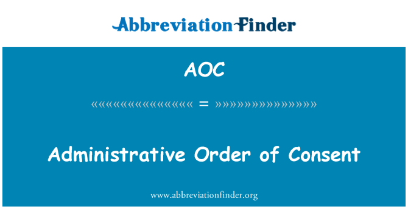

An Administrative Order-on-Consent (AOC) is a specific type of legal agreement forged between an individual, business, or entity and a regulatory agency. The primary goal of an AOC is to address and correct legal violations, most often related to environmental concerns, without necessitating court proceedings. These agreements provide a framework for the offender to comply with legal obligations by ceasing harmful activities and, typically, undertaking corrective actions. Environmental Protection Agency (EPA) commonly employs AOCs as a means to ensure compliance and remediation, especially in cases involving pollution and other forms of environmental damage.

Within the environmental context, AOCs play a pivotal role, mitigating the need for prolonged litigation while still ensuring that necessary remediation occurs. The agreements are legally binding, meaning noncompliance can ultimately lead to judicial enforcement. As a result, these orders not only expedite resolution but also maintain a high level of accountability.



Interestingly, the framework and conceptual underpinnings of AOCs have potential applications beyond environmental regulation. For instance, in the financial sector, particularly in algorithmic trading, analogous mechanisms can be observed. Algorithmic trading systems rely on compliance algorithms to ensure adherence to financial regulations and trading norms, reflecting similar principles of consent-based compliance in AOCs.

This article examines various facets of AOCs, including their legal implications, role in environmental regulation, and potential cross-sectoral influence, particularly in financial markets. By exploring AOCs, we can better understand their importance as tools for both environmental remediation and as potential models for enforcement strategies in other fields.

## Table of Contents

## What is an Administrative Order-on-Consent (AOC)?

An Administrative Order-on-Consent (AOC) is a legal mechanism used to address violations, particularly in environmental contexts, without resorting to litigation. These agreements are voluntary, yet legally binding, establishing the terms under which an offending party agrees to rectify the violations they have committed. Typically, parties involved agree to undertake specific actions, such as remediating environmental damage, ceasing harmful activities, and potentially paying monetary penalties or damages.

The Environmental Protection Agency (EPA) commonly utilizes AOCs to facilitate environmental cleanups. These agreements enable the EPA and the responsible party to negotiate and define a remedial strategy that will address the violations efficiently. In executing an AOC, an offending entity may agree to a variety of remedial measures. This may include actions such as the removal of hazardous substances, restoration of damaged ecosystems, or implementation of new operational practices to prevent future violations.

AOCs are advantageous in that they allow for quicker resolutions compared to court trials. Since they are formed through negotiation, the parties involved can reach a mutually agreed-upon plan for compliance, tailored to the specific circumstances of the violation. This cooperative approach can lead to more effective and timely remedial actions. However, because AOCs are legally binding, failure to comply with the agreement terms can result in further legal action, including court enforcement and additional penalties.

In conclusion, Administrative Orders-on-Consent serve as a critical tool for regulatory agencies and responsible parties to collaboratively ensure compliance and remediate violations. They provide a structured yet flexible framework for addressing and mitigating the impacts of violations while avoiding the time-consuming and often costly litigation process.

## The Legal Framework of AOCs

Administrative Orders-on-Consent (AOCs) serve as an essential mechanism for regulatory bodies, facilitating compliance without the need for protracted litigation. As voluntary yet legally binding agreements, AOCs enable the resolution of violations through cooperation between the regulatory agency and the offending party. These agreements typically obligate the offender to address and remediate the harm caused by their actions, often focusing on extensive environmental damages like pollution.

The binding nature of AOCs is a critical aspect of their legal framework, ensuring that parties adhere strictly to the terms set forth. Should an entity fail to comply with an AOC, regulatory agencies are empowered to enforce compliance through the court system. This enforcement capability underscores the seriousness of entering into an AOC and highlights its dual advantage: promoting timely remedial action while avoiding time-consuming court processes.

Moreover, AOCs are frequently employed in situations where environmental damage is significant and demands immediate attention and remediation. For instance, the U.S. Environmental Protection Agency (EPA) uses AOCs to compel entities to undertake environmental cleanup efforts, ensuring that the responsible parties not only cease harmful activities but also rectify the consequences of such violations. This framework aids regulatory agencies in achieving environmental rehabilitation efficiently and effectively, prioritizing ecological restoration and public health over lengthy legal battles.

The strategic utilization of AOCs in managing environmental compliance reflects their importance as a tool for regulatory governance. They provide a framework within which violations can be addressed promptly and constructively, thus safeguarding environmental and public interests while fostering cooperation between regulators and entities.

## Consent Agreements in Administrative Orders

Consent agreements form the backbone of Administrative Orders-on-Consent (AOCs), establishing a framework through which a regulatory body and an entity can collaboratively resolve violations. These agreements act as settlements, allowing entities to agree to terms without admitting fault, thereby avoiding potential litigation.

Typically, consent agreements stipulate both financial settlements and corrective actions. Financial settlements serve to compensate for damages or as a deterrent against future violations. For example, an entity responsible for environmental damage might agree to a financial penalty that reflects the severity of the infraction, while ensuring that the funds contribute to environmental restoration efforts or regulatory costs.

Corrective actions within consent agreements outline the steps the entity must take to address the violation. This might include process modifications, environmental cleanup initiatives, or installation of pollution control technologies. Corrective actions are designed to prevent recurrence of the issue and promote ongoing compliance with regulatory standards.

Overall, these agreements are implemented to foster cooperation between regulatory authorities and violators, emphasizing constructive resolution over adversarial litigation.

## AOC and Algorithmic Trading: A Cross-Sectoral View

Administrative Orders-on-Consent (AOCs), traditionally applied within environmental regulatory frameworks, can offer valuable insights into developing contract enforcement strategies in financial markets, specifically in [algorithmic trading](/wiki/algorithmic-trading). Algorithmic trading involves computerized systems executing trades at high speeds and volumes based on pre-set criteria, where compliance and execution speed are critical. The principles underlying AOCs, such as voluntary compliance and binding agreements, may be applicable in designing compliance algorithms for financial systems.

In algorithmic trading, the ability to conform to regulatory norms and market conditions rapidly is crucial. The deployment of compliance algorithms designed to mirror an AOC's mechanism of engaging parties towards a binding agreement, is a potential innovation in enhancing trading algorithms. These compliance algorithms would ensure that trades adhere to legal and market constraints automatically and adjust to any deviations almost instantaneously, akin to how AOCs preemptively address violations.

AOCs offer incentives to comply by balancing penalties with corrective actions, which can inspire financial contract structures in algorithmic systems. This could involve designing algorithms that automatically adapt trading strategies to comply with evolving legal and regulatory norms. For instance, algorithms can be developed to monitor legal threshold constraints and adjust trading strategies in real time to prevent violations. This behavior parallels the self-regulatory nature of AOCs, which require entities to voluntarily adhere to stipulated conditions to avoid legal repercussions.

In practice, such compliance mechanisms in algorithmic trading could look like the following Python code snippet, demonstrating an algorithm that adjusts trading strategies based on regulatory constraints:

```python
def compliance_algo(trade_data, regulation_threshold):
    """
    Adjusts trading strategy based on regulatory thresholds.
    """
    compliant_trades = []

    for trade in trade_data:
        if trade['value'] <= regulation_threshold:
            compliant_trades.append(trade)
        else:
            # Adjust strategy: reduce trade size or modify terms
            adjusted_trade = adjust_trade(trade, regulation_threshold)
            compliant_trades.append(adjusted_trade)

    return compliant_trades

def adjust_trade(trade, threshold):
    """
    Modify the trade to make it compliant with the regulation threshold.
    """
    trade['value'] = min(trade['value'], threshold)
    return trade
```

The code exemplifies how algorithmic adjustments could be realized when trades exceed regulatory limits, reminiscent of an AOC's self-corrective nature. By embedding these self-regulatory mechanisms, the parallels between AOCs and algorithmic trading compliance strategies become evident. This cross-sectoral application of AOC principles underscores the importance of adaptable, enforceable contracts in maintaining market integrity while fostering innovative, automated compliance solutions.

## Case Studies: AOCs in Action

Administrative Orders-on-Consent (AOCs) serve as a significant mechanism for regulatory enforcement, especially in addressing environmental violations. Real-life examples provide a concrete understanding of how AOCs function and their effectiveness in achieving compliance and remediation.

One notable case involves the University of Hawaii and its agreement with the Environmental Protection Agency (EPA) to address pollution issues at the Waikiki Aquarium. This agreement was established after it was discovered that the facility was discharging pollutants into coastal waters in violation of the Clean Water Act. The AOC required the University to implement specific corrective actions, including upgrading facilities and adopting best management practices to prevent further environmental degradation.

The case of the Waikiki Aquarium underscores the dual role of AOCs in enforcement and resolution. By entering into an AOC, the University of Hawaii was able to avoid the time-consuming process of litigation while committing to rectify the identified issues. The legally binding nature of the AOC ensured that the University adhered to the prescribed remediation measures, ultimately contributing to the safeguarding of local marine ecosystems.

This example highlights the practical applications of AOCs in resolving environmental violations while showcasing their role in facilitating cooperation between regulatory agencies and violators. By focusing on corrective actions and compliance rather than punitive measures, AOCs promote effective solutions to environmental challenges.

## Advantages and Disadvantages of Entering into an AOC

Entering into an Administrative Order-on-Consent (AOC) presents both strategic benefits and potential challenges for entities involved in regulatory violations, typically related to environmental issues. 

**Advantages:**

1. **Quicker Resolution:** One of the primary advantages of an AOC is the expedited resolution of regulatory disputes. By agreeing to the terms set out by the regulatory agency, parties can avoid lengthy litigation processes, which often involve considerable time and resources. This swift resolution can also minimize operational disruptions and allow the entity to focus on compliance and remediation strategies.

2. **Cost Efficiency:** The avoidance of court battles not only saves time but also reduces legal costs associated with extended court proceedings. Legal fees can be substantial, and an AOC can help entities allocate resources more efficiently towards corrective actions rather than on legal defenses.

3. **Predictability:** With an AOC, parties have a clearer understanding of the outcomes, as the conditions and expectations set by the regulatory authority are explicitly outlined in the agreement. This transparency allows for precise planning and implementation of necessary corrective measures.

4. **Reduction in Penalties:** Often, regulatory bodies may be willing to negotiate for lesser penalties within an AOC compared to what might be levied following a contentious legal battle. This can be particularly advantageous for entities looking to mitigate financial impacts.

**Disadvantages:**

1. **Binding Nature:** An AOC is a legally binding document. Noncompliance with the terms of the agreement can result in severe repercussions, including the reinstatement of legal proceedings, additional penalties, or enforcement actions. This binding nature requires thorough commitment and adherence to stipulated measures, placing significant pressure on the involved entities to ensure compliance.

2. **Potential for Unanticipated Obligations:** Despite the clarity that an AOC seeks to provide, unforeseen obligations or complications can arise during the implementation phase. Entities might find that some requirements are more costly or time-consuming than initially anticipated.

3. **Limited Negotiation Room:** In some cases, the negotiating power of the entity might be limited, especially when the regulatory authority has significant leverage. This scenario could lead to terms that are not as favorable as the entity might wish.

In summary, while an Administrative Order-on-Consent can serve as a useful tool for achieving regulatory compliance efficiently, it demands careful consideration of the potential risks and obligations involved. Entities must weigh these factors against the benefits of quick resolution and reduced legal expenditures to determine if entering an AOC aligns with their strategic and operational goals.

## The Future of AOCs and Implications for Regulatory Compliance

Administrative Orders-on-Consent (AOCs) are set to maintain their significance as effective instruments for regulatory agencies. They serve as a flexible and cooperative mechanism that allows regulators to enforce compliance without resorting to protracted legal proceedings. The relevance of AOCs is underscored by their ability to adapt to various regulatory contexts, emphasizing the critical need for businesses and entities to uphold compliance and accountability standards.

One of the primary reasons AOCs will continue to be integral is their ability to expedite the resolution of environmental and regulatory issues. By providing a clear framework for corrective actions and financial settlements, AOCs reduce the time and resources needed for litigation. This not only benefits the regulatory body but also enables businesses to rectify issues more quickly, minimizing potential disruptions to operations.

Furthermore, the binding nature of AOCs ensures that entities take their commitments seriously. The possibility of court enforcement for noncompliance acts as a strong deterrent against breaching agreed terms. As regulatory frameworks around the world adapt to increasing environmental and technological challenges, the role of such agreements in maintaining high compliance standards cannot be overstated.

The future of AOCs also involves their potential application in emerging regulatory fields. For example, in the digital age, where data privacy and cybersecurity have become pivotal, analogous consent agreements could be developed to address violations and enforce corrective measures swiftly. Regulatory bodies can leverage insights from the AOC model to formulate agreements that mirror its efficacy in ensuring adherence to newly established norms.

Moreover, with the heightened global emphasis on sustainability and corporate responsibility, AOCs are likely to feature prominently in initiatives aimed at achieving environmental goals. As businesses are increasingly held accountable for their environmental footprint, AOCs offer a tangible way to implement necessary changes without jeopardizing their viability.

In summary, the future trajectory of Administrative Orders-on-Consent points towards their continued utility as a dynamic tool for facilitating regulatory compliance. Their adaptability to various sectors highlights the necessity for businesses to remain vigilant in maintaining compliance, ultimately fostering a culture of accountability and sustainable practices.

## Conclusion

Administrative Orders-on-Consent (AOCs) play an essential role in ensuring regulatory compliance, representing a pragmatic approach to resolving violations without resorting to litigation. These legal agreements facilitate swift rectification processes, making them indispensable tools for entities like the Environmental Protection Agency (EPA) that deal with extensive environmental damage. By circumventing the complexities and duration of court cases, AOCs provide an efficient resolution mechanism that benefits both regulatory bodies and violators.

Moreover, the applicability of AOCs extends beyond environmental scenarios. They offer a model for structured compliance and enforcement, which can be adapted to other sectors, including finance and technology. In algorithmic trading, for instance, the principles underpinning AOCs can inspire the development of compliance algorithms, fostering regulatory adherence in a rapidly evolving market landscape.

The multi-sector relevance of AOCs underscores their effectiveness as a framework for addressing violations while promoting accountability. As industries continue to evolve and regulatory landscapes become more complex, AOCs are poised to remain pivotal in ensuring that regulations are followed and that entities are held accountable for their actions. This adaptability strengthens their role in crafting effective legal frameworks, which can be tailored to suit various contexts and emerging challenges.

## References & Further Reading

[1]: Environmental Protection Agency. ["Administrative Orders on Consent."](https://www.epa.gov/sites/default/files/2013-10/documents/7003-aoc-05-mem.pdf)

[2]: Hemenway, Chad. ["Understanding the Use and Enforcement of Administrative Orders on Consent (AOCs) in Environmental Cases."](https://www.periconi.com/blog/2018/04/the-power-of-a-consent-order-and-a-consent-decree/), Lexology.

[3]: U.S. Environmental Protection Agency. ["Enforcement and Compliance History Online."](https://echo.epa.gov/)

[4]: Marquez, Rebeca. ["Algorithmic Trading and Market Dynamics."](https://www.cmegroup.com/education/files/Algo_and_HFT_Trading_0610.pdf) ResearchGate.

[5]: Gomber, Peter, Arndt, Bjoern, Lutat, Marco, & Uhle, Thorsten. (2011). ["High-Frequency Trading."](https://papers.ssrn.com/sol3/papers.cfm?abstract_id=1858626) Social Science Electronic Publishing.