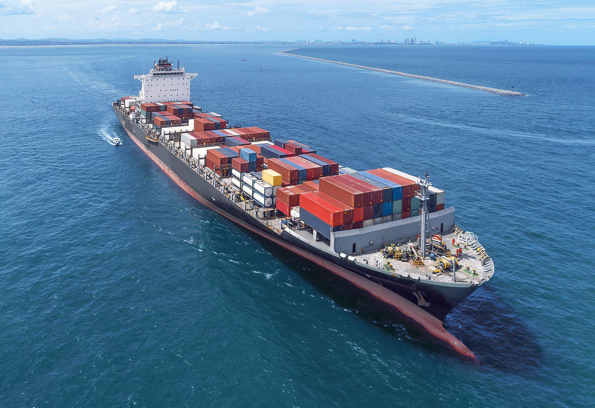

Maritime law, also known as admiralty law, is a distinct body of law governing nautical issues and private maritime disputes. Its roots trace back thousands of years, reflecting its deep ancestral ties to trade and commerce, foundational elements of early civilizations. The Phoenicians, Egyptians, Greeks, and Romans all contributed to the early development of maritime codes, such as the Lex Rhodia, which served as a significant influence on contemporary maritime law. The historical significance of maritime law lies in its role as a cornerstone for trade and economic expansion, facilitating global commerce by ensuring predictable and fair adjudications out on the open seas.

The relevance of maritime law transcends its antiquity, playing a critical role in today's interconnected global trade system. It provides the legal framework necessary for the regulation of relationships and the resolution of disputes involving private maritime parties, shipping operations, and public ocean resources. The intertwining of maritime law and global trade highlights admiralty courts' significance—courts that specifically address maritime issues, ensuring proper jurisdictional governance over seas and oceans.

The modern world sees maritime law intersecting with technological advancements, most notably algorithmic trading within the shipping industry. These technological innovations require adaptations in legal frameworks to accommodate automated decision-making and logistics operations. Such intersections highlight the ongoing relevance and adaptability of maritime law in addressing complex, contemporary challenges.

This article explores several critical dimensions of maritime law. Starting with its historical origins, it examines how ancient practices inform current maritime legal structures and the operation of admiralty courts. Additionally, it considers the modern evolution of maritime law, influenced by technological progress and globalization. Special focus is given to algorithmic trading in maritime commerce, illustrating its impact on decision-making and logistics within the shipping industry. Finally, key legal cases are highlighted for their foundational impact on current maritime legal practices and future challenges that might affect this enduring area of law. Through this exploration, the article underscores the continuing importance of maritime law in regulating global trade and its ability to adapt to the modern world's demands.

## Table of Contents

## Historical Origins of Maritime Law

Maritime law, also known as admiralty law, finds its origins in the earliest trading civilizations, laying a foundational legal framework for modern naval affairs. Ancient Egyptians were among the first to formalize maritime practices, establishing guidelines for navigation and trade on the Nile River. As seafaring societies emerged, such as the Greeks and Romans, maritime law evolved to accommodate increasingly complex maritime trade networks across the Mediterranean Sea.

One of the seminal contributions to early maritime law comes from the island of Rhodes with the development of the Lex Rhodia. This ancient code, thought to date back to around 800 BC, addressed issues such as jettison and maritime liability, laying down principles that would influence later legal codifications. Specifically, the Lex Rhodia dealt with the apportioning of losses incurred at sea, pioneering concepts related to general average—a maritime principle where loss is shared among all parties involved in a sea venture. Justinian's Digest later incorporated these rules, further embedding them into the fabric of maritime law.

The expansion of powerful maritime nations during the Middle Ages significantly impacted the evolution of maritime legal frameworks. Italian city-states like Venice and Genoa created sophisticated legal systems to handle maritime trade, often necessitated by their positions as prominent trading hubs. The Consolato del Mare, a maritime code from the 14th century, comprised customs and laws from the Catalan maritime regions, encapsulating broader Mediterranean practices and influencing maritime jurisprudence.

As maritime nations expanded in prominence, a need emerged for consistent, unified maritime laws to govern burgeoning international trade. This era saw the growth of the Hanseatic League in Northern Europe, which developed the Laws of Wisby, further refining maritime legal precedents. During the same period, England's maritime prowess led to the establishment of the English Admiralty Court, which incorporated customary law and continental practices, creating a hybrid legal system influential even today.

In summary, the historical roots of maritime law are deeply entrenched in the practices and regulations of ancient civilizations like the Egyptians, Greeks, and Romans. Influential codes—such as the Lex Rhodia—have shaped modern maritime legal principles. The rise of powerful maritime nations during the Middle Ages further refined legal frameworks, ultimately giving rise to a more uniform, internationally recognized body of maritime law crucial to global commerce.

## Understanding Admiralty Courts

Admiralty courts are specialized judicial bodies with jurisdiction over maritime law issues. These courts have a unique mandate, dealing specifically with matters related to maritime activities and the associated legal disputes. Their primary function is to provide a forum for resolving disputes that arise from various maritime operations and transactions, thereby ensuring the smooth functioning of maritime commerce and trade.

The jurisdiction of admiralty courts typically extends to a range of cases that are inherently tied to maritime activities. Among the most common types of cases handled are shipping disputes, which can involve issues such as breach of shipping contracts, demurrage, and charter party agreements. Admiralty courts also deal with collisions at sea, adjudicating matters related to the causes, accountability, and compensation arising from marine accidents. Salvage claims, which involve compensation for the recovery of ships, cargo, or other properties in peril at sea, constitute another significant category of cases. Additionally, admiralty courts frequently address issues of marine insurance, maritime liens, and cargo claims.

Admiralty courts operate under a distinct procedural system influenced significantly by historical practices. In the United States, admiralty courts are part of the federal judicial system; Article III, Section 2 of the U.S. Constitution extends judicial power to "all Cases of admiralty and maritime Jurisdiction." This has been codified under U.S. Title 28, which provides the statutory framework for the functioning of these courts. A unique aspect of U.S. admiralty courts is their ability to conduct proceedings in rem, allowing them to address cases where the property (usually a vessel) is the defendant, unlike other courts where actions are typically in personam.

Globally, the structure and function of admiralty courts can vary. In the United Kingdom, for instance, the Admiralty Court is a specialist court located within the High Court of Justice and handles cases involving collision claims, salvage, and limitation actions. Other countries may have specialized mechanisms or tribunals dedicated to maritime disputes, reflecting their legal traditions and the significance of maritime commerce in their economies.

In essence, admiralty courts play an indispensable role in maintaining maritime operations' uniformity and reliability, provide clear legal recourse for maritime stakeholders, and resolve disputes efficiently. Their structured approach and specialized jurisdiction ensure that maritime law is upheld across different jurisdictions, thereby facilitating international maritime trade and cooperation.

## The Evolution of Maritime Law in the Modern Era

Maritime law has undergone considerable transformations in response to technological advancements and globalization. These developments have created new legal challenges and redefined existing frameworks to accommodate the rapidly changing environment of international maritime commerce.

Technological advancements have significantly impacted maritime law. The introduction of automated systems for navigation and communication, as well as improvements in shipbuilding technology, have necessitated updates to regulatory standards to ensure safety and security at sea. For instance, the International Convention for the Safety of Life at Sea (SOLAS) has been revised multiple times to integrate new safety measures that incorporate cutting-edge technology. Furthermore, the increasing prevalence of digital documentation and electronic communication has urged the adoption of legal frameworks that address issues of cybersecurity and data protection in maritime operations.

Globalization has intensified maritime activity, prompting the need for harmonized international legal standards. Key international treaties, such as the United Nations Convention on the Law of the Sea (UNCLOS), have been instrumental in modernizing maritime practices and establishing norms for territorial waters, exclusive economic zones, and the legal status of the high seas. These treaties facilitate cooperation among nations and provide a legal basis for resolving disputes. The International Maritime Organization (IMO) plays a crucial role in implementing international agreements that promote safe, secure, and efficient shipping on clean oceans.

Modern legal challenges are addressed under maritime law through comprehensive strategies that account for global and environmental concerns. Environmental regulations have gained prominence, particularly with regards to pollution control from ships. The International Convention for the Prevention of Pollution from Ships (MARPOL) sets provisions to prevent marine pollution by oil and other harmful substances. Amendments to MARPOL continue to evolve in order to address emerging environmental issues, such as greenhouse gas emissions from ships.

Piracy remains a modern challenge that maritime law continues to address. Nations have collaborated to patrol high-risk areas, such as the Gulf of Aden and the waters off Somalia, through multinational naval forces. Legal frameworks provide mechanisms for prosecuting acts of piracy and armed robbery at sea, yet the dynamic nature of these threats necessitates ongoing international coordination and legal refinement.

Overall, the evolution of maritime law in the modern era reflects a continuous effort to adapt to technological innovations and the complexities of global trade, thereby enhancing regulatory frameworks to promote maritime safety, security, and environmental stewardship.

## Algorithmic Trading in Maritime Commerce

Algorithmic trading is a method of executing trades using automated systems and algorithms to process and respond to market data. In the shipping industry, [algorithmic trading](/wiki/algorithmic-trading) has gained traction for its ability to optimize decision-making and improve the efficiency of maritime logistics. The application of algorithmic trading in maritime commerce primarily revolves around supply chain management, freight pricing, and risk assessment.

The use of algorithms allows companies to analyze vast amounts of data from various sources, including ship tracking systems, weather forecasts, and port schedules, to make more informed decisions. For instance, in freight pricing, algorithms can dynamically adjust rates based on current market conditions, demand fluctuations, and fuel prices, ultimately leading to more competitive pricing strategies.

Moreover, algorithmic trading enhances decision-making by facilitating predictive analytics and trend forecasting. Machine learning models can identify patterns and potential disruptions in shipping routes or port operations, enabling companies to preemptively reroute shipments or adjust schedules, thus minimizing delays and costs. For example, by analyzing historical shipping patterns and real-time data, algorithms can forecast congestion at ports and suggest alternative routes or times for docking.

However, the integration of algorithmic trading within the maritime sector presents several legal considerations and challenges. One of the primary concerns is the regulatory framework governing data usage and sharing. Ensuring compliance with international standards and data protection laws, such as the General Data Protection Regulation (GDPR) in Europe, is crucial for companies utilizing algorithm-driven systems.

Furthermore, the deployment of algorithmic trading systems necessitates robust cybersecurity measures to protect sensitive commercial data from breaches. The manipulation of data inputs or outputs could lead to significant financial losses and operational disruptions, raising questions about liability and accountability in the event of system failures or data compromises.

Additionally, there are challenges related to contractual obligations and dispute resolution. The use of automated systems might result in disputes regarding the accuracy of data and decisions made by algorithms, which could complicate traditional contract enforcement mechanisms. To address these challenges, it is essential for stakeholders in the maritime industry to develop clear guidelines and frameworks for the use of algorithmic trading, balancing innovation with regulatory compliance and risk management.

## Key Legal Cases and Precedents

Maritime law, also known as admiralty law, encompasses a wide range of legal principles governing activities on the sea, including shipping, navigation, and marine conduct. Several landmark cases have played pivotal roles in shaping the development of maritime law, particularly in aspects like insurance liability and jurisdictional interpretation.

One significant case is *The Schooner Exchange v. McFaddon* (1812). This case established the foundational principle of sovereign immunity, determining that a foreign warship docked in a U.S. port was immune from the jurisdiction of domestic courts. This set a precedent for jurisdictional interpretation in maritime law, emphasizing the limits of a nation's legal reach over foreign vessels.

A crucial case concerning insurance liability is *Devlin v. Smith* (1882). The court's decision highlighted the "implied warranty of seaworthiness," implying that a shipowner must ensure a vessel is adequately maintained and fit for its intended voyage. This precedent has influenced countless disputes regarding marine insurance, obligating shipowners to maintain their vessels to avoid liability and claims rejection.

In *The Everest* (1963), the concept of limitation of liability for shipowners was significantly refined. The case involved a collision caused by the negligence of a ship's crew, leading the court to rule that the owner's liability could be limited provided they had no direct knowledge or privity about the negligence. This case has impacted how liabilities are calculated in maritime incidents, leading to current practices where shipowners can restrict financial culpability under certain conditions.

Contemporary legal challenges continue to leverage these precedents. For instance, in cases of marine pollution and environmental regulations, courts often refer to the principles established in earlier judgments to determine liability and jurisdictional authority. This is particularly evident with the increase in piracy incidents where jurisdiction and the extent of liability remain contentious.

In dealing with modern issues like electronic documentation and automated vessels, courts adapt previous precedents to fit new paradigms. For example, the principle derived from *Devlin v. Smith* is now often extended to ensure that electronic navigation systems meet seaworthiness standards.

Ultimately, the successes in addressing emerging maritime legal challenges rely heavily on the interpretations and applications of these landmark cases. Their influence extends not only to traditional maritime concerns but also to novel issues arising from technological advancements and globalized trade.

## Conclusion

Maritime law, with its origins deeply rooted in ancient civilizations such as those of the Egyptians, Greeks, and Romans, remains an indispensable component of global trade today. Its historical evolution through various epochs—shaped by early maritime codes like the Lex Rhodia, the influence of the Middle Ages, and the ascendancy of powerful maritime nations—has laid the foundation for the legal frameworks that govern today's complex maritime activities. The original principles and practices have been preserved while adapting to the changing contours of international commerce and technological advancements.

In contemporary settings, maritime law plays a crucial role in regulating international trade, a testament to its enduring relevance. It provides a structured mechanism to address disputes, allocate liability, and enforce contracts in the inherently global and collaborative nature of maritime commerce. This regulatory function is critical as the world witnesses unprecedented levels of shipping activity, fueled by globalization and international trade agreements. Admiralty courts, through their specialized jurisdiction, continue to adjudicate intricate maritime disputes, ensuring that justice is dispensed in line with established legal precedents.

As we look to the future, maritime law must navigate a landscape marked by rapid technological advancements and evolving legal challenges. Developments like algorithmic trading in maritime commerce introduce new dynamics that demand careful legal consideration. The rise of digital platforms and technology-driven solutions necessitates updates to existing laws to address issues such as cyber threats, electronic documentation, and autonomous vessels. Additionally, environmental concerns, such as pollution and climate change, require maritime laws to adapt for sustainable shipping practices, potentially through international treaties and conventions.

The challenges and opportunities presented by these advancements offer a pathway for innovation within maritime law, allowing it to continually refine and update its principles. By maintaining a balance between tradition and innovation, maritime law is poised to remain a linchpin in the effective regulation of global trade, ultimately contributing to a stable and predictable international trading environment. As legal practitioners, policymakers, and industry stakeholders engage with these changes, there will be an ongoing need for collaboration and dialogue to ensure that maritime law facilitates rather than hinders progress in global maritime commerce.

## References & Further Reading

[1]: Tetley, W. (2002). ["Maritime Liens and Claims"](https://books.google.com/books/about/Maritime_Liens_and_Claims.html?id=sjMSAAAAYAAJ). Montreal: International Shipping Publications.

[2]: Shearer, I. A. (1994). ["Stark's International Law."](https://openlibrary.org/books/OL1201871M/Starke's_international_law.) Oxford University Press.

[3]: Wilson, J. (2008). ["Carriage of Goods by Sea."](https://www.amazon.com/Carriage-Goods-Sea-John-Wilson/dp/1408218933) Pearson Education Limited.

[4]: Gold, E., Chircop, A., & Kindred, H. (2003). ["Maritime Law."](https://books.google.com/books/about/Maritime_Law.html?id=9jwSAAAAYAAJ) Irwin Law.

[5]: Ma, S., & Voon, F. (2016). ["Algorithmic Trading in the Equities Market."](https://www.tandfonline.com/doi/full/10.1080/03085147.2016.1213080) University of New South Wales Law Journal 39(2), 445-479.

[6]: Dubner, B. H. (1983). ["The Law of International Sea Piracy."](https://archive.org/details/lawofinternation0000dubn) Martinus Nijhoff Publishers.

[7]: Churchill, R. R., & Lowe, A. V. (1999). ["The Law of the Sea."](https://archive.org/details/lawofsea03edchur) Manchester University Press.