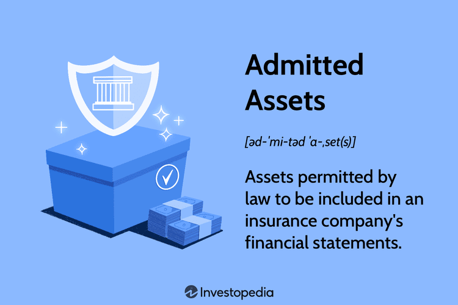

The world of finance and insurance operates within a multifaceted landscape characterized by a convergence of various disciplines. This intricate ecosystem seeks to achieve stability, drive profitability, and ensure compliance with evolving regulatory frameworks. A pivotal component in this domain is insurance accounting, a specialized area of accounting that extends beyond the scope of traditional Generally Accepted Accounting Principles (GAAP). Insurance accounting specifically addresses the unique requirements of the insurance industry, including the critical processes of asset valuation and the categorization of assets into admitted versus non-admitted.

Asset valuation underpins the financial stability of insurance companies by ensuring that the reported value of assets closely aligns with their fair market value. This process is significant for maintaining accurate and transparent financial records, which stakeholders can rely upon to assess a company's fiscal health. Within this context, admitted assets are essential, as they are recognized on financial statements for their liquidity and ability to cover policyholder claims, thereby ensuring the company's solvency.

In the contemporary financial landscape, algorithmic trading emerges as a transformative force in asset management. Algorithmic trading employs automated, rules-based computer systems to execute trades at speeds and volumes beyond human capability. By integrating algorithmic trading strategies, companies can optimize their asset management processes, enhancing trading efficiency, reducing transaction costs, and improving the precision of asset valuation through data-driven insights.

This article examines these intertwined domains, elucidating the foundational principles and sophisticated methodologies that underpin them. It further considers their broader implications for investors and corporations, highlighting the critical need for comprehensive and adaptive strategies in navigating the ever-evolving world of finance and insurance.

## Table of Contents

## Insurance Accounting and Asset Valuation

Insurance accounting is rooted in statutory accounting principles, which differ from Generally Accepted Accounting Principles (GAAP) used in other industries. These principles prioritize the regulatory requirements set forth by insurance commissioners, focusing primarily on solvency and the ability to meet policyholder obligations. This particular focus necessitates a distinct approach to asset valuation—an elemental process in evaluating a company's financial robustness.

Asset valuation in insurance accounting demands a precise determination of the fair market value of assets. This valuation plays a crucial role in reflecting a company’s financial health. The process involves assessing assets to ensure that they are valued accurately and are capable of liquidation to meet policyholder claims. A critical component within this valuation process is the distinction and evaluation of admitted assets. These assets are considered liquid and readily convertible to cash, which is imperative for an insurance company's operational soundness and its ability to fulfill its obligations promptly. The statutory accounting framework prescribes that only these liquid and marketable assets are admitted for financial reporting purposes to ensure that insurance firms maintain an adequate level of solvency.

Admitted assets are typically evaluated with a higher level of scrutiny as they are directly linked to the insurer's capacity to settle claims, a core operational function of any insurance entity. Non-admitted assets, conversely, are not readily convertible to cash due to either marketability issues or regulatory constraints, and thus, are excluded from statutory financial statements. This differentiation is particularly vital as it focuses on the insurer's [liquidity](/wiki/liquidity-risk-premium), ensuring there are sufficient liquid resources to cover liabilities, a key [factor](/wiki/factor-investing) in remaining solvent and continuing operations without disruption.

Statutory accounting requires that insurers perform regular and meticulous evaluations of their admitted assets to ensure this liquidity is maintained. These evaluations can use various valuation methods, such as the market approach or the income approach, ensuring that assets reflect their true economic value and alignment with statutory guidelines. Proper asset valuation underpins the financial strategy of insurers, enabling them to manage risk effectively and maintain compliance with regulatory requirements.

Overall, insurance accounting’s focus on statutory accounting and asset valuation highlights its unique nature, distinct from traditional accounting. It underscores the importance of asset liquidity and the prudent management of financial resources to ensure the ongoing solvency and operational continuity of insurance companies.

## Understanding Admitted vs. Non-Admitted Assets

Admitted assets are essential components within an insurance company’s financial statements. These assets are accepted by state regulators in determining the company’s solvency and financial health. They primarily consist of liquid assets or those that can be easily converted to cash to meet immediate obligations. Common examples of admitted assets include cash, bonds, stocks, and certain types of real estate and receivables. The key criterion is their ability to be converted into cash within a short time frame, typically within a year.

Non-admitted assets, on the other hand, possess economic value but do not meet the stringent criteria set by regulators for inclusion in statutory financial statements. These may include office furniture, equipment, certain types of real estate, intangible assets like goodwill, and overdue receivables. The lack of liquidity or the uncertainty surrounding their valuation leads to their exclusion from the admitted category. Despite their exclusion, non-admitted assets can be significant in value and are often reported in corporate balance sheets under GAAP accounting standards, albeit with appropriate notes.

The distinction between admitted and non-admitted assets carries significant implications for regulatory compliance and financial analysis. Regulators require clear distinctions to evaluate an insurer's financial solvency accurately. Insurers must maintain a minimum level of admitted assets to ensure they can cover policyholder claims, thus safeguarding policyholders against potential insolvency. This is particularly important in maintaining the trust and stability of the financial system.

For financial analysts and investors, understanding this distinction aids in assessing the insurer's liquidity position and risk profile. While admitted assets reflect the immediate liquidity and operational capacity of a company, non-admitted assets might represent potential future value or strategic advantages, despite their immediate liquidity limitations. Thus, a comprehensive analysis of both asset types is crucial for forming a holistic view of a company’s financial health.

## Algorithmic Trading in Asset Management

Algorithmic trading, often referred to as algo trading, employs computer systems to execute trade orders automatically according to a defined set of instructions or algorithms. These algorithms can vary in complexity, ranging from simple moving average crossovers to complex [machine learning](/wiki/machine-learning) models. The primary advantage of [algorithmic trading](/wiki/algorithmic-trading) lies in its ability to enhance trading efficiency. By automating the decision-making process, trades can be executed at speeds significantly faster than human traders, allowing for the exploitation of market conditions in real-time.

Moreover, algorithmic trading plays a pivotal role in reducing transaction costs. Automated systems are designed to optimize the timing and size of orders, minimizing market impact and taking advantage of optimal market positions. This cost efficiency is crucial in high-frequency trading, where the [volume](/wiki/volume-trading-strategy) of trades necessitates stringent cost control to maintain profitability.

The capacity of algorithmic trading systems to process vast volumes of data is another significant advantage. In asset management, evaluating vast datasets for predicting asset prices and trends is essential. Algorithms can filter and analyze this data much faster than traditional manual methods, leading to more accurate and timely asset valuations. For instance, sentiment analysis of news articles or social media can be incorporated into trading strategies to predict market movements.

Incorporating algorithmic trading into asset management strategies allows companies to optimize their portfolios. By systematically evaluating risk and return characteristics of various securities, algorithms can construct and continuously adjust portfolios to achieve the desired risk-return profile. Additionally, these systems can deploy dynamic hedging strategies to mitigate risks associated with volatile markets.

Overall, the integration of algorithmic trading into asset management processes revolutionizes the way investment decisions are made, facilitating a more efficient, dynamic, and data-driven approach to managing assets. As technological advancements continue to evolve, the role of algorithmic trading in finance is expected to expand further, enabling more sophisticated and effective asset management strategies.

## Challenges in Asset Valuation and Algo Trading

Asset valuation is an intricate process that is essential for determining the fair market value of assets, yet it is fraught with challenges. One major issue is market [volatility](/wiki/volatility-trading-strategies), which can lead to significant fluctuations in asset prices and consequently impact their valuation. Valuers must account for these fluctuations to provide accurate and reliable financial statements. Furthermore, subjectivity in valuation methods can lead to inconsistent outcomes, as different experts may apply various techniques and assumptions. This subjectivity can undermine the reliability of financial reporting, particularly when dealing with complex assets.

Valuing illiquid assets adds another layer of complexity. Illiquid assets, such as real estate or privately held businesses, do not have a readily available market price, making them difficult to assess. Traditional valuation methods may not be adequate, requiring alternative approaches like discounted cash flow models or comparable company analysis, which themselves rely on assumptions that can introduce uncertainty.

Algorithmic trading also presents significant challenges. It depends heavily on the availability of robust and high-quality data, which are necessary to develop and test the trading algorithms. Poor data quality can lead to incorrect trading signals and substantial financial losses. Additionally, algorithmic trading requires advanced technological infrastructure to process large volumes of data in real-time. This infrastructure needs to be secure and maintain data integrity to prevent unauthorized access and potential manipulation, which can have deleterious effects on both market participants and the financial system at large.

Balancing these challenges with the potential benefits of asset valuation and algorithmic trading necessitates strategic management and innovation. Investment in cutting-edge technology is crucial to handle the complexities of data management and algorithm deployment. Companies must develop comprehensive strategies to strengthen their valuation methods and safeguard against the inherent risks of algorithmic trading. This includes adopting robust risk management frameworks and continually updating systems to keep pace with technological advancements and regulatory requirements. Through such measures, organizations can enhance their financial strategies, optimize asset management, and improve overall market resilience.

## Conclusion

The intersection of insurance accounting, asset valuation, and algorithmic trading represents a dynamic convergence that offers both challenges and opportunities for financial entities. Embracing robust methodologies and advancing technological tools is essential for companies aiming to refine their financial strategies. Insurance accounting, with its focus on statutory practices, plays a crucial role in maintaining solvency through precise asset valuation. This requires a detailed understanding of admitted assets, given their liquidity and ability to settle claims, which is fundamental to achieving regulatory compliance.

Concurrently, algorithmic trading introduces an advanced dimension to asset management by enabling the execution of trades via automated systems. These systems apply predefined rules to optimize trading efficiency, mitigate transaction costs, and enhance the firm's ability to process expansive datasets for improved asset valuation. Such technological integration not only strengthens portfolio management but also equips firms with the capabilities to hedge against market volatility and other financial risks.

However, the integration of these domains is not without its challenges. Asset valuation is susceptible to market fluctuations, subjective methodologies, and the complexity of assessing illiquid assets. In the case of algorithmic trading, ensuring robust data integrity and secure technological infrastructure are critical hurdles. The successful balancing of these challenges with the potential benefits requires strategic management and substantial investment in contemporary technology.

As regulatory landscapes and market conditions evolve, companies must remain agile, adapting to changes to ensure accurate asset valuations and effective risk management. This adaptability is crucial not only for maintaining competitive advantage but also for achieving long-term financial stability. Such efforts will be instrumental in harnessing the full potential of the intersection between insurance accounting, asset valuation, and algorithmic trading, fostering innovation and resilience in financial operations.

## References & Further Reading

[1]: "Accounting for Investments, Volume 1: Equities, Futures and Options" by R. Venkata Subramani - This book covers valuation and accounting principles applicable in finance and insurance.

[2]: "Financial Accounting for Insurance Companies" by Irvin N. Gleim - A comprehensive guide to the accounting practices in the insurance industry, including asset valuation.

[3]: "Algorithmic Trading: Winning Strategies and Their Rationale" by Ernie Chan - Discusses algorithmic trading strategies which are relevant to asset management.

[4]: "Insurance Industry: Principles, Practices, and Regulation" by Michael Lustig - A detailed look into the regulatory framework and practices, including asset categorization.

[5]: Lopez de Prado, M. (2018). "Advances in Financial Machine Learning." Wiley - Offers insights into how machine learning can be integrated into trading strategies for better asset management.