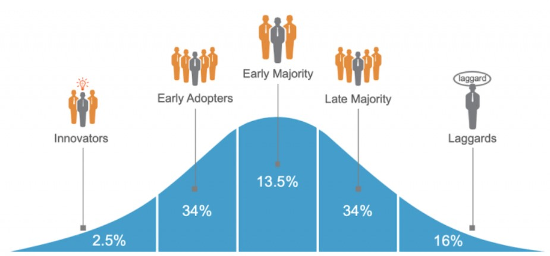

## Table of Contents

## What are adopter categories?

Adopter categories are groups of people based on how quickly they start using new products or ideas. There are five main categories: innovators, early adopters, early majority, late majority, and laggards. Innovators are the first to try new things. They like taking risks and are often seen as leaders in trying new technologies. Early adopters come next. They are also quick to use new products but are more careful than innovators. They help spread the word about new ideas.

The early majority waits a bit longer before trying new things. They need to see that the product works well before they use it. They are important because they make up a large part of the market. The late majority is even slower. They are cautious and only adopt new ideas after they are very common and proven. Laggards are the last to change. They stick to old ways and are very resistant to new ideas. Understanding these categories helps businesses know how to market their products to different groups of people.

## Why are adopter categories important in marketing?

Adopter categories are important in marketing because they help businesses understand how different groups of people will react to new products or ideas. By knowing which category their target customers fall into, companies can create better marketing plans. For example, if a company is selling a brand-new technology, they would focus on innovators and early adopters first. These people are excited about new things and will help spread the word to others.

Understanding adopter categories also helps businesses know how to talk to different groups. Innovators and early adopters might like detailed information about how the product works. The early majority, on the other hand, might need to see reviews and testimonials from others before they decide to buy. The late majority and laggards need even more convincing. They want to see that the product is widely accepted and has been around for a while. By tailoring their marketing messages to these different groups, companies can reach more people and sell more products.

## Who developed the concept of adopter categories?

The concept of adopter categories was developed by Everett Rogers. He was a sociologist who studied how new ideas and technologies spread through societies. Rogers introduced this idea in his book called "Diffusion of Innovations," which was first published in 1962. In his book, he explained that people adopt new things at different speeds and can be grouped into categories based on how quickly they start using them.

Rogers' work has been very important for many fields, including marketing, public health, and technology. His adopter categories help businesses and researchers understand why some people are quick to try new things while others take much longer. By knowing these categories, companies can create better plans to introduce new products and make sure they reach all kinds of customers.

## Can you list the different types of adopter categories?

Adopter categories are groups of people that show how fast they start using new things. There are five main groups: innovators, early adopters, early majority, late majority, and laggards. Innovators are the first to try new products. They love taking risks and are often the leaders in using new technology. Early adopters come right after. They are also quick to use new things but are a bit more careful than innovators. They help spread the word about new ideas to others.

The early majority waits longer before trying new products. They need to see that the product works well before they use it. This group is important because they make up a big part of the market. The late majority is even slower. They are very cautious and only start using new ideas after they are very common and proven to work. Laggards are the last to change. They stick to old ways and are very resistant to new ideas. They only adopt new things when they have to.

Understanding these categories helps businesses know how to market their products to different groups of people. For example, a company selling a new technology would focus on innovators and early adopters first. They are excited about new things and will help spread the word. The early majority, on the other hand, might need to see reviews and testimonials before they decide to buy. The late majority and laggards need even more convincing. They want to see that the product is widely accepted and has been around for a while. By knowing these groups, companies can reach more people and sell more products.

## What characteristics define an innovator in adopter categories?

Innovators are the first people to try new things. They love taking risks and are excited about new ideas and technologies. They are often seen as leaders because they are quick to use new products before anyone else. Innovators are not afraid to try something that might not work, and they like being at the front of new trends.

Innovators also have a big impact on how new ideas spread. They are the ones who start the buzz about a new product. Because they are willing to try new things, they help show other people that the product is worth checking out. Innovators are important because they help move new ideas from just being new to being accepted by more people.

## How do early adopters differ from early majority in terms of behavior?

Early adopters are quick to try new things, but they are a bit more careful than innovators. They like to see that a new product works well before they use it, but they are still faster than most people. Early adopters are important because they help spread the word about new ideas. They are not as risky as innovators, but they are excited about new products and like to be seen as leaders in trying new things.

The early majority, on the other hand, waits even longer before trying new products. They need to see a lot of proof that the product is good before they decide to use it. They are more cautious and want to make sure that many other people have tried the product first. The early majority is a big group, so they are very important for making new products popular. They are not as excited about new things as early adopters, but they will try new products once they see that they work well.

## What role does the late majority play in the diffusion of innovations?

The late majority plays an important role in the diffusion of innovations by adopting new products or ideas after they have become well-established. This group is more cautious than the early majority and waits until many others have tried the product first. They need to see a lot of proof that the new thing is good and works well before they decide to use it. Because they are a large group, the late majority helps to make the new product or idea very common in society.

Once the late majority starts using a new product, it shows that the innovation has been widely accepted. Their adoption is often the tipping point that makes the product a standard part of everyday life. By the time the late majority gets on board, the product has been tested and proven by many others. This group's acceptance is crucial for the complete spread of the innovation throughout the entire market.

## How can businesses target laggards effectively?

Laggards are the last group to try new things. They stick to old ways and are very slow to change. To target laggards effectively, businesses need to focus on showing that the new product is safe and has been around for a long time. Laggards need to see that everyone else is using the product and that it works well. They don't like taking risks, so businesses should use simple, clear messages that explain how the product is reliable and proven.

Businesses can also use word-of-mouth from friends and family to reach laggards. Since laggards trust people they know, hearing from someone they trust can help convince them to try the new product. It's also important to offer support and help to laggards. They might need more guidance on how to use the product, so businesses should provide good customer service and easy instructions. By being patient and showing that the product is a safe choice, businesses can slowly win over laggards.

## What are some strategies to engage each adopter category?

To engage innovators, businesses should focus on showing off new and exciting features of their products. Innovators love to be the first to try new things, so businesses should reach out to them early with special previews or beta testing opportunities. They also like to be seen as leaders, so giving them a way to share their experiences with others can help spread the word. Using social media and tech-focused events can be a good way to reach innovators.

Early adopters need to see that the product works well, but they are still quick to try new things. Businesses can engage them by offering detailed information about how the product works and its benefits. Early adopters like to feel special, so giving them early access or exclusive deals can help. They also like to share their experiences, so encouraging them to leave reviews and share on social media can help spread the word to the early majority.

The early majority needs a lot of proof that the product is good before they try it. Businesses should focus on showing them testimonials and reviews from other users. They also like to see that the product is easy to use and fits into their daily life. Offering good customer service and easy-to-understand instructions can help win them over. The late majority is even more cautious, so businesses need to show that the product is very common and trusted by many people. Using simple, clear messages and word-of-mouth from friends and family can help reach this group. Laggards are the last to change, so businesses need to be patient and show that the product is safe and has been around for a long time. Providing good support and help can slowly win them over.

## How do adopter categories influence the product life cycle?

Adopter categories play a big role in the product life cycle. The product life cycle has four stages: introduction, growth, maturity, and decline. In the introduction stage, businesses focus on innovators and early adopters. These people are excited about new things and help spread the word to others. They help the product start to grow. As more people start using the product, it moves into the growth stage. This is when the early majority starts to adopt the product. They need to see that the product works well and is popular before they try it. Their adoption helps the product become more common and reach more people.

As the product moves into the maturity stage, the late majority starts to use it. They are very cautious and only try new things after they see that many others have used it successfully. Their adoption helps the product reach almost everyone in the market. Finally, in the decline stage, even laggards might start to use the product. Laggards are the last to change and stick to old ways. By the time they start using the product, it might already be getting replaced by something new. Understanding these categories helps businesses know how to market their products at different stages of the life cycle and keep them popular for as long as possible.

## Can you explain how adopter categories impact market segmentation?

Adopter categories help businesses understand how to split up their market into different groups. Each group, or segment, likes to try new things at different times. Innovators and early adopters are quick to try new products, so businesses can target them first with special previews or new features. The early majority waits a bit longer and needs to see that the product works well before they try it. They are a big group, so businesses need to show them lots of proof and good reviews. 

The late majority and laggards come even later. The late majority needs to see that the product is very common before they try it. They are cautious and want to make sure it's safe. Laggards are the last to change and stick to old ways. They need a lot of convincing and help to try new things. By knowing these different groups, businesses can make special plans for each one. They can use different messages and ways to reach each group, helping them sell more products to everyone in the market.

## What are the criticisms or limitations of using adopter categories in marketing strategies?

Using adopter categories in marketing can be helpful, but it has some problems. One big issue is that people are not always easy to put into just one group. Someone might act like an innovator for one product but a laggard for another. This makes it hard for businesses to know exactly how to reach them. Also, the idea of adopter categories can be too simple. It doesn't think about other things that might affect how people try new things, like their age, money, or where they live.

Another problem is that adopter categories don't always work the same in every market. What works in one country might not work in another. For example, people in different places might have different ideas about what is new or exciting. Also, the world is changing fast with technology, and how people try new things can change too. What was true about adopter categories 20 years ago might not be true today. So, businesses need to be careful and not rely too much on these categories without thinking about other things too.

## References & Further Reading

[1]: Rogers, E. M. (2003). ["Diffusion of Innovations"](https://archive.org/details/diffusionofinnov00roge_0) (5th ed.). Free Press.

[2]: Johnson, N. F., et al. (2013). ["Abrupt rise of new machine ecology beyond human response time."](https://www.nature.com/articles/srep02627) Scientific Reports, 3, 2627.

[3]: EU Commission (2014). ["Directive 2014/65/EU of the European Parliament and of the Council"](https://eur-lex.europa.eu/eli/dir/2014/65/oj/eng) (MiFID II).

[4]: ["Advances in Financial Machine Learning"](https://www.amazon.com/Advances-Financial-Machine-Learning-Marcos/dp/1119482089) by Marcos Lopez de Prado

[5]: ["Quantitative Trading: How to Build Your Own Algorithmic Trading Business"](https://www.amazon.com/Quantitative-Trading-Build-Algorithmic-Business/dp/1119800064) by Ernest P. Chan