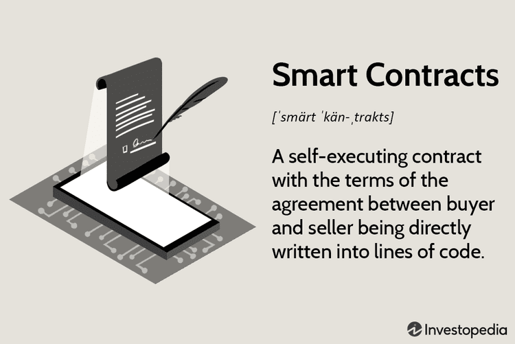

## Table of Contents

## What is blockchain technology and how does it work?

Blockchain technology is like a digital notebook that keeps a record of transactions or information in a way that's very hard to change or cheat. Imagine a chain of blocks, where each block contains a list of transactions. Once a block is filled with transactions, it gets added to the chain and locked in place. Every new block added to the chain contains a reference to the previous block, creating a secure and unchangeable record. This technology is used in cryptocurrencies like Bitcoin, but it can also be used for other things like tracking goods in a supply chain or managing health records.

The way blockchain works is through a network of computers, called nodes, that all keep a copy of the blockchain. When someone wants to add a new transaction, it gets sent to the network, where it's checked and verified by these nodes. If most of the nodes agree that the transaction is valid, it gets added to a new block. To make sure no one can change the information, the blocks use something called cryptography, which is like a special code that locks the data in place. This makes the blockchain very secure because if someone tries to change a block, they would have to change all the blocks that come after it, which is nearly impossible with so many computers watching over the chain.

## How can blockchain technology be applied in the health care industry?

Blockchain technology can be used in health care to keep patient records safe and easy to share. Imagine you go to different doctors or hospitals. With blockchain, all your health information can be stored in one secure place that only you and your doctors can access. This means if you switch doctors or need to go to the emergency room, your new doctor can quickly see your past medical history without waiting for paperwork. It's like having a digital health diary that's always up to date and protected from being changed or hacked.

Another way blockchain can help in health care is by tracking medicines from the factory to the pharmacy. This can make sure that the drugs you get are real and not fake. It's like following a medicine's journey with a digital stamp at each step. If there's a problem with a batch of medicine, it's easier to find out where it came from and stop it from reaching patients. This can keep people safer and save time and money by making the whole process smoother and more transparent.

## What are the potential benefits of using blockchain in health care?

Using blockchain in health care can make things easier and safer for patients. It can keep all your health information in one safe spot that only you and your doctors can see. This means if you go to a new doctor or need emergency care, they can quickly look at your past health records. It's like having a digital health diary that's always up to date and hard to mess with. This can save time and help doctors make better decisions about your care because they have all the information they need right away.

Another big benefit is that blockchain can help make sure the medicines you get are real and not fake. It can track medicines from the factory all the way to the pharmacy. This way, if there's a problem with a batch of medicine, it's easier to find out where it came from and stop it from reaching patients. This can keep people safer and save time and money by making the whole process smoother and easier to check.

## What challenges might arise when implementing blockchain in health care systems?

One big challenge of using blockchain in health care is keeping patient information private. Even though blockchain is very secure, there's still a risk that someone could get into the system and see private health details. It's like trying to keep your diary safe in a digital world where hackers are always trying to break in. Another challenge is that different health care systems might not be able to work together easily. If hospitals and clinics use different blockchain systems, it can be hard to share patient information quickly and safely. It's like trying to connect different puzzles that don't quite fit together.

Also, setting up and running a blockchain system can be expensive and complicated. It takes a lot of computer power to keep the blockchain running smoothly, and that can cost a lot of money. It's like trying to keep a big, fancy computer system going all the time. Plus, people who work in health care need to learn how to use the new system, which can take time and training. If they don't understand how to use it properly, it might not work as well as it should.

## Can you provide examples of current blockchain applications in health care?

One example of blockchain in health care is MedRec, a project that helps keep patient records safe and easy to share. MedRec uses blockchain to create a secure way for doctors and patients to access health information. It's like a digital health diary that's hard for anyone else to see or change. This can be really helpful if you move to a new city or need to see a specialist who needs to know your past medical history quickly.

Another example is the use of blockchain to track medicines from the factory to the pharmacy. A company called Chronicled uses blockchain to make sure that the medicines you get are real and not fake. It's like putting a digital stamp on each step of the medicine's journey. This way, if there's a problem with a batch of medicine, it's easier to find out where it came from and stop it from reaching patients. This can help keep people safer and make the whole process of getting medicine smoother and more transparent.

## How does blockchain enhance data security and privacy in health care?

Blockchain makes health care data more secure by using special codes called cryptography. This means that once information is put into the blockchain, it's very hard for anyone to change or steal it. It's like locking your health diary with a super strong lock that only you and your doctors can open. Because the data is spread across many computers, if someone tries to hack into one computer, they can't change the whole record. This makes it much safer than keeping all the information in one place.

Blockchain also helps keep your health information private. Only people who are supposed to see your records, like you and your doctors, can access them. It's like having a secret club where only members can read the club's diary. If someone else tries to peek, the blockchain system stops them. This way, your personal health details stay private and safe, which is really important in health care where privacy matters a lot.

## What is the role of smart contracts in health care blockchain solutions?

Smart contracts are like digital agreements that automatically do what they're supposed to do when certain things happen. In health care, they can make things easier and faster. For example, when a doctor sends a patient's records to another hospital, a smart contract can make sure the records get there safely and that only the right people can see them. It's like having a digital helper that follows the rules without needing someone to watch over it all the time.

These smart contracts can also help with things like insurance claims or paying for medical services. When a patient gets treatment, the smart contract can check if everything is okay and then automatically send the payment to the doctor or hospital. This can save time and reduce mistakes because everything is done by the computer following the rules set in the contract. It's like having a trustworthy friend who always does what they promise, making the whole process smoother and more reliable.

## How can blockchain improve the efficiency of health care supply chains?

Blockchain can make health care supply chains work better by keeping a clear record of where things are and where they're going. Imagine you need to track medicine from the factory to the hospital. With blockchain, each step of the journey gets a digital stamp, so you can see exactly where the medicine has been and if it's real or fake. This can help stop problems before they start and make sure patients get the right medicine quickly.

Using blockchain also means less time spent on paperwork and checking things. If there's a problem with a batch of medicine, it's easier to find out where it came from and fix it fast. This can save a lot of time and money, and it makes the whole process of getting medicine to patients smoother and more reliable. It's like having a clear map that everyone can follow, making the supply chain work better for everyone involved.

## What are the regulatory and compliance considerations for blockchain in health care?

When using blockchain in health care, there are important rules and laws to follow. One big rule is about keeping patient information private. In many countries, there are laws like HIPAA in the United States that say health care providers must keep patient data safe and only share it with people who need to see it. Blockchain needs to be set up in a way that follows these rules, making sure that only the right people can access patient records and that the data is protected from being hacked or changed.

Another thing to think about is how blockchain fits with other health care rules. For example, if a medicine needs to be tracked from the factory to the pharmacy, there might be rules about how that tracking is done and who can see the information. Blockchain systems need to be able to follow these rules, which can be tricky because the technology is new and the rules might not be clear yet. Health care providers and companies working with blockchain need to work with lawmakers to make sure the technology is used in a way that follows all the necessary laws and keeps patients safe.

## How can blockchain facilitate interoperability among different health care systems?

Blockchain can help different health care systems talk to each other by creating a shared way to store and share information. Imagine if every hospital and clinic had its own way of keeping records, like different languages. Blockchain acts like a universal translator, allowing all these systems to understand and use the same information. By using blockchain, a patient's records can be easily moved from one place to another, making sure that doctors everywhere have the latest information they need to take care of you.

This shared system also makes it easier for doctors to work together. If a patient needs to see a specialist in another city, the specialist can quickly look at the patient's records on the blockchain without waiting for paperwork or dealing with different computer systems. This can save time and help doctors make better decisions because they have all the information they need right away. It's like having a big, secure notebook that everyone can read from, making health care smoother and more connected.

## What are the future trends and potential developments of blockchain in health care?

In the future, blockchain in health care is expected to grow a lot. One big trend could be using blockchain to make sure medicines are safe and real from the factory to the pharmacy. This can help stop fake medicines from reaching patients and make the whole process faster and easier to check. Another trend might be using blockchain to keep patient records even safer and easier to share. This means if you move or need to see a new doctor, they can quickly see your health history without waiting for paperwork. It's like having a digital health diary that's always up to date and hard to mess with.

Another potential development is the use of smart contracts in health care. Smart contracts are like digital agreements that automatically do what they're supposed to do when certain things happen. For example, they could help with insurance claims or paying for medical services without needing someone to watch over everything. This can save time and reduce mistakes because everything is done by the computer following the rules set in the contract. As more people learn about blockchain and how it can help, we might see even more ways it can be used to make health care better and safer for everyone.

## How can health care organizations begin the process of adopting blockchain technology?

Health care organizations can start adopting blockchain technology by first learning about it. They should look at how blockchain works and how it can help with things like keeping patient records safe and tracking medicines. It's a good idea to talk to experts who know about blockchain and health care. They can help explain how to use it and what rules need to be followed. Once they understand more, the organization can start small, maybe by using blockchain for one part of their work, like tracking supplies, to see how it goes.

After trying it out on a small scale, the organization can think about using blockchain for bigger things, like sharing patient records between different hospitals. This might need more planning and working with other health care groups to make sure everyone can use the same system. It's important to keep talking to patients and staff to make sure they understand and feel good about using blockchain. By taking it step by step, health care organizations can slowly bring in blockchain technology and make health care better and safer for everyone.

## References & Further Reading

[1]: Tapscott, D., & Tapscott, A. (2018). ["Blockchain Revolution: How the Technology Behind Bitcoin and Other Cryptocurrencies is Changing the World"](https://www.tandfonline.com/doi/full/10.1080/10686967.2018.1404373). Portfolio.

[2]: Nakamoto, S. (2008). ["Bitcoin: A Peer-to-Peer Electronic Cash System."](https://nakamotoinstitute.org/library/bitcoin/)

[3]: Azaria, A., Ekblaw, A., Vieira, T., & Lippman, A. (2016). ["MedRec: Using Blockchain for Medical Data Access and Permission Management."](https://ieeexplore.ieee.org/document/7573685) 2016 2nd International Conference on Open and Big Data (OBD).

[4]: Kuo, T.-T., Kim, H.-E., & Ohno-Machado, L. (2017). ["Blockchain Distributed Ledger Technologies for Biomedical and Health Care Applications."](https://pubmed.ncbi.nlm.nih.gov/29016974/) Journal of the American Medical Informatics Association, 24(6), 1211–1220.

[5]: Ristevski, B., & Chen, M. (2018). ["Big Data Analytics in Medicine and Healthcare."](https://pubmed.ncbi.nlm.nih.gov/29746254/) Journal of Big Data, 5, Article 1.

[6]: Yu, S., Yang, H., & Ko, P. (2020). ["Algorithmic Trading and Healthcare: How the Financial Sector Techniques Are Being Used in Medicine"](https://pubmed.ncbi.nlm.nih.gov/32955177/)

[7]: Zheng, Z., Xie, S., Dai, H., Chen, X., & Wang, H. (2018). ["An Overview of Blockchain Technology: Architecture, Consensus, and Future Trends."](https://ieeexplore.ieee.org/document/8029379) 2017 IEEE International Congress on Big Data (BigData Congress).