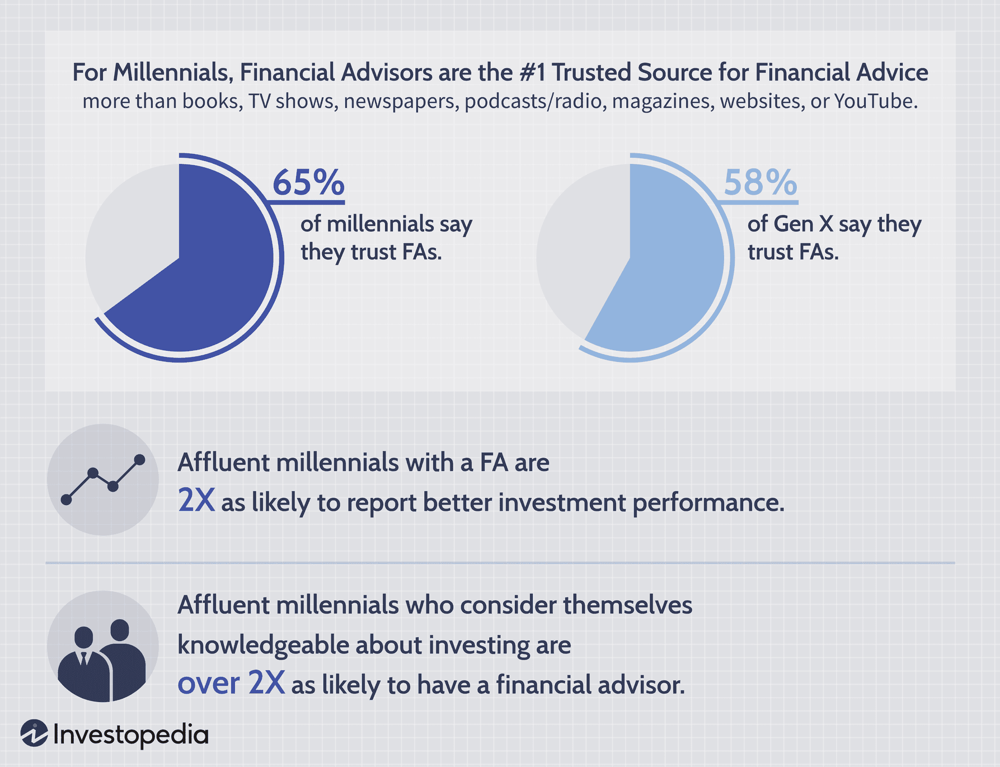

## Table of Contents

## What are robo-advisors and how do they work?

Robo-advisors are digital platforms that provide automated financial planning and investment management services with minimal human intervention. They use computer algorithms to analyze your financial situation and goals, then create and manage a diversified investment portfolio for you. This makes investing easier and more accessible, especially for people who might not have a lot of money to invest or who don't want to spend time researching investments.

When you sign up with a robo-advisor, you'll usually start by answering some questions about your income, expenses, financial goals, and how much risk you're comfortable taking with your investments. Based on your answers, the robo-advisor will suggest a portfolio made up of various investments like stocks, bonds, and ETFs (exchange-traded funds). The robo-advisor will then automatically manage your portfolio, making adjustments as needed to keep it aligned with your goals and risk tolerance. This can include rebalancing your investments or changing your asset allocation over time.

## Who are affluent millennials and what are their financial goals?

Affluent millennials are young adults born between the early 1980s and the mid-1990s who have a higher income or more wealth than average. They might have good jobs, own businesses, or have inherited money. These millennials often have more money to spend and invest than their peers, but they also face unique challenges and opportunities when it comes to managing their finances.

The financial goals of affluent millennials can vary, but many focus on achieving a good balance between enjoying their money now and saving for the future. They often want to buy a home, pay off student loans, or start a family. At the same time, they're interested in investing for retirement, building wealth, and maybe even leaving a legacy. They value experiences and often seek out financial advice to help them make the most of their money while still living a fulfilling life.

## Why might affluent millennials be interested in robo-advisors?

Affluent millennials might be interested in robo-advisors because they want an easy way to manage their money. Robo-advisors use computers to make investing simple. They ask you some questions about your money and goals, then they build a plan for you. This saves time because you don't have to pick your own investments or keep track of them all the time. It's like having a helper that does the work for you.

Also, robo-advisors are often cheaper than hiring a human financial advisor. Affluent millennials might have a lot of money, but they still want to save on fees. Robo-advisors charge lower fees because they use technology instead of people. This means more of the money can stay in the millennial's pocket. Plus, they can start investing with less money than they might need for a traditional advisor, which is good for young people who are just starting out.

## What are the benefits of using robo-advisors for investment management?

Using robo-advisors for investment management can save you time and money. They use computers to do the work for you, so you don't have to spend hours [picking](/wiki/asset-class-picking) and watching your investments. This is good for busy people who don't want to spend a lot of time on their money. Robo-advisors also charge lower fees than human advisors because they use technology instead of people. This means you can keep more of your money instead of paying big fees.

Another benefit is that robo-advisors make it easy to start investing, even if you don't have a lot of money. They can help you build a plan that fits your goals and how much risk you want to take. They will keep your investments balanced and make changes as needed without you having to do anything. This can help you feel more confident about your money because you know someone, or in this case, something, is watching over it.

## How do robo-advisors compare to traditional financial advisors in terms of cost and service?

Robo-advisors and traditional financial advisors are different in how much they cost and what they do for you. Robo-advisors are usually a lot cheaper. They charge small fees, often just a part of a percent of the money you have with them. This is because they use computers to do the work, so they don't need as many people. Traditional advisors, on the other hand, can be expensive. They might charge you a percent of the money you have with them, but it's usually more than what robo-advisors charge. They might also charge you for each time they do something for you, like buying or selling investments.

When it comes to service, robo-advisors and traditional advisors also differ. Robo-advisors use computers to make a plan for your money based on what you tell them you want. They keep your investments going without you having to do anything. But, they don't talk to you in person or give you advice about things like buying a house or planning for your kids' future. Traditional advisors, though, can give you personal advice and talk to you about all parts of your money. They can help you with big decisions and make plans that fit your life exactly. But, because they spend a lot of time with you, their service can be more costly.

## What are the potential risks and limitations of using robo-advisors?

Using robo-advisors can have some risks and limits. One big risk is that they use computers to make decisions, and computers can sometimes make mistakes or miss things that a person might see. For example, they might not understand if something big happens in the world that could affect your investments. Also, robo-advisors usually stick to a simple plan and might not change it even if your life changes a lot. This means they might not be the best choice if you need a lot of personal help or if your money situation is very complicated.

Another limit of robo-advisors is that they can't give you advice about all parts of your money. They are good at picking investments, but they can't help you with things like buying a house or planning for your kids' future. If you need a lot of personal advice and someone to talk to about your money, a robo-advisor might not be enough. Plus, even though they are cheaper than human advisors, you still have to pay fees, and those fees can add up over time.

## How has the adoption of robo-advisors among affluent millennials evolved over the past decade?

Over the past decade, the use of robo-advisors among affluent millennials has grown a lot. At first, many young people with money were not sure about using computers to help them invest. But as robo-advisors got better and more people started using them, affluent millennials saw that they could be a good way to manage their money without spending a lot of time or money. They liked that robo-advisors were easy to use and could help them start investing with less money than they might need for a human advisor.

Now, more affluent millennials are using robo-advisors than ever before. They see the value in having a simple, low-cost way to invest and grow their wealth. Many of them use robo-advisors to handle part of their money while still working with human advisors for more complicated parts of their finances. This mix of technology and personal advice helps them feel more in control of their money and confident about their future.

## What specific features do robo-advisors offer that appeal to affluent millennials?

Robo-advisors have some special features that affluent millennials really like. One big thing is that they are easy to use. You just answer some questions about your money and goals, and the robo-advisor makes a plan for you. This saves a lot of time because you don't have to pick your own investments or watch them all the time. Affluent millennials are often busy, so having a simple way to invest is a big help. They also like that robo-advisors let them start investing with less money than they might need for a human advisor. This is good for young people who are just starting out but still want to grow their wealth.

Another feature that appeals to affluent millennials is the low cost. Robo-advisors charge much less than human advisors because they use computers to do the work. This means more of the millennial's money can stay in their pocket instead of going to big fees. They also like that robo-advisors can automatically adjust their investments to keep them on track with their goals. This makes them feel more confident about their money because they know someone, or rather something, is always watching over it.

## How do affluent millennials perceive the trustworthiness and security of robo-advisors?

Affluent millennials often see robo-advisors as trustworthy because they use technology to manage money in a clear and easy-to-understand way. They like that robo-advisors use data and math to make decisions, which feels fair and not based on someone's opinion. Many robo-advisors are also backed by big financial companies, which makes them feel more secure. Plus, they have rules and checks to make sure your money is safe, which helps affluent millennials trust them more.

Even though robo-advisors use computers, affluent millennials still care a lot about security. They want to know their money is safe from hackers and other bad things. Robo-advisors use strong security measures like encryption and two-[factor](/wiki/factor-investing) authentication to keep money safe. This helps affluent millennials feel more comfortable using them. But, some still worry a bit because they know technology can sometimes have problems. So, they might use robo-advisors for part of their money while keeping some with human advisors just to be sure.

## What are the key factors driving the adoption of robo-advisors among affluent millennials?

Affluent millennials are choosing robo-advisors more and more because they are easy to use and save time. These young adults with money often have busy lives and don't want to spend a lot of time picking and watching their investments. Robo-advisors ask a few questions about their money and goals, then build a plan for them. This means they can start investing without needing a lot of money or time, which is great for people just starting out but still want to grow their wealth.

Another big reason affluent millennials like robo-advisors is because they are cheaper than human advisors. Robo-advisors use computers to do the work, so they don't need as many people, which means lower fees. This lets affluent millennials keep more of their money instead of paying big fees. Plus, robo-advisors can automatically adjust their investments to keep them on track with their goals, making them feel more confident about their money.

## How can robo-advisors be tailored to better meet the needs of affluent millennials?

To better meet the needs of affluent millennials, robo-advisors can add more personal touches. This means letting users talk to real people when they need help or have questions. Even though robo-advisors use computers, having someone to talk to can make affluent millennials feel more comfortable and confident about their money. They can also add features that help with other parts of their money, like saving for a house or planning for their kids' future. This way, robo-advisors can be a one-stop shop for all their financial needs, not just investing.

Another way to tailor robo-advisors for affluent millennials is by offering more choices and control over their investments. Many young adults with money want to pick some of their own investments or have more say in how their money is managed. Robo-advisors can let them do this while still keeping the benefits of using computers to help them. They can also give more detailed reports and updates on how their money is doing, which helps affluent millennials feel more in control and understand their investments better.

## What are the future trends and predictions for robo-advisor adoption among affluent millennials?

In the future, more affluent millennials will likely use robo-advisors because they are easy to use and save money. As technology gets better, robo-advisors will become even easier and offer more features. They might even use things like [artificial intelligence](/wiki/ai-artificial-intelligence) to make better decisions about money. Affluent millennials will like this because they can trust the technology to help them grow their wealth without spending a lot of time or money on it.

Also, robo-advisors will start to offer more personal help. They might let users talk to real people when they need advice or have questions. This will make affluent millennials feel more comfortable because they can get the best of both worlds - the low cost and ease of robo-advisors, and the personal touch of human advisors. This mix of technology and personal service will make robo-advisors even more popular among young adults with money.

## References & Further Reading

[1]: ["Advances in Financial Machine Learning"](https://www.amazon.com/Advances-Financial-Machine-Learning-Marcos/dp/1119482089) by Marcos Lopez de Prado

[2]: ["Machine Learning for Algorithmic Trading"](https://www.amazon.com/Machine-Learning-Algorithmic-Trading-alternative/dp/1839217715) by Stefan Jansen

[3]: ["Quantitative Trading: How to Build Your Own Algorithmic Trading Business"](https://www.amazon.com/Quantitative-Trading-Build-Algorithmic-Business/dp/1119800064) by Ernest P. Chan

[4]: Lincoln, M. (2018). ["Robo-Advisors: Investing through Algorithms."](https://papers.ssrn.com/sol3/papers.cfm?abstract_id=3776826) Forbes. 

[5]: Johnsen, J. (2019). ["The Role of Fintech in Digital Transformation"](https://www.sciencedirect.com/science/article/pii/S2666954422000084) Accenture.