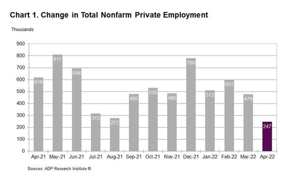

## Table of Contents

## What is the ADP National Employment Report?

The ADP National Employment Report is a monthly report that tells us about job changes in the private sector in the United States. It is made by ADP, a company that helps businesses with payroll and human resources. The report gives us information about how many jobs were added or lost in different industries and company sizes. It helps people understand how the job market is doing without looking at government jobs.

This report comes out a few days before the official government report from the Bureau of Labor Statistics. Many people, like investors and economists, use the ADP report to get an early idea of what the job market might look like. It's not always perfect, but it gives a good hint about employment trends. Because it focuses only on private companies, it can show us how businesses are doing in hiring and firing people.

## Who publishes the ADP National Employment Report?

The ADP National Employment Report is published by ADP, which is a company that helps other businesses with their payroll and human resources. ADP stands for Automatic Data Processing. They use the data they collect from the companies they work with to create this report.

The report comes out every month and gives information about how many jobs were added or lost in the private sector in the United States. It helps people understand the job market before the government's official report is released. Many people, like investors and economists, find it useful to get an early look at employment trends.

## How often is the ADP National Employment Report released?

The ADP National Employment Report comes out every month. It tells us about job changes in the private sector in the United States. The report is made by ADP, a company that helps businesses with payroll and human resources.

It is released a few days before the official government report from the Bureau of Labor Statistics. This gives people, like investors and economists, an early look at how the job market is doing. The report helps them understand trends in hiring and firing in private companies.

## What types of data does the ADP National Employment Report include?

The ADP National Employment Report includes data about how many jobs were added or lost in the private sector in the United States each month. It tells us about changes in employment across different industries like manufacturing, construction, and services. The report also breaks down the job changes by the size of the companies, so we can see if small, medium, or large businesses are hiring more or less.

This report uses information from the companies that ADP works with for payroll and human resources. It focuses only on private companies, so it does not include government jobs. The data helps people understand how the job market is doing and can show trends in hiring and firing. Many people, like investors and economists, use this report to get an early idea of what the official government employment report might say.

## How does the ADP National Employment Report differ from the U.S. Bureau of Labor Statistics report?

The ADP National Employment Report and the U.S. Bureau of Labor Statistics (BLS) report both tell us about job changes in the United States, but they are different in some ways. The ADP report focuses only on private sector jobs, which means it does not include government jobs. It uses data from companies that ADP helps with payroll and human resources. On the other hand, the BLS report includes both private and public sector jobs, and it uses a much larger and more varied set of data sources, like surveys from businesses and households.

Another difference is when these reports come out. The ADP report is released a few days before the BLS report. This means that the ADP report gives people an early look at what the job market might look like. Many investors and economists use the ADP report to make guesses about the BLS report. But, the BLS report is seen as more official and complete because it covers all parts of the economy and uses a wider range of data.

## What is the methodology used to compile the ADP National Employment Report?

The ADP National Employment Report is put together using data from the companies that ADP helps with payroll and human resources. ADP looks at the payroll records of these companies to see how many people were hired or let go each month. This data comes from a large number of businesses across different industries and sizes, which helps make the report more accurate. The report focuses only on private sector jobs, so it does not include any government jobs.

To make sure the report is as accurate as possible, ADP uses a special method called statistical modeling. This method helps them take the data they have and make it represent the whole private sector in the United States. They also work with Moody's Analytics, a company that helps with economic research, to fine-tune their methods and make the report even better. By doing this, ADP can give a good early look at how the job market is doing before the official government report comes out.

## How accurate is the ADP National Employment Report in predicting employment trends?

The ADP National Employment Report is often seen as a good early guess about how the job market is doing, but it is not always perfect. It uses payroll data from the companies ADP works with, which is a big help in understanding private sector jobs. Still, because it only looks at private companies and not government jobs, it can miss some parts of the whole job market. Also, the way ADP picks and uses its data is different from the government's way, so sometimes the numbers can be quite different from the official report.

Over time, the ADP report has gotten better at matching up with the official numbers from the Bureau of Labor Statistics. But, it's important to remember that it's just a prediction and not the final word on employment trends. People like investors and economists use it to get an early look at the job market, but they also wait for the official report to get the full picture. So, while the ADP report is useful, it's best to use it along with other information to understand what's happening with jobs in the United States.

## What are the key indicators to look for in the ADP National Employment Report?

When you look at the ADP National Employment Report, the main thing to watch is the total number of jobs added or lost in the private sector. This number tells you if more people are getting jobs or if more people are losing their jobs. The report breaks this down by different industries, like manufacturing, construction, and services. This helps you see which parts of the economy are doing well and which ones are struggling. It also looks at job changes by the size of the company, so you can see if small, medium, or large businesses are hiring more or less.

Another important thing to check is how the numbers from the ADP report compare to what people were expecting. If the report shows a lot more jobs added than expected, it might mean the economy is doing better than people thought. On the other hand, if it shows fewer jobs added than expected, it could mean the economy is not doing as well. The report comes out a few days before the official government report, so it gives people an early idea of what might be in that report. But remember, it's not always perfect, so it's good to use it along with other information to understand the job market better.

## How can businesses use the data from the ADP National Employment Report for strategic planning?

Businesses can use the data from the ADP National Employment Report to plan better by looking at how many jobs are being added or lost in different industries. If the report shows that a lot of jobs are being added in a certain industry, a business in that industry might decide to hire more people to meet growing demand. On the other hand, if the report shows that jobs are being lost in an industry, a business might think about cutting costs or changing what they do to stay strong. By looking at the report, businesses can also see if small, medium, or large companies are hiring more or less, which can help them decide what size of business they want to be.

The ADP report also helps businesses understand overall economic trends. If the report shows that more jobs are being added than people expected, it might mean the economy is doing well, and businesses might want to expand or invest more. But if the report shows fewer jobs added than expected, businesses might want to be more careful with their money and plan for tougher times. By using the ADP report along with other information, businesses can make smarter decisions about hiring, growing, and staying ready for whatever the future brings.

## What historical trends can be observed from past ADP National Employment Reports?

Over the years, the ADP National Employment Reports have shown us some interesting trends about jobs in the United States. One big trend is how the number of jobs goes up and down with the economy. When the economy is doing well, the reports usually show that more jobs are being added in the private sector. This happened a lot during the late 1990s and the mid-2010s when the economy was growing. But when the economy is not doing so well, like during the 2008 financial crisis or the early days of the COVID-19 pandemic in 2020, the reports show that a lot of jobs are being lost. This helps us see how sensitive the job market is to what's happening in the economy.

Another trend we can see is how different industries do over time. For example, the reports have shown that the service industry, like restaurants and stores, often adds a lot of jobs when the economy is good. But industries like manufacturing and construction can be more up and down, with big changes in the number of jobs. The reports also show us how small, medium, and large businesses are doing. Sometimes, small businesses might be adding a lot of jobs while big businesses are not, or the other way around. By looking at these trends, we can get a better idea of how the job market changes and what might happen next.

## How does the ADP National Employment Report influence financial markets?

The ADP National Employment Report can have a big effect on financial markets because it gives people an early look at how many jobs are being added or lost in the private sector. When the report comes out, investors and traders look at it to see if the economy is doing better or worse than they thought. If the report shows more jobs added than expected, it can make people feel good about the economy. This can lead to stock prices going up because people think companies will make more money if more people are working. On the other hand, if the report shows fewer jobs added than expected, it can make people worried. This can cause stock prices to go down because people might think companies will make less money if fewer people are working.

The report also affects other parts of the financial markets, like bonds and currencies. If the ADP report shows strong job growth, it might make people think that interest rates could go up because the economy is doing well. This can lead to higher bond yields and a stronger U.S. dollar. But if the report shows weak job growth, it might make people think that interest rates will stay low or even go down, which can lead to lower bond yields and a weaker U.S. dollar. So, the ADP report is important because it helps people make guesses about what might happen next in the economy and the financial markets.

## What are the limitations and criticisms of the ADP National Employment Report?

The ADP National Employment Report has some limitations that people talk about. One big problem is that it only looks at private sector jobs, so it misses out on government jobs. This means it doesn't give a full picture of the whole job market. Also, the way ADP picks and uses its data is different from the government's way. This can make the numbers in the ADP report different from the official numbers from the Bureau of Labor Statistics. Sometimes, these differences can be big, which makes people question how accurate the ADP report is.

Another criticism is that the ADP report can be hard to understand because it uses a special method called statistical modeling. This method helps ADP take the data they have and make it represent the whole private sector, but it can also make the report less clear. Some people also say that the ADP report can be too focused on big companies and might not show what's happening with small businesses as well. Even though the report has gotten better over time, it's still important to use it along with other information to get a better idea of what's happening with jobs in the United States.

## What is the Importance of National Employment Data?

National employment data plays a critical role in assessing the economic health of a country. It serves as a key indicator for policymakers, businesses, and investors who rely on this information to make informed economic and financial decisions. Understanding employment figures provides insights into the level of economic activity, the potential for economic growth, and the overall economic well-being of a population.

### Employment Data and Economic Health

Employment data reveals valuable information about the labor market's condition. High employment levels generally indicate a robust economy with healthy spending patterns, while rising unemployment can signal economic distress, prompting potential drops in consumer spending and overall economic slowdown. Monitoring employment trends helps stakeholders gauge the economy's performance and anticipate future economic trends.

### Influence on Monetary Policy

The Federal Reserve, along with other central banks, closely monitors national employment data to make strategic monetary policy decisions. Employment figures, such as the unemployment rate and job creation numbers, are vital inputs for assessing economic conditions and determining appropriate policy actions. When employment data suggests an overheating economy, central banks might consider raising interest rates to prevent inflation. Conversely, high unemployment might lead them to lower interest rates to stimulate economic activity.

For example, the Taylor Rule, a guideline for setting interest rates, incorporates the output gap (the difference between actual and potential economic output) and the difference between actual and target inflation rates. Employment data is crucial in estimating the output gap. The formula for the Taylor Rule is generally expressed as:

$$

i = r^* + \pi + 0.5 (\pi - \pi^*) + 0.5 (y - y^*) 
$$

Where $i$ is the nominal [interest rate](/wiki/interest-rate-trading-strategies), $r^*$ is the real equilibrium interest rate, $\pi$ is the rate of inflation, $\pi^*$ is the target inflation rate, and $y - y^*$ represents the output gap.

### Historical Impact on Market Movements

Historical analysis demonstrates significant impacts of employment figures on market movements. For instance, strong employment reports have often led to bullish stock markets as they suggest corporate profitability and economic strength. Conversely, negative surprises in employment data can lead to bearish market reactions, causing declines in stock prices and heightened [volatility](/wiki/volatility-trading-strategies).

Notable examples include the financial crisis of 2008, when massive job losses influenced the Federal Reserve to implement aggressive monetary easing. On the other hand, during the recovery period post-2009, improving employment figures played a role in policy normalization, affecting bond yields and equity valuations.

In conclusion, national employment data is not just a snapshot of current labor market conditions but a foundational element for evaluating economic vitality and shaping monetary policy. Its influence on financial markets underscores the importance of understanding employment dynamics for investors and policymakers alike. These insights guide decisions that impact both short-term market reactions and long-term economic strategies.

## References & Further Reading

[1]: Zeng, M., & Luo, H. (2013). ["Algorithmic Trading Using Data Mining and Neural Networks."](https://scholar.google.com/citations?user=3tIOE2IAAAAJ&hl=en) International Journal of Computer Applications & Information Technology.

[2]: Decker, F., & Sackmann, S. (2018). ["Applications of Machine Learning in Algorithmic Trading."](https://journals.sagepub.com/doi/full/10.1177/2053951720926558) In: Machine Learning for Asset Managers. Springer.

[3]: ADP Research Institute & Moody's Analytics. ["ADP National Employment Report."](https://mediacenter.adp.com/2021-11-03-ADP-National-Employment-Report-Private-Sector-Employment-Increased-by-571,000-Jobs-in-October)

[4]: Phillips, K. R. (2009). ["The ADP National Employment Report: A New Analysis of Private Employment."](https://adpemploymentreport.com/) Federal Reserve Bank of Dallas Economic Policy Review.

[5]: John, G. (2018). ["Fundamental Analysis and Algorithmic Trading."](https://www.investopedia.com/articles/active-trading/101014/basics-algorithmic-trading-concepts-and-examples.asp) Wiley Trading Series.