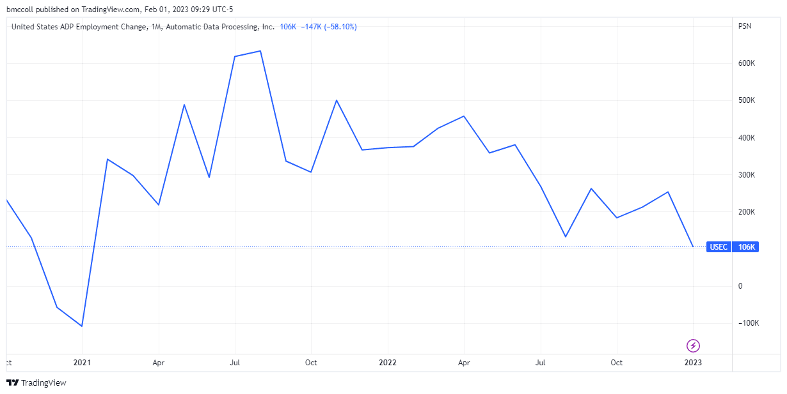

Employment data plays a crucial role in economic analysis and decision-making. It offers insights into the health and trajectory of an economy by detailing job growth, unemployment rates, and wage trends. Policymakers, businesses, and investors closely monitor employment data to make informed decisions regarding fiscal policies, strategic growth, and investment opportunities. Such data reflects the economic activities across different sectors and regions, acting as a critical indicator for macroeconomic stability.

The ADP National Employment Report is a significant source of employment data, providing monthly updates on private-sector nonfarm employment in the United States. Produced by the ADP Research Institute in collaboration with Moody's Analytics, this report is based on payroll data from approximately 460,000 U.S. clients. It offers a nuanced view of employment trends by analyzing changes in employment across various sectors, company sizes, and geographic regions. The ADP report is often considered a valuable precursor to the Bureau of Labor Statistics (BLS) Employment Situation report, providing early insights that help forecast the official government statistics.



There is a strong connection between employment data and algorithmic trading strategies. Algorithmic trading, which uses advanced mathematical models and automated systems to execute trades, relies heavily on economic data releases, including employment figures, to adjust trading positions quickly. The employment data provides signals to algorithms, influencing decisions on buying or selling in the financial markets. Fluctuations in employment figures can cause significant short-term volatility, which traders aim to exploit for profit. 

The purpose of this article is to explore how national employment data, particularly the ADP report, impacts algorithmic trading. It will examine the methodologies adopted by ADP in employment data reporting, highlight the importance of national employment data in economic assessments, and detail the reactions of financial markets to these data releases. Additionally, the article will explore how algorithmic trading systems incorporate employment data into their strategies, the technological tools deployed for this purpose, and the challenges that arise. Case studies will provide practical examples, while future trends will speculate on the integration of advanced analytics with employment data in trading systems.

In summary, this exploration offers insights into the dynamic relationship between employment data and financial markets, emphasizing the necessity for traders and investors to remain updated on employment reports to secure a competitive edge.

## Table of Contents

## Understanding the ADP Employment Report

The ADP Employment Report, produced by the Automatic Data Processing, Inc. (ADP), is a monthly publication that provides valuable insights into private sector employment trends in the United States. This report is highly regarded for its role in assessing labor market conditions prior to the release of the official government employment data published by the U.S. Bureau of Labor Statistics. ADP's data is vital for analysts, policymakers, and investors who seek to gauge the pulse of the economy based on employment dynamics.

ADP utilizes a comprehensive methodology to collect and analyze employment data. The report is based on payroll data from approximately 400,000 U.S. business clients, covering a diverse range of industries. By leveraging this extensive dataset, ADP can provide detailed insights into private sector payroll changes. The data is categorized by various sectors, including goods-producing industries like manufacturing and construction, as well as service-providing sectors such as healthcare, finance, and education. Additionally, the report segments employment changes by business size, distinguishing between small, medium, and large enterprises. Furthermore, ADP's report encompasses geographic breakdowns, allowing for regional analysis of employment patterns.

A distinguishing [factor](/wiki/factor-investing) of the ADP Employment Report is its timing relative to the government's jobs data. Released two days before the official Nonfarm Payrolls report, ADP serves as a precursor that can influence market expectations and economic forecasts. The methodology employed by ADP is statistically sophisticated, modeling employment changes using rigorous quantitative techniques and adjusting for variables such as seasonal factors. This enables the report to provide an early signal of labor market trends and potential shifts in economic [momentum](/wiki/momentum).

The ADP report is valued by economists and financial professionals for its ability to foreshadow official government data. Historical comparisons indicate that the ADP report often aligns with subsequent government estimates, making it a reliable indicator for short-term economic assessments. Its sectoral, size-based, and regional breakdowns of employment changes offer a nuanced view that helps stakeholders make more informed decisions. As a result, the report is widely used to anticipate policy decisions, craft economic forecasts, and develop trading strategies in financial markets. By reflecting real-time employment conditions, the ADP Employment Report acts as a critical tool for interpreting the broader economic landscape.

## The Importance of National Employment Data

National employment data plays a critical role in assessing the economic health of a country. It serves as a key indicator for policymakers, businesses, and investors who rely on this information to make informed economic and financial decisions. Understanding employment figures provides insights into the level of economic activity, the potential for economic growth, and the overall economic well-being of a population.

### Employment Data and Economic Health

Employment data reveals valuable information about the labor market's condition. High employment levels generally indicate a robust economy with healthy spending patterns, while rising unemployment can signal economic distress, prompting potential drops in consumer spending and overall economic slowdown. Monitoring employment trends helps stakeholders gauge the economy's performance and anticipate future economic trends.

### Influence on Monetary Policy

The Federal Reserve, along with other central banks, closely monitors national employment data to make strategic monetary policy decisions. Employment figures, such as the unemployment rate and job creation numbers, are vital inputs for assessing economic conditions and determining appropriate policy actions. When employment data suggests an overheating economy, central banks might consider raising interest rates to prevent inflation. Conversely, high unemployment might lead them to lower interest rates to stimulate economic activity.

For example, the Taylor Rule, a guideline for setting interest rates, incorporates the output gap (the difference between actual and potential economic output) and the difference between actual and target inflation rates. Employment data is crucial in estimating the output gap. The formula for the Taylor Rule is generally expressed as:

$$

i = r^* + \pi + 0.5 (\pi - \pi^*) + 0.5 (y - y^*) 
$$

Where $i$ is the nominal [interest rate](/wiki/interest-rate-trading-strategies), $r^*$ is the real equilibrium interest rate, $\pi$ is the rate of inflation, $\pi^*$ is the target inflation rate, and $y - y^*$ represents the output gap.

### Historical Impact on Market Movements

Historical analysis demonstrates significant impacts of employment figures on market movements. For instance, strong employment reports have often led to bullish stock markets as they suggest corporate profitability and economic strength. Conversely, negative surprises in employment data can lead to bearish market reactions, causing declines in stock prices and heightened [volatility](/wiki/volatility-trading-strategies).

Notable examples include the financial crisis of 2008, when massive job losses influenced the Federal Reserve to implement aggressive monetary easing. On the other hand, during the recovery period post-2009, improving employment figures played a role in policy normalization, affecting bond yields and equity valuations.

In conclusion, national employment data is not just a snapshot of current labor market conditions but a foundational element for evaluating economic vitality and shaping monetary policy. Its influence on financial markets underscores the importance of understanding employment dynamics for investors and policymakers alike. These insights guide decisions that impact both short-term market reactions and long-term economic strategies.

## Impact of Employment Data on Financial Markets

Employment data serves as a critical indicator for traders and investors, influencing their decisions and perception of the market landscape. These announcements are keenly anticipated as they provide insights into the economy's health and future trajectory, influencing various asset classes such as stocks, [forex](/wiki/forex-system), and bonds both in the short and long term.

### Reactions to Employment Data Announcements

When employment data is released, it often generates immediate responses in financial markets. Traders and investors interpret the figures relative to market expectations, leading to volatility as they adjust their positions. For example, higher-than-expected employment growth may signal economic strength, prompting a bullish trend in equity markets. Conversely, disappointing numbers can trigger sell-offs.

### Short-term Impacts

In the short term, employment data can cause significant fluctuations in asset prices. Upon release, rapid price movements occur as algorithms and traders react to the news. For instance, stronger employment figures can bolster investor confidence, pushing stock prices up as the perceived economic strength supports corporate earnings growth. In contrast, the forex market might see an appreciation in the domestic currency due to anticipated interest rate hikes from central banks, which are likely in response to strong labor market performance.

Similarly, bond markets react to employment data through changes in yields. Strong data can lead to higher yields as traders anticipate tighter monetary policy from institutions like the Federal Reserve, reducing bond prices. The immediate impact is thus characterized by heightened volatility, making employment data releases significant events in financial calendars.

### Long-term Impacts

While short-term reactions are often dominated by volatility and quick adjustments, the long-term impacts of employment data are integral to economic projections and investment planning. Sustained improvements in employment metrics can lead to a long-term upward trend in stock markets based on the expectation of durable economic growth. Such data contributes to shaping interest rate expectations, influencing long-term bond yields and affecting investors' risk assessments.

In the forex market, persistent job growth can strengthen a country's currency over time, as consistent improvements in employment may lead to a tightening of monetary policy. This expectation can alter market dynamics, influencing investment and hedging strategies.

### Examples of Market Reactions

Recent market reactions exemplify the significance of employment data. For instance, the U.S. labor market report in July 2023 showed robust job creation, leading to a rally in stock markets as investors interpreted this as evidence of a resilient economy. At the same time, the USD appreciated against major currencies due to expectations of further interest rate hikes by the Federal Reserve.

Conversely, in August 2022, a lower-than-expected employment figure resulted in falling stock prices and a weakening USD, as it raised concerns over the economic outlook and potential easing of monetary policy.

In summary, employment data plays a pivotal role in shaping trader and investor behavior across different market segments, with its announcements creating both immediate and extended impacts that reflect the economic environment and influence financial strategies.

## Algorithmic Trading and Employment Data

Algorithmic trading, often known as algo trading, is the use of computer algorithms to execute trading orders with minimal human intervention. These algorithms can operate across various asset classes such as equities, forex, and commodities, and they rely on pre-defined criteria, including timing, price, and [volume](/wiki/volume-trading-strategy) to make informed trading decisions. The increasing prevalence of [algorithmic trading](/wiki/algorithmic-trading) in modern financial markets is due to its ability to enhance trading speed, accuracy, and efficiency, significantly reducing the market impact.

Employment data, such as the figures provided in the ADP Employment Report, are critical inputs for algorithmic trading strategies. These data can indicate the health of the economy and influence market sentiments. Algorithms use employment data to forecast market trends and adjust trading strategies accordingly. For example, a better-than-expected employment report may signal economic growth, prompting algorithms to buy stocks in anticipation of rising markets, while worse-than-expected data might trigger selling.

To process and integrate employment data, algorithms leverage several technological tools and models. Machine learning techniques, including neural networks and decision trees, are utilized to recognize patterns and make predictions based on historical and real-time data. An example of a simple algorithm that could use employment data might involve linear regression to forecast stock price movements based on employment figures:

```python
import numpy as np
from sklearn.linear_model import LinearRegression

# Example employment data (e.g., jobs added) and corresponding market impact (e.g., index change)
employment_data = np.array([[150], [200], [250], [300]])
market_impact = np.array([2, 2.5, 3, 3.5])

# Initialize and fit the linear regression model
model = LinearRegression()
model.fit(employment_data, market_impact)

# Predict market impact for new employment data
new_employment_data = np.array([[275]])
predicted_impact = model.predict(new_employment_data)
print(f"Predicted market impact for 275 jobs added: {predicted_impact[0]}")
```

While algorithmic trading with employment data offers significant opportunities, it also presents several challenges. The primary challenge is the accuracy and timeliness of the data. Any delays or inaccuracies in data can lead to erroneous predictions and trading losses. Additionally, the market's reaction to employment reports can be influenced by other macroeconomic factors, and algorithms need to account for such complexities to avoid incorrect signals.

Another opportunity in this field is the advancement of big data analytics and [machine learning](/wiki/machine-learning), allowing for more precise and comprehensive data analysis. Algorithms can integrate diverse datasets beyond just employment figures to enhance the prediction accuracy and adapt to market changes rapidly.

The ability to seamlessly parse and incorporate employment data into trading strategies is a significant advantage in algorithmic trading. Firms and traders continually refine their algorithms and incorporate the latest technological innovations to capitalize on the predictive power of employment data, ultimately aiming for a competitive edge in the fast-paced financial markets.

## Case Studies and Practical Applications

Case studies of hedge funds and financial firms utilizing employment data in algorithmic trading illustrate the tangible benefits and challenges associated with this practice. Notably, Bridgewater Associates, one of the world's largest hedge funds, has been at the forefront of leveraging macroeconomic indicators, including employment data, to drive its trading strategies. By using proprietary algorithms, Bridgewater integrates such data into their All Weather and Pure Alpha funds, enabling them to anticipate economic shifts and adjust their positions accordingly. This approach not only offers insights into future Federal Reserve actions but also helps in predicting asset price movements across various markets.

Renaissance Technologies, another significant player in [quantitative trading](/wiki/quantitative-trading), employs employment data to inform its Medallion Fund's high-frequency trading strategies. By analyzing employment [statistics](/wiki/bayesian-statistics) alongside numerous other data points, Renaissance's algorithms can detect patterns and correlations that might be imperceptible to human analysts. This model, which relies heavily on statistical [arbitrage](/wiki/arbitrage), uses data such as non-farm payroll numbers to predict short-term price fluctuations and execute trades swiftly.

Despite these successes, the application of employment data in algorithmic trading is not without pitfalls. For instance, hedge funds must contend with the volatility and sometimes unexpected market reactions to employment reports. A clear example occurred in August 2011 when an unexpected drop in job creation led to significant market turbulence. Some algorithmic systems, not designed to account for such macroeconomic anomalies, faced losses due to inaccurate predictions and overreliance on historical patterns that may not hold in unique market conditions.

From these cases, several lessons emerge. First, integrating employment data into trading strategies requires a robust statistical framework capable of handling data variability and noisy signals. Models should be adaptive, incorporating machine learning techniques to refine predictions based on new data. Second, diversifying data sources beyond traditional employment reports can enhance the accuracy of algorithms. This might include using real-time labor market information from online job portals or combining macroeconomic data with [alternative data](/wiki/best-alternative-data) sources.

Finally, successful implementation necessitates a strategy for risk management. Employing techniques like hedging and setting stop-loss limits can mitigate potential negatives from inaccurate forecasts. Encouragingly, firms that continuously refine their algorithms to adapt to new market conditions and technological advancements are poised to maintain a competitive edge in utilizing employment data within algorithmic trading.

## Future Trends in Employment Data and Algorithmic Trading

Technological advancements are poised to significantly influence the role of employment data in algorithmic trading. Innovations in data processing and analytics are expected to enhance the ability of trading algorithms to parse and act upon employment statistics with greater precision.

Big data and machine learning have the potential to revolutionize how employment statistics are interpreted. With the proliferation of data sources and the increasing granularity of employment data, machine learning models can offer deeper insights than traditional analytical methods. Machine learning algorithms can process vast datasets to identify patterns and correlations that may not be immediately apparent. For instance, neural networks, particularly [deep learning](/wiki/deep-learning) models, can be used to forecast employment trends by analyzing historical data, economic indicators, and external factors such as geopolitical events.

In Python, machine learning libraries like TensorFlow and PyTorch enable the construction and training of complex models:

```python
import tensorflow as tf
from tensorflow.keras.models import Sequential
from tensorflow.keras.layers import Dense, LSTM

# Example of a simple LSTM model for employment data prediction
model = Sequential()
model.add(LSTM(50, input_shape=(X_train.shape[1], X_train.shape[2])))
model.add(Dense(1))
model.compile(optimizer='adam', loss='mse')

model.fit(X_train, y_train, epochs=50, batch_size=72, validation_data=(X_test, y_test), verbose=2)
```

Big data technologies, such as Hadoop and Spark, also support the processing of large volumes of unstructured data. These tools can handle real-time data streams, allowing algorithms to adjust trading strategies dynamically as new employment data becomes available. The ability to quickly assimilate and react to new information can offer a competitive edge in the fast-moving world of financial trading.

Future developments in employment data collection are likely to enhance these capabilities further. The integration of [artificial intelligence](/wiki/ai-artificial-intelligence) in data-collection processes could lead to more timely and accurate datasets. For example, real-time data from social media and job postings can provide near-instantaneous insights into labor market conditions, which algorithms could utilize to anticipate shifts before they are reflected in official statistics.

The implications on financial trading are significant. More accurate and timely data can improve the precision of trading algorithms, reducing risks and increasing profitability. However, these advancements also present challenges, such as the need for robust data governance frameworks to ensure data quality and privacy.

In conclusion, as technological advancements continue to evolve, the integration of sophisticated data analysis techniques will play an increasingly pivotal role in the intersection of employment data and algorithmic trading. This evolution will necessitate continual adaptation and innovation within the financial industry to leverage these new tools effectively.

## Conclusion

In conclusion, the analysis of national employment data, as highlighted by the ADP Employment Report, plays a crucial role in shaping modern economic and financial landscapes. The ADP report serves as a valuable precursor to the official government employment statistics, offering insights into employment trends across various sectors, sizes, and regions. Its significance extends beyond mere numbers, providing a lens through which policymakers, economists, and traders assess economic health and anticipate market movements.

Staying updated with employment reports is essential for traders and investors who seek to gain a competitive edge in financial markets. Employment data can significantly influence market dynamics, impacting stock, forex, and bond markets both in the short and long term. With the rise of algorithmic trading, incorporating timely employment data into trading strategies has become increasingly important. Algorithms equipped with advanced technological tools and models allow for rapid analysis and reaction to employment data releases, thus optimizing trading outcomes.

The dynamic relationship between employment data and financial markets underscores the need for continuous learning and adaptation. As technological advancements such as big data analytics and machine learning evolve, they promise to further refine the interpretation and application of employment statistics in trading algorithms. This ongoing evolution suggests a future where the seamless integration of employment data into trading decisions becomes a norm rather than an exception.

To fully harness the potential of employment data in financial trading, readers are encouraged to engage with further resources and readings related to employment reports, economic indicators, and algorithmic trading frameworks. Understanding the complex interplay between these elements will empower market participants to make informed and strategic decisions, fostering resilience in an ever-changing financial environment.

## References & Further Reading

[1]: Zeng, M., & Luo, H. (2013). ["Algorithmic Trading Using Data Mining and Neural Networks."](https://scholar.google.com/citations?user=3tIOE2IAAAAJ&hl=en) International Journal of Computer Applications & Information Technology.

[2]: Decker, F., & Sackmann, S. (2018). ["Applications of Machine Learning in Algorithmic Trading."](https://journals.sagepub.com/doi/full/10.1177/2053951720926558) In: Machine Learning for Asset Managers. Springer.

[3]: ADP Research Institute & Moody's Analytics. ["ADP National Employment Report."](https://mediacenter.adp.com/2021-11-03-ADP-National-Employment-Report-Private-Sector-Employment-Increased-by-571,000-Jobs-in-October)

[4]: Phillips, K. R. (2009). ["The ADP National Employment Report: A New Analysis of Private Employment."](https://adpemploymentreport.com/) Federal Reserve Bank of Dallas Economic Policy Review.

[5]: John, G. (2018). ["Fundamental Analysis and Algorithmic Trading."](https://www.investopedia.com/articles/active-trading/101014/basics-algorithmic-trading-concepts-and-examples.asp) Wiley Trading Series.