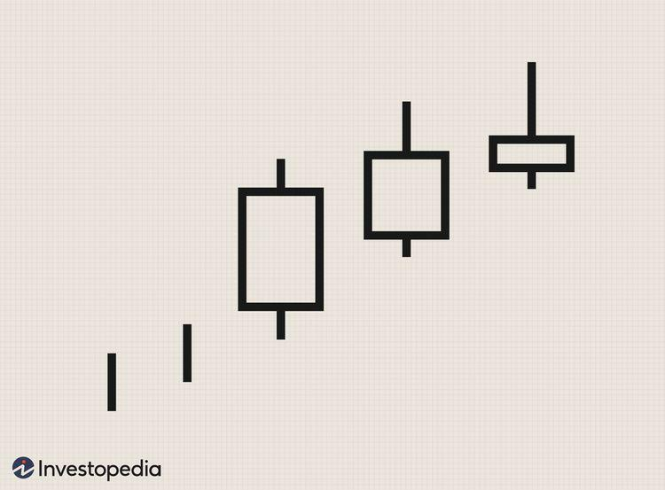

## Table of Contents

## What is the Advance Block Candlestick Pattern?

The Advance Block Candlestick Pattern is a bearish reversal pattern that appears in an uptrend. It consists of three candles, all of which are bullish. The first candle is a strong bullish candle, followed by two more bullish candles that have smaller bodies and longer upper shadows. These longer upper shadows show that the bulls are struggling to keep the price up, and the bears are starting to push back.

This pattern suggests that the uptrend might be losing steam. Even though the price is still going up, the smaller bodies and longer upper shadows of the second and third candles indicate that the buying pressure is weakening. Traders watch for this pattern as a sign to possibly sell or take profits, expecting that the price might start to fall soon.

## How does the Advance Block pattern form?

The Advance Block pattern starts forming during an uptrend when the market is going up. The first candle in this pattern is a strong bullish candle, meaning it has a long body and shows that buyers are in control. This candle shows that the price has gone up a lot during that day or period.

After the first strong bullish candle, the next two candles are also bullish but they look different. They have smaller bodies and longer upper shadows. The smaller bodies show that the buying power is not as strong as before. The longer upper shadows mean that the price went up but then came back down a bit, showing that sellers are starting to fight back against the buyers. This pattern suggests that the uptrend might be getting weaker and could soon reverse.

## What does the Advance Block pattern signify in trading?

The Advance Block pattern is a warning sign for traders. It shows up when the price has been going up for a while, but it suggests that the upward trend might not last much longer. This pattern is made of three candles that are all bullish, but the last two candles look weaker. The first candle is strong and shows that buyers are in control. But the next two candles have smaller bodies and long upper shadows, which means the buyers are not as strong anymore and sellers are starting to push back.

Traders use the Advance Block pattern to decide when to sell or take profits. When they see this pattern, it tells them that the price might start going down soon. So, it's a good time to think about getting out of their positions before the price drops. This pattern helps traders be ready for a possible change in the market direction and make smart trading choices.

## Can you explain the psychology behind the Advance Block pattern?

The psychology behind the Advance Block pattern shows how the mood of the market can change. At first, everyone feels good about the market because it's going up. This is shown by the first strong bullish candle. People are buying a lot and feel confident that the price will keep going up. But then, things start to change a little.

The next two candles in the pattern are still going up, but they don't look as strong. They have smaller bodies, which means the buying isn't as strong as before. The long upper shadows on these candles show that even though the price went up, it didn't stay there. This means some people are starting to sell, and they're pushing the price back down. It's like the first sign that not everyone believes the price will keep going up, and this can make more people think about selling too.

## What are the key components of an Advance Block pattern?

The Advance Block pattern has three main parts. It starts with a strong bullish candle that shows the price going up a lot. This candle tells us that buyers are in charge and feeling confident about the market going up. The first candle is important because it sets the stage for what comes next.

After the first strong candle, there are two more candles that are also bullish but look different. These candles have smaller bodies, which means the buying power is not as strong as before. They also have long upper shadows, which show that the price went up but then came back down a bit. This means some people are starting to sell and push the price back down. These two candles together with the first one make up the Advance Block pattern and suggest that the upward trend might be losing strength.

## How can the Advance Block pattern be identified on a chart?

To spot an Advance Block pattern on a chart, look for three candles that appear during an uptrend. The first candle should be a strong bullish candle with a long body, showing that the price went up a lot. This candle tells us that buyers were in control and the market was feeling good about going up.

After the first strong candle, the next two candles should also be bullish, but they will look different. These candles will have smaller bodies, meaning the buying power isn't as strong as before. They will also have long upper shadows, which show that the price went up but then came back down a bit. This means some people are starting to sell and the upward trend might be losing strength. Together, these three candles make up the Advance Block pattern and suggest that the price might start going down soon.

## What are common mistakes traders make when using the Advance Block pattern?

One common mistake traders make when using the Advance Block pattern is ignoring the overall trend and context. The Advance Block pattern is a bearish reversal pattern, but it works best when it shows up after a long uptrend. If traders see this pattern but the market hasn't been going up for a while, they might think it means the price will go down soon when it might not. It's important to look at the bigger picture and see if the pattern fits with what's been happening in the market.

Another mistake is jumping into trades too quickly without waiting for confirmation. The Advance Block pattern suggests that the price might start going down, but it's not a sure thing. Traders should look for other signs that the price is really going to drop, like other bearish patterns or indicators. If they trade based on the Advance Block pattern alone without waiting for more proof, they could end up losing money if the price keeps going up instead.

## How reliable is the Advance Block pattern in predicting market movements?

The Advance Block pattern can be helpful for traders, but it's not perfect. It shows up during an uptrend and suggests that the price might start going down soon. But, like any pattern, it doesn't always work. Sometimes, the price keeps going up even after the pattern shows up. So, traders need to be careful and not rely on it too much. They should look at other things, like other patterns or indicators, to make sure the price is really going to drop.

The reliability of the Advance Block pattern can also depend on the market and how strong the trend was before the pattern appeared. If the uptrend was very strong and lasted a long time, the pattern might be more likely to predict a reversal. But if the trend was weak or short, the pattern might not be as good at predicting what will happen next. Traders should always think about the bigger picture and use the pattern as one part of their overall trading plan, not the only thing they look at.

## What are the best practices for trading using the Advance Block pattern?

When trading with the Advance Block pattern, it's important to look at the bigger picture. This pattern shows up during an uptrend and suggests that the price might start going down soon. But it works best when the trend has been strong and long-lasting. So, before you decide to trade based on this pattern, check if the market has been going up for a while. If it has, the pattern might be more reliable. Also, don't just rely on this pattern alone. Look at other things like other patterns or indicators to make sure the price is really going to drop.

Another good practice is to wait for confirmation before you start trading. The Advance Block pattern is a warning sign, but it's not a sure thing. Sometimes, the price can keep going up even after the pattern shows up. So, wait for more signs that the price is really going to go down, like other bearish patterns or indicators. This can help you make smarter trading choices and avoid losing money if the price doesn't drop like you thought it would. By combining the Advance Block pattern with other tools and waiting for confirmation, you can trade more safely and effectively.

## How does the Advance Block pattern compare to other bearish reversal patterns?

The Advance Block pattern is different from other bearish reversal patterns like the Evening Star or the Bearish Engulfing pattern. The Advance Block pattern happens during an uptrend and shows three bullish candles in a row. The first candle is strong, but the next two have smaller bodies and long upper shadows. This tells us that the buying power is getting weaker and sellers are starting to push back. Other patterns like the Evening Star have a strong bullish candle followed by a small candle and then a strong bearish candle. The Bearish Engulfing pattern has a small bullish candle followed by a big bearish candle that "engulfs" the first one. So, the Advance Block pattern looks different because it shows three candles all going up but getting weaker.

Even though the Advance Block pattern is a bearish reversal pattern, it might not be as clear or strong as other patterns. Patterns like the Evening Star or Bearish Engulfing show a clear change from buying to selling. The Advance Block pattern is more about the buying power slowly getting weaker. This can make it harder to spot and less sure about predicting a big drop in price. Traders often use the Advance Block pattern along with other signs to make sure the market is really going to turn around. So, while it can be useful, it's good to look at other patterns and indicators too to make the best trading choices.

## Can the Advance Block pattern be used in conjunction with other technical indicators?

Yes, the Advance Block pattern can be used with other technical indicators to make better trading choices. It's a good idea to use more than one tool when you're trying to understand what the market might do next. The Advance Block pattern shows that the buying power might be getting weaker, but it's not a sure thing. So, looking at other indicators can help you be more sure about what's going to happen.

For example, you could use the Relative Strength Index (RSI) to see if the market is overbought or oversold. If the RSI is high and the Advance Block pattern shows up, it might mean the price is more likely to go down soon. Another good indicator to use is the Moving Average Convergence Divergence (MACD). If the MACD starts to cross down while you see the Advance Block pattern, it could be a stronger sign that the price will drop. By using the Advance Block pattern with other indicators, you can make smarter and safer trading decisions.

## What are some advanced strategies for maximizing the effectiveness of the Advance Block pattern?

To maximize the effectiveness of the Advance Block pattern, it's important to use it as part of a bigger trading plan. Instead of relying on just this pattern, you should look at other things too. One good way to do this is by using other technical indicators like the Relative Strength Index (RSI) or the Moving Average Convergence Divergence (MACD). If the RSI shows the market is overbought and you see the Advance Block pattern, it might mean the price is more likely to go down soon. Also, if the MACD starts to cross down while the Advance Block pattern is showing up, it could be a stronger sign that the price will drop. By combining the Advance Block pattern with other tools, you can make smarter and safer trading choices.

Another advanced strategy is to pay attention to the [volume](/wiki/volume-trading-strategy) of trades when the Advance Block pattern appears. If the volume starts to go down as the pattern forms, it can be a stronger sign that the buying power is really getting weaker. This means the pattern might be more reliable. It's also a good idea to wait for confirmation before you start trading. Sometimes, the price can keep going up even after the pattern shows up. So, look for other signs like other bearish patterns or a break below a key support level to make sure the price is really going to drop. By using these advanced strategies, you can use the Advance Block pattern more effectively and make better trading decisions.

## References & Further Reading

[1]: ["Japanese Candlestick Charting Techniques"](https://www.amazon.com/Japanese-Candlestick-Charting-Techniques-Second/dp/0735201811) by Steve Nison

[2]: ["Encyclopedia of Candlestick Charts"](https://www.amazon.com/Encyclopedia-Candlestick-Charts-Thomas-Bulkowski/dp/0470182016) by Thomas N. Bulkowski

[3]: ["Algorithmic Trading: Winning Strategies and Their Rationale"](https://www.wiley.com/en-us/Algorithmic+Trading%3A+Winning+Strategies+and+Their+Rationale-p-9781118460146) by Ernie Chan

[4]: ["Technical Analysis of Financial Markets"](https://drive.google.com/file/d/1OcDrGakDhaejT7J7xGEE3HHKy7xmrafy/preview) by John J. Murphy

[5]: ["Trading Price Action Trends"](https://www.amazon.com/Trading-Price-Action-Trends-Technical/dp/1118066510) by Al Brooks

[6]: ["Advances in Financial Machine Learning"](https://www.amazon.com/Advances-Financial-Machine-Learning-Marcos/dp/1119482089) by Marcos Lopez de Prado

[7]: ["Evidence-Based Technical Analysis"](https://www.amazon.com/Evidence-Based-Technical-Analysis-Scientific-Statistical/dp/0470008741) by David Aronson

[8]: ["Machine Learning for Algorithmic Trading"](https://github.com/stefan-jansen/machine-learning-for-trading) by Stefan Jansen