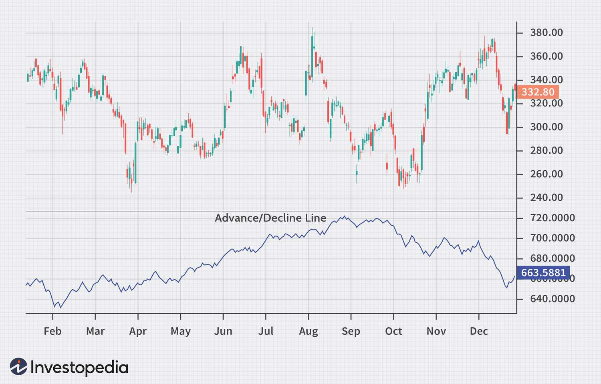

The stock market operates as a multifaceted system, where its inherent complexity poses both opportunities and challenges to participants. Navigating these intricacies requires investors and traders to employ a variety of financial indicators to facilitate informed decision-making. Among these tools, the Advance/Decline Index stands out as a vital market breadth indicator that offers insights into the stock market's overall health.

The Advance/Decline Index is particularly valuable for its ability to measure the cumulative difference between advancing and declining stocks within a specific market index. By tracking this measure over time, investors can gain a clearer picture of market momentum, with increases in the index reflecting market strength, while decreases indicate potential weaknesses. The insights provided by this indicator can confirm existing trends and alert investors to possible reversals.



This article examines the Advance/Decline Index in detail, covering its definition, calculation, significance, and application in algorithmic trading. By exploring how this indicator can enhance stock market analysis and decision-making, we aim to equip readers with a thorough understanding of its role and utility within financial markets. Through careful application, the Advance/Decline Index can become an indispensable component of an investor's analytical repertoire.

## Table of Contents

## What Is the Advance/Decline Index?

The Advance/Decline Index, commonly abbreviated as the A/D Index, serves as a crucial market breadth indicator that measures the cumulative difference between the number of advancing and declining stocks within a specified stock index. It is widely recognized for evaluating market momentum. A rising A/D Index suggests strengthening market conditions, as it indicates that a greater number of stocks are experiencing price gains. Conversely, a declining A/D Index hints at potential market weakness, reflecting that more stocks are seeing price declines.

This index is frequently referred to as the A/D Line, emphasizing its graphical representation over time, which aids in confirming existing market trends and serves as an early warning mechanism for potential trend reversals. The A/D Index is particularly useful in identifying divergences where its movement may disagree with the direction of major stock indices. This can provide traders and analysts with early signals of potential market shifts.

The application scope of the A/D Index extends across various time frames, yet it is often most valued for its daily analytical insights. By observing daily fluctuations, investors can gain timely information on the market's breadth, allowing for more informed decision-making. The focus on daily data helps traders and investors to closely monitor the momentum and breadth of the market, enhancing the understanding of underlying market dynamics beyond what is visible in price movements alone.

The versatility of the A/D Index stems from its ability to be integrated into different investment strategies, whether manual or algorithmic, offering a foundation for evaluating market conditions and adjusting strategies accordingly.

## How to Calculate the Advance/Decline Index

The Advance/Decline (A/D) Index is calculated using a straightforward process, involving simple arithmetic that provides a valuable measure of market breadth. To begin, count the number of advancing stocks, which are those whose prices have increased, and the number of declining stocks, whose prices have fallen, within a selected index or market for a particular day. The net value, crucial for constructing the A/D Index, is determined by subtracting the number of declining stocks from the number of advancing stocks:

$$
\text{Net Value} = \text{Number of Advancing Stocks} - \text{Number of Declining Stocks}
$$

Once you have the net value for a given day, add this figure to the prior day's A/D Index value to calculate the current day's A/D Index:

$$
\text{Today's A/D Index} = \text{Yesterday's A/D Index} + \text{Net Value}
$$

If you are calculating the A/D Index for the first time, the net value for that day becomes the initial value of the A/D Index, as there are no previous index values to consult.

$$
\text{Initial A/D Index} = \text{Net Value of Initial Day}
$$

This daily recursive calculation makes it feasible to observe how market dynamics evolve over time, helping investors and traders gain insights into market [momentum](/wiki/momentum) through a cumulative approach. In coding this process, a simple Python script can be designed to compute the A/D Index based on daily advancing and declining stock data. Below is a hypothetical example demonstrating this calculation in Python:

```python
# Sample data for advancing and declining stocks over a period
advancing_stocks = [320, 310, 305, 315, 300]
declining_stocks = [180, 190, 195, 185, 200]

# Initialize the A/D Index values list
ad_index = [advancing_stocks[0] - declining_stocks[0]]

# Calculate the A/D Index values over the period
for i in range(1, len(advancing_stocks)):
    net_value = advancing_stocks[i] - declining_stocks[i]
    current_ad_index = ad_index[-1] + net_value
    ad_index.append(current_ad_index)

# Output the calculated A/D Index values
print(ad_index)
```

The iterative nature of this calculation aids market participants in continuously tracking the momentum of stocks, shedding light on overall market performance and potential trend shifts.

## Interpreting the Advance/Decline Index

A rising Advance/Decline (A/D) Index is indicative of market strength, as it signifies that more stocks are experiencing price increases than decreases. This suggests a broad market participation in the upward movement, which typically enhances the validity of the trend. Conversely, a falling A/D Index implies market weakness, as the number of declining stocks surpasses those that are advancing, indicating a lack of support for rising prices.

Divergences between the A/D Index and overall stock market indices often signal potential market reversals. A positive divergence occurs when the A/D Index increases while stock indices decline, potentially suggesting an upcoming market upswing. This situation indicates that despite downward pressure on index levels, a broad base of stocks is participating in the upward movement, hinting at a possible reversal of the bearish trend. On the other hand, a negative divergence, where the A/D Index declines while stock indices rise, warns that the rally might be unsustainable due to limited participation. In such cases, gains are concentrated in fewer stocks, reducing the robustness of the upward trend and possibly heralding a forthcoming correction or downturn.

To highlight these concepts with a Python code snippet, consider a simple algorithm to detect such divergences:

```python
def detect_divergence(ad_index, stock_index):
    if ad_index[-1] > ad_index[-2] and stock_index[-1] < stock_index[-2]:
        return "Positive Divergence"
    elif ad_index[-1] < ad_index[-2] and stock_index[-1] > stock_index[-2]:
        return "Negative Divergence"
    else:
        return "No Divergence"

# Example usage
ad_index = [100, 105, 110, 115, 113]
stock_index = [1200, 1210, 1225, 1230, 1220]

divergence_type = detect_divergence(ad_index, stock_index)
print(divergence_type)  # Output: Positive Divergence
```

In this code, the function `detect_divergence` checks the latest values of the A/D Index and stock index to determine the type of divergence, helping traders assess market conditions and anticipate reversals.

## Application in Algorithmic Trading

Algorithmic trading utilizes the Advance/Decline (A/D) Index to enhance precision in market analysis and strategy development. Algorithms, equipped with the A/D Index, can effectively detect broad market trends and allocate resources optimally, whether in bullish or bearish environments. By examining the rising or falling trend of the A/D Index, algorithms can gauge the overall market momentum, guiding strategic decisions on asset allocation and risk management.

Furthermore, the integration of pattern recognition and [machine learning](/wiki/machine-learning) significantly augments the utility of the A/D Index in [algorithmic trading](/wiki/algorithmic-trading). Machine learning algorithms can process vast datasets to identify complex patterns and divergences between the A/D Index and other market indicators. These divergences can be strategically significant, offering insights into potential trend reversals or confirmation of market direction. For instance, a positive divergence, where the A/D Index is rising while the major indices fall, might signal a strategic opportunity for entering long positions.

The effectiveness of the A/D Index is particularly pronounced when used in conjunction with other technical indicators, enriching the framework for algorithmic strategies. By cross-verifying signals with complementary tools such as moving averages, Relative Strength Index (RSI), or Bollinger Bands, traders can form a more holistic view of market conditions, thereby reducing the likelihood of false signals and enhancing interpretative accuracy.

For practical implementation, traders can leverage programming languages like Python to automate the calculation and integration of the A/D Index within trading algorithms. Utilizing libraries such as Pandas for data manipulation and NumPy for numerical calculations facilitates the process. Below is a simple example of Python code to calculate the A/D Index and detect potential divergences:

```python
import pandas as pd

# Sample data containing advancing and declining stocks count
data = {
    'advancing': [300, 320, 315, 310, 305],
    'declining': [200, 180, 185, 190, 195]
}

df = pd.DataFrame(data)

# Calculate the daily net change
df['net_change'] = df['advancing'] - df['declining']

# Initialize the A/D Index series
df['A/D Index'] = df['net_change'].cumsum()

# Identifying potential divergences for strategic decisions
for i in range(1, len(df)):
    if df['A/D Index'][i] > df['A/D Index'][i-1]:
        print(f"Day {i}: Positive divergence detected.")
    elif df['A/D Index'][i] < df['A/D Index'][i-1]:
        print(f"Day {i}: Negative divergence detected.")
```

In summary, the A/D Index, through strategic algorithmic application, plays a vital role in comprehending market breadth and making informed trading decisions. By leveraging machine learning and complementary indicators, traders can mitigate risks and capitalize on market opportunities more effectively.

## Advantages and Limitations

The Advance/Decline (A/D) Index offers significant insights into market trends, primarily through its ability to confirm trends and identify potential reversals. As a measure of market breadth, it quantifies the number of advancing stocks relative to declining ones, providing a comprehensive perspective on market behavior. A rising A/D Index corroborates bullish trends, while a declining Index suggests bearish conditions, aiding traders and investors in validating their market analysis.

Despite its strengths, the A/D Index is not infallible. One of its limitations is the potential to produce false signals, particularly in highly volatile or choppy markets where short-term fluctuations can distort the true market picture. This characteristic necessitates the use of complementary analyses to validate signals and minimize the risk of erroneous decision-making.

Moreover, the A/D Index's cumulative nature implies an inherent lag in its responsiveness. Since the Index aggregates daily advances and declines over time, it might be slow to reflect rapid market changes. This lag requires traders to integrate additional tools, such as moving averages, oscillators, or momentum indicators, to make timely, well-informed decisions.

To illustrate this, consider a Python example that integrates the A/D Index with a moving average for more timely insights:

```python
import pandas as pd

# Sample DataFrame with daily advances and declines
data = {'Advancing': [350, 370, 390, 400, 420],
        'Declining': [150, 160, 180, 190, 200]}

df = pd.DataFrame(data)

# Calculate daily net advances
df['Net_Advances'] = df['Advancing'] - df['Declining']

# Calculate A/D Index
df['AD_Index'] = df['Net_Advances'].cumsum()

# Calculate a simple moving average of A/D Index
df['AD_Index_MA'] = df['AD_Index'].rolling(window=3).mean()

print(df)
```

This code snippet calculates the A/D Index and a 3-day moving average, helping traders smooth out noise and potentially reduce false signals. Incorporating such techniques into analysis frameworks allows market participants to leverage the strengths of the A/D Index while addressing its limitations.

## Case Studies

Historical market events provide concrete examples of how the Advance/Decline (A/D) Index serves as a valuable tool for investors and traders seeking to understand market dynamics. Observations from past crises highlight the Index's ability to signal shifts in market trends, aiding in strategic decision-making.

During the 2008 financial crisis, financial markets experienced extreme [volatility](/wiki/volatility-trading-strategies), with a significant decline in global stock indices. The A/D Index offered insights into market movements that were not readily apparent through price analysis alone. Notably, positive divergences in the A/D Line became evident during the latter stages of the crisis. A positive divergence occurs when the A/D Index begins to rise while major stock indices continue to fall. This pattern suggested underlying strength in the market, as an increasing number of stocks began to advance despite the overall declining trend. Such divergences indicated potential stabilization and laid the groundwork for the market's eventual recovery phases. This foresight would have been crucial for investors looking to identify early signals of market bottoming and potential entry points.

Similarly, during the COVID-19 pandemic, the stock market experienced abrupt declines due to economic uncertainties and lockdown measures implemented globally. The A/D Index again proved its utility by indicating market breath during periods of recovery. As markets started rebounding, the A/D Index showcased strong recoveries, often preceding traditional stock indices in showing signs of market health improvement. This early indication allowed traders to recognize the breadth of the recovery, suggesting that gains were not limited to a small number of high-cap stocks but were supported across a broader base of securities. Such information is valuable for investors who prioritize diversified portfolio strategies, as it reassures them of the market's solid footing in recovery phases.

The historical performance of the A/D Index during these crises underscores its merit as a market breadth indicator capable of providing early signals of trend reversals and recoveries. It highlights the importance for investors to consider this tool alongside traditional market analysis techniques for more comprehensive market insights.

## Conclusion

The Advance/Decline Index stands out as an essential instrument for investors and traders focusing on market breadth analysis. It provides a holistic view of market trends by tracking the difference between advancing and declining stocks, offering key insights into the underlying health of a stock market. This makes it an invaluable component for assessing market momentum and potential reversals.

In algorithmic trading, the Advance/Decline Index is particularly beneficial. It supports the development of more refined market strategies by enhancing decision-making processes. By incorporating this index into trading algorithms, investors can better identify market conditions that favor bullish or bearish strategies, thus optimizing resource allocation. Additionally, the integration of this index with machine learning and pattern recognition technologies enables the early detection of divergences that may indicate significant market shifts, thereby allowing strategic trade implementation.

Nonetheless, despite its powerful analytical capabilities, the Advance/Decline Index has its limitations. In isolation, it can produce false signals, particularly in volatile market conditions where rapid price fluctuations may distort market trends. Consequently, it is crucial to use the Advance/Decline Index in conjunction with other technical indicators and analytical tools. This balanced approach mitigates the risks associated with false signals and ensures more timely and informed decision-making. The cumulative nature of the index may also result in lagging interpretations, prompting the need for supplementary analysis to capture the most current market movements.

Overall, the Advance/Decline Index is an indispensable tool that enriches the toolkit of any investor or trader, though its optimal use is achieved when employed as part of a broader analytical framework.

## References & Further Reading

[1]: Lo, A. W. (2017). ["Adaptive Markets: Financial Evolution at the Speed of Thought"](https://archive.org/details/adaptivemarketsf0000loan). Princeton University Press.

[2]: Murphy, J. J. (1999). ["Technical Analysis of the Financial Markets: A Comprehensive Guide to Trading Methods and Applications"](https://archive.org/details/technicalanalysi0000murp). New York Institute of Finance.

[3]: Tharp, V. K. (2008). ["Trade Your Way to Financial Freedom"](https://www.amazon.com/Trade-Your-Way-Financial-Freedom/dp/007147871X). McGraw-Hill Education.

[4]: Derman, E. (2016). ["My Life as a Quant: Reflections on Physics and Finance"](https://www.amazon.com/My-Life-Quant-Reflections-Physics/dp/0470192739). Wiley.

[5]: Grinold, R. C., & Kahn, R. N. (2000). ["Active Portfolio Management: A Quantitative Approach for Producing Superior Returns and Controlling Risk"](https://archive.org/details/activeportfoliom0000grin). McGraw-Hill Education.