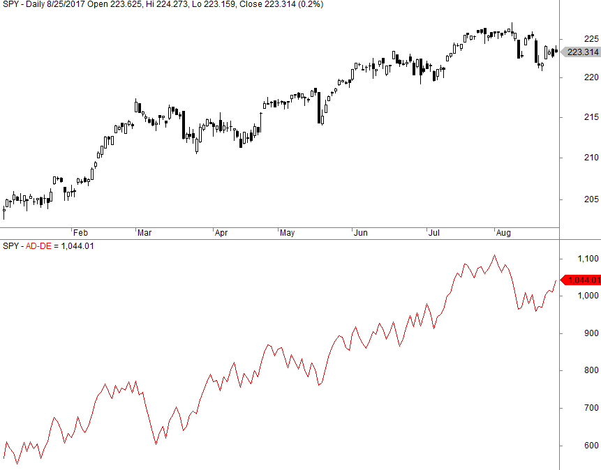

Algorithmic trading, commonly known as algo trading, refers to the use of computer algorithms to automate trading decisions in financial markets. It has become a dominant force, accounting for a significant portion of trading volume worldwide. The growing significance of algorithmic trading can be attributed to its ability to execute trades at high speeds and volumes, exploit market inefficiencies, and reduce human error. By automating the decision-making process, algorithmic trading enables traders to capitalize on fleeting opportunities that are often invisible to the human eye.

Central to the success of algorithmic trading are trading indicators—mathematical calculations based on price, volume, or other market data used to forecast future price movements. These indicators are essential in forming the backbone of an algorithm's decision-making framework. Among these indicators is the advance-decline line (AD line), a crucial measure of market breadth. The AD line provides insights into the overall movement of the market by calculating the difference between the number of advancing and declining stocks over a given period. This indicator is widely used to gauge the strength of market trends and to identify potential reversals.



The objective of this article is to explore the integration of advance-decline indicators within algorithmic trading strategies. By delving into the calculation and application of the AD line, we aim to shed light on its value in enhancing the accuracy and reliability of trading algorithms. Understanding how to effectively incorporate advance-decline data can provide traders with a richer context for their trades, allowing them to confirm trends or identify divergences that pure price-based indicators might not capture. Ultimately, the integration of such market breadth indicators offers a strategic edge, enabling the development of more nuanced and effective trading strategies.

## Table of Contents

## Understanding the Advance-Decline Indicator

The advance-decline line (ADL) is a widely-used market breadth indicator that offers insights into the overall health and sentiment of financial markets. As a measure of market breadth, the ADL provides a comprehensive view of the number of advancing stocks versus declining stocks within a particular index or market segment. The calculation of the ADL involves taking the difference between the number of advancing stocks and the number of declining stocks and adding this value to the previous period's ADL value. Mathematically, the formula is expressed as:

$$
\text{ADL}(t) = \text{ADL}(t-1) + (\text{Advancing stocks} - \text{Declining stocks})
$$

This linear accumulation of advances and declines provides a cumulative insight into market trends and potential reversal points. The core principle of the ADL is to track how many stocks are participating in a market move, offering a more nuanced perspective than simply observing price changes in indices.

The importance of the advance-decline line lies in its ability to assess market sentiment and predict potential reversals. When the ADL is rising alongside an index, it suggests robust market sentiment with broad participation from stocks, indicating a healthy uptrend. Conversely, if the index is rising but the ADL is declining, it may signal a weakening trend or potential reversal, as fewer stocks participate in the upward movement. This divergence can be an early warning sign for traders and investors.

One of the primary benefits of using advance-decline data is its capability to confirm trends or identify divergences, which price-based indicators might miss. For instance, during a bull market, a steadily rising ADL confirms strong [momentum](/wiki/momentum) and investor confidence, supporting the sustainability of the trend. On the other hand, a divergence between the ADL and the underlying index suggests caution, as it may indicate that the trend is losing its underlying strength and a reversal could be imminent.

Divergences between the ADL and major market indexes serve as valuable signals for potential trend changes, allowing traders to adjust their strategies accordingly. By incorporating advance-decline data, traders gain additional context that enhances decision-making, providing a more comprehensive market analysis.

## Importance of Market Breadth Indicators in Algorithmic Trading

Market breadth indicators are crucial tools in [algorithmic trading](/wiki/algorithmic-trading) strategies, offering valuable insights into the overall health of financial markets. One of the most popular among these is the advance-decline (A-D) line, which measures the difference between the number of advancing and declining stocks within a given market index. This indicator provides a broad perspective on market trends that pure price-based indicators may overlook, thus enhancing the precision and reliability of trading algorithms.

**Role in Algorithmic Trading**

In algorithmic trading, the A-D line is leveraged to gauge the market's overall sentiment. Unlike indicators that rely solely on price movements, the A-D line gives a more comprehensive view by reflecting the market's breadth, that is, the participation level among securities. Algorithmic traders incorporate the A-D line to fine-tune their strategies, helping to confirm whether price movements are supported by a genuine market-wide trend or are isolated to a few influential stocks.

For instance, consider a scenario where a major stock index is rising, but the A-D line is falling or stagnating. This divergence suggests that the upward price movement may not be sustainable, as fewer stocks are participating in the rally. An algorithmic strategy that factors in this divergence can adjust its positions, thus potentially avoiding losses from a trend reversal.

**Contextual Insights Over Pure Price-Based Indicators**

Market breadth indicators like the A-D line offer contextual insights that are invaluable for traders. Pure price-based indicators might suggest a strong upward or downward trend based on price movement alone. However, the accompanying breadth data can reveal whether this movement is broadly supported across the market. For example, a bullish signal generated by a price-based momentum indicator may be verified by a concurrent uptrend in the A-D line, thereby lending greater confidence to a buy decision.

Algorithmic strategies often employ conditions where both price-based and breadth-based signals must align before executing trades, reducing false positives. Here's a basic example in Python:

```python
def trading_signal(price_trend, ad_line_trend):
    if price_trend == 'up' and ad_line_trend == 'up':
        return 'buy'
    elif price_trend == 'down' and ad_line_trend == 'down':
        return 'sell'
    else:
        return 'hold'

# Usage example
signal = trading_signal('up', 'up')
print(signal)  # Output: buy
```

This simple logic illustrates how algorithms can incorporate both price and market breadth data, potentially improving trading outcomes. 

In summary, the incorporation of market breadth indicators like the advance-decline line in algorithmic trading provides a more nuanced understanding of market dynamics. By capturing the level of participation across the market, these indicators help traders validate price trends, increase the robustness of trading strategies, and potentially enhance the overall performance and reliability of their trading algorithms.

## Integrating Advance-Decline Data in Algo Trading Strategies

Incorporating advance-decline data into algorithmic trading models involves several key steps and considerations, focusing on coding the indicator, integrating it with other data, and ensuring the strategy's robustness through systematic [backtesting](/wiki/backtesting).

### Process of Incorporating Advance-Decline Data

The integration begins with fetching the necessary market data, typically the number of advancing and declining stocks over a given time period. This data is then used to calculate the advance-decline line (ADL), a cumulative indicator that provides insights into market sentiment. The calculation is straightforward:

$$

\text{ADL}_t = \text{ADL}_{t-1} + (\text{Advances}_t - \text{Declines}_t) 
$$

Here, $\text{ADL}_t$ represents the advance-decline line at time $t$, $\text{Advances}_t$ is the number of stocks that increased in price, and $\text{Declines}_t$ is the number that decreased.

### Coding Techniques

To implement the advance-decline indicator in trading algorithms, programming languages like Python are commonly used due to their extensive libraries and ease of use. A basic implementation can utilize libraries such as `pandas` for data manipulation and `matplotlib` for visualization. Here's an example code snippet in Python:

```python
import pandas as pd
import matplotlib.pyplot as plt

# Sample data: a DataFrame with 'Date', 'Advances', and 'Declines'.
data = pd.DataFrame({
    'Date': pd.date_range(start='2020-01-01', periods=100, freq='D'),
    'Advances': np.random.randint(50, 150, size=100),
    'Declines': np.random.randint(50, 150, size=100),
})

# Calculate AD Line
data['ADL'] = (data['Advances'] - data['Declines']).cumsum()

# Plot the results
plt.figure(figsize=(10, 6))
plt.plot(data['Date'], data['ADL'], label='ADL')
plt.xlabel('Date')
plt.ylabel('ADL Value')
plt.title('Advance-Decline Line')
plt.legend()
plt.show()
```

### Importance of Backtesting

Backtesting strategies that incorporate advance-decline data is crucial for validating their effectiveness. It involves applying the trading strategy to historical data to evaluate how it would have performed. This helps in identifying potential weaknesses and optimizing the strategy before deploying it in live markets.

When backtesting, it’s essential to consider several performance metrics, such as Sharpe Ratio, maximum drawdown, and win rate. These metrics provide insights into the strategy's risk-adjusted returns and general reliability. 

Moreover, employing walk-forward optimization can help in understanding how the strategy adapts to varying market conditions. This method involves dividing historical data into a series of segments for in-sample and out-of-sample testing, thus ensuring the model's robustness to overfitting.

In conclusion, the integration of advance-decline data into algorithmic trading strategies requires careful coding and comprehensive testing. By following systematic approaches to data handling and backtesting, traders can leverage this powerful indicator to enhance their trading models successfully.

## Backtesting and Performance Evaluation

Backtesting is a crucial process in validating algorithmic trading strategies, particularly those that incorporate the advance-decline line as a market breadth indicator. By simulating trading strategies on historical data, traders can assess the reliability and potential profitability of their models before deploying them in live markets. This process minimizes risks and enhances decision-making by providing insights into how a strategy would have performed under various market conditions.

### Significance of Backtesting with the Advance-Decline Line

The integration of the advance-decline line into trading algorithms offers a nuanced view of market sentiment, which can refine and improve trading strategies. The primary advantage of backtesting these strategies is to test the effectiveness of using the advance-decline line to gauge market breadth, identify overbought or oversold conditions, and detect divergences relative to price movements.

### Insights and Performance Metrics

Backtesting strategies that incorporate the advance-decline line often reveal its potential to enhance predictive accuracy. Historical backtests have shown that strategies utilizing this indicator can achieve higher Sharpe ratios, which measure risk-adjusted returns. The advance-decline data can help in identifying turning points, offering early signals of potential market reversals.

A typical backtest might involve calculating performance metrics such as:

- **Win rate:** Proportion of profitable trades compared to total trades.
- **Profit factor:** Ratio of gross profit to gross loss.
- **Maximum drawdown:** Largest peak-to-trough decline in the backtested period.

For example, a simple strategy combining the advance-decline line with a moving average crossover system might be backtested as follows in Python:

```python
import pandas as pd

# Assuming 'data' is a DataFrame with 'price', 'advancing', and 'declining' columns
data['ad_line'] = (data['advancing'] - data['declining']).cumsum()
data['moving_average'] = data['ad_line'].rolling(window=50).mean()

# Creating signals
data['signal'] = 0
data.loc[data['ad_line'] > data['moving_average'], 'signal'] = 1
data.loc[data['ad_line'] < data['moving_average'], 'signal'] = -1

# Calculate returns
data['strategy_returns'] = data['signal'].shift(1) * (data['price'].pct_change())

# Performance metrics
total_returns = data['strategy_returns'].sum()
sharpe_ratio = data['strategy_returns'].mean() / data['strategy_returns'].std()
```

This basic strategy looks at periods where the advance-decline line crosses above or below its moving average, using these crossovers as signals to buy or sell.

### Common Pitfalls and Challenges

Despite the benefits of backtesting, there are several challenges and pitfalls associated with it. Overfitting is a significant risk, where a strategy is tailored too closely to historical data, capturing noise rather than genuine patterns. Such a model may perform well during backtesting but fail in live markets.

Further, the advance-decline line is susceptible to sudden shifts in market sentiment and external macroeconomic events. These factors can lead to discrepancies between backtested and actual results. Additionally, slippage and transaction costs are often underestimated or ignored in backtests, which can lead to overly optimistic performance metrics.

To mitigate these challenges, traders should:

1. Ensure robust walk-forward testing to evaluate performance over unseen data.
2. Employ cross-validation techniques to reduce overfitting risks.
3. Clearly account for transaction costs and slippage in their backtesting models.

Backtesting is an indispensable tool for refining algorithmic strategies, especially those using the advance-decline line. By carefully considering its nuances and limitations, traders can significantly enhance their market strategies, contributing to more informed and profitable trading decisions.

## Case Studies and Examples

Real-world applications of the advance-decline line have demonstrated its utility in enhancing the accuracy of trading algorithms by providing insights into market sentiment and potential turning points. Two notable case studies illustrate the effectiveness of the advance-decline line in identifying market reversals and confirming trends.

### Case Study 1: The 2008 Financial Crisis

During the 2008 financial crisis, the advance-decline line played a crucial role in identifying significant market reversals. Prior to the crisis, the line showed persistent divergences from major stock indices, such as the S&P 500. While the index continued to reach new highs, the advance-decline line failed to confirm these upward movements, creating a divergence. This divergence signaled weakening market breadth and hinted at underlying vulnerabilities, effectively forecasting the eventual downside reversal.

Traders who integrated this indicator into their algorithmic trading systems were able to adjust their strategies, avoiding potential losses by positioning themselves more conservatively or even shorting the market. The key lesson from this case is that divergences between the advance-decline line and stock indices can serve as an early warning system for impending downturns.

### Case Study 2: Post-Brexit Market Movements

Following the Brexit vote in June 2016, financial markets experienced significant [volatility](/wiki/volatility-trading-strategies). The advance-decline line was instrumental in confirming trend reversals during this period. Initially, market indices such as the FTSE 100 declined sharply in response to the vote. However, the advance-decline line provided early signals of a recovery as it began to trend upwards, even when major indices showed tentative movements.

Algorithmic systems that used the advance-decline line identified these early trend reversals, allowing traders to capitalize on the post-Brexit recovery by accurately timing entries into long positions. This case underlined the importance of using advance-decline data not solely for detecting downturns but also for recognizing recovery potentials.

### Lessons Learned

1. **Divergences as Indicators of Reversals**: By monitoring divergences between the advance-decline line and market indices, traders can anticipate potential reversals. A divergence often indicates a weakening or strengthening in market sentiment, providing an early signal to adjust trading positions.

2. **Confirmation of Trend Directions**: The advance-decline line is beneficial not only for spotting divergences but also for confirming trend directions. A rising advance-decline line that aligns with an upward-moving market index solidifies the trend's strength, offering confidence in trading decisions.

3. **Integration with Algorithmic Models**: Incorporating advance-decline data into trading algorithms can yield superior performance by adding a layer of market breadth analysis. Such integration requires careful coding and backtesting to ensure reliability and accuracy in various market conditions.

### Conclusion

These real-world scenarios highlight the significant value of the advance-decline line in trading algorithms, showcasing its ability to provide early warnings and confirm trends. By learning from past market events and integrating advance-decline data into trading strategies, traders can enhance their ability to navigate complex market environments and improve overall performance.

## Challenges and Limitations

Traders utilizing the advance-decline line (AD Line) in algorithmic trading encounter several challenges and limitations, which can potentially affect the outcomes of their strategies. Understanding these pitfalls is crucial for improving trading performance.

One significant challenge is the inherent lag in the AD Line. As a market breadth indicator, it summarizes the net movement of advancing and declining stocks. However, it often lags behind price-based indicators, which can delay signals for market entries or exits. This lag can result in missed opportunities or late actions, especially in fast-moving markets. To mitigate this limitation, traders can incorporate additional real-time indicators that provide more immediate insights into market conditions, allowing for quicker decision-making.

Another limitation is the potential misinterpretation of the AD Line during periods of market consolidation or low [volume](/wiki/volume-trading-strategy). During such times, the line might give false signals, indicating a trend reversal or continuation that does not materialize. This issue arises because the AD Line can be overly sensitive to minor fluctuations in the number of advancing or declining stocks when overall market activity is subdued. Traders can implement filters or thresholds to reduce the impact of noise during these periods, ensuring that the AD Line triggers signals only when market movements are significant.

Algorithmic traders also face challenges related to data quality and computational precision. Errors or inconsistencies in data can lead to incorrect calculations of the AD Line, thereby skewing the trading algorithm's output. Ensuring high-quality data feeds and implementing error-checking mechanisms can help alleviate these problems. Moreover, when coding the AD Line into a trading algorithm, it is important to consider computational efficiency and precision to avoid discrepancies between the calculated values and actual market data.

The non-predictive nature of the AD Line is a core limitation that traders must acknowledge. While it provides valuable insights into market breadth, it does not predict future price movements. As a result, relying solely on the AD Line may result in suboptimal trading decisions. To address this, traders should combine the AD Line with other indicators and analysis techniques, forming a composite view of the market that incorporates multiple facets of analysis.

In summary, while the advance-decline line is a valuable tool for gauging market breadth and sentiment, its limitations require careful handling in algorithmic trading. By understanding and mitigating these challenges—such as overcoming lag, addressing data quality issues, and using complementary indicators—traders can enhance the reliability and performance of their algorithmic strategies.

## Conclusion

Integrating advance-decline indicators into algorithmic trading strategies presents numerous advantages. By providing a comprehensive view of market breadth through the analysis of advancing versus declining stocks, these indicators contribute significantly to enhancing decision-making processes. Algorithmic traders who incorporate this data can better assess market sentiment and identify potential reversal points, offering a more layered understanding than relying solely on price-based indicators.

Continuous research and adaptation remain crucial components in developing effective algorithmic trading models. Financial markets are dynamic, with conditions evolving due to economic events, technological advancements, and shifts in investor behavior. As such, regularly updating trading algorithms to incorporate the latest findings from market breadth research can optimize performance and reliability. This ongoing improvement process ensures that models remain robust and can adapt to changing market conditions.

Traders and investors are encouraged to explore advance-decline data as an essential part of their market analysis toolkit. By understanding and utilizing this data, they can develop more sophisticated trading strategies, enhancing their ability to predict market movements and improve portfolio performance. The integration of advance-decline indicators is not a mere addition to trading algorithms but an essential enhancement that can lead to more informed and strategic decision-making in financial markets.

## Frequently Asked Questions

What is the primary purpose of the advance-decline line?

The primary purpose of the advance-decline line (AD Line) is to serve as a market breadth indicator, which provides insights into the overall health of the stock market. It measures the number of advancing stocks versus declining stocks over a specific period. By plotting these differences cumulatively, the AD Line helps traders and analysts assess whether more stocks are participating in a market trend, indicating the strength or weakness of a market move. A rising AD Line suggests that an increasing number of stocks are advancing, which could signal a robust market, while a declining AD Line points to a potential weakening market as more stocks decrease in price.

How can the advance-decline line predict market reversals?

The advance-decline line can hint at potential market reversals by identifying divergences between market indices and the AD Line. For example, if a major stock index is reaching new highs, but the AD Line fails to follow suit and shows a divergence by moving lower, it might suggest underlying weakness and the possibility of a market reversal. This divergence suggests that fewer stocks are participating in the upward trend, weakening the market's overall momentum. Conversely, if the market index is declining but the AD Line shows an upward trajectory, it could indicate that the decline lacks breadth, and a reversal to the upside might be imminent.

Can the advance-decline line be used independently in trading strategies?

While the advance-decline line is a useful indicator, it is generally not advisable to rely on it exclusively for making trading decisions. The AD Line provides a broad sense of market sentiment and participation but lacks the specificity needed for precise entry and [exit](/wiki/exit-strategy) points. Traders often combine the AD Line with other technical indicators, such as moving averages, Relative Strength Index (RSI), or volume data, to create a more comprehensive trading strategy. By gathering insights from multiple indicators, traders can make more informed decisions that account for various market dynamics.

What are the common pitfalls when using the advance-decline line in algo trading?

Common pitfalls when using the advance-decline line in algorithmic trading include over-reliance on the indicator as a standalone signal, ignoring market context, and not accounting for the effects of large-cap stocks. Since the AD Line reflects the cumulative breadth of advancing versus declining stocks, it might misrepresent market conditions if major index movements are driven by a few large-cap stocks, which could skew interpretations. Moreover, algorithmic traders might face challenges in coding the AD Line effectively, especially when integrating it with other indicators or adapting to real-time data feeds. To mitigate these issues, traders should ensure robust backtesting, incorporate diverse indicators into their strategies, and continuously validate the AD Line's performance in different market conditions.

## References & Further Reading

[1]: Pring, M. J. (2002). ["Technical Analysis Explained: The Successful Investor's Guide to Spotting Investment Trends and Turning Points,"](https://www.amazon.com/Technical-Analysis-Explained-Fifth-Successful/dp/0071825177) 4th edition. McGraw-Hill.

[2]: Murphy, J. J. (1999). ["Technical Analysis of the Financial Markets: A Comprehensive Guide to Trading Methods and Applications."](https://www.amazon.com/Technical-Analysis-Financial-Markets-Comprehensive/dp/0735200661) New York Institute of Finance.

[3]: Kirkpatrick, C. D., & Dahlquist, J. R. (2010). ["Technical Analysis: The Complete Resource for Financial Market Technicians."](https://ptgmedia.pearsoncmg.com/images/9780134137049/samplepages/9780134137049.pdf) FT Press.

[4]: Lo, A. W., & Hasanhodzic, J. (2010). ["The Evolution of Technical Analysis: Financial Prediction from Babylonian Tablets to Bloomberg Terminals,"](https://books.google.com/books/about/The_Evolution_of_Technical_Analysis.html?id=HMR_YTo3l2AC) Wiley Finance.

[5]: Neely, C. J., Weller, P. A., & Ulrich, J. M. (2009). ["The Adaptive Markets Hypothesis: Evidence from the Foreign Exchange Market,"](https://www.cambridge.org/core/journals/journal-of-financial-and-quantitative-analysis/article/abs/adaptive-markets-hypothesis-evidence-from-the-foreign-exchange-market/9D336CDCA83233819EB5CDD0F4BC0DAA) Journal of Financial and Quantitative Analysis.