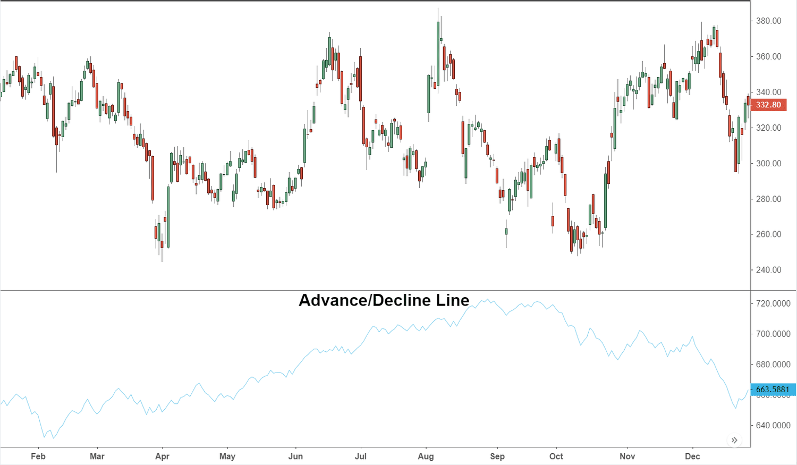

The stock market is a complex and ever-changing landscape that demands the use of various analytical tools and indicators to assist traders and analysts in making informed decisions. One significant tool in this context is the Advance/Decline (A/D) Line, a technical indicator prized for its ability to assess market breadth and sentiment. The A/D Line captures the relationship between advancing and declining stocks, providing insights into the overall participation of stocks in market trends.

This article examines the A/D Line's significance in stock market analysis and its applications within algorithmic trading strategies. The A/D Line is instrumental in understanding whether the overall market movement is supported by the broader participation of stocks or driven by a smaller subset. We will describe how the A/D Line is calculated and provide examples of its application in trading decisions. Additionally, the article discusses the challenges and limitations encountered when utilizing the Advance/Decline Line, supplemented by practical applications and real-world case studies illustrating its effectiveness.



For traders seeking to refine their strategies and enhance their decision-making, understanding the mechanics of the A/D Line and incorporating it into their analysis is crucial. With its ability to illuminate market sentiment and breadth, the A/D Line remains a valuable component of technical analysis, offering a deeper understanding of market dynamics.

## Table of Contents

## Understanding the Advance/Decline (A/D) Line

The Advance/Decline (A/D) Line is a technical indicator used to measure the breadth of the stock market by plotting the difference between advancing and declining stocks on a daily basis. As a breadth indicator, it helps market participants understand how many stocks are participating in an upward or downward market movement. This participation can be crucial for validating the strength or weakness of a current market trend.

The A/D Line is cumulative, meaning that each day's value is added to or subtracted from the previous total. If more stocks advance than decline on a particular day, the resulting positive number is added to the previous A/D Line value. Conversely, if more stocks decline, the negative result is subtracted from the preceding total. This cumulative nature of the A/D Line provides a more comprehensive view of market sentiment over time as opposed to a simple day-to-day analysis.

The formula for calculating the daily advance-decline value is relatively straightforward:

$$
\text{A/D}_{\text{today}} = \text{Net Advances} + \text{A/D}_{\text{previous day}}
$$

where $\text{Net Advances} = \text{Number of Advancing Stocks} - \text{Number of Declining Stocks}$.

The A/D Line can be used to confirm market sentiment, whether bullish or bearish, by observing its trend relative to major market indices like the S&P 500 or the Dow Jones Industrial Average. When the A/D Line trends upward alongside an upward-moving index, it confirms bullish sentiment, indicating broad participation in the market's rise. Conversely, if the A/D Line trends downward when a major index is rising, it can suggest that the rally is weakening, as fewer stocks are participating—potentially signaling divergence and future market correction. Similarly, a declining A/D Line alongside a declining index can confirm bearish sentiment in the market, whereas a rising A/D Line in such a scenario might suggest a possible reversal or oversold conditions.

## Calculating the A/D Line

To calculate the Advance/Decline (A/D) Line, the fundamental approach involves taking the daily difference between the number of advancing stocks and declining stocks. This difference, known as Net Advances, serves as the cornerstone for updating the A/D Line. The Net Advances are calculated as follows:

$$
\text{Net Advances} = \text{Number of Advancing Stocks} - \text{Number of Declining Stocks}
$$

Once the Net Advances are computed, the value is integrated into the cumulative total by adding it to the previous day's A/D Line value, effectively updating the line. This iterative process provides a long-term view of market trends by compounding daily fluctuations.

For instance, consider a scenario where the stock market saw 750 stocks rise and 650 stocks fall on a particular day. The Net Advances for that day would be:

$$
750 - 650 = 100
$$

This Net Advances value of 100 would be added to the previous day's A/D Line total, extending the cumulative measure of the market's movement. Thus, this continuous addition or subtraction of daily Net Advances values reflects the overall market sentiment and participation over time.

Here's a simple Python code snippet to illustrate how one might programmatically calculate the A/D Line:

```python
def calculate_ad_line(daily_advances, daily_declines, previous_ad_line):
    net_advances = daily_advances - daily_declines
    current_ad_line = previous_ad_line + net_advances
    return current_ad_line

# Example usage
previous_ad_line = 2000  # Assume yesterday's A/D Line value is 2000
daily_advances = 750
daily_declines = 650

current_ad_line = calculate_ad_line(daily_advances, daily_declines, previous_ad_line)
print("Today's A/D Line:", current_ad_line)
```

This code effectively captures the essence of how the A/D Line is maintained over time by considering daily transitions in stock performance. As such, the cumulative nature of the A/D Line allows traders and analysts to gauge broader market trends beyond the short-term fluctuations.

## Using the A/D Line in Algorithmic Trading

In [algorithmic trading](/wiki/algorithmic-trading), the Advance/Decline (A/D) Line plays an essential role by providing insights into market trends and potential divergences. Algorithms are designed to identify divergences between market indexes and the A/D Line. A divergence occurs when the price movement of a stock index moves in the opposite direction to the A/D Line. Such divergences act as early indicators of potential market reversals. For example, a bullish divergence can point to a potential market bottom if the stock index is declining while the A/D Line is rising. Conversely, a bearish divergence may signal a market top if the index is rising, but the A/D Line is falling.

Algorithmic systems utilize this information for sentiment analysis, which allows them to adjust trading strategies based on shifts in market participation. By monitoring the A/D Line, algorithms can assess whether market moves are supported by a broad number of stocks or if divergences suggest an underlying change in sentiment.

To optimize trading strategies, the A/D Line can be integrated with other technical indicators, such as the Relative Strength Index (RSI) or Moving Averages. These indicators help confirm entry and [exit](/wiki/exit-strategy) points. For instance, if both the Moving Average and A/D Line indicate bullish conditions, an algorithm might confirm a buy signal. Python and other programming languages are used to implement these calculations:

```python
def calculate_AD_line(advances, declines, previous_AD):
    """Calculates the Advance/Decline Line value based on daily advances and declines."""
    net_advances = advances - declines
    return previous_AD + net_advances

# Example usage:
# Current day stats
advances = 750
declines = 650
previous_AD = 1000

# Calculate current A/D line
current_AD = calculate_AD_line(advances, declines, previous_AD)
print("Current A/D Line:", current_AD)
```

Integrating these calculations within algorithmic frameworks, algorithms continuously monitor the A/D Line, adapting trading strategies dynamically. This capability provides a comprehensive view, enhancing decision-making processes by affirming or contesting potential trade executions.

In conclusion, using the A/D Line in algorithmic trading enhances the traders’ capability to interpret market conditions, improving the effectiveness and precision of trading strategies.

## Interpreting A/D Line Divergences

Divergences between the Advance/Decline (A/D) Line and major stock indexes are crucial indicators of potential market turning points. These divergences can manifest as either bullish or bearish signals, providing insights into the underlying market dynamics that may not be immediately visible through index movements alone.

A bullish divergence occurs when there is a disconnect between the trend of a falling market index and a rising A/D Line. While the index may suggest a downward trajectory, the increasing A/D Line implies strengthening market breadth, indicating that more stocks are advancing compared to those declining. This scenario typically hints at a potential market bottom, as the rallying breadth may precede a reversal in the overall index trend.

Conversely, a bearish divergence takes place when an index is on an upward trend, yet the A/D Line begins to decline. This suggests that fewer stocks are contributing to the rally, pointing towards market exhaustion and possibly signaling a forthcoming correction or market top. Such divergence indicates that while the index reflects a positive movement, the broader market participation is weakening, which could presage a reversal.

Identifying and understanding these divergences are essential for evaluating market health and making informed decisions. Traders use these signals to anticipate potential market reversals before they become evident through index performance alone. By recognizing patterns where the A/D Line trends in opposition to a market index, traders can adjust their strategies accordingly to mitigate risk or capitalize on anticipated market shifts.

In practice, employing the A/D Line involves consistent monitoring and analysis, often complemented by other technical indicators to validate signals. Algorithms can also be programmed to detect these divergences, automatically flagging potential buy or sell actions based on predefined criteria. The nuanced interpretation of A/D Line divergences thus requires a comprehensive understanding of market mechanics and a keen eye for the subtle signals that may herald major market movements.

## Case Studies and Practical Application

During the 2008 financial crisis, the Advance/Decline (A/D) Line served as a significant indicator in determining market stabilization before the recovery phase. At that time, while the stock indices continued to decline, the A/D Line exhibited a divergence by stabilizing or rising, suggesting an underlying strength amidst the broader market chaos. This divergence indicated that a growing number of stocks were beginning to stabilize or advance despite the downward trend of the indices, highlighting potential early signs of a recovery. Thus, the A/D Line's ability to detect subtle shifts in market breadth proved invaluable for analysts and traders attempting to anticipate a turning point during a period of profound market uncertainty.

Similarly, the market turmoil caused by the COVID-19 pandemic in 2020 demonstrated the A/D Line's practical utility. As global markets plummeted in March 2020, traders observed significant breadth thrusts in the A/D Line during the recovery phase. This indicator captured the widespread and robust participation of stocks in the upward recovery, offering a clue that the recovery was broadly registered across various market sectors. As more stocks began to participate in the recovery, the A/D Line's pronounced upward movement provided confirmation of the market's nascent rebound and helped traders capitalize on the recovery early on.

These case studies underscore the power of the A/D Line in predictive market analysis. By identifying divergences or breadth thrusts, traders can leverage the A/D Line to fine-tune their strategies, detect potential turning points, and gain insights into broader market sentiment and participation. Analyzing historical behaviors of the A/D Line during times of market distress, such as the 2008 financial crisis and the 2020 COVID-19 sell-off, equips traders with the knowledge to apply this indicator to similar market conditions in the future, potentially allowing for more informed and strategic trading decisions.

## Limitations and Considerations

The Advance/Decline (A/D) Line, while a valuable tool for assessing market breadth and sentiment, comes with specific limitations that traders and analysts need to consider. Its efficacy is often more pronounced in long-term market analysis and might not yield accurate signals during periods of high market [volatility](/wiki/volatility-trading-strategies). This inherent characteristic is due to its cumulative nature; rapid market movements can lead to lagging signals, potentially impacting real-time decision-making.

One challenge in calculating the A/D Line is its susceptibility to distortions from market capitalization dynamics and the inclusion of delisted stocks. In indices with a significant number of smaller, speculative firms, the fluctuations of individual stocks can skew the A/D Line, complicating its interpretability. This can be particularly problematic in indices where smaller companies wield more influence relative to their larger counterparts.

As a lagging indicator, the A/D Line may not promptly reflect sudden market shifts. Its cumulative calculation method means that by the time divergence has been identified, the market may have already reacted, presenting difficulties for traders who rely on timely data for their strategies.

Given these limitations, a prudent approach would involve using the A/D Line in conjunction with other technical indicators. For instance, integrating [momentum](/wiki/momentum) indicators like the Relative Strength Index (RSI) or Moving Averages could provide a more nuanced understanding of market conditions. This combination allows traders to verify signals from the A/D Line with additional data points, thereby enhancing decision-making accuracy. Continuous data analysis also plays a critical role in adapting strategies to market conditions, ensuring more robust interpretations of the A/D Line are achieved. This multifaceted strategy acknowledges the A/D Line's strengths and limitations, allowing traders to make informed and effective trading decisions.

## Conclusion

The Advance/Decline Line (A/D Line) is a vital instrument in analyzing stock market breadth, providing meaningful insights into overall market sentiment and the confirmation of prevailing trends. By offering a cumulative measure of advancing versus declining stocks, the A/D Line helps market participants understand the extent of stock participation in market movements. Its role is particularly valuable in identifying divergences where market indices and the A/D Line move out of sync, potentially indicating upcoming reversals or corrections.

For algorithmic traders, the incorporation of the A/D Line into trading systems can significantly enhance strategy performance. When used alongside other technical indicators like the Relative Strength Index (RSI) or Moving Averages, the A/D Line can refine entry and exit points, improving both accuracy and timing. Algorithms can be programmed to detect specific patterns or divergences in the A/D Line, helping traders adjust their strategies proactively based on broader market participation.

Understanding the A/D Line's applications and limitations allows traders to deploy this indicator effectively within their trading frameworks. The A/D Line excels as a long-term indicator, best applied when used in conjunction with other technical analysis tools and continuous data monitoring. While it may not react swiftly to sudden market changes due to its cumulative nature, its strength lies in confirming sustained market trends and sentiments.

With the correct approach, the A/D Line is not just a tool for understanding market breadth but also a strategic component in making data-driven trading decisions. By integrating this line within a holistic trading system, traders can gain a comprehensive view of market dynamics, enhancing their capacity to make informed choices and achieve better trading outcomes.

## References & Further Reading

[1]: Murphy, J. J. (1999). ["Technical Analysis of the Financial Markets: A Comprehensive Guide to Trading Methods and Applications."](https://archive.org/details/technicalanalysi0000murp) New York Institute of Finance.

[2]: Pring, M. J. (2002). ["Technical Analysis Explained: The Successful Investor's Guide to Spotting Investment Trends and Turning Points."](https://www.amazon.com/Technical-Analysis-Explained-Fifth-Successful/dp/0071825177) McGraw-Hill.

[3]: Elder, A. (1993). ["Trading for a Living: Psychology, Trading Tactics, Money Management."](https://www.amazon.com/Trading-Living-Psychology-Tactics-Management/dp/0471592242) Wiley.

[4]: Achelis, S. B. (2000). ["Technical Analysis from A to Z."](https://www.mhebooklibrary.com/doi/book/10.1036/9780071380119) McGraw-Hill.

[5]: Lo, A. W., & MacKinlay, A. C. (1999). ["A Non-Random Walk Down Wall Street."](https://www.amazon.com/Non-Random-Walk-Down-Wall-Street/dp/0691092567) Princeton University Press.