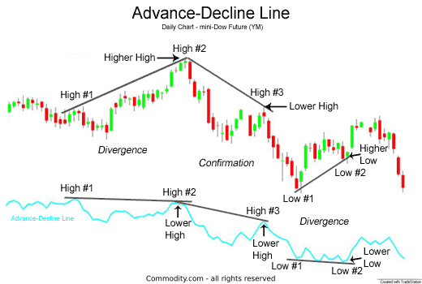

## Table of Contents

## What is the Advance/Decline Line?

The Advance/Decline Line, often called the A/D Line, is a technical analysis tool used to measure the overall health of the stock market. It works by counting the number of stocks that go up (advance) and the number of stocks that go down (decline) each day. If more stocks are advancing than declining, the A/D Line goes up. If more stocks are declining than advancing, the A/D Line goes down. This helps investors see if the market is generally moving up or down, beyond just looking at big indexes like the S&P 500.

The A/D Line is useful because it gives a broader picture of market trends. For example, even if a few big stocks are doing well and pushing up a major index, the A/D Line might show that most other stocks are not doing as well. This can signal that the market might be weaker than it looks. On the other hand, if the A/D Line is rising even when a major index is flat or falling, it might mean that the market is healthier than it appears, with many stocks quietly doing well. This makes the A/D Line a valuable tool for investors trying to understand the true state of the market.

## How is the Advance/Decline Line calculated?

The Advance/Decline Line is calculated by looking at how many stocks go up and how many go down each day. To start, you count the number of stocks that close higher than they did the day before. These are the advancing stocks. Then, you count the number of stocks that close lower than the day before. These are the declining stocks. You subtract the number of declining stocks from the number of advancing stocks. This gives you the daily advance/decline number.

To get the A/D Line, you add the daily advance/decline number to the previous day's A/D Line value. For example, if the A/D Line was at 100 yesterday and today there are 1500 advancing stocks and 1300 declining stocks, the daily advance/decline number is 200 (1500 - 1300). You add this to yesterday's A/D Line value, so today's A/D Line would be 300 (100 + 200). This process is repeated every day, creating a running total that shows the overall trend of the market.

## What does the Advance/Decline Line indicate about the market?

The Advance/Decline Line tells you if the stock market is doing well or not. It does this by counting how many stocks are going up and how many are going down each day. If more stocks are going up than going down, the A/D Line goes up. This means the market is strong and a lot of stocks are doing well. But if more stocks are going down than going up, the A/D Line goes down. This shows that the market might be weak and many stocks are not doing well.

The A/D Line is helpful because it gives you a bigger picture of what's happening in the market. Sometimes, a few big stocks can make the main stock market index look good, but the A/D Line can show that most other stocks are not doing as well. This can be a warning sign that the market might not be as strong as it seems. On the other hand, if the A/D Line is going up even when the main index is not, it might mean that the market is actually healthier than it looks, with many smaller stocks doing well. So, the A/D Line helps investors see the true health of the market.

## Can the Advance/Decline Line be used for all types of markets?

The Advance/Decline Line can be used for many different types of markets, like stocks, futures, and even some kinds of commodities. It's a simple way to see if more things in a market are going up or going down. For example, in the stock market, it helps to see if most stocks are doing well or if only a few big ones are making the market look good. The same idea can be used in other markets to get a feel for what's happening overall.

However, the A/D Line might not work as well in markets where there are fewer things to count. For example, in a market with only a few items, like certain commodities, the A/D Line might not give a clear picture because there aren't enough things to compare. So, while it's useful in many markets, it's best in ones where there are lots of different items to look at.

## How often should one update the Advance/Decline Line?

The Advance/Decline Line should be updated every day. This is because it counts how many stocks go up or down each day. By updating it daily, you can see the latest trends in the market and know if more stocks are going up or down right now.

Using the A/D Line every day helps you keep a close eye on the market. It's like taking the market's temperature every day to see if it's getting healthier or not. If you don't update it daily, you might miss important changes in the market and not get the full picture of what's happening.

## What are common misconceptions about the Advance/Decline Line?

One common misconception about the Advance/Decline Line is that it can predict the future of the market. People sometimes think that if the A/D Line is going up, the market will keep going up, or if it's going down, the market will keep going down. But the A/D Line doesn't predict the future; it just shows what has already happened. It's a tool to help understand the current health of the market, not a crystal ball.

Another misconception is that the A/D Line is the same as a major stock market index like the S&P 500. Some people think that if the A/D Line and the S&P 500 are moving in different directions, one of them must be wrong. But they measure different things. The S&P 500 looks at how a specific group of big stocks is doing, while the A/D Line looks at how all stocks in the market are doing. They can give different information about the market, and both can be right at the same time.

## How does the Advance/Decline Line differ from other market breadth indicators?

The Advance/Decline Line is one way to look at how the whole market is doing, but there are other tools called market breadth indicators that do similar things in different ways. One example is the Advance/Decline Ratio, which is different from the A/D Line because it shows the ratio of advancing stocks to declining stocks on a given day, instead of a running total. Another example is the McClellan Oscillator, which uses the difference between the number of advancing and declining stocks but adds in some math to smooth out the numbers and make it easier to spot trends.

While the A/D Line gives you a big picture of how many stocks are going up or down over time, these other indicators can give you more detailed or different views of the market. For example, the Advance/Decline Ratio can tell you right away if more stocks are going up than down today, without needing to look at a long-term trend. The McClellan Oscillator can help you see if the market is getting too excited or too worried, which can be a sign that a big change might be coming soon. So, while the A/D Line is great for seeing the overall health of the market over time, other market breadth indicators can give you different pieces of information to help you understand what's happening in the market.

## What are the limitations of using the Advance/Decline Line?

The Advance/Decline Line is a helpful tool, but it has some limits. One big limit is that it only looks at the number of stocks going up or down, not how much they are going up or down. So, if a few big stocks go way up, it can make the market look good even if most other stocks are not doing well. The A/D Line would not show this because it doesn't count how big the changes are, just how many stocks changed.

Another limit is that the A/D Line does not predict the future. It just tells you what has already happened in the market. People sometimes think that if the A/D Line is going up, the market will keep going up, but that's not true. It's just a tool to help you see the current health of the market, not a way to know what will happen next.

## How can the Advance/Decline Line be integrated with other technical analysis tools?

The Advance/Decline Line can be used with other technical analysis tools to get a fuller picture of the market. For example, you can use it with moving averages to see if the market trend is getting stronger or weaker. If the A/D Line is going up and it crosses above its moving average, it might mean the market is getting healthier. On the other hand, if the A/D Line is going down and crosses below its moving average, it might mean the market is getting weaker. This can help you see if the market is likely to keep going the way it's going or if it might change direction soon.

Another way to use the A/D Line with other tools is by looking at it with the Relative Strength Index (RSI). The RSI measures how fast and how much a stock or the market is moving. If the A/D Line is going up but the RSI is very high, it might mean the market is getting too excited and might need to cool down soon. If the A/D Line is going down and the RSI is very low, it might mean the market is too worried and might bounce back. By using these tools together, you can get a better idea of what's happening in the market and make smarter choices about when to buy or sell.

## What historical market events have been reflected in the Advance/Decline Line?

The Advance/Decline Line has shown some big market events in the past. For example, during the dot-com bubble in the late 1990s, the A/D Line started to go down even though the main stock market index, the Nasdaq, was still going up. This showed that even though a few big tech stocks were doing well, most other stocks were not. It was a warning sign that the market might be weaker than it looked, and soon after, the bubble burst and the market crashed.

Another time the A/D Line was helpful was during the financial crisis in 2008. As the crisis got worse, the A/D Line dropped a lot, showing that many more stocks were going down than going up. This was a clear sign that the market was in big trouble. The A/D Line helped people see that the market was not just having a small problem but was facing a big crash. It showed how bad things were getting before many people realized it.

## How can one interpret divergences between the Advance/Decline Line and major indices?

When the Advance/Decline Line and major indices like the S&P 500 or the Dow Jones move in different directions, it's called a divergence. This can tell you a lot about what's really happening in the market. For example, if the S&P 500 is going up but the A/D Line is going down, it means that only a few big stocks are doing well, while most other stocks are not. This is a warning sign that the market might not be as strong as it looks. It's like a few big trees growing tall in a forest, but most of the smaller trees are not doing well.

On the other hand, if the A/D Line is going up but the major indices are going down, it means that many stocks are doing better than what the main indices are showing. This can be a good sign that the market might be healthier than it seems. It's like the forest having lots of small trees growing well, even if a few big ones are not doing as well. By watching these divergences, you can get a better idea of the true health of the market and make smarter choices about when to buy or sell stocks.

## What advanced strategies can traders employ using the Advance/Decline Line?

Traders can use the Advance/Decline Line to spot trends and make smarter trading decisions. One advanced strategy is to use the A/D Line with other technical indicators, like moving averages or the Relative Strength Index (RSI). For example, if the A/D Line is going up and crosses above its moving average, it might be a good time to buy stocks because it shows that the market is getting healthier. On the other hand, if the A/D Line is going down and crosses below its moving average, it might be a good time to sell or avoid buying because it shows the market is getting weaker. By using these tools together, traders can get a better idea of when to make their moves.

Another strategy is to look for divergences between the A/D Line and major indices. If the S&P 500 is going up but the A/D Line is going down, it might mean that the market is not as strong as it looks. This could be a warning to be careful or even to sell stocks. On the other hand, if the A/D Line is going up but the S&P 500 is going down, it might mean that the market is healthier than it seems, and it could be a good time to buy. By paying attention to these divergences, traders can find opportunities that others might miss and make better trading decisions.

## What is the Understanding of the Advance/Decline (A/D) Line?

The Advance/Decline (A/D) Line is a technical indicator used to measure the breadth of the stock market by plotting the difference between advancing and declining stocks on a daily basis. As a breadth indicator, it helps market participants understand how many stocks are participating in an upward or downward market movement. This participation can be crucial for validating the strength or weakness of a current market trend.

The A/D Line is cumulative, meaning that each day's value is added to or subtracted from the previous total. If more stocks advance than decline on a particular day, the resulting positive number is added to the previous A/D Line value. Conversely, if more stocks decline, the negative result is subtracted from the preceding total. This cumulative nature of the A/D Line provides a more comprehensive view of market sentiment over time as opposed to a simple day-to-day analysis.

The formula for calculating the daily advance-decline value is relatively straightforward:

$$
\text{A/D}_{\text{today}} = \text{Net Advances} + \text{A/D}_{\text{previous day}}
$$

where $\text{Net Advances} = \text{Number of Advancing Stocks} - \text{Number of Declining Stocks}$.

The A/D Line can be used to confirm market sentiment, whether bullish or bearish, by observing its trend relative to major market indices like the S&P 500 or the Dow Jones Industrial Average. When the A/D Line trends upward alongside an upward-moving index, it confirms bullish sentiment, indicating broad participation in the market's rise. Conversely, if the A/D Line trends downward when a major index is rising, it can suggest that the rally is weakening, as fewer stocks are participating—potentially signaling divergence and future market correction. Similarly, a declining A/D Line alongside a declining index can confirm bearish sentiment in the market, whereas a rising A/D Line in such a scenario might suggest a possible reversal or oversold conditions.

## How do you calculate the A/D Line?

To calculate the Advance/Decline (A/D) Line, the fundamental approach involves taking the daily difference between the number of advancing stocks and declining stocks. This difference, known as Net Advances, serves as the cornerstone for updating the A/D Line. The Net Advances are calculated as follows:

$$
\text{Net Advances} = \text{Number of Advancing Stocks} - \text{Number of Declining Stocks}
$$

Once the Net Advances are computed, the value is integrated into the cumulative total by adding it to the previous day's A/D Line value, effectively updating the line. This iterative process provides a long-term view of market trends by compounding daily fluctuations.

For instance, consider a scenario where the stock market saw 750 stocks rise and 650 stocks fall on a particular day. The Net Advances for that day would be:

$$
750 - 650 = 100
$$

This Net Advances value of 100 would be added to the previous day's A/D Line total, extending the cumulative measure of the market's movement. Thus, this continuous addition or subtraction of daily Net Advances values reflects the overall market sentiment and participation over time.

Here's a simple Python code snippet to illustrate how one might programmatically calculate the A/D Line:

```python
def calculate_ad_line(daily_advances, daily_declines, previous_ad_line):
    net_advances = daily_advances - daily_declines
    current_ad_line = previous_ad_line + net_advances
    return current_ad_line

# Example usage
previous_ad_line = 2000  # Assume yesterday's A/D Line value is 2000
daily_advances = 750
daily_declines = 650

current_ad_line = calculate_ad_line(daily_advances, daily_declines, previous_ad_line)
print("Today's A/D Line:", current_ad_line)
```

This code effectively captures the essence of how the A/D Line is maintained over time by considering daily transitions in stock performance. As such, the cumulative nature of the A/D Line allows traders and analysts to gauge broader market trends beyond the short-term fluctuations.

## References & Further Reading

[1]: Murphy, J. J. (1999). ["Technical Analysis of the Financial Markets: A Comprehensive Guide to Trading Methods and Applications."](https://archive.org/details/technicalanalysi0000murp) New York Institute of Finance.

[2]: Pring, M. J. (2002). ["Technical Analysis Explained: The Successful Investor's Guide to Spotting Investment Trends and Turning Points."](https://www.amazon.com/Technical-Analysis-Explained-Fifth-Successful/dp/0071825177) McGraw-Hill.

[3]: Elder, A. (1993). ["Trading for a Living: Psychology, Trading Tactics, Money Management."](https://www.amazon.com/Trading-Living-Psychology-Tactics-Management/dp/0471592242) Wiley.

[4]: Achelis, S. B. (2000). ["Technical Analysis from A to Z."](https://www.mhebooklibrary.com/doi/book/10.1036/9780071380119) McGraw-Hill.

[5]: Lo, A. W., & MacKinlay, A. C. (1999). ["A Non-Random Walk Down Wall Street."](https://www.amazon.com/Non-Random-Walk-Down-Wall-Street/dp/0691092567) Princeton University Press.