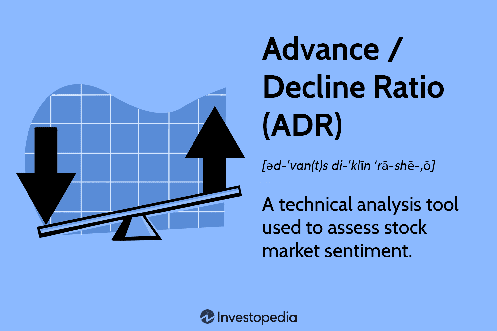

## Table of Contents

## What is the Advance/Decline Ratio?

The Advance/Decline Ratio is a measure used in the stock market to understand how many stocks are going up compared to how many are going down. It is calculated by dividing the number of stocks that have increased in price (advanced) by the number of stocks that have decreased in price (declined) over a specific period, usually a day. This ratio helps investors and analysts get a quick snapshot of market sentiment and whether the market is generally moving upwards or downwards.

If the Advance/Decline Ratio is greater than 1, it means more stocks are advancing than declining, which suggests a bullish or positive market trend. Conversely, if the ratio is less than 1, it indicates that more stocks are declining than advancing, pointing towards a bearish or negative market trend. Investors often use this ratio alongside other indicators to make more informed decisions about buying or selling stocks.

## How is the Advance/Decline Ratio calculated?

The Advance/Decline Ratio is calculated by taking the number of stocks that went up in price during a certain time, like a day, and dividing it by the number of stocks that went down in price during that same time. For example, if 1,500 stocks went up and 1,000 stocks went down, the Advance/Decline Ratio would be 1,500 divided by 1,000, which equals 1.5.

This ratio helps people understand if the stock market is doing well or not. If the ratio is more than 1, it means more stocks are going up than down, which is a good sign for the market. If the ratio is less than 1, it means more stocks are going down than up, which can be a warning sign. By looking at this ratio, investors can get a quick idea of the market's overall direction.

## Why is the Advance/Decline Ratio important for investors?

The Advance/Decline Ratio is important for investors because it gives them a quick and simple way to see how the stock market is doing. By looking at this ratio, investors can tell if more stocks are going up or down on a given day. This helps them understand the overall mood of the market, whether it's feeling happy and positive, or worried and negative. If the ratio is above 1, it means more stocks are going up, which is a good sign for the market. If it's below 1, more stocks are going down, which might be a warning sign.

Investors use the Advance/Decline Ratio along with other tools to make better decisions about buying or selling stocks. It's like a quick check-up on the market's health. By knowing if the market is generally moving up or down, investors can adjust their strategies. For example, if the ratio shows a lot of stocks are going up, an investor might feel more confident about buying stocks. On the other hand, if the ratio shows many stocks are going down, they might decide to wait or sell some of their stocks. This ratio helps investors stay informed and make smarter choices.

## Can you explain the mechanism behind the Advance/Decline Ratio?

The Advance/Decline Ratio is a simple way to see how the stock market is doing. It works by counting how many stocks went up in price during a day and dividing that number by how many stocks went down in price that same day. For example, if 1,200 stocks went up and 800 stocks went down, the ratio would be 1,200 divided by 800, which equals 1.5. This number tells you if more stocks are going up or down, helping you understand if the market is feeling good or worried.

This ratio is important because it gives investors a quick snapshot of the market's mood. If the ratio is more than 1, it means more stocks are going up, which is a sign that the market is doing well. If it's less than 1, more stocks are going down, which might be a warning sign. Investors use this information to decide if they should buy or sell stocks. By looking at the Advance/Decline Ratio, they can get a sense of whether the market is moving in a positive or negative direction and adjust their strategies accordingly.

## What does a high Advance/Decline Ratio indicate about the market?

A high Advance/Decline Ratio means that more stocks are going up in price than going down. This is a good sign for the market because it shows that a lot of stocks are doing well. When the ratio is high, it often means that investors are feeling confident and happy about the market. They might see this as a signal to buy more stocks or hold onto what they already have.

This high ratio can also show that the market is in a strong, positive trend. It's like a lot of people are joining a party, and the mood is upbeat. Investors use this information to make decisions, like buying more stocks when they see a high Advance/Decline Ratio. It helps them feel more sure about their choices and can lead to more people wanting to invest in the market.

## What does a low Advance/Decline Ratio suggest about market conditions?

A low Advance/Decline Ratio means that more stocks are going down in price than going up. This is a sign that the market might be feeling worried or not doing so well. When the ratio is low, it can show that investors are less confident and might be thinking about selling their stocks.

This low ratio can suggest that the market is in a negative trend. It's like more people are leaving a party than joining it, and the mood is down. Investors might see this as a warning to be careful or to sell some of their stocks to avoid losing money.

## How can the Advance/Decline Ratio be used in conjunction with other market indicators?

The Advance/Decline Ratio is a helpful tool, but it works even better when used with other market indicators. For example, investors might look at the Advance/Decline Ratio along with the market's overall performance, like the S&P 500 or the Dow Jones. If the Advance/Decline Ratio is high and the S&P 500 is also going up, it can give investors more confidence that the market is in a strong, positive trend. On the other hand, if the Advance/Decline Ratio is low and the market is also going down, it might be a stronger warning sign to be careful.

Another way to use the Advance/Decline Ratio is with technical indicators like moving averages or the Relative Strength Index (RSI). If the Advance/Decline Ratio is high and the RSI is also showing that stocks are not overbought, it might be a good time to buy. But if the Advance/Decline Ratio is low and the RSI is showing that stocks are oversold, it might be a good time to sell or wait. By combining the Advance/Decline Ratio with these other indicators, investors can get a fuller picture of what's happening in the market and make smarter decisions.

## What are some common misconceptions about the Advance/Decline Ratio?

One common misconception about the Advance/Decline Ratio is that it can predict the future of the market. People might think that if the ratio is high, the market will keep going up, or if it's low, the market will keep going down. But the truth is, the Advance/Decline Ratio only tells you what happened in the past, not what will happen next. It's like looking at yesterday's weather report to guess today's weather – it can give you a clue, but it's not a sure thing.

Another misconception is that the Advance/Decline Ratio is the only thing you need to look at to understand the market. Some people might think that if this ratio is high, everything is great, or if it's low, everything is bad. But the market is complicated, and you need to look at other things too, like how big companies are doing, what's happening in the economy, and other indicators. The Advance/Decline Ratio is just one piece of the puzzle, and it's important to use it along with other information to get a full picture of what's going on.

## Can you provide a simple example of how to interpret the Advance/Decline Ratio?

Let's say you check the stock market at the end of the day, and you find out that 1,000 stocks went up and 500 stocks went down. When you divide the number of stocks that went up (1,000) by the number of stocks that went down (500), you get an Advance/Decline Ratio of 2. This means that twice as many stocks went up as went down. It's a good sign because it shows that the market is feeling happy and more stocks are doing well.

Now imagine another day where only 300 stocks went up, but 900 stocks went down. If you divide the number of stocks that went up (300) by the number of stocks that went down (900), you get an Advance/Decline Ratio of 0.33. This means that three times as many stocks went down as went up. It's a warning sign because it shows that the market might be feeling worried and more stocks are not doing so well.

## How does the Advance/Decline Ratio differ from other market breadth indicators?

The Advance/Decline Ratio is one of several market breadth indicators that investors use to understand how the market is doing. Unlike the Advance/Decline Line, which adds up the difference between advancing and declining stocks each day and keeps a running total, the Advance/Decline Ratio just gives you a daily snapshot. It's like taking a picture of the market's mood each day, while the Advance/Decline Line is more like keeping a diary of the market's mood over time.

Another market breadth indicator is the McClellan Oscillator, which uses a more complex calculation involving moving averages of the daily net advances (the difference between advancing and declining stocks). This indicator can show short-term overbought or oversold conditions in the market. While the Advance/Decline Ratio gives a simple ratio of how many stocks are going up versus going down, the McClellan Oscillator gives a more detailed view of market momentum and potential turning points. Both are useful, but they tell you different things about the market's health.

## What are the limitations of using the Advance/Decline Ratio for market analysis?

The Advance/Decline Ratio is a helpful tool, but it has some limitations when you use it to understand the market. One big problem is that it only looks at the number of stocks going up or down, not how much their prices are changing. So, if a few big stocks go up a lot, the market might seem good, but the Advance/Decline Ratio might not show that because it just counts the number of stocks, not their size or how much they moved.

Another limitation is that the Advance/Decline Ratio is just a snapshot of one day. It doesn't tell you anything about what might happen tomorrow or next week. If you only look at this ratio, you might miss out on other important things happening in the market, like big news or changes in the economy. It's like trying to understand a whole movie by just watching one scene.

## How can advanced traders use the Advance/Decline Ratio to develop trading strategies?

Advanced traders can use the Advance/Decline Ratio to help them decide when to buy or sell stocks. If they see that the ratio is high, meaning more stocks are going up than down, they might feel more confident about buying stocks. They could look for stocks that are doing well and think about adding them to their portfolio. On the other hand, if the ratio is low, with more stocks going down than up, traders might decide it's a good time to sell some of their stocks or wait for a better time to buy. By watching the Advance/Decline Ratio, traders can get a quick sense of the market's mood and adjust their strategies accordingly.

Traders often combine the Advance/Decline Ratio with other tools to make better decisions. For example, they might use it along with technical indicators like moving averages or the Relative Strength Index (RSI). If the Advance/Decline Ratio is high and the RSI shows that stocks are not overbought, a trader might feel more sure about buying. But if the ratio is low and the RSI shows stocks are oversold, they might think about selling or waiting. By looking at the Advance/Decline Ratio in the context of other market indicators, advanced traders can develop more informed and effective trading strategies.

## What is the Advance/Decline Ratio (ADR)?

The Advance/Decline Ratio (ADR) is a crucial metric in the analysis of stock market performance, quantifying market breadth by comparing the number of advancing stocks to declining ones over a defined period. This ratio serves as a pivotal gauge of market sentiment, indicating whether the prevailing mood among investors is optimistic or pessimistic.

ADR offers a numerical perspective on current market trends, facilitating the identification of bullish or bearish phases. A higher ADR suggests that a majority of stocks are advancing, signaling a bullish market, whereas a lower ADR indicates a dominance of declining stocks, pointing to a bearish trend. Unlike mere price movements, ADR encompasses the level of stock participation in prevailing market trends, providing a more comprehensive view.

For example, if in a given session, 1,500 stocks advance while 1,000 decline, the ADR would be calculated as follows:

$$
\text{ADR} = \frac{\text{Number of Advancing Stocks}}{\text{Number of Declining Stocks}} = \frac{1500}{1000} = 1.5
$$

This result suggests a tendency towards a bullish market sentiment, given that the number of advancing stocks outweighs the number of decliners.

Understanding ADR can yield significant insights into the general health and [momentum](/wiki/momentum) of the market. By analyzing this ratio, traders can make more informed predictions about market direction, improving their ability to anticipate potential shifts. This understanding goes beyond simple price analysis, providing traders with a deeper comprehension of market dynamics that could influence trading strategies.

## How does ADR work in stock market indicators?

The Advance/Decline Ratio (ADR) serves as a crucial market momentum barometer, providing insights into the broader stock market's direction by analyzing whether more stocks are advancing or declining during a given period. A high ADR suggests a bullish market environment, characterized by a greater number of advancing stocks compared to decliners. Conversely, a low ADR indicates a bearish sentiment, dominated by more declining stocks. This relation can be expressed mathematically as:

$$
\text{ADR} = \frac{\text{Number of Advancing Stocks}}{\text{Number of Declining Stocks}}
$$

By examining ADR trends, traders can effectively discern the market's direction and pinpoint potential shifts in momentum. For instance, a consistently increasing ADR may signal strengthening bullish trends, while a declining ADR could indicate a weakening market and potential bearish reversals.

What makes ADR particularly valuable is its ability to filter out market noise, allowing traders to focus on the true breadth of the market. Unlike other metrics that might be swayed by the performance of a few large-cap stocks, ADR provides a more comprehensive view by considering the collective movement of all stocks within a specified universe.

Additionally, ADR can be calculated over various timeframes, catering to both short-term and long-term market perspectives. This flexibility means traders can analyze daily market activities or observe the ADR over extended periods to gain insights into enduring market trends. For day traders, an intraday ADR could offer insights into immediate market shifts, while long-term traders might prefer weekly or monthly ADR data for evaluating sustained market dynamics.

Overall, the Advance/Decline Ratio offers traders a nuanced view of market momentum and sentiment, equipping them with a potent tool for making informed trading decisions. By incorporating ADR analysis into their market strategies, traders can better anticipate shifts and optimize their actions accordingly.

## How do you calculate the Advance/Decline Ratio?

The Advance/Decline Ratio (ADR) is calculated using a straightforward formula:

$$
\text{ADR} = \frac{\text{Number of Advancing Stocks}}{\text{Number of Declining Stocks}}
$$

This calculation provides a quantitative measure of market breadth by comparing the number of stocks that are experiencing price increases (advancing) to those experiencing price decreases (declining) within a specific period. While the formula itself is uncomplicated, interpreting the resulting ratio requires a deeper understanding of the current market conditions. For instance, contextual factors such as market [volatility](/wiki/volatility-trading-strategies), economic announcements, and sector performance can significantly influence the interpretation of ADR data.

Examining ADR over various timeframes allows traders to detect trends and confirm shifts in market momentum. A higher ADR indicates a bullish market sentiment, which is exemplified when advancing stocks significantly outnumber declining ones. Conversely, an ADR below 1.0 could signal bearish conditions, where decliners predominate. For example, if 2,000 stocks in a market rise in price and 1,000 fall, the ADR would be:

$$
\text{ADR} = \frac{2000}{1000} = 2.0
$$

This result points to a bullish bias, suggesting that market sentiment is positive with twice as many stocks on the upswing.

To reduce the effect of short-term volatility and better understand long-term trends, traders often use moving averages of the ADR. This method helps smooth out daily fluctuations, providing a clearer view of the overall market trend. Moving averages can be calculated using various methods, such as simple moving averages (SMA) or exponential moving averages (EMA), depending on the trader's preference and strategy.

In Python, calculating the ADR along with its moving average could be implemented as follows:

```python
def calculate_adr(advancing_stocks, declining_stocks):
    if declining_stocks == 0:
        return float('inf')  # Handle division by zero
    return advancing_stocks / declining_stocks

def moving_average(data, window_size):
    return [sum(data[i:i + window_size]) / window_size for i in range(len(data) - window_size + 1)]

# Example usage:
advancing_stocks = [2000, 2200, 2100, 2500]
declining_stocks = [1000, 1100, 1000, 1300]
adr_values = [calculate_adr(adv, decl) for adv, decl in zip(advancing_stocks, declining_stocks)]

window_size = 3
adr_moving_avg = moving_average(adr_values, window_size)

print("ADR Values:", adr_values)
print(f"{window_size}-day Moving Average of ADR:", adr_moving_avg)
```

This code calculates the ADR for a given dataset of advancing and declining stocks and computes a moving average over a specified window size. Such calculations help traders focus beyond immediate market noise and facilitate the recognition of persistent trends that may impact trading strategies.

## References & Further Reading

[1]: McMillan, L. G. (2012). ["Options as a Strategic Investment"](https://archive.org/details/optionsasstrateg0000mcmi_t0g2) (5th ed.). Prentice Hall Press.

[2]: Azzopardi, D., & Buckle, D. (2009). ["Market Breadth: Theory and Practice."](https://core.ac.uk/download/13100207.pdf) Palgrave Macmillan.

[3]: Elder, A. (2002). ["Come Into My Trading Room: A Complete Guide to Trading."](https://www.amazon.com/Come-Into-My-Trading-Room/dp/0471225347) John Wiley & Sons, Inc.

[4]: Kirkpatrick, C. D., & Dahlquist, J. R. (2019). ["Technical Analysis: The Complete Resource for Financial Market Technicians"](https://ptgmedia.pearsoncmg.com/images/9780134137049/samplepages/9780134137049.pdf) (3rd ed.). FT Press.

[5]: Pring, M. J. (2002). ["Technical Analysis Explained: The Successful Investor's Guide to Spotting Investment Trends and Turning Points"](https://www.amazon.com/Technical-Analysis-Explained-Fifth-Successful/dp/0071825177) (Fourth Edition). McGraw-Hill Education.