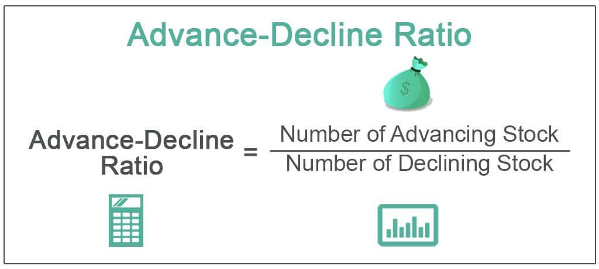

In the fast-paced world of stock trading, understanding market indicators is crucial for traders. The Advance/Decline Ratio (ADR) is an essential market-breadth indicator playing a significant role in algorithmic trading. ADR evaluates the market's underlying strength by comparing the number of advancing stocks to those that are declining over a given period. This comparison provides insights that go beyond simple price movements, helping traders assess market sentiment, identify potential trends, and anticipate reversals. By effectively analyzing ADR, traders can make more informed decisions, enhancing their ability to react to market trends. As we explore the intricacies of ADR, its calculation, interpretation, and application in trading strategies, we aim to highlight its importance in modern trading practices. Understanding ADR can empower traders to navigate market complexities with greater confidence, enabling them to optimize their strategies and respond adeptly to evolving market conditions.

## Table of Contents



## What is the Advance/Decline Ratio (ADR)?

The Advance/Decline Ratio (ADR) is a crucial metric in the analysis of stock market performance, quantifying market breadth by comparing the number of advancing stocks to declining ones over a defined period. This ratio serves as a pivotal gauge of market sentiment, indicating whether the prevailing mood among investors is optimistic or pessimistic.

ADR offers a numerical perspective on current market trends, facilitating the identification of bullish or bearish phases. A higher ADR suggests that a majority of stocks are advancing, signaling a bullish market, whereas a lower ADR indicates a dominance of declining stocks, pointing to a bearish trend. Unlike mere price movements, ADR encompasses the level of stock participation in prevailing market trends, providing a more comprehensive view.

For example, if in a given session, 1,500 stocks advance while 1,000 decline, the ADR would be calculated as follows:

$$
\text{ADR} = \frac{\text{Number of Advancing Stocks}}{\text{Number of Declining Stocks}} = \frac{1500}{1000} = 1.5
$$

This result suggests a tendency towards a bullish market sentiment, given that the number of advancing stocks outweighs the number of decliners.

Understanding ADR can yield significant insights into the general health and [momentum](/wiki/momentum) of the market. By analyzing this ratio, traders can make more informed predictions about market direction, improving their ability to anticipate potential shifts. This understanding goes beyond simple price analysis, providing traders with a deeper comprehension of market dynamics that could influence trading strategies.

## How ADR Works in Stock Market Indicators

The Advance/Decline Ratio (ADR) serves as a crucial market momentum barometer, providing insights into the broader stock market's direction by analyzing whether more stocks are advancing or declining during a given period. A high ADR suggests a bullish market environment, characterized by a greater number of advancing stocks compared to decliners. Conversely, a low ADR indicates a bearish sentiment, dominated by more declining stocks. This relation can be expressed mathematically as:

$$
\text{ADR} = \frac{\text{Number of Advancing Stocks}}{\text{Number of Declining Stocks}}
$$

By examining ADR trends, traders can effectively discern the market's direction and pinpoint potential shifts in momentum. For instance, a consistently increasing ADR may signal strengthening bullish trends, while a declining ADR could indicate a weakening market and potential bearish reversals.

What makes ADR particularly valuable is its ability to filter out market noise, allowing traders to focus on the true breadth of the market. Unlike other metrics that might be swayed by the performance of a few large-cap stocks, ADR provides a more comprehensive view by considering the collective movement of all stocks within a specified universe.

Additionally, ADR can be calculated over various timeframes, catering to both short-term and long-term market perspectives. This flexibility means traders can analyze daily market activities or observe the ADR over extended periods to gain insights into enduring market trends. For day traders, an intraday ADR could offer insights into immediate market shifts, while long-term traders might prefer weekly or monthly ADR data for evaluating sustained market dynamics.

Overall, the Advance/Decline Ratio offers traders a nuanced view of market momentum and sentiment, equipping them with a potent tool for making informed trading decisions. By incorporating ADR analysis into their market strategies, traders can better anticipate shifts and optimize their actions accordingly.

## Calculating the Advance/Decline Ratio

The Advance/Decline Ratio (ADR) is calculated using a straightforward formula:

$$
\text{ADR} = \frac{\text{Number of Advancing Stocks}}{\text{Number of Declining Stocks}}
$$

This calculation provides a quantitative measure of market breadth by comparing the number of stocks that are experiencing price increases (advancing) to those experiencing price decreases (declining) within a specific period. While the formula itself is uncomplicated, interpreting the resulting ratio requires a deeper understanding of the current market conditions. For instance, contextual factors such as market [volatility](/wiki/volatility-trading-strategies), economic announcements, and sector performance can significantly influence the interpretation of ADR data.

Examining ADR over various timeframes allows traders to detect trends and confirm shifts in market momentum. A higher ADR indicates a bullish market sentiment, which is exemplified when advancing stocks significantly outnumber declining ones. Conversely, an ADR below 1.0 could signal bearish conditions, where decliners predominate. For example, if 2,000 stocks in a market rise in price and 1,000 fall, the ADR would be:

$$
\text{ADR} = \frac{2000}{1000} = 2.0
$$

This result points to a bullish bias, suggesting that market sentiment is positive with twice as many stocks on the upswing.

To reduce the effect of short-term volatility and better understand long-term trends, traders often use moving averages of the ADR. This method helps smooth out daily fluctuations, providing a clearer view of the overall market trend. Moving averages can be calculated using various methods, such as simple moving averages (SMA) or exponential moving averages (EMA), depending on the trader's preference and strategy.

In Python, calculating the ADR along with its moving average could be implemented as follows:

```python
def calculate_adr(advancing_stocks, declining_stocks):
    if declining_stocks == 0:
        return float('inf')  # Handle division by zero
    return advancing_stocks / declining_stocks

def moving_average(data, window_size):
    return [sum(data[i:i + window_size]) / window_size for i in range(len(data) - window_size + 1)]

# Example usage:
advancing_stocks = [2000, 2200, 2100, 2500]
declining_stocks = [1000, 1100, 1000, 1300]
adr_values = [calculate_adr(adv, decl) for adv, decl in zip(advancing_stocks, declining_stocks)]

window_size = 3
adr_moving_avg = moving_average(adr_values, window_size)

print("ADR Values:", adr_values)
print(f"{window_size}-day Moving Average of ADR:", adr_moving_avg)
```

This code calculates the ADR for a given dataset of advancing and declining stocks and computes a moving average over a specified window size. Such calculations help traders focus beyond immediate market noise and facilitate the recognition of persistent trends that may impact trading strategies.

## Types and Applications of ADR

The Advance/Decline Ratio (ADR) can serve as both a standalone figure and a trend indicator. Its utility extends across various time frames, making it a versatile tool for traders seeking to analyze market dynamics.

Short-term ADR is instrumental in assessing daily market fluctuations. Traders can observe what proportion of stocks are advancing relative to those declining to gauge day-to-day market sentiment. This immediate insight helps traders respond to rapid market changes and identify possible entry or [exit](/wiki/exit-strategy) points based on current sentiment.

On the other hand, long-term ADR analysis provides valuable insights into broader market trends. By observing ADR over an extended period, traders can discern the overall health of the market. A consistent high ADR over weeks or months may indicate an underlying bullish trend, while a prolonged low ADR might suggest bearish conditions.

Comparing ADR with major market indices allows traders to assess the contribution of individual stocks to the overall market movement. A high ADR in the face of a declining index can imply that a few large stocks might be disproportionately influencing the index. Conversely, a rising index with a low ADR may suggest that only a limited number of stocks are driving the upward trend, prompting traders to be cautious.

In [algorithmic trading](/wiki/algorithmic-trading), ADR plays a significant role as it enables automated decision-making based on predefined thresholds. Algorithms can use ADR data to trigger trades when specific conditions are met, such as an ADR crossing a designated level. This application underscores ADR's compatibility with systematic trading strategies, where speed and precision are paramount.

ADR enhances technical analysis by providing a more comprehensive picture of market sentiment. It complements price and [volume](/wiki/volume-trading-strategy) data, offering a three-dimensional view of market conditions. Traders leveraging ADR can better understand whether market movements are broad-based or concentrated within specific stocks, aiding in the development of more robust trading strategies. By integrating ADR with other metrics, traders are able to refine their analysis and navigate market complexities with greater confidence.

## Advantages and Disadvantages of ADR

The Advance/Decline Ratio (ADR) serves as a vital tool in financial analysis with several notable advantages. Its primary strength lies in gauging market sentiment by measuring the number of advancing stocks relative to declining ones. ADR can effectively identify trends, offering a quantitative perspective on whether the market is experiencing bullish or bearish momentum. Additionally, it functions as an early warning signal for potential trend reversals, providing traders with the opportunity to adjust their strategies accordingly. The ability of ADR to signal overbought or oversold conditions further enhances its utility, allowing traders to anticipate corrections or continuations in market movements.

However, ADR also presents several disadvantages. One of the main limitations is its susceptibility to skew, particularly due to the influence of large-cap stocks. In markets where large-cap stocks dominate, ADR may misrepresent the actual sentiment of smaller stocks, leading to potential inaccuracies in market interpretation. This skewing effect can distort the indicator's reflection of broader market dynamics.

Furthermore, ADR lacks sector-specific insights, which can be critical for traders focusing on particular industries. The indicator provides a broad overview without differentiating between the performance of various sectors, potentially overlooking sector-specific trends and signals that may be crucial for targeted trading strategies.

Moreover, the effectiveness of ADR might be compromised by market volatility and noise. During periods of heightened volatility, the fluctuations in ADR can obscure genuine signals, complicating the interpretation of market trends. This challenge requires traders to exercise caution and consider additional indicators or frameworks to validate ADR signals reliably.

In summary, while the Advance/Decline Ratio offers substantial benefits in assessing market sentiment and identifying trends, traders should be mindful of its limitations, such as skew towards large-cap stocks and the absence of sector-specific insights. Incorporating ADR into a broader analytical framework and combining it with complementary indicators can enhance its reliability and applications in trading strategies.

## Incorporating ADR into Trading Strategies

Integrating the Advance/Decline Ratio (ADR) into trading strategies can significantly enhance a trader's ability to evaluate market sentiment and identify potential trends. The ADR serves as a critical component in algorithms focused on market breadth, and its effectiveness increases when combined with other technical indicators.

When employing ADR in trading strategies, coupling it with volume indicators and moving averages can refine signal accuracy. For instance, combining ADR with the Moving Average Convergence Divergence (MACD) or the Relative Strength Index (RSI) can corroborate signals, offering a more comprehensive view of market dynamics. Volume indicators are particularly useful, as elevated trading volumes often accompany genuine market movements, thereby substantiating the trends indicated by ADR. 

Sustained ADR trends are noteworthy as they signify a strong and continuous market direction. A persistently high ADR suggests sustained market optimism, whereas a low ADR over time indicates prolonged pessimism. Conversely, divergences between ADR and price movements can serve as early warnings of potential trend reversals. For example, if prices rise while ADR declines, it may suggest weakening participation in the uptrend, signaling a possible reversal.

Traders frequently monitor ADR alongside economic events to adjust their entry and exit points. Economic announcements can cause significant market fluctuations, making it pivotal for traders to align their strategies with such events. By observing how ADR responds to these events, traders can make more informed decisions on optimal trading times.

Careful interpretation of ADR trends allows traders to align strategies with broader market movements. Understanding when ADR is indicating a major shift can offer traders an advantage in anticipating market swings. Traders can incorporate this data by setting algorithmic thresholds that trigger buy or sell signals based on ADR configurations.

By utilizing ADR thoughtfully and in combination with complementary data, traders can achieve a more nuanced understanding of market behavior. Properly implemented, ADR can significantly enhance trading strategies, allowing for decisions that are more informed by underlying market sentiment and trends.

## Conclusion

The Advance/Decline Ratio (ADR) represents a crucial component of stock market analysis by providing a snapshot of market breadth and sentiment. This tool allows traders to glean insights into whether the market is predominantly optimistic or pessimistic by comparing advancing stocks to declining ones. Its value becomes evident when paired with other indicators, as ADR can enhance trading strategies by confirming trends or identifying potential reversals.

Algorithmic trading benefits greatly from incorporating measures like ADR since it helps traders anticipate potential market directions and make more informed decisions. With its formula ADR = Number of Advancing Stocks / Number of Declining Stocks, traders can easily compute and integrate ADR into automated systems for timely evaluations of market sentiment.

Understanding ADR requires more than merely examining raw numbers; it involves contextualizing data with other market indicators to optimize outcomes. Traders can improve the efficacy of ADR assessments by cross-validating with volume data, moving averages, and economic events to improve predictive accuracy.

Although ADR has its limitations, such as its sensitivity to large-cap stocks and potential sector biases, these can be mitigated by integrating complementary indicators and focusing on comprehensive market analysis. Adjusting calculations over different timeframes further refines insights and enhances strategic planning.

In conclusion, mastering ADR equips traders with a nuanced view of market conditions, enabling them to navigate complexities effectively. Those who invest time in comprehending and utilizing the ADR within their trading frameworks can unlock significant advantages, positioning themselves ahead in the competitive landscape of stock markets.

## References & Further Reading

[1]: McMillan, L. G. (2012). ["Options as a Strategic Investment"](https://archive.org/details/optionsasstrateg0000mcmi_t0g2) (5th ed.). Prentice Hall Press.

[2]: Azzopardi, D., & Buckle, D. (2009). ["Market Breadth: Theory and Practice."](https://core.ac.uk/download/13100207.pdf) Palgrave Macmillan.

[3]: Elder, A. (2002). ["Come Into My Trading Room: A Complete Guide to Trading."](https://www.amazon.com/Come-Into-My-Trading-Room/dp/0471225347) John Wiley & Sons, Inc.

[4]: Kirkpatrick, C. D., & Dahlquist, J. R. (2019). ["Technical Analysis: The Complete Resource for Financial Market Technicians"](https://ptgmedia.pearsoncmg.com/images/9780134137049/samplepages/9780134137049.pdf) (3rd ed.). FT Press.

[5]: Pring, M. J. (2002). ["Technical Analysis Explained: The Successful Investor's Guide to Spotting Investment Trends and Turning Points"](https://www.amazon.com/Technical-Analysis-Explained-Fifth-Successful/dp/0071825177) (Fourth Edition). McGraw-Hill Education.