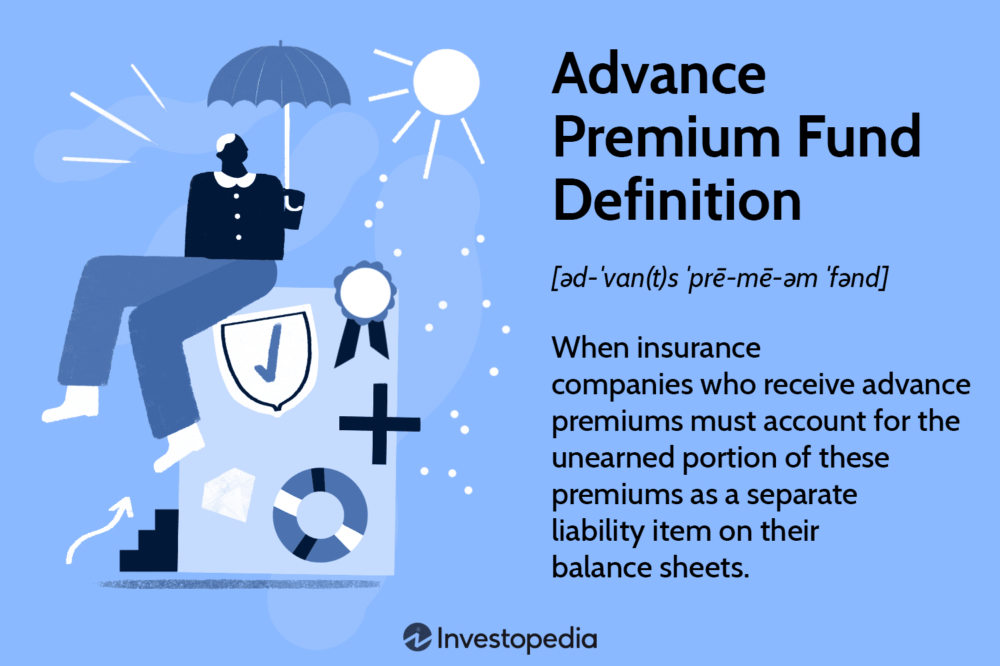

In the rapidly evolving world of finance and insurance, understanding the intricacies of premium funding is crucial. This article aims to explore the convergence of insurance, finance, and trading through advanced premium funds. Premium funding plays a pivotal role across various industries, serving as a cornerstone for sectors such as insurance and algorithmic trading. These funds enable insurers to manage financial health effectively while offering algorithmic traders a means to optimize strategies through reliable financial backing.

The role of advance premium funds offers a comprehensive approach to navigating financial strategies by maintaining liquidity and ensuring solvency. By efficiently managing these funds, businesses can foresee and mitigate potential financial challenges, ensuring stability and compliance with regulatory requirements. The synergies between finance, insurance, and trading highlight the capability of premium funding to advance financial strategies, prompting a re-evaluation of traditional approaches in financial management.



Join us in exploring these synergies, where advanced technologies and premium funding come together to foster innovation and enhance financial outcomes. Embracing the intersections of these industries may offer a strategic edge in developing robust, future-ready financial strategies. Understanding the mechanisms and benefits of premium funding is not only informative but also imperative for any financial entity striving to achieve long-term success.

## Table of Contents

## What is an Advance Premium Fund?

Advance Premium Funds (APFs) are an essential component in the world of insurance finance, centered around the management of pre-paid insurance premiums. These funds are collected from policyholders before the initiation of coverage and are recorded as a liability for the insurance company until the service is actually provided. This recognition is crucial because it ensures that the insurer accurately reflects its financial obligations on the balance sheet, thereby maintaining transparency and financial accuracy.

The collection and management of APFs involve several important processes. When a policyholder pays their premium upfront, the funds are held by the insurer and classified as unearned premiums in the company’s accounting records. These unearned premiums are gradually recognized as revenue over the term of the insurance contract, aligning with the period in which coverage is provided. This process is vital for insurers to accurately report their income and fulfill regulatory compliance, as per guidelines established by financial standards such as the International Financial Reporting Standards (IFRS) and Generally Accepted Accounting Principles (GAAP).

APFs not only help maintain financial health by providing insurers with an immediate influx of cash but also improve operational liquidity. By having these funds readily available, insurers can handle claims more efficiently without needing to liquidate other assets. This ensures that insurers can meet their policyholders' demands, thereby maintaining trust and reliability in the services they provide.

From a strategic perspective, APFs enable insurance companies to plan more effectively. Knowing that a certain amount of revenue is secure allows insurers to invest in growth opportunities, technology upgrades, and human resources, contributing to long-term stability and competitiveness in the market.

The benefits of Advance Premium Funds extend beyond just operational efficiency. They play a critical role in risk management by allowing companies to diversify their investment portfolios and hedge against potential financial downturns. This flexibility makes them not just a funding mechanism but a strategic asset for any insurance entity aiming to optimize its financial structure and market position. 

In summary, Advance Premium Funds are a cornerstone of the insurance business model, ensuring that insurance companies remain solvent, compliant, and capable of meeting their financial commitments. Understanding and effectively managing these funds is pivotal for maintaining the financial health and operational efficacy of insurance providers.

## How Advance Premium Fund Impacts Insurance Finance

Advance premium funds are essential for maintaining cash flow stability within the insurance sector. By collecting premiums in advance, insurance companies can earmark these funds for covering future policyholder claims, thus preventing potential financial instability.

At their core, advance premium funds help insurers efficiently manage their financial resources. These funds are recorded as liabilities on the insurer's balance sheet until the associated insurance coverage is provided. This accounting treatment underscores the importance of precise financial reporting and compliance with regulatory standards to maintain the company's financial health.

Strategically, advance premium funds enable insurance companies to strengthen their financial positions. For instance, the predictable cash flow generated from these funds allows insurers to allocate resources toward investments and operational expenses without compromising their capacity to meet policyholder claims. This strategic allocation not only bolsters an insurer's financial resilience but also enhances its profitability through potential investment returns.

From a financial management perspective, an insurer must employ effective methods to manage advance premium funds to sustain [liquidity](/wiki/liquidity-risk-premium) and solvency. Insurers often invest these funds in liquid assets that can be readily accessed when needed to pay claims. The management of these investments requires astute financial oversight to ensure that returns are maximized while minimizing risk and maintaining sufficient liquidity.

The impact of advance premium funds on liquidity is significant. By maintaining a pool of ready cash, insurers can fulfill their short-term obligations and absorb unexpected financial shocks. This financial buffer reduces the need for costly short-term borrowing and maintains the insurer's creditworthiness.

Moreover, advance premium funds significantly influence an insurer's solvency—the capacity to meet long-term obligations. By using these funds judiciously, insurance companies can assure policyholders and regulators of their ability to fulfill claims even during periods of high demand or adverse economic conditions. This contributes to the insurer's overall stability and reputation in the marketplace.

In summary, advance premium funds play a crucial role in the financial mechanics of the insurance industry. Their effective management ensures cash flow stability, enhances financial strength, and preserves the liquidity and solvency of insurers, facilitating a robust and reliable insurance system.

## Algorithmic Trading and Premium Funding

Algorithmic trading is increasingly harnessing advance premium funds as a means to model predictions and mitigate risks. These funds, traditionally used in the insurance industry, are now being integrated into trading strategies to enhance their efficacy. The intersection of algorithmic strategies with the financial potentials of premium funds opens new avenues for traders looking to optimize their financial models and improve returns.

The use of advance premium funds in [algorithmic trading](/wiki/algorithmic-trading) allows for better liquidity management. Traders can allocate these pre-paid premiums to ensure a stable cash flow, thereby minimizing the liquidity risks associated with market [volatility](/wiki/volatility-trading-strategies). By leveraging these funds, algorithmic trading systems gain the ability to make more accurate predictions, as they have a more reliable financial base to work from.

Tech advancements are transforming the utilization of these funds in trading. With the rise of [machine learning](/wiki/machine-learning) and [artificial intelligence](/wiki/ai-artificial-intelligence), traders can analyze historical premium data to predict market movements and adjust their strategies accordingly. For instance, a predictive model might use Python to process historical insurance premium data and correlate it with market trends to suggest optimal trading actions:

```python
import pandas as pd
from sklearn.ensemble import RandomForestRegressor

# Sample loading of historical premium data
data = pd.read_csv('premium_data.csv')
features = data.drop('market_movement', axis=1)
target = data['market_movement']

# Random forest model to predict market movement
model = RandomForestRegressor()
model.fit(features, target)

# Predicting future market movement
predictions = model.predict(features)
```

Such integrations illustrate how premium funds can be repurposed to refine trading algorithms, thereby aligning financial strategies across sectors.

Additionally, the symbiotic relationship between finance algorithms and the insurance industry is key to optimized returns. Insurers benefit from the increased precision in predictions, allowing them to offer competitive products while maintaining their financial stability. Conversely, traders benefit from the structured cash flows that insurance funds provide, which can be used as a buffer against sudden market shifts. This mutual benefit highlights the strategic importance of these funds in both finance and insurance industries, and underscores the importance of remaining adaptive to new technological advancements to harness their full potential.

## Advantages of Utilizing Advance Premium Funds

Utilizing advance premium funds offers several advantages that can significantly contribute to an insurance company's financial stability. One of the primary benefits is the predictability of cash flow. By collecting premiums in advance, insurers ensure a steady influx of funds, which can be strategically allocated to cover future claims, operational costs, and investment opportunities. This predictable cash flow minimizes the risk of liquidity shortages, allowing insurance firms to maintain financial equilibrium and respond effectively to policyholder claims.

Moreover, advance premium funds help reduce default risk. By securing premium payments upfront, insurers mitigate the risk associated with policyholders defaulting on their premium obligations. This ensures that even in challenging economic times, the insurer maintains a buffer, which is critical for fulfilling claims and sustaining operations. Consequently, advance premium funds contribute to the overall financial health and solvency of insurance firms.

These funds also offer flexibility and a wide array of investment opportunities. Insurers can invest capital from advance premium funds in various financial instruments, such as bonds, stocks, or real estate, to generate additional revenue. Such investments not only bolster the financial reserves of the company but also provide an opportunity to earn returns that can be reinvested into the business or used to lower policyholder premiums, thereby enhancing competitiveness in the market.

The strategic importance of advance premium funds is evident in the way they can be leveraged to align with broader financial goals. By having access to advance funds, insurers can engage in long-term financial planning, manage risks more effectively, and enhance their ability to take advantage of market opportunities. This is especially beneficial in an industry that is increasingly characterized by rapid changes and evolving consumer needs.

Real-world examples illustrate the successful utilization of advance premium funds. For instance, a major insurance firm may allocate a portion of its advance premium funds towards the development of innovative insurance products, thereby expanding its market share and increasing profitability. Another company might use its advance funds to improve its digital infrastructure, enhancing customer service and operational efficiency, which can lead to customer retention and increased sales.

In conclusion, the advantages of advance premium funds encompass financial stability, reduced default risk, investment flexibility, and strategic financial positioning. By understanding and effectively managing these funds, insurance companies can enhance their financial resilience and adaptability in an ever-changing economic landscape.

## Common Misconceptions and Clarifications

Addressing common misconceptions about advance premium funds is vital for ensuring their effective and efficient use. One prevalent misunderstanding is that advance premium funds are immediately available for an insurer's operational or investment purposes. In reality, these funds are designated liabilities on the balance sheet until the corresponding insurance coverage is provided. This allocation means insurers must maintain accurate financial records to reflect the pending obligation associated with these pre-paid premiums.

A second misconception is that advance premium funds are risk-free. While they provide a predictable cash flow, the funds still [carry](/wiki/carry-trading) inherent risks, such as mismatching of future claims with available resources. Proper management requires strategic foresight and financial acumen to adequately prepare for potential claims that these funds might eventually settle.

Regarding usage, some stakeholders inaccurately assume that advance premium funds enforce rigid investment strategies. In fact, insurers benefit from the flexibility afforded by these funds, allowing a range of investment opportunities, provided they align with regulatory standards and fiduciary responsibilities. However, it's critical that investment decisions account for the liquidity needs associated with future claims.

Understanding the legal and regulatory frameworks governing advance premium funds is also crucial. A frequent myth is that regulations surrounding these funds are negligible. On the contrary, insurers must navigate complex regulatory environments, with standards varying widely across jurisdictions. These rules may dictate specific reserve requirements or investment limitations to ensure that the funds remain solvent and accessible when needed.

Finally, there are myths around the overall impact of these funds on an insurer’s financial health. Some may think that advance premium funds alone can secure an insurer's financial stability. While they play a vital role, comprehensive financial health also depends on effective risk management, diversification, and adherence to industry best practices.

By dispelling these myths and providing clear insights into the practicalities of advance premium funds, stakeholders can better appreciate their full potential and benefits. Accurate understanding promotes sound financial strategizing and regulatory compliance, ultimately enhancing an insurer's capacity to manage risks effectively.

## Conclusion

Advance premium funds have emerged as integral components in the financial strategies of insurance and trading sectors. By consolidating insights from the preceding discussions, the substantial role these funds play becomes apparent. These funds foster financial stability and enable meticulous planning for future liabilities, ensuring that insurers and traders can navigate market volatility efficiently.

Strategic management of advance premium funds is imperative. In the insurance industry, it enables the allocation of resources toward future claims and liabilities, enhancing cash flow stability and reducing default risk. In trading, these funds provide a financial cushion, allowing for the exploitation of market opportunities while mitigating risks.

Looking ahead, the integration of advanced technologies and algorithms in managing these funds is anticipated. The utilization of big data analytics, artificial intelligence, and machine learning can optimize fund management, offering predictive insights and automated decision-making processes. Such technology-driven strategies will enhance efficiency and accuracy in managing advance premium funds, aligning with evolving financial paradigms.

Financial professionals must incorporate the principles of advance premium funding into their strategic planning. By leveraging these funds, businesses can enhance their liquidity, solvency, and overall financial health. Additionally, understanding the regulatory and legal frameworks governing these funds is crucial for compliance and risk management.

In conclusion, the adaptability and informed management of advance premium funds are paramount. As financial landscapes evolve, staying informed and responsive to changes will empower organizations to maintain competitiveness and achieve long-term success. By embracing the ongoing advancements in technology and regulation, businesses can ensure that their financial strategies remain robust and effective.

## References & Further Reading

[1]: ["Insurance Premium Finance: What a Financier Needs to Know"](https://www.assureful.com/insurance-premium-financing/) by Eliezer G. Kalifa

[2]: ["IFRS 17 Insurance Contracts"](https://www.ifrs.org/issued-standards/list-of-standards/ifrs-17-insurance-contracts/) - International Financial Reporting Standards

[3]: Kearney, C. (2016). ["An Overview of Algorithmic Trading: Execution Strategies and Market Structure"](https://www.researchgate.net/publication/378548435_Algorithmic_Trading_and_AI_A_Review_of_Strategies_and_Market_Impact) Journal of Asset Management

[4]: ["Algorithmic and High-Frequency Trading"](https://www.amazon.com/Algorithmic-High-Frequency-Trading-Mathematics-Finance/dp/1107091144) by Álvaro Cartea, Sebastian Jaimungal, and José Penalva

[5]: Dorobantu, F., & Stefanescu, C. (2018). ["Liquidity-Based Strategies in Algorithmic Trading"](https://www.researchgate.net/publication/378548435_Algorithmic_Trading_and_AI_A_Review_of_Strategies_and_Market_Impact) in Advances in Financial Machine Learning and Quantitative Finance

[6]: Chan, E. P. (2013). ["Algorithmic Trading: Winning Strategies and Their Rationale"](https://github.com/ftvision/quant_trading_echan_book)

[7]: ["GAAP Accounting Standards"](https://fasb.org/standards) - Financial Accounting Standards Board

[8]: Mihov, V. (2019). ["Machine Learning and Big Data with kdb+/q"](https://onlinelibrary.wiley.com/doi/book/10.1002/9781119404729)