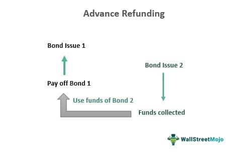

## Table of Contents

## What is advance refunding?

Advance refunding is when a company or government replaces an old bond with a new one before the old bond is due. They do this to save money because the new bond might have a lower interest rate. The money from the new bond is used to buy safe investments like government securities. The earnings from these investments are then used to pay off the old bond when it comes due.

This process can help the issuer save money over time, but it can be complicated. It's often used by governments and big companies because they can handle the complex rules and costs involved. Advance refunding is not allowed for everyone, and there are special rules about when and how it can be done.

## How does advance refunding work?

Advance refunding happens when an organization decides to replace an old bond with a new one before the old bond's due date. They do this because the new bond might have a lower interest rate, which helps them save money. To make this work, the organization uses the money from the new bond to buy safe investments, like government securities. The earnings from these investments are then used to pay off the old bond when it comes due.

This process can help save money over time, but it's not simple. It's usually done by governments and large companies because they can handle the complex rules and costs. There are special rules about when and how advance refunding can be done, and not everyone is allowed to do it. It's important to follow these rules carefully to make sure everything goes smoothly.

## What are the benefits of advance refunding for issuers?

Advance refunding helps issuers save money. When they issue a new bond with a lower interest rate, they can use the money from this new bond to pay off an old bond that has a higher interest rate. This means they pay less in interest over time. For example, if a city had a bond with a 5% interest rate and they can now get a new bond at 3%, they save 2% on interest for the remaining life of the bond.

It also helps issuers manage their debt better. By using the money from the new bond to buy safe investments like government securities, they can set aside enough money to pay off the old bond when it's due. This makes their future payments more predictable and easier to plan for. It's like putting money into a savings account that grows enough to cover a future bill.

## What are the potential risks associated with advance refunding?

Advance refunding can be tricky because it involves a lot of rules and steps. If issuers do not follow these rules carefully, they might face penalties or legal problems. For example, there are strict rules about when and how you can do advance refunding, and if you mess up, it can cost a lot of money. Also, the costs of issuing the new bond, like fees for lawyers and bankers, can be high. If these costs are more than the savings from the lower interest rate, then the issuer might not save money at all.

Another risk is that the investments used to pay off the old bond might not perform as expected. If the government securities or other safe investments do not earn enough money, there might not be enough to cover the old bond when it comes due. This could leave the issuer in a tough spot, needing to find more money to pay off the bond. It's a bit like betting that your savings will grow enough to cover a future expense, but if it doesn't, you're in trouble.

## What is the difference between current and advance refunding?

Current refunding and advance refunding are two ways that an organization can replace an old bond with a new one. In current refunding, the old bond is paid off within 90 days of the new bond being issued. This means the old bond is almost due, and the organization uses the money from the new bond to pay it off right away. It's like using a new loan to pay off an old one that's about to come due.

Advance refunding, on the other hand, happens more than 90 days before the old bond is due. The organization issues a new bond with a lower interest rate and uses the money to buy safe investments like government securities. The earnings from these investments are then used to pay off the old bond when it comes due. It's like taking out a new loan to save money on interest, and using the savings to pay off an old loan in the future.

## What are the key regulations governing advance refunding?

Advance refunding is controlled by rules set by the IRS and the SEC. The IRS says you can only do advance refunding once for each bond. This means you can't keep replacing the same bond over and over to save on interest. Also, the IRS has rules about how to use the money from the new bond. You have to use it to buy safe investments like government securities, and you can't touch this money until the old bond is due. If you don't follow these rules, you might have to pay big fines.

The SEC also has rules to make sure everyone knows what's going on. They want to make sure that investors are told about the new bond and what it means for the old one. This helps keep everything fair and open. Both the IRS and SEC rules are there to make sure advance refunding is done the right way and doesn't cause problems for anyone.

## How has the Tax Cuts and Jobs Act affected advance refunding?

The Tax Cuts and Jobs Act, which was passed in 2017, changed the rules for advance refunding. Before this law, cities and states could do advance refunding more than once for the same bond. But after the law, they can only do it once. This means if they want to save money by getting a new bond with a lower interest rate, they have to be very careful and plan well because they won't get another chance.

This change makes advance refunding harder for cities and states. They have to think carefully about when to do it because they can't do it again. If they make a mistake, they might not be able to save as much money as they hoped. The law was made to help the government collect more taxes, but it makes things more complicated for cities and states that need to manage their money well.

## What role do escrow accounts play in advance refunding?

In advance refunding, escrow accounts are very important. When a city or company decides to replace an old bond with a new one, they put the money from the new bond into an escrow account. This account is like a special savings account that they can't touch until the old bond is due. They use the money in the escrow account to buy safe investments, like government securities, which will grow over time.

The earnings from these investments in the escrow account are then used to pay off the old bond when it comes due. This makes sure that the old bond gets paid off on time, even though it's being replaced early. The escrow account helps keep everything organized and makes sure the money is there when it's needed. It's like setting aside money now to make sure you can pay a big bill later.

## How do you calculate the savings from an advance refunding?

To calculate the savings from an advance refunding, you need to compare the interest costs of the old bond with the interest costs of the new bond. First, figure out how much interest you would pay on the old bond until it's due. Then, calculate how much interest you'll pay on the new bond. The difference between these two amounts is your potential savings. But you also need to subtract any costs of doing the advance refunding, like fees for lawyers and bankers. If the savings from the lower interest rate are more than these costs, you'll save money.

It's also important to think about the investments you buy with the money from the new bond. These investments, usually government securities, should earn enough money to pay off the old bond when it's due. If they don't earn enough, you might not save as much as you hoped. So, when calculating savings, you need to make sure the earnings from these investments are enough to cover the old bond's payments. This way, you can get a good idea of how much money you'll really save with an advance refunding.

## What are the accounting implications of advance refunding?

When a company or government does an advance refunding, it changes how they show their money in their accounting books. They have to take the old bond off their books and put the new bond on instead. They also have to show the money they put into the escrow account and the investments they bought with it. This can make their financial statements look different, showing less debt from the old bond and new debt from the new bond. They also need to show any costs they paid to do the advance refunding, like fees for lawyers and bankers.

The accounting rules say they have to be careful about how they handle the old bond. Even though they are replacing it early, they can't just pretend it's gone. They have to show it as "defeased" in their books, which means it's still there but the money to pay it off is set aside in the escrow account. This helps everyone see that the old bond will be paid off, even though it's being replaced. It's important to follow these rules so their financial statements are honest and clear.

## What are the best practices for managing an advance refunding transaction?

When managing an advance refunding transaction, it's important to plan carefully and follow the rules. Start by checking if it makes sense to do an advance refunding. Look at the interest rates and see if you can save money by getting a new bond with a lower rate. Make sure you understand all the costs, like fees for lawyers and bankers, and that the savings will be more than these costs. Also, make sure you follow the IRS and SEC rules about when and how you can do an advance refunding. These rules are there to keep everything fair and to avoid big fines.

Once you decide to go ahead, set up an escrow account and use the money from the new bond to buy safe investments, like government securities. These investments should earn enough money to pay off the old bond when it's due. Keep good records of everything you do, so you can show that you followed the rules. It's also a good idea to work with experts like lawyers and financial advisors who know about advance refunding. They can help you do everything right and make sure you save as much money as possible.

## How do market conditions influence the decision to pursue advance refunding?

Market conditions play a big role in deciding whether to do an advance refunding. When interest rates go down, it might be a good time to get a new bond with a lower rate. This can save money because the new bond will cost less in interest than the old one. But you also have to think about how much it will cost to do the advance refunding, like fees for lawyers and bankers. If these costs are too high, you might not save any money at all. So, you need to look at the interest rates and the costs to see if it's worth doing.

Another thing to think about is how the market is doing for the investments you'll buy with the new bond's money. Usually, you buy safe investments like government securities, and you want these to earn enough to pay off the old bond when it's due. If the market is doing well and these investments are earning a good return, it can make advance refunding a better deal. But if the market is not doing well, you might not earn enough, and then you could be in trouble when the old bond comes due. So, checking the market conditions is a big part of deciding if advance refunding is a good idea.

## What is Understanding Advance Refunding?

Advance refunding is a sophisticated financial strategy used by municipalities to refinance existing debt by issuing new bonds. This approach is particularly advantageous when interest rates are declining, as it enables the issuer to secure lower interest costs, thereby enhancing fiscal efficiency. The mechanism of advance refunding is not merely the issuance of new debt but involves a comprehensive evaluation of timing and potential cost savings, making the process both strategic and pragmatic.

At its core, advance refunding facilitates the redemption of outstanding bonds before their maturity date through the issuance of new bonds. This maneuver allows the entity to capitalize on favorable interest rates, which can significantly reduce the cost of debt service. By issuing new bonds at lower interest rates, the municipality can generate savings on interest expenses over the life of the bonds.

To execute advance refunding, issuers often establish a sinking fund—a dedicated fund where the proceeds from the new bond issue are deposited. The sinking fund is structured to systematically retire the older, higher-interest bonds at their call dates or maturity. This strategic setup ensures that the debt is recalled or paid down under more advantageous borrowing conditions. 

The process is initiated by thorough financial analysis and forecasting, which involves assessing the current [interest rate](/wiki/interest-rate-trading-strategies) environment and projecting future rates. This financial evaluation allows issuers to determine the optimal timing for advance refunding to maximize savings. Moreover, issuers must [factor](/wiki/factor-investing) in possible costs associated with the transaction, including underwriting fees, legal expenses, and any penalties for early bond repayment. 

In mathematical terms, the net present value (NPV) of the cash flows is evaluated to decide if advance refunding is a financially viable option. The NPV calculation takes into account the future cash flows from both the old and new bond issues, discounted back to present value terms using the current yield curve. The basic formula for NPV is:

$$
\text{NPV} = \sum \frac{C_t}{(1 + r)^t} - C_0
$$

where $C_t$ is the net cash inflow during the period $t$, $r$ is the discount rate, and $C_0$ is the initial investment, or cash outflow in today's terms.

Advance refunding thus requires precision in both financial assessment and timing to optimize the financial outcomes. When executed successfully, it not only provides cost savings but also allows municipalities to manage their debt obligations more efficiently, contributing to improved fiscal health.

## References & Further Reading

[1]: Kang, C., & Bastani, M. (2019). ["Algorithmic Trading in the Municipal Bond Market."](https://www.ecb.europa.eu/paym/groups/pdf/bmcg/191120/2019-11-20_-_BMCG_-_Item_3b_-_Algorithmic_trading_in_bond_markets_-_Morgan_Stanley.pdf) Journal of Banking & Finance, 106, 50-68.

[2]: Green, R. C., Li, D., & Schürhoff, N. (2010). ["Price Discovery in Illiquid Markets: Do Financial Asset Prices Rise Faster Than They Fall?"](https://www.jstor.org/stable/40864983) The Review of Financial Studies, 23(3), 1145-1183.

[3]: Fabozzi, F. J. (Editor), "Handbook of Municipal Bonds." Wiley Finance, 2008. Available on [Amazon](https://onlinelibrary.wiley.com/doi/book/10.1002/9781119198093).

[4]: "Tax Cuts and Jobs Act: A Commentary and Analysis." CCH Incorporated. Available at [Wolters Kluwer](https://www.italymagazine.com/passignano-sul-trasimeno?overridden_route_name=entity.taxonomy_term.canonical&base_route_name=entity.taxonomy_term.canonical&page_manager_page=taxonomy&page_manager_page_variant=taxonomy-panels_variant-0&page_manager_page_variant_weight=-10).

[5]: Narayan, P. K., & Bannigidadmath, D. (2015). ["Do Economic Conditions Predict the Us Municipal Bond Premium?"](https://www.deakin.edu.au/__data/assets/pdf_file/0004/411934/2015_07-7.pdf) International Review of Financial Analysis, 39, 176-185.