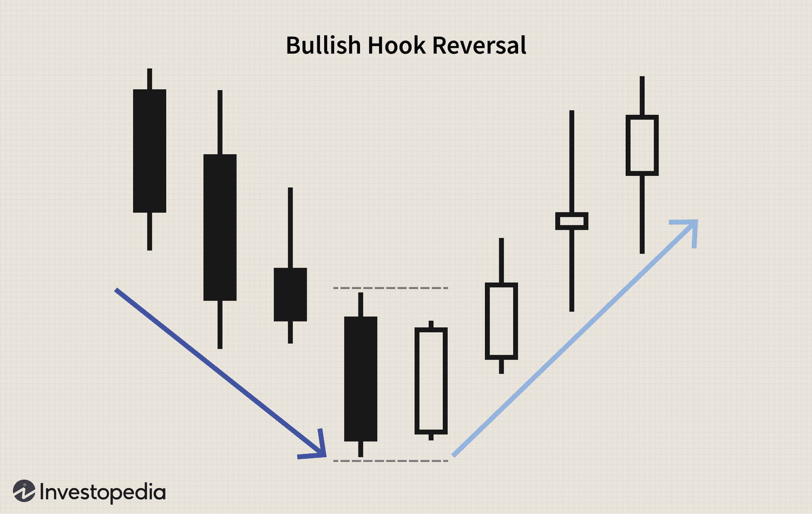

## Table of Contents

## What are candlestick charts and why are they important in trading?

Candlestick charts are a type of chart used to show how the price of something, like a stock or a currency, changes over time. Each "candlestick" on the chart represents what happened to the price during a certain period, like a day or an hour. The candlestick has a wide part, called the body, which shows the opening and closing prices. If the closing price is higher than the opening price, the body is usually colored white or green. If it's lower, the body is usually colored black or red. There are also thin lines, called wicks or shadows, that stick out from the top and bottom of the body. These show the highest and lowest prices during that period.

Candlestick charts are important in trading because they help traders see patterns and trends in price movements more easily than other types of charts. By looking at these patterns, traders can make guesses about what might happen to the price next. For example, certain patterns might suggest that the price is going to go up, while others might suggest it's going to go down. This information can help traders decide when to buy or sell, making their trading decisions more informed and potentially more successful.

## What are the basic components of a candlestick?

A candlestick has two main parts: the body and the wicks. The body shows the opening and closing prices of the time period it represents. If the closing price is higher than the opening price, the body is usually colored green or white. This means the price went up during that time. If the closing price is lower than the opening price, the body is usually colored red or black. This means the price went down.

The wicks, also called shadows, are the thin lines that stick out from the top and bottom of the body. The top wick shows the highest price reached during the time period, and the bottom wick shows the lowest price. Together, the body and the wicks give traders a clear picture of how the price moved during that specific time, making it easier to spot patterns and trends.

## What is the difference between a bullish and a bearish candlestick?

A bullish candlestick shows that the price went up during the time it represents. You can see this because the body of the candlestick is usually colored green or white. The bottom of the body is the opening price, and the top of the body is the closing price. This means the price at the end of the time period was higher than at the start. Bullish candlesticks make traders think that the price might keep going up, so they might decide to buy.

A bearish candlestick shows that the price went down during the time it represents. The body of the candlestick is usually colored red or black. The top of the body is the opening price, and the bottom of the body is the closing price. This means the price at the end of the time period was lower than at the start. Bearish candlesticks make traders think that the price might keep going down, so they might decide to sell.

## What are some common simple candlestick patterns beginners should know?

Some common simple candlestick patterns that beginners should know are the Doji, Hammer, and Shooting Star. A Doji looks like a plus sign or a cross. It happens when the opening and closing prices are very close or the same. This shows that the market is not sure which way to go next. A Hammer has a small body at the top and a long bottom wick. It looks like a hammer. This pattern usually shows up at the bottom of a downtrend and can mean the price might start going up. A Shooting Star has a small body at the bottom and a long top wick. It looks like a star falling from the sky. This pattern usually shows up at the top of an uptrend and can mean the price might start going down.

These patterns are important because they give traders hints about what might happen next with the price. When you see a Doji, it's a good idea to wait and see what happens next because the market is unsure. If you see a Hammer at the end of a downtrend, it might be a good time to buy because the price could start going up. And if you see a Shooting Star at the end of an uptrend, it might be a good time to sell because the price could start going down. Learning these simple patterns can help beginners make better trading decisions.

## How can candlestick patterns be used to predict market trends?

Candlestick patterns can help traders guess what the market might do next by showing them special shapes made by the price over time. When traders see these shapes, they can use them to figure out if the price might go up or down. For example, if a trader sees a Hammer pattern at the end of a time when the price has been going down, they might think the price is about to start going up. This is because the Hammer shows that even though the price went down a lot, it came back up by the end of the time period, which can mean the market is getting ready to change direction.

On the other hand, if a trader sees a Shooting Star pattern at the end of a time when the price has been going up, they might think the price is about to start going down. The Shooting Star shows that the price went up a lot but then came back down by the end of the time period, which can mean the market is getting tired and might change direction soon. By looking at these patterns, traders can make better guesses about what the market might do next and decide when to buy or sell.

## What are some advanced candlestick patterns and how do they form?

Advanced candlestick patterns are more complex shapes that traders look for to predict what the market might do next. One example is the Morning Star pattern. This pattern forms over three days and shows up at the end of a downtrend. The first day is a long bearish candlestick, showing the price going down a lot. The second day is a small candlestick, which can be either bullish or bearish, showing that the price isn't moving much. The third day is a long bullish candlestick, showing the price going up a lot. This pattern looks like the price is waking up from a downtrend and might start going up.

Another advanced pattern is the Evening Star, which is the opposite of the Morning Star. It forms over three days and shows up at the end of an uptrend. The first day is a long bullish candlestick, showing the price going up a lot. The second day is a small candlestick, which can be either bullish or bearish, showing that the price isn't moving much. The third day is a long bearish candlestick, showing the price going down a lot. This pattern looks like the price is getting ready to go to sleep after an uptrend and might start going down. By understanding these patterns, traders can make better guesses about what the market might do next.

## How can traders confirm the reliability of advanced candlestick patterns?

Traders can confirm the reliability of advanced candlestick patterns by looking at other things besides just the patterns. One way is to use other kinds of charts, like moving averages or trend lines, to see if they agree with what the candlestick pattern is saying. If the pattern shows the price might go up and the moving average is also going up, that makes the pattern more reliable. Another way is to look at the trading volume. If the volume is high when the pattern forms, it means more people are trading, which can make the pattern more trustworthy.

It's also helpful to check the patterns over a longer time. If a pattern like the Morning Star or Evening Star has worked well in the past, it might work well again. Traders should keep track of how often these patterns lead to the price moving in the expected way. By combining candlestick patterns with other tools and checking them over time, traders can feel more confident about their guesses on what the market will do next.

## What role do volume and other indicators play in validating candlestick patterns?

Volume and other indicators help traders check if candlestick patterns are telling the truth about where the price might go next. When a candlestick pattern forms, like a Morning Star or an Evening Star, traders look at how many people were trading at that time. If a lot of people were trading, it means the pattern is stronger. High volume shows that more traders agree with the pattern, making it more likely that the price will move the way the pattern suggests.

Other indicators, like moving averages or trend lines, also help make sure candlestick patterns are reliable. If a pattern shows the price might go up, but the moving average is going down, traders might not trust the pattern as much. But if both the pattern and the moving average are saying the same thing, it gives traders more confidence in their guess about where the price is headed. By using volume and other indicators together with candlestick patterns, traders can make better decisions about when to buy or sell.

## How do different time frames affect the interpretation of candlestick patterns?

Different time frames can change how traders see and use candlestick patterns. If you look at a candlestick chart for a short time, like a few minutes, the patterns you see might be different from what you see on a chart for a longer time, like a few days or weeks. Short time frames can show quick changes in the price, but these changes might not mean much in the big picture. For example, a Hammer pattern on a 5-minute chart might show a quick dip and recovery in price, but it might not signal a big change in the overall trend.

On the other hand, candlestick patterns on longer time frames are usually more important. A pattern like a Morning Star on a daily chart might mean a bigger change in the market's direction than the same pattern on a 15-minute chart. Longer time frames give traders a better view of the overall trend and help them make more confident guesses about where the price might go next. By looking at candlestick patterns on different time frames, traders can get a clearer picture of the market and make better trading decisions.

## What are some strategies for trading based on advanced candlestick patterns?

When traders use advanced candlestick patterns like the Morning Star or Evening Star, they often combine these patterns with other tools to make their trading decisions. For example, if they see a Morning Star pattern at the end of a downtrend, they might wait to see if the trading volume is high when the pattern forms. High volume means more people are trading, which can make the pattern more reliable. They might also look at other indicators, like moving averages, to see if they agree with the pattern. If the moving average is also going up, it adds more confidence that the price might keep going up.

Another strategy is to use different time frames to check the patterns. A Morning Star on a daily chart might be more important than one on a 5-minute chart because it shows a bigger change in the market's direction. Traders might look at the pattern on a longer time frame first and then check shorter time frames to find the best time to enter a trade. For example, if they see a bullish pattern on a daily chart, they might wait for a smaller bullish pattern on a 1-hour chart to confirm their decision before buying. By using these strategies, traders can make more informed guesses about where the price might go next and increase their chances of making successful trades.

## How can one manage risks when trading with advanced candlestick patterns?

When trading with advanced candlestick patterns, managing risk is important to protect your money. One way to do this is by setting stop-loss orders. A stop-loss order is like a safety net that automatically sells your trade if the price goes down too much. This helps you limit how much money you could lose if the pattern doesn't work out the way you expected. Another way to manage risk is by not putting all your money into one trade. Instead, spread your money across different trades, so if one trade doesn't go well, you won't lose everything.

It's also a good idea to use other tools along with candlestick patterns to make sure your guesses about the market are as good as possible. For example, look at the trading volume and other indicators like moving averages to see if they agree with the pattern. If they do, you can feel more confident in your trade. And always remember to keep learning and watching the market. The more you know and the more you practice, the better you'll get at spotting when a pattern is likely to work and when it's better to wait.

## What are the limitations and potential pitfalls of relying on candlestick patterns for trading decisions?

Candlestick patterns can help traders guess where the price might go next, but they are not perfect. One big problem is that patterns can be hard to spot and different people might see them differently. This means two traders looking at the same chart might not agree on what they see. Also, patterns don't always work. Just because a pattern like a Morning Star shows up, it doesn't mean the price will go up every time. Sometimes the market does the opposite of what the pattern suggests, which can lead to losing money.

Another issue is that candlestick patterns work best when used with other tools, like moving averages or volume. If you only look at the patterns and ignore other signs, you might make bad trading decisions. For example, a pattern might look good on a short time frame but not on a longer one. It's also easy to see patterns that aren't really there, especially if you're hoping to see them. This can trick you into making trades based on wishful thinking instead of what the market is really doing.

## What are Trading Strategies and Technical Analysis?

Technical analysis is a fundamental aspect of many trading strategies, as it helps traders project future price movements through the interpretation of historical price data. This methodology relies on chart patterns and technical indicators to identify trends and potential reversals that are crucial for strategic trading.

### Chart Patterns and Technical Indicators

Chart patterns, such as head and shoulders, double tops, and cups with handles, provide visual insights into market dynamics. These formations allow traders to anticipate shifts in market direction and make informed decisions based on the perceived strength or weakness of the trend.

Technical indicators, on the other hand, offer quantitative data points that can guide entry and [exit](/wiki/exit-strategy) decisions. Common indicators include moving averages, the Relative Strength Index (RSI), and the Moving Average Convergence Divergence (MACD).

- **Moving Averages**: These are used to smooth out price data, creating a constantly updated average price. They help to identify the direction of the current trend. The moving average formula is:
$$
  \text{MA} = \frac{\sum_{i=1}^{n} P_i}{n}

$$

  where $P_i$ is the price at time $i$, and $n$ is the number of periods in the moving average.

- **Relative Strength Index (RSI)**: This momentum oscillator measures the speed and change of price movements and ranges from 0 to 100. Generally, an RSI above 70 may indicate an overbought condition, while an RSI below 30 may signal an oversold condition.

- **Moving Average Convergence Divergence (MACD)**: This trend-following momentum indicator shows the relationship between two moving averages of a security's price. The MACD is calculated by subtracting the 26-period Exponential Moving Average (EMA) from the 12-period EMA.

### Integration with Algorithmic Trading

The incorporation of [algorithmic trading](/wiki/algorithmic-trading) systems enhances the application of technical analysis, as algorithms can efficiently process large amounts of data to execute trades based on predefined parameters. These systems depend on the robust analysis provided by technical indicators to automate trading tasks.

For instance, traders might use Python to implement a simple trading algorithm based on a moving average crossover strategy:

```python
import pandas as pd

def moving_average_strategy(prices, short_window=10, long_window=30):
    signals = pd.DataFrame(index=prices.index)
    signals['price'] = prices
    signals['short_mavg'] = prices.rolling(window=short_window, min_periods=1, center=False).mean()
    signals['long_mavg'] = prices.rolling(window=long_window, min_periods=1, center=False).mean()
    signals['signal'] = 0.0
    signals['signal'][short_window:] = np.where(signals['short_mavg'][short_window:] 
                                                > signals['long_mavg'][short_window:], 1.0, 0.0)
    signals['positions'] = signals['signal'].diff()
    return signals

# Example usage:
# prices = pd.Series([...])
# signals = moving_average_strategy(prices)
```

This algorithm generates signals based on the crossing of short-term and long-term moving averages and provides a framework for automated trading decisions based on these technical assessments.

### Refining Trading Approaches

By combining technical analysis with algorithmic trading principles, traders can refine their approaches and automate tasks, resulting in more precise and timely market participation. The systematic application of technical indicators in trading algorithms enables traders to validate strategies through [backtesting](/wiki/backtesting) and optimize their execution across different market conditions.

In conclusion, understanding and applying technical analysis is essential for developing robust trading strategies. The integration of chart patterns, technical indicators, and algorithmic systems allows traders to enhance their decision-making processes and capitalize on market opportunities with greater efficiency.

## References & Further Reading

[1]: Bergstra, J., Bardenet, R., Bengio, Y., & Kégl, B. (2011). ["Algorithms for Hyper-Parameter Optimization."](https://dl.acm.org/doi/10.5555/2986459.2986743) Advances in Neural Information Processing Systems 24.

[2]: ["Advances in Financial Machine Learning"](https://www.amazon.com/Advances-Financial-Machine-Learning-Marcos/dp/1119482089) by Marcos Lopez de Prado

[3]: ["Evidence-Based Technical Analysis: Applying the Scientific Method and Statistical Inference to Trading Signals"](https://www.amazon.com/Evidence-Based-Technical-Analysis-Scientific-Statistical/dp/0470008741) by David Aronson

[4]: ["Machine Learning for Algorithmic Trading"](https://github.com/stefan-jansen/machine-learning-for-trading) by Stefan Jansen

[5]: ["Quantitative Trading: How to Build Your Own Algorithmic Trading Business"](https://github.com/LucindaYa/quant-resources/blob/master/Quantitative%20Trading%20How%20to%20Build%20Your%20Own%20Algorithmic%20Trading%20Business.pdf) by Ernest P. Chan