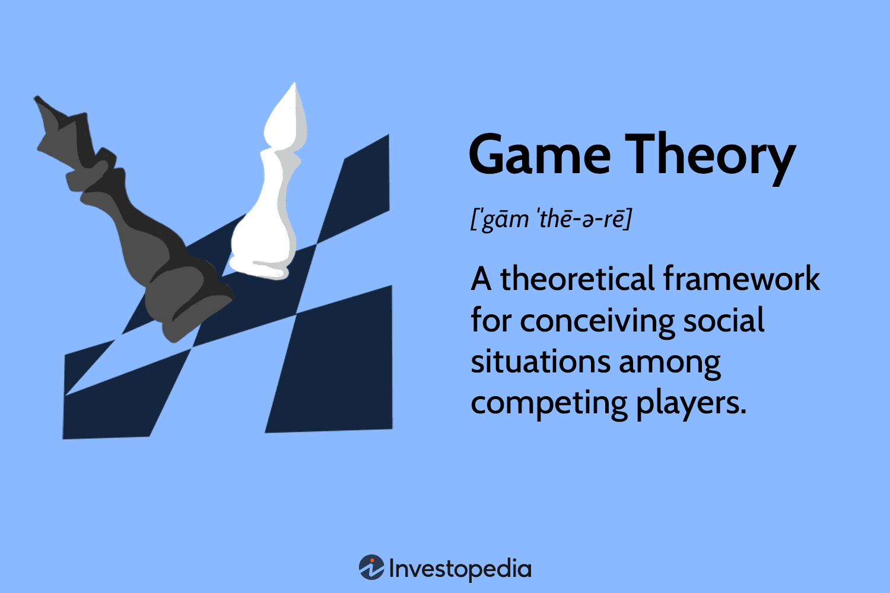

 to Advanced Concepts in Strategic Analysis, Game Theory, and Algorithmic Trading

Achieving a competitive edge in financial markets necessitates a sophisticated understanding of advanced strategies. This discussion covers the intersection of strategic analysis, game theory, and algorithmic trading. These concepts are essential for optimizing trading strategies and enhancing decision-making processes in increasingly complex markets. Understanding these methodologies offers traders valuable insights into the ever-changing market landscape.



Strategic analysis in trading involves evaluating various scenarios to identify optimal decision-making paths. By applying principles from game theory, traders can forecast competitor actions and develop advantageous strategies. Game theory, introduced by John von Neumann and Oskar Morgenstern, provides a mathematical framework for examining strategic interactions among rational decision-makers. Core components like players, strategies, payoffs, and Nash Equilibrium are crucial for market analysis and predicting competitor behavior.

Algorithmic trading harnesses these concepts, using algorithms to execute trades at high speeds and volumes, often with minimal human intervention. By incorporating game theoretic principles, algorithmic trading can identify and exploit market inefficiencies, achieving optimal outcomes. For instance, strategies may involve high-frequency trading, algorithmic market making, and arbitrage, all of which depend on quick, strategic decision-making.

The integration of game theory into algorithmic trading also involves a combination of advanced technologies such as artificial intelligence and machine learning. These technologies enhance the adaptability and intelligence of trading algorithms, allowing them to learn from market data and adjust strategies dynamically. Furthermore, emerging technologies like quantum computing hold the potential to transform market predictions and strategic interactions significantly.

In essence, understanding and applying advanced concepts in strategic analysis, game theory, and algorithmic trading can offer significant advantages. Traders equipped with these insights can better navigate financial markets, anticipate competitor behavior, and leverage technological advancements to refine their trading strategies dynamically. As financial markets continue to evolve, these methodologies will become increasingly important for capitalizing on opportunities and mitigating risks.

## Table of Contents

## Understanding Game Theory

Game theory is a structured methodology developed to analyze strategic interactions among rational decision-makers. Its foundation was laid by John von Neumann and Oskar Morgenstern in the 1940s, with their seminal work, "Theory of Games and Economic Behavior," forming the basis of economic game theory [1]. Since then, game theory has diversified into various branches, including cooperative and non-cooperative games.

At its core, game theory revolves around several key concepts: players, strategies, payoffs, and equilibrium. Players are the individual entities involved in the decision-making process, which could be individuals, firms, or even countries, depending on the context. Each player in the game has a set of possible strategies, which represent the choices available to them. The payoffs are the outcomes associated with each combination of strategies employed by the players, often represented in terms of utility or profits.

One of the most pivotal concepts in game theory is the Nash Equilibrium, named after mathematician John Nash. A Nash Equilibrium occurs when no player has an incentive to deviate from their chosen strategy, given the strategies chosen by the other players. Formally, in a game with $n$ players, a strategy profile $(s_1^*, s_2^*, \ldots, s_n^*)$ is a Nash Equilibrium if for each player $i$, the following condition holds:

$$
u_i(s_i^*, s_{-i}^*) \geq u_i(s_i, s_{-i}^*)
$$

where $s_{-i}^*$ denotes the strategies of all players except player $i$, and $u_i$ is the payoff function for player $i$.

In the context of financial markets, these concepts allow traders to predict the behavior of competitors. By modeling market scenarios as strategic games, traders can analyze potential moves of other market participants and identify their own best responses. For example, in a simplified duopoly model, two competing firms decide on quantities to produce. By applying game theory, each firm can anticipate the production decision of the other and adjust its strategy to maximize profits.

Game theory is also instrumental in resolving conflicting interests that arise in trading. For example, in high-frequency trading ([HFT](/wiki/high-frequency-trading-strategies)), the interactions between trading algorithms can be modeled as a non-cooperative game, where each algorithm aims to optimize its trading decisions in fractions of a second without collaboration.

By understanding the tenets of game theory, traders can refine their strategies, thus enhancing their ability to achieve favorable outcomes in markets characterized by strategic complexity.

[1] von Neumann, J., & Morgenstern, O. (1944). Theory of Games and Economic Behavior. Princeton University Press.

## Game Theory in Algorithmic Trading

Algorithmic trading has transformed the landscape of financial markets by utilizing computational technologies to execute orders with precision and speed. A critical aspect of its evolution is the integration of game theory, which provides a mathematical framework for strategic decision-making in competitive environments. By considering the actions and strategies of other market participants, traders leverage game theory to optimize their own strategies, aiming to achieve favorable outcomes in stock markets and derivatives trading.

One of the primary applications of game theory in [algorithmic trading](/wiki/algorithmic-trading) is in [market making](/wiki/market-making). Market makers provide [liquidity](/wiki/liquidity-risk-premium) to the market by continuously buying and selling securities, profiting from the bid-ask spread. By using game-theoretic principles, market makers can anticipate competitor behavior, adjust their quotes dynamically, and manage inventory risk more effectively. This strategic anticipation is crucial, particularly when faced with the challenge of maintaining profitability in highly liquid and competitive markets.

Arbitrage is another area where game theory plays a pivotal role. Traders seek to exploit price differentials across various markets or instruments to gain risk-free profits. Game-theoretic models can help in predicting the reaction of other arbitrageurs and market participants, allowing traders to time their trades optimally and diminish the risk of prices converging before execution.

High-frequency trading (HFT) involves executing a large number of orders at high speeds, with the goal of capitalizing on minute price movements. Game theory enables HFT firms to anticipate and respond to the strategies of other high-speed traders. By modeling the interactions of various participants, HFT algorithms can be designed to predict short-term market trends and adapt to rapid price changes. This strategic foresight is integral for minimizing latencies and securing competitive advantages in a field where speed is paramount.

Predatory trading refers to strategies that manipulate market conditions to benefit the trader at the expense of others. While controversial, these strategies employ game-theoretic tactics to induce or respond to market pressure. For example, a trader might use a 'bear raid' to drive down the price of a stock, buying it back at a lower price. Game theory helps in designing such strategies by providing insights into optimal points of attack and defense, although ethical considerations and regulatory constraints must always be taken into account.

The use of game theory in algorithmic trading not only enhances strategic decision-making but also contributes to the development of adaptive trading algorithms. These algorithms are designed to adjust strategies dynamically based on live market data and the continuous evaluation of competitors' behaviors. This adaptability is crucial in developing robust systems that can withstand market [volatility](/wiki/volatility-trading-strategies) and the unpredictability of other traders' actions.

In summary, the integration of game theory into algorithmic trading provides traders with powerful tools for anticipating market movements and developing sophisticated, adaptive strategies. By embracing these principles, traders can better navigate the complexities of modern financial markets, ensuring they remain competitive in a rapidly evolving environment.

## Strategic Analysis in Trading

Strategic analysis in trading involves systematically assessing and developing strategies to facilitate effective decision-making in dynamic market environments. This process requires a keen understanding of market forces, potential scenarios, and the diverse strategies available to traders, grounded in robust analytical frameworks like game theory.

At its core, strategic analysis enables traders to forecast potential outcomes by evaluating various scenarios and their associated payoffs. This evaluation is critical for efficient resource allocation and risk mitigation. For instance, in a Nash Equilibrium context, traders can anticipate competitor actions and choose optimal strategies that could lead to favorable outcomes without the possibility of unilateral improvements.

Utilizing game theory, traders can scrutinize extensive scenarios. Consider a market where players must decide whether to hold or sell assets based on anticipated moves of competitors. Using game theoretical tools, traders translate these actions into strategic models, exploring each strategy's multifaceted payoff structure. This analysis empowers traders to not just react, but proactively craft strategies that defend and expand their market positions.

Moreover, understanding the strategic options available allows firms to navigate complex market dynamics. Companies can leverage computational tools that implement strategic analysis frameworks. For example, Python libraries such as `numpy` and `scipy` can run simulations that analyze different market scenarios, providing insights into which strategies maximize expected utilities under given constraints.

```python
import numpy as np

# Simplified example of payoff matrix analysis
payoff_matrix = np.array([[3, 1], 
                          [0, 2]])

# Function to compute Nash Equilibrium for a 2x2 matrix
def find_nash_equilibrium(matrix):
    for i in range(matrix.shape[0]):
        for j in range(matrix.shape[1]):
            my_strategy = matrix[i, j]
            opponent_strategy = max(matrix[i, :])
            if my_strategy >= opponent_strategy:
                best_response = my_strategy
                print(f"Nash Equilibrium at Row {i+1}, Column {j+1}: Payoff {best_response}")

find_nash_equilibrium(payoff_matrix)
```

Strategic analysis approaches also account for the asymmetrical information and stochastic processes characterizing financial markets. By incorporating these elements into their models, traders can achieve sustainable growth and sustained competitive advantages.

In essence, strategic analysis in trading is instrumental for firms aiming to stay ahead in today's complex, rapidly evolving markets. The ability to anticipate changes and adapt quickly is paramount, and the integration of detailed strategic analysis with advanced technological tools and methodologies can significantly enhance a firm’s market performance.

## Integration with Technology: AI, Machine Learning, and Quantum Computing

The integration of advanced technologies like [artificial intelligence](/wiki/ai-artificial-intelligence) (AI), [machine learning](/wiki/machine-learning) (ML), and quantum computing with game theory is significantly transforming algorithmic trading. These technological advancements refine the ability of trading algorithms to autonomously learn from historical data, predict future market trends, and react to changes in financial markets with greater precision and speed.

AI and ML algorithms, particularly those utilizing [deep learning](/wiki/deep-learning) and [reinforcement learning](/wiki/reinforcement-learning) models, have the capacity to process vast amounts of financial data efficiently. They identify complex patterns and subtle signals within datasets that traditional models might miss. For instance, reinforcement learning, an area of machine learning, is particularly useful in evolving trading strategies as it involves systems learning optimal actions via interactions with the environment. Hence, algorithms can dynamically adjust strategies in response to market feedback, enhancing strategic decision-making.

Incorporating game theory concepts, machine learning models can be structured to simulate various market scenarios and predict opponents’ moves in a competitive environment. This capability aids in developing adaptive strategies, allowing traders to optimize their actions based on anticipated competitor behavior. Nash Equilibrium concepts are often employed within these models to provide solutions where no trader can gain by unilaterally changing their strategy, thus stabilizing the trading environment.

Quantum computing holds the promise of revolutionizing algorithmic trading by addressing complex, computationally-intensive problems that classical computing struggles to solve efficiently. Quantum algorithms, such as quantum annealing and Shor's algorithm, have the potential to perform optimization and factorization tasks at unprecedented speeds, which are crucial for strategic analysis in trading. This capability is projected to facilitate more sophisticated financial modeling, risk management, and real-time data processing, potentially leading to groundbreaking advancements in market predictions and trading efficiencies.

These technological integrations not only bolster predictive analytics in trading but also enable traders to gain deeper insights into strategic interactions and unfolding market dynamics. As AI, machine learning, and quantum computing continue to evolve, their influence on algorithmic trading strategies is expected to grow, offering more powerful tools for navigating the complexities of modern financial markets.

## Prominent Case Studies and Applications

Several companies have successfully applied game theory principles within the framework of algorithmic trading to maintain competitive advantages and achieve consistent success. Among the most prominent players in this area are Citadel Securities, Two Sigma Investments, Renaissance Technologies, Jane Street, and Virtu Financial. Each of these firms leverages strategic analysis and algorithmic techniques, informed by game theory, to navigate the complexities of financial markets effectively.

Citadel Securities, a key market maker, uses game-theoretic models to predict market movements and optimize its trading strategies. By employing algorithms that consider the actions and reactions of other market participants, Citadel Securities enhances its market-making capabilities, thereby achieving lower spreads and better liquidity provision. This approach allows them to anticipate competitor behavior and adjust their strategies dynamically, ensuring they remain at the forefront of the trading industry.

Two Sigma Investments is renowned for its reliance on data science and advanced computational methods. The firm integrates game theory with machine learning to create adaptable trading strategies that optimize decision-making processes. Their quantitative models are designed to navigate market inefficiencies and capitalize on [arbitrage](/wiki/arbitrage) opportunities. This integration of game theory with algorithmic trading allows Two Sigma to maintain an edge in an increasingly competitive market environment.

Renaissance Technologies, famous for its Medallion Fund, employs sophisticated mathematical models, including elements of game theory, to identify patterns and trends in market data. Their approach involves using [statistical arbitrage](/wiki/statistical-arbitrage) and other algorithmic techniques to exploit market inefficiencies. Renaissance Technologies exemplifies how game-theoretic insights can help in crafting highly effective trading algorithms that consistently outperform traditional investment methodologies.

Jane Street is another leading firm that incorporates game theory into its trading practices. Known for its expertise in high-frequency trading (HFT), Jane Street utilizes game-theoretic strategies to optimize its trading decisions and improve market efficiency. Their trading systems are designed to evaluate and react to market conditions at lightning speed, enabling them to manage risk and maximize returns effectively.

Virtu Financial stands out as a global leader in electronic market making and execution services. Applying game theory principles, Virtu designs algorithms that evaluate the strategic interactions between different market players, which helps the firm provide liquidity in financial markets smoothly. This strategic use of game theory enables Virtu to adapt to market changes rapidly and maintain its position as a top-tier market maker.

These case studies underscore the vital role of strategic analysis in shaping the trading strategies of leading financial firms. By embedding game-theoretic principles into their trading algorithms, these companies have demonstrated their ability to navigate complex market environments successfully and achieve superior trading outcomes. Their success highlights the importance of a robust, theoretical foundation in developing adaptive and efficient trading methodologies.

## Challenges and Ethical Considerations

While game theory and algorithmic trading offer significant advantages, they also bring forth challenges that need careful consideration, particularly in terms of regulatory and ethical aspects. As these strategies become more sophisticated and pervasive, it is vital to evaluate their impact on market fairness and integrity.

One of the primary concerns is the use of predatory strategies. These strategies can disrupt the natural balance of financial markets and undermine the principles of fair trading. Predatory trading involves tactics that exploit less sophisticated market participants or manipulate market conditions for undue advantage. Such practices can distort pricing mechanisms and create an uneven playing field, undermining trust in financial markets.

Here, regulatory compliance plays a crucial role. Authorities across the globe have set stringent regulations to curb manipulative practices and ensure market transparency. Compliance with these regulations is essential for maintaining market integrity. Examples include the Market Abuse Regulation (MAR) in the European Union, which addresses insider trading and market manipulation, and the Securities Exchange Commission (SEC) rules in the United States aimed at promoting fair practices. Traders and firms must ensure that their strategies align with these legal frameworks to avoid penalties and reputational damage.

Moreover, the balance between profit motives and ethical responsibilities is a key challenge. While the primary goal of trading firms is to maximize profits, it is imperative to do so without compromising ethical standards. Firms are expected to implement mechanisms that ensure ethical conduct, promote transparency, and avoid conflicts of interest. Ethical trading practices not only foster trust among market participants but also contribute to the long-term stability of the financial system.

Finally, maintaining trust and integrity is paramount for sustainable success in financial markets. Traders and firms need to engage in ongoing dialogue with regulatory bodies, participate in industry initiatives to enhance transparency, and invest in internal compliance programs. By doing so, they can ensure that their operations support a fair and equitable market environment.

In conclusion, while game theory and algorithmic trading provide powerful tools for market engagement, their successful integration necessitates careful attention to challenges and ethical considerations. By prioritizing compliance and ethical standards, traders and firms can contribute positively to the evolution of financial markets.

## Conclusion

The intersection of strategic analysis, game theory, and algorithmic trading constructs a robust framework that significantly enhances the navigation of today’s intricate financial markets. These integrated methodologies provide an advanced toolkit for traders to adeptly interpret complex market signals and strategically optimize their trading approaches. As the financial landscapes continuously evolve, these concepts are anticipated to be pivotal in the formulation and adaptation of modern trading strategies, ensuring sustained competitiveness and innovation.

Future-oriented traders, equipped with an in-depth understanding of these methodologies, are better poised to identify and leverage lucrative opportunities while effectively mitigating associated risks. The strategic confluence of these concepts enables a profound comprehension of market dynamics and allows for the anticipation of competitor behaviors, resulting in more informed decision-making. Moreover, embracing technological advancements such as artificial intelligence, machine learning, and quantum computing enhances these strategies' effectiveness. These technologies facilitate sophisticated predictive models and adaptive algorithms, further refining the strategic approaches used in trading.

The future of financial markets appears to be on a trajectory defined by increasingly sophisticated and adaptive strategies. These strategies are underpinned by sound theoretical principles, marking a shift towards more intelligent and automated trading environments. As these concepts continue to integrate, the efficacy and robustness of trading practices are expected to advance, driving a new era of strategic innovation in financial markets.

## References & Further Reading

[1]: von Neumann, J., & Morgenstern, O. (1944). ["Theory of Games and Economic Behavior."](https://psycnet.apa.org/record/1945-00500-000) Princeton University Press.

[2]: Lopez de Prado, M. (2018). ["Advances in Financial Machine Learning."](https://www.amazon.com/Advances-Financial-Machine-Learning-Marcos/dp/1119482089) John Wiley & Sons.

[3]: Aronson, D. (2007). ["Evidence-Based Technical Analysis: Applying the Scientific Method and Statistical Inference to Trading Signals."](https://www.amazon.com/Evidence-Based-Technical-Analysis-Scientific-Statistical/dp/0470008741) John Wiley & Sons.

[4]: Jansen, S. (2020). ["Machine Learning for Algorithmic Trading."](https://github.com/stefan-jansen/machine-learning-for-trading) Packt Publishing.

[5]: Chan, E. P. (2009). ["Quantitative Trading: How to Build Your Own Algorithmic Trading Business."](https://github.com/ftvision/quant_trading_echan_book) John Wiley & Sons.