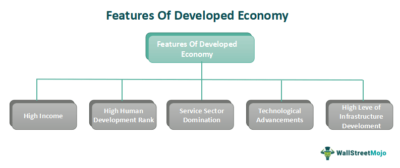

In today's interconnected world, understanding economic statistics is crucial for both investors and policy-makers. Advanced economies, characterized by their high per capita income and extensive industrialization, play a significant role in shaping the global financial landscape. These economies are not only major players in global trade but also influential in setting trends in technological advancements and financial systems. They have robust infrastructural, educational, and health systems, contributing to their high Human Development Index (HDI).

The rise of sophisticated technologies has transformed how economic information is utilized, particularly in the domain of financial markets. With the rapid advancement of technology, algorithmic trading now leverages economic criteria to inform investment decisions. Algorithmic trading uses computer programs to execute trades at high speeds and volumes, depending on pre-set criteria. These criteria often incorporate complex economic indicators like GDP growth rates, unemployment statistics, and inflation figures, all of which help traders make data-driven decisions.



By integrating these economic statistics with algorithmic trading techniques, investors and traders gain actionable intelligence that assists in navigating the volatile and dynamic global market environment. This practice not only enhances the precision and efficiency of trading strategies but also mitigates the risks associated with human biases and errors. Consequently, the fusion of economic statistics with technological innovations in trading is now a central pillar for those seeking to optimize their financial strategies and outcomes.

This article explores the intersection of economic statistics, advanced economies, economic criteria, and their application in algorithmic trading. Understanding these concepts is essential for staying competitive in the global marketplace, allowing policymakers to make informed economic decisions and enabling investors to capitalize on emerging market trends.

## Table of Contents

## Defining Advanced Economies

An advanced economy is recognized for its high level of gross domestic product (GDP) per capita, comprehensive industrialization, and significant engagement in global financial markets. These economies are often characterized by a well-developed infrastructure, high standards of living, and sophisticated economic systems. One key attribute of advanced economies is their ability to leverage technological advancements in enhancing productivity and fostering innovation. This technological edge plays a pivotal role in maintaining their competitive advantage and contributing to sustained economic growth.

The International Monetary Fund (IMF) evaluates economies based on several criteria to classify them as advanced. These criteria include not only GDP per capita but also technological advancement, the sophistication of financial systems, export diversification, and economic openness. The latter is measured by the volume of trade and active participation in international financial institutions. Countries with robust financial markets and a high Human Development Index (HDI) are more likely to be classified as advanced economies.

By 2024, the IMF recognizes 41 nations as advanced economies. This classification underscores the evolving metrics and standards for evaluating economies. These nations are distinguished by their ability to adapt to global economic challenges and capitalize on opportunities arising from technological progress. The evolution in standards is reflective of the dynamic change in economic landscapes, where continuous innovation and financial agility are necessary to sustain the status of an advanced economy.

The emphasis on technological transfer and innovation speaks to the increasing importance of knowledge-driven economies. For example, advanced economies invest significantly in research and development (R&D), which is critical to fostering new technologies and industries. This investment also ensures they maintain a competitive edge in fast-paced global markets.

Additionally, a strong institutional framework supports these economies. Effective governance, transparent legal systems, and sound regulatory environments are essential components that underpin the stability and growth of advanced economies. These factors contribute to attracting foreign investment and supporting domestic businesses' growth, ultimately enhancing the overall economic resilience and prosperity of such nations.

## Key Economic Criteria for Advanced Economies

An advanced economy is assessed based on a variety of key economic criteria as established by the International Monetary Fund (IMF). A central measure is the Gross Domestic Product (GDP) per capita, which reflects the average income and economic output per person, indicating the general prosperity and productivity of the nation. High GDP per capita is a hallmark of these economies, showcasing their ability to generate substantial economic output relative to their population sizes.

Export diversification is another significant criterion for classifying advanced economies. Economies with a wide range of export goods and services tend to be more resilient to shocks in global demand, reducing dependency on a single sector or market. This diversification enables them to better weather global economic fluctuations, maintaining stability in economic performance and trade balance.

Integration into the global financial system is critical for an economy to be considered advanced. This involves robust participation in international markets, strong financial institutions, and the ability to attract foreign investments. An integrated financial system promotes efficient capital allocation and risk management across borders, contributing to economic stability and growth.

Technological innovation is a crucial indicator of an advanced economy's capability to sustain long-term growth and competitiveness. Advanced economies invest significantly in research and development (R&D), fostering an environment where new technologies can be created and applied to enhance productivity and quality of life.

The Human Development Index (HDI) is also pivotal when determining the status of an advanced economy. HDI assesses long-term progress in three fundamental dimensions: life expectancy, education level, and standard of living. A high HDI score indicates that a country not only has economic strength but also provides its citizens with a higher quality of life, encompassing health and educational opportunities.

Economic openness is gauged by examining an economy's trade [volume](/wiki/volume-trading-strategy) and its participation in international financial institutions such as the World Bank and the International Monetary Fund itself. High levels of trade and active involvement in these institutions are indicative of an economy's willingness to engage in and benefit from global economic dynamics, reflecting a commitment to liberal economic policies that facilitate cross-border trade and investment. 

Collectively, these criteria—GDP per capita, export diversification, global financial integration, technological innovation, HDI, and economic openness—are utilized by the IMF to assess and classify economies as advanced, recognizing their contribution to and role in the global economy.

## Role of Economic Statistics in Algorithmic Trading

Algorithmic trading incorporates a wide array of economic indicators to predict market fluctuations and facilitate informed trading decisions. Central to this are macroeconomic indicators such as Gross Domestic Product (GDP), unemployment rates, and inflation, which serve as critical inputs for these trading algorithms. These indicators provide a comprehensive view of an economy's health and potential future performance, allowing trading systems to anticipate market responses to economic data releases.

GDP is a primary economic indicator that signifies the total value of all goods and services produced over a specific time period within an economy. A higher-than-expected GDP growth rate typically signals a robust economy, which can lead to increased investor confidence and upward movement in stock prices. Conversely, lower-than-expected GDP figures may indicate a sluggish economy, potentially resulting in market sell-offs. Thus, GDP data is often integrated into [algorithmic trading](/wiki/algorithmic-trading) systems to adjust investment portfolios based on expected economic performance.

Unemployment rates are another crucial economic indicator utilized in algorithmic trading. A declining unemployment rate is generally perceived as a sign of economic strength, suggesting that more individuals are employed and likely contributing to consumer spending and economic growth. Alternatively, rising unemployment rates might indicate economic weakness, prompting trading algorithms to adjust their strategies to mitigate potential losses.

Inflation rates also play a significant role in shaping trading algorithms. Inflation reflects the rate at which the general level of prices for goods and services is rising, eroding purchasing power. Higher inflation can lead central banks to increase interest rates, aiming to tame inflation by reducing spending and borrowing. Such monetary policy actions can influence currency strength, bond yields, and stock market performance, making inflation data a vital component of algorithmic trading models.

To leverage these economic indicators effectively, statistical models and time series analysis are widely employed. Statistical models, such as regression analysis, help in understanding relationships between variables, enabling the prediction of future trends based on historical data. Time series analysis, on the other hand, involves studying datasets over intervals of time to identify patterns or potential future values. Common methods within time series analysis include moving averages, autoregressive models, and exponential smoothing, which assist in smoothing out random fluctuations in the data to better capture underlying trends.

In Python, implementing a simple moving average (SMA) for a time series of GDP growth rates can be done using the following code:

```python
import pandas as pd

# Example data: GDP growth rates
data = {'GDP_growth': [3.2, 2.5, 3.7, 4.1, 2.8, 3.4, 3.0, 3.3]}
df = pd.DataFrame(data)

# Calculate the Simple Moving Average (SMA) over a window of 3 periods
df['SMA'] = df['GDP_growth'].rolling(window=3).mean()

print(df)
```

This code demonstrates how moving averages can be calculated to smooth out GDP growth data, providing a clearer signal of potential economic trends. Such techniques are essential for algorithmic trading systems, which seek to translate economic [statistics](/wiki/bayesian-statistics) into actionable trading strategies. By continuously analyzing economic indicators, algorithmic trading systems can enhance their responsiveness to market conditions, optimizing performance and minimizing risk.

## Challenges and Considerations

Data quality and accuracy are paramount in economic data analysis, particularly when applied to algorithmic trading. Economic data is often subject to revisions, inconsistencies, and errors, impacting its reliability. Such inaccuracies can arise from various sources, including incomplete datasets, misreporting, or differences in statistical methodologies among countries. As a result, trading algorithms based on flawed data can produce misleading signals, potentially leading to financial losses.

Another significant challenge is the synchronization of real-time data with trading algorithms. Algorithmic trading platforms rely on timely and precise data to execute trades. This necessitates sophisticated infrastructure capable of handling high-frequency data streams and integrating multiple data sources effectively. Real-time data processing requires not only robust computational resources but also expertise in data management to ensure that trading decisions are based on the most current information available.

Market noise also poses a critical hurdle in economic data analysis. Noise refers to random fluctuations in data that obscure the underlying patterns or trends. In financial markets, noise is predominantly caused by short-term [volatility](/wiki/volatility-trading-strategies), influenced by factors such as speculative trading and market sentiment. It can lead to inaccuracies in modeling and predicting market behavior if not appropriately filtered out.

Moreover, overfitting is a common issue in statistical models used within algorithmic trading. Overfitting occurs when a model is excessively complex, capturing not only the genuine trends but also the random noise of past data. This can result in models that perform well on historical datasets but fail to generalize to new, unseen data, leading to erroneous predictions. To mitigate overfitting, techniques such as cross-validation, regularization, and pruning are employed.

In economic data analysis, these challenges underscore the importance of rigorous data validation, advanced computational infrastructure, and careful model construction. Addressing these considerations effectively can enhance the reliability of predictions made by algorithmic trading systems, thereby optimizing trading outcomes.

## Case Study: Economic Data Analysis in Action

An example of applying economic statistics in algorithmic trading is the use of Gross Domestic Product (GDP) data to guide currency trading strategies. GDP serves as a key economic indicator that reflects the economic health and growth trajectory of a country. When a strong GDP growth forecast is released, it can indicate a robust economic environment, potentially leading to an appreciation of the country's currency. This is primarily because a healthy economy is often correlated with increased investor confidence and capital inflows, driving up demand for the currency.

Algorithmic trading systems can be programmed to automatically respond to GDP data releases. By integrating GDP forecasts into trading algorithms, these systems can make informed predictions about currency movements. For instance, if a country's GDP growth surpasses market expectations, an algorithm may initiate a long position on that currency, anticipating a rise in its value due to positive economic sentiment.

The deployment of such strategies requires precise and timely economic data. Traders often use statistical models and time series analysis to forecast GDP growth and assess its potential impact on currency markets. These models analyze historical GDP data, identify patterns, and generate predictions. Python, a popular programming language in financial analysis, provides robust libraries such as pandas and statsmodels for time series analysis. These tools facilitate the processing and analysis of economic data to enhance trading algorithms.

For example, a basic Python script to assess GDP impact might involve loading historical GDP data, applying a statistical model for prediction, and deriving trading signals based on forecasted GDP growth.

```python
import pandas as pd
from statsmodels.tsa.arima_model import ARIMA

# Load GDP data
gdp_data = pd.read_csv('gdp_data.csv', parse_dates=['Date'], index_col='Date')
gdp_series = gdp_data['GDP']

# Fit ARIMA model
model = ARIMA(gdp_series, order=(1, 1, 1))
model_fit = model.fit(disp=0)

# Forecast GDP
forecast, stderr, conf_int = model_fit.forecast(steps=1)

print(f"Forecasted GDP: {forecast[0]}")

# Trading decision based on GDP forecast
if forecast[0] > expected_gdp_threshold:
    print("Initiate long position on the currency.")
else:
    print("Hold current positions.")
```

This code snippet illustrates how an algorithm might forecast GDP and generate a trading signal based on the forecast. It emphasizes the integration of econometric models in algorithmic trading to react seamlessly to significant economic indicators like GDP.

The use of GDP data in trading strategies exemplifies how economic insights are directly translated into actionable trading decisions, highlighting the critical role that economic statistics play in modern financial markets.

## Conclusion

The fusion of economic statistics with algorithmic trading provides a powerful toolkit for navigating the complexities of global markets. This integration allows investors and traders to harness robust data-driven strategies to make informed decisions. Economic statistics, including GDP growth rates, inflation, and employment figures, serve as the foundational inputs for algorithmic models that forecast market movements and identify profitable opportunities.

As advanced economies continue to evolve, staying informed about economic criteria and their implications for trading has become more crucial than ever. The dynamic nature of global markets means that traders must be agile, adapting to new economic indicators and trends that can impact asset pricing and market sentiment. A thorough understanding of these criteria enables traders to anticipate shifts in economic conditions that may affect their portfolios.

By leveraging reliable economic indicators, traders and investors can optimize their strategies and enhance their decision-making processes. Advanced algorithms can process vast amounts of economic data in real-time, allowing for timely responses to emerging trends. With the aid of sophisticated computational techniques, such as time series analysis and [machine learning](/wiki/machine-learning), algorithms can discern patterns within complex data sets, providing actionable insights that drive strategic trading decisions. Ultimately, the synergy between economic statistics and algorithmic trading equips market participants with the tools needed to achieve better outcomes in an increasingly interconnected and volatile financial environment.

## References & Further Reading

[1]: ["World Economic Outlook: October 2023"](https://www.imf.org/en/Publications/WEO/Issues/2023/10/10/world-economic-outlook-october-2023) by the International Monetary Fund

[2]: ["Algorithmic Trading: Winning Strategies and Their Rationale"](https://www.wiley.com/en-us/Algorithmic+Trading%3A+Winning+Strategies+and+Their+Rationale-p-9781118460146) by Ernest P. Chan

[3]: ["Advanced Macroeconomics"](https://ocw.mit.edu/courses/14-461-advanced-macroeconomics-i-fall-2012/) by David Romer

[4]: Gross Domestic Product (GDP) Statistics. U.S. Bureau of Economic Analysis. Retrieved from [https://www.bea.gov/data/gdp](https://www.bea.gov/data/gdp/gross-domestic-product)

[5]: ["The Little Book of Economics: How the Economy Works in the Real World"](https://www.amazon.com/Little-Book-Economics-Economy-Works/dp/1118391578) by Greg Ip

[6]: ["International Economics: Theory and Policy"](https://open.umn.edu/opentextbooks/textbooks/276) by Paul Krugman and Maurice Obstfeld

[7]: Schwager, J. D. (2017). ["Market Wizards: Interviews with Top Traders"](https://www.amazon.com/Market-Wizards-Updated-Interviews-Traders/dp/1118273052)