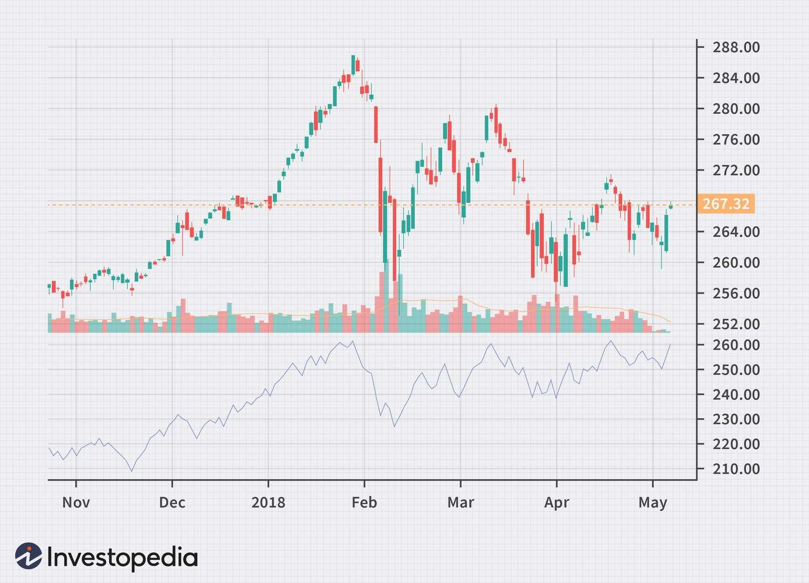

## Table of Contents

## What are advances and declines in the context of economic or market performance?

Advances and declines refer to the number of stocks or other financial assets that have gone up or down in value over a certain period, usually a day. In the context of the stock market, if more stocks have increased in value than decreased, it is said that the market has more advances than declines. This can be a sign of a healthy market or positive investor sentiment. Conversely, if more stocks have declined in value, it might indicate a bearish market or negative sentiment among investors.

These terms are often used in market reports and analyses to give a quick snapshot of market performance. For example, if a news report says that the market had 2,000 advances and 1,500 declines, it means that 2,000 stocks went up in value while 1,500 went down. This simple metric helps investors and analysts understand the overall direction and health of the market at a glance.

## How do advances and declines affect individual investors?

Advances and declines can give individual investors a quick idea about how the market is doing. If there are more advances than declines, it means more stocks are going up in value. This can make investors feel good about the market and more likely to buy stocks. On the other hand, if there are more declines, it means more stocks are losing value. This can make investors worried and they might decide to sell their stocks or wait before buying new ones.

Understanding advances and declines can help investors make better choices. For example, if an investor sees that the market has been having more advances for a while, they might feel confident to invest more money. But if the market has been showing more declines, an investor might choose to be more careful or even move their money to safer investments. By keeping an eye on these numbers, investors can get a sense of the market's mood and adjust their strategies accordingly.

## What are the basic mechanisms that drive advances in a market or economy?

Advances in a market or economy often happen because of good news or positive feelings among people. When businesses are doing well, they might make more money and pay their workers more. This makes people feel happy and spend more money, which helps the economy grow. Also, if there's new technology or a new way of doing things that makes businesses more efficient, it can lead to more advances. Investors see this and think it's a good time to buy stocks, which pushes the market up.

Sometimes, the government can help drive advances too. If they lower taxes or make it easier for businesses to grow, it can lead to more jobs and more spending. Another thing that can help is when interest rates are low. This makes it cheaper for businesses to borrow money to expand, and for people to borrow money to buy things like houses or cars. When all these things come together, it can lead to a strong period of advances in the market and economy.

## What are the common causes of declines in economic or market conditions?

Declines in the economy or market often happen when people start to feel worried or unsure about the future. If businesses are not doing well, they might have to let people go or not hire new workers. This can make people feel less secure about their jobs and cause them to spend less money. When people spend less, businesses make less money, which can lead to more job losses and even less spending. This cycle can keep going and cause the economy to shrink.

Another reason for declines can be when there are big problems in the world, like a war or a natural disaster. These events can disrupt how businesses operate and make it hard for them to make money. Also, if the government raises taxes or makes new rules that make it harder for businesses to grow, it can lead to declines. High interest rates can also make it more expensive for businesses and people to borrow money, which can slow down the economy. When these things happen, the market can go down as investors worry and sell their stocks.

## How can advances and declines be measured and tracked?

Advances and declines can be measured by counting how many stocks or other financial assets go up or down in value over a certain time, usually a day. This information is often shown in market reports and on financial websites. For example, if a report says there were 2,000 advances and 1,500 declines, it means 2,000 stocks went up and 1,500 went down. This simple count helps people see if the market is doing well or not.

To track advances and declines over time, people can use charts and graphs. These tools show how the numbers change from day to day or week to week. By looking at these charts, investors can see if the market is getting better or worse. Many financial websites and apps have tools that make it easy to see these trends and help people make smart choices about their investments.

## What are the short-term versus long-term impacts of advances and declines?

In the short term, advances in the market can make people feel happy and confident. When they see more stocks going up, they might decide to buy more stocks or spend more money. This can lead to a quick boost in the economy. On the other hand, declines can make people worried and scared. If they see more stocks going down, they might sell their stocks or spend less money. This can cause the economy to slow down quickly.

In the long term, the impacts of advances and declines can be different. If advances keep happening over a long time, it can lead to strong growth in the economy. Businesses might invest more, hire more people, and make more money. This can make the economy much stronger over time. But if declines keep happening, it can lead to a long period of slow growth or even a recession. Businesses might struggle, people might lose their jobs, and the economy might take a long time to recover. Understanding these long-term trends can help people make better plans for their money and investments.

## How do government policies influence advances and declines?

Government policies can have a big impact on whether the market and economy go up or down. When the government makes rules that help businesses grow, like lowering taxes or making it easier to start a new business, it can lead to more advances. For example, if the government gives money to help build new roads or schools, it can create jobs and make people feel good about spending money. Also, if the government keeps interest rates low, it makes it cheaper for businesses to borrow money to expand, which can help the economy grow.

On the other hand, if the government makes rules that make it harder for businesses to do well, it can lead to declines. For example, if the government raises taxes a lot, businesses might have less money to spend on growing or hiring new workers. If the government makes new rules that are hard for businesses to follow, it can slow them down and make the economy weaker. High interest rates can also make it more expensive for businesses to borrow money, which can lead to fewer advances and more declines.

## What role do technological innovations play in driving advances?

Technological innovations can make big changes in the economy and help drive advances. When new technology comes out, it can make businesses work better and faster. For example, if a new computer program helps a company do its work quicker, it can make more money. This can lead to more jobs and more spending, which helps the economy grow. Also, new technology can create whole new industries, like how the internet led to lots of new jobs and businesses. When people see these new opportunities, they might feel good about the future and invest more money in the market.

Sometimes, new technology can change how people live and work. For example, smartphones and apps have made it easy for people to shop, work, and connect with others from anywhere. This can make people's lives easier and help businesses reach more customers. When businesses can reach more people and make more money, it can lead to more advances in the market. Overall, technological innovations can make the economy stronger by helping businesses grow and giving people new ways to spend and invest their money.

## How do global events and international relations impact advances and declines?

Global events and international relations can have a big impact on whether the market goes up or down. If something bad happens in the world, like a war or a big natural disaster, it can scare people and make them worried about the future. When people are worried, they might sell their stocks and spend less money. This can lead to declines in the market and the economy. On the other hand, if countries work well together and there's peace, it can make people feel safe and confident. They might be more likely to invest in the market and spend money, which can lead to advances.

International relations can also affect how businesses do around the world. If countries have good relationships and trade a lot with each other, it can help businesses grow and make more money. For example, if a country signs a new trade deal, it might be able to sell more of its products to other countries. This can lead to more jobs and more spending, which helps the economy grow. But if countries don't get along and put up barriers to trade, it can make it hard for businesses to sell their products. This can lead to fewer jobs and less spending, which can cause declines in the economy and the market.

## What advanced statistical models are used to predict and analyze advances and declines?

To predict and analyze advances and declines in the market and economy, experts use advanced statistical models like time series analysis. Time series analysis looks at data over time to find patterns and trends. For example, it can help see if the market is going up or down in a certain way. This model uses past data to make guesses about what might happen next. It's like looking at the weather history to predict if it will rain tomorrow. By understanding these patterns, investors and economists can make better choices about when to buy or sell stocks.

Another useful model is regression analysis, which helps understand how different things affect the market. For example, it can show how changes in interest rates or government policies might lead to advances or declines. Regression analysis looks at how one thing, like the economy, changes when another thing, like interest rates, changes. This helps people see what might cause the market to go up or down. By using these models, experts can make smarter guesses about the future and help people plan their investments better.

## How do advances and declines affect different sectors of the economy differently?

Advances and declines in the economy can affect different sectors in different ways. When the market is doing well and there are more advances, some sectors might see a bigger boost than others. For example, the technology sector often grows a lot during good times because people and businesses are more willing to spend money on new gadgets and software. The same goes for the consumer goods sector, where people might buy more things like clothes and electronics when they feel good about the economy. On the other hand, sectors like utilities, which provide things like electricity and water, might not see as much change because people need these services no matter how the economy is doing.

When the market is going down and there are more declines, some sectors can get hit harder than others. For instance, the construction and real estate sectors often struggle during tough economic times because people are less likely to buy new homes or start big building projects. The automotive industry can also suffer because people might not want to spend money on new cars when they're worried about their jobs and money. Meanwhile, sectors like healthcare and basic consumer goods, like food and cleaning supplies, might not be affected as much because people still need these things even when the economy is bad. Understanding how advances and declines affect different sectors can help people make smarter choices about where to invest their money.

## What are the theoretical frameworks used by economists to understand the dynamics of advances and declines?

Economists use different theories to understand why markets and economies go up and down. One important theory is the business cycle, which says that economies go through periods of growth and decline in a repeating pattern. When there are advances, it's often part of the expansion phase where businesses grow, people spend more, and the economy gets stronger. But then, there can be a peak where things slow down, leading to declines during the contraction phase. This cycle helps economists predict when good or bad times might come and plan accordingly.

Another theory is the Keynesian model, which focuses on how spending affects the economy. According to this theory, when people and businesses spend more money, it leads to advances because it creates more demand for goods and services. But if spending goes down, it can cause declines because businesses might not sell as much and might have to cut jobs. Governments can help by spending more money themselves or by making policies that encourage people to spend more. This theory helps explain why government actions can have a big impact on whether the economy grows or shrinks.

## What are the Mechanisms of Algorithmic Trading?

Algorithmic trading, a key component of modern financial markets, operates through a set of well-defined mechanisms that enable automated buying and selling of financial instruments. These systems rely heavily on mathematical models and algorithms to make decisions, process data, and execute trades efficiently. 

At the core of [algorithmic trading](/wiki/algorithmic-trading) are sophisticated mathematical models that analyze market data to identify trading opportunities. Algorithms are crafted to interpret historical data and forecast future price movements using statistical methods, such as regression analysis, moving averages, and other quantitative techniques. For example, simple moving averages (SMA) can be computed as:

$$
\text{SMA} = \frac{1}{n} \sum_{i=1}^{n} P_i
$$

where $P_i$ represents the price of the asset at time $i$, and $n$ is the number of time periods.

Once the models indicate a potential trade, the algorithm processes real-time market information to execute trades. The capacity for real-time information processing is crucial, as milliseconds can determine the profitability of a trade. High-frequency trading ([HFT](/wiki/high-frequency-trading-strategies)) strategies are especially reliant on real-time data to take advantage of small price discrepancies across markets.

Algorithmic trading employs various strategies to gain an edge in markets. Arbitrage involves taking advantage of price differences in different markets or forms; it generally requires rapid execution to lock in profits. Trend-following strategies aim to capitalize on upward or downward market trends, analyzing price patterns to buy or sell accordingly. Market-making strategies provide [liquidity](/wiki/liquidity-risk-premium) by placing simultaneous buy and sell orders to profit from bid-ask spreads.

Risk management is an integral part of algorithmic trading. Algorithms must incorporate measures to mitigate potential losses, such as stop-loss orders, position sizing, and diversification. Back-testing is another critical aspect; it involves simulating a trading strategy using historical data to evaluate its performance before deploying it in live markets. This process helps detect potential flaws and optimize the strategy for real-world conditions.

In summary, the mechanisms that drive algorithmic trading encompass a combination of mathematical modeling, real-time data analysis, strategic execution, and rigorous risk management. These components collectively enable market participants to execute trades with precision and speed, leveraging the power of automation and technology to navigate complex financial markets effectively.

## References & Further Reading

[1]: Hendershott, T., & Riordan, R. (2020). ["Algorithmic Trading and Information."](https://www.semanticscholar.org/paper/Algorithmic-Trading-and-Information-Hendershott-Riordan/992bb61fe2a9861310118f9f68ad98433e75eefd) Journal of Financial and Quantitative Analysis.

[2]: European Securities and Markets Authority (ESMA). (n.d.). ["MiFID II."](https://www.esma.europa.eu/press-news/esma-news/esma-publishes-final-guidelines-mifid-ii-suitability-requirements-0)

[3]: Kirilenko, A.A., Kyle, A.S., Samadi, M., & Tuzun, T. (2017). ["The Flash Crash: High-Frequency Trading in an Electronic Market."](https://onlinelibrary.wiley.com/doi/abs/10.1111/jofi.12498) Journal of Finance.

[4]: U.S. Securities and Exchange Commission. (2013). ["SEC Charges Knight Capital With Violations of Market Rules."](https://www.sec.gov/newsroom/press-releases/2013-222) 

[5]: Bergstra, J., Bardenet, R., Bengio, Y., & Kégl, B. (2011). ["Algorithms for Hyper-Parameter Optimization."](https://dl.acm.org/doi/10.5555/2986459.2986743) Advances in Neural Information Processing Systems 24.

[6]: ["Advances in Financial Machine Learning"](https://www.amazon.com/Advances-Financial-Machine-Learning-Marcos/dp/1119482089) by Marcos Lopez de Prado

[7]: ["Evidence-Based Technical Analysis: Applying the Scientific Method and Statistical Inference to Trading Signals"](https://www.amazon.com/Evidence-Based-Technical-Analysis-Scientific-Statistical/dp/0470008741) by David Aronson

[8]: ["Machine Learning for Algorithmic Trading"](https://github.com/stefan-jansen/machine-learning-for-trading) by Stefan Jansen

[9]: ["Quantitative Trading: How to Build Your Own Algorithmic Trading Business"](https://www.amazon.com/Quantitative-Trading-Build-Algorithmic-Business/dp/1119800064) by Ernest P. Chan