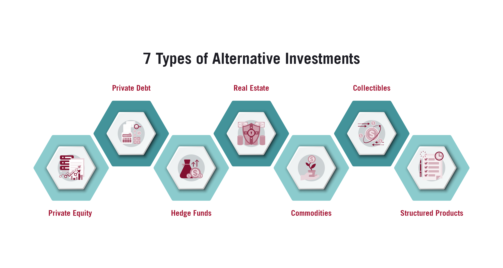

## Table of Contents

## What are alternative investments?

Alternative investments are types of investments that are different from the usual stocks, bonds, and cash. They can include things like real estate, commodities, private equity, hedge funds, and even art or collectibles. People might choose alternative investments because they want to spread out their money in different places, hoping to get a better return or to lower the risk of losing money.

These investments can be more complicated and might need more work to understand and manage. For example, buying a piece of art or investing in a startup company is not as simple as buying a stock. Alternative investments can also be harder to sell quickly if you need your money back fast. But, they can offer chances to make money in ways that traditional investments might not.

## What are some common types of alternative investments?

Alternative investments include a variety of options that are different from regular stocks and bonds. Some common types are real estate, where people buy properties to rent out or sell later for a profit. Commodities are another type, like gold, oil, or agricultural products, which people invest in hoping their value will go up. Private equity involves investing in private companies that are not listed on public stock exchanges, which can lead to big returns if the company does well.

Another popular alternative investment is hedge funds, which are managed pools of money that use different strategies to earn returns for their investors. These can be riskier and are usually only available to wealthy people or institutions. Art and collectibles, like paintings, vintage cars, or rare stamps, are also considered alternative investments. People buy these items because they believe their value will increase over time, though it can be hard to predict and they might not be easy to sell quickly.

Lastly, there are cryptocurrencies, like Bitcoin and Ethereum, which are digital or virtual currencies that use encryption techniques to secure their transactions. These are very new and can be very volatile, meaning their value can go up and down a lot. Peer-to-peer lending is another type where individuals lend money to others through online services, [earning](/wiki/earning-announcement) interest on the loans. Each of these alternative investments has its own risks and potential rewards, so it's important to understand them well before investing.

## How do alternative investments differ from traditional investments?

Alternative investments are different from traditional investments in a few big ways. Traditional investments are things like stocks, bonds, and cash, which you can buy and sell easily on public markets. They are well-known and a lot of people invest in them. On the other hand, alternative investments include things like real estate, private equity, hedge funds, and even art or cryptocurrencies. These are not as easy to buy and sell, and they often need more research and understanding because they can be more complex.

Another key difference is how risky they can be. Traditional investments usually have less risk because they are more predictable and there's a lot of information about them. Alternative investments can offer bigger rewards, but they also come with bigger risks. For example, the value of a piece of art or a startup company can change a lot, and it might be hard to sell them quickly if you need your money back. Because of this, alternative investments are often used by people who want to spread out their money in different ways, hoping to get better returns or lower their overall risk.

## What are the potential advantages of investing in alternative assets?

One big advantage of investing in alternative assets is the chance to earn more money. Because they can be riskier, they often have the potential for bigger rewards. For example, if you invest in a startup that does really well, you could make a lot more money than if you had just bought stocks. Also, alternative investments can help you spread out your money. If all your money is in stocks and the stock market goes down, you could lose a lot. But if some of your money is in real estate or art, those might still be doing well even if the stock market is not.

Another advantage is that alternative investments can protect your money from inflation. Inflation means that the value of money goes down over time, which can hurt traditional investments like bonds. But things like real estate or commodities often go up in value when inflation goes up, which can help keep your money's value safe. Also, alternative investments can give you something unique. For example, owning a piece of art or a vintage car can be fun and rewarding in a way that just owning stocks isn't.

## Can alternative investments provide diversification benefits?

Yes, alternative investments can help you spread out your money in different ways, which is called diversification. When you put all your money in one place, like just in stocks, you could lose a lot if something bad happens to the stock market. But if you also have some money in other things like real estate or art, those might still be doing okay even if the stock market goes down. This can help lower the overall risk of losing your money.

Alternative investments often don't move in the same way as traditional investments like stocks and bonds. For example, when the stock market goes down, the value of real estate might stay the same or even go up. By having some of your money in alternative investments, you can balance out the ups and downs of your overall investment portfolio. This can make your money safer and help you sleep better at night knowing your investments are spread out.

## How do alternative investments potentially offer higher returns?

Alternative investments can offer higher returns because they often come with more risk. When you take bigger risks, you can make more money if things go well. For example, if you invest in a new startup and it turns into a big success, you could earn a lot more than if you had just bought some regular stocks. Because alternative investments are not as common and can be harder to understand, people who are willing to do the extra work and take the extra risk might be rewarded with bigger profits.

Another way alternative investments can offer higher returns is by not moving in the same way as traditional investments like stocks and bonds. If the stock market is doing badly, your alternative investments like real estate or art might still be doing well. This means you could be making money in one place even when you're losing it in another. By having some money in alternative investments, you can balance out the ups and downs and potentially earn more over time.

## What are the main disadvantages of alternative investments?

One big disadvantage of alternative investments is that they can be hard to sell quickly. If you need your money back fast, it might be tough to find someone to buy your real estate or a piece of art right away. This is different from stocks or bonds, which you can usually sell anytime the market is open. Also, alternative investments can be riskier. They might go up a lot in value, but they can also go down a lot. If you put your money in a startup that fails, you could lose everything.

Another disadvantage is that alternative investments often need more work to understand and manage. You have to do a lot of research to know if a piece of art or a piece of land is a good investment. This can take a lot of time and might need special knowledge. Plus, because alternative investments are not as common, they can be harder to value. It might be tough to know if you're paying a fair price or if you'll be able to sell it for what you want later on.

## What are the liquidity risks associated with alternative investments?

Alternative investments can be hard to turn into cash quickly. This is called [liquidity](/wiki/liquidity-risk-premium) risk. When you invest in things like real estate or art, you can't just sell them right away like you can with stocks or bonds. It might take a long time to find someone who wants to buy your property or your painting, and you might have to sell it for less than you wanted just to get your money back fast.

Because of this, if you need your money back quickly for an emergency or another investment, alternative investments might not be the best choice. You could be stuck waiting or lose money trying to sell them fast. This is different from traditional investments, which you can usually sell anytime the market is open, making it easier to get your money when you need it.

## How do the fees and expenses of alternative investments compare to traditional investments?

Alternative investments often have higher fees and expenses than traditional investments. When you invest in things like hedge funds or private equity, you might have to pay a management fee, which is a percentage of the money you invest, and a performance fee, which is a cut of any profits the investment makes. These fees can add up quickly and eat into your returns. For example, a [hedge fund](/wiki/hedge-fund-trading-strategies) might charge a 2% management fee and a 20% performance fee, which is a lot more than what you'd pay for a regular stock or bond fund.

Traditional investments like stocks and bonds usually have lower fees. If you buy a stock, you might just pay a small commission to your broker. If you invest in a mutual fund or an [ETF](/wiki/etf-trading-strategies), you'll pay an expense ratio, which is a small percentage of your investment each year. These fees are often much lower than what you'd pay for alternative investments. For instance, an index fund might have an expense ratio of just 0.05%, which is a lot less than the fees for many alternative investments. So, while alternative investments can offer higher returns, the higher fees can make it harder to keep more of those returns for yourself.

## What are the regulatory and compliance considerations for alternative investments?

Alternative investments often have different rules and requirements compared to traditional investments. For example, hedge funds and private equity are usually only open to people who have a lot of money or to big organizations. This is because they are seen as riskier, and the government wants to make sure that only people who can handle the risk are investing in them. There are also rules about how these investments can be sold and advertised, which can make it harder for people to learn about them and invest.

Another thing to think about is how alternative investments are reported and taxed. Some alternative investments, like real estate or art, might not be as easy to report on your taxes as stocks or bonds. You might need to hire someone to help you figure out how much you owe in taxes. Also, different countries have different rules about what you can and can't invest in, so if you're investing in something in another country, you need to make sure you're following all the right rules.

## How can an investor assess the risk and performance of alternative investments?

To assess the risk and performance of alternative investments, an investor needs to do a lot of research. They should look at past performance, if there is any, to see how the investment has done over time. But remember, past performance doesn't always tell you what will happen in the future. Talking to people who know a lot about the specific type of investment, like real estate experts or art dealers, can also help. They can give you information about what might affect the value of the investment, like changes in the market or the economy. It's also important to think about how easy it would be to sell the investment if you need your money back quickly.

Another way to assess risk and performance is by looking at the fees and expenses. Alternative investments often have higher fees than traditional ones, which can eat into your returns. You should also think about how the investment fits into your overall plan. If you're already taking a lot of risks with other investments, adding a risky alternative investment might not be a good idea. Finally, understanding the regulatory and tax rules that apply to the investment can help you figure out how much risk you're really taking on and how much you might make or lose.

## What strategies can be used to effectively incorporate alternative investments into a portfolio?

To effectively incorporate alternative investments into a portfolio, you should start by thinking about how much risk you're willing to take. Alternative investments can be riskier than stocks and bonds, so you need to balance them with safer investments. A good strategy is to only put a small part of your money into alternative investments, like 5% to 15% of your total portfolio. This way, you can still try to earn more money without putting all your eggs in one basket. You should also think about what kind of alternative investments you want to include. For example, if you already own a house, maybe you don't need to invest in more real estate. Instead, you could look at other options like art or private equity to spread out your risks and rewards.

Another important strategy is to do a lot of research before you invest in anything. Alternative investments can be hard to understand and manage, so you need to know what you're getting into. Talk to experts, read up on the investment, and think about how it fits into your overall plan. It's also a good idea to check the fees and expenses, as these can be higher for alternative investments and can eat into your returns. Finally, think about how easy it would be to sell the investment if you need your money back quickly. Some alternative investments can be hard to sell, so make sure you're okay with that before you invest.

## References & Further Reading

[1]: Bergstra, J., Bardenet, R., Bengio, Y., & Kégl, B. (2011). ["Algorithms for Hyper-Parameter Optimization."](https://dl.acm.org/doi/10.5555/2986459.2986743) Advances in Neural Information Processing Systems 24.

[2]: ["Advances in Financial Machine Learning"](https://www.amazon.com/Advances-Financial-Machine-Learning-Marcos/dp/1119482089) by Marcos Lopez de Prado

[3]: ["Evidence-Based Technical Analysis: Applying the Scientific Method and Statistical Inference to Trading Signals"](https://www.amazon.com/Evidence-Based-Technical-Analysis-Scientific-Statistical/dp/0470008741) by David Aronson

[4]: ["Machine Learning for Algorithmic Trading"](https://github.com/stefan-jansen/machine-learning-for-trading) by Stefan Jansen

[5]: ["Quantitative Trading: How to Build Your Own Algorithmic Trading Business"](https://www.amazon.com/Quantitative-Trading-Build-Algorithmic-Business/dp/1119800064) by Ernest P. Chan