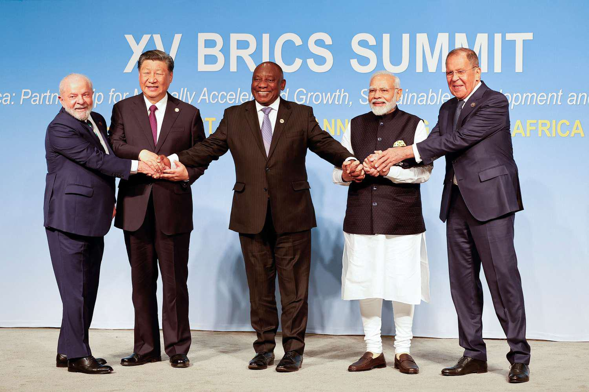

## Table of Contents

## What are BRICS countries?

BRICS is a group of five countries: Brazil, Russia, India, China, and South Africa. These countries work together to help each other grow and become stronger. They started meeting in 2009 to talk about ways to improve their economies and work together on global issues.

The idea of BRICS came from an economist named Jim O'Neill in 2001. He thought these countries would become very important in the world because they have a lot of people, big economies, and growing influence. South Africa joined the group later in 2010, making it BRICS instead of BRIC.

BRICS countries meet every year to discuss important topics like trade, development, and peace. They want to have more say in the world and help each other solve problems. By working together, they hope to make the world a better place for everyone.

## What is an ETF?

An [ETF](/wiki/etf-trading-strategies), or Exchange-Traded Fund, is a type of investment that lets you buy a bunch of different stocks or assets all at once. It's like a basket where you can put many things inside. When you buy an ETF, you're buying a small piece of that basket. ETFs are traded on stock exchanges, just like individual stocks, which makes them easy to buy and sell.

ETFs are popular because they offer a simple way to invest in a wide range of assets without having to pick each one yourself. For example, if you want to invest in technology companies, you can buy a tech ETF that includes many different tech stocks. This can help spread out your risk because if one company does poorly, the others might do well and balance it out.

There are many different types of ETFs, covering everything from stocks and bonds to commodities like gold and oil. They can be focused on specific industries, countries, or even themes like environmental sustainability. ETFs are a flexible tool for investors looking to build a diverse portfolio without a lot of hassle.

## What are BRICS ETFs?

BRICS ETFs are special kinds of investment funds that focus on the countries in the BRICS group: Brazil, Russia, India, China, and South Africa. These ETFs let you invest in companies from these countries all at once. It's like buying a basket that has a little bit of many different companies from these five countries inside it. This can be a good way to spread out your investment and not put all your money into just one place.

Investing in BRICS ETFs can be exciting because these countries are growing fast and becoming more important in the world. By putting your money into a BRICS ETF, you're betting that these countries will keep doing well. But remember, investing always has risks, and the value of your investment can go up or down. So, it's smart to learn as much as you can and maybe talk to a financial advisor before you decide to invest in BRICS ETFs.

## What are the main advantages of investing in BRICS ETFs?

Investing in BRICS ETFs can help you spread out your money across many different companies in Brazil, Russia, India, China, and South Africa. This is good because if one company or even one country doesn't do well, the others might still do okay. It's like not putting all your eggs in one basket. By investing in a BRICS ETF, you're betting on the growth of these big and fast-growing countries, which can be a smart move if they keep getting stronger.

Another advantage is that BRICS ETFs make it easy to invest in these countries without having to pick each company yourself. You can just buy one ETF and instantly own a piece of many different businesses. This saves time and can be less stressful than trying to choose individual stocks. Plus, since these countries are becoming more important in the world, investing in them through an ETF can be a way to be part of their success story.

## What are the potential risks and disadvantages of BRICS ETFs?

Investing in BRICS ETFs can be risky because the economies of Brazil, Russia, India, China, and South Africa can be unpredictable. These countries sometimes face big problems like political changes, economic slowdowns, or even conflicts. If one of these countries runs into trouble, it can affect the value of the whole ETF. Also, since these countries are far away, it can be hard to keep track of what's happening and make smart investment choices.

Another disadvantage is that BRICS ETFs might not be as diverse as you think. Even though you're investing in five different countries, a lot of the money might still be tied up in just a few big companies. If those companies do badly, it can drag down the whole ETF. Plus, these ETFs often come with fees that you have to pay, which can eat into your profits over time. So, while BRICS ETFs can be a good way to invest in growing economies, they come with their own set of challenges and costs.

## How do BRICS ETFs compare to other emerging market ETFs?

BRICS ETFs focus on the economies of Brazil, Russia, India, China, and South Africa. These countries are often seen as big players in the world because they are growing fast and have a lot of people. When you invest in a BRICS ETF, you're betting on the success of these specific countries. Other emerging market ETFs, on the other hand, might include a wider range of countries from places like Southeast Asia, Latin America, and Eastern Europe. So, a BRICS ETF is more focused, while other emerging market ETFs can give you a broader spread of investments.

One thing to think about is risk. BRICS countries can be up and down because they sometimes have big problems like political changes or economic slowdowns. If you invest in a BRICS ETF, you're putting all your eggs in fewer baskets, which can be riskier. Other emerging market ETFs might be safer because they spread your money across more countries. But, they might also grow slower because they're not as focused on the fast-growing BRICS nations. So, it's a balance between focusing on a few countries that could do really well, or spreading out to many countries for less risk but maybe less reward.

## What factors should be considered before investing in BRICS ETFs?

Before you decide to invest in BRICS ETFs, it's important to think about the risks. The economies of Brazil, Russia, India, China, and South Africa can be unpredictable. They might face big problems like political changes, economic slowdowns, or even conflicts. If one of these countries has trouble, it can affect the whole ETF. Also, even though you're investing in five different countries, a lot of the money might still be tied up in just a few big companies. If those companies do badly, it can drag down the whole ETF. So, you need to be ready for ups and downs and understand that investing in BRICS ETFs can be riskier than other types of investments.

Another thing to consider is how much you know about these countries. Since they're far away, it can be hard to keep track of what's happening and make smart investment choices. You might want to learn more about their economies, politics, and businesses before you invest. Also, think about the fees you have to pay for BRICS ETFs. These fees can eat into your profits over time, so it's important to know what you're paying and if it's worth it. By taking the time to understand these factors, you can make a better decision about whether investing in BRICS ETFs is right for you.

## How have BRICS ETFs performed historically?

BRICS ETFs have had ups and downs over the years. When these countries are doing well, the ETFs can grow a lot. For example, when China's economy was growing really fast, BRICS ETFs did very well. But when there are problems, like the economic slowdown in Brazil or political issues in Russia, the ETFs can lose value. So, the performance of BRICS ETFs depends a lot on what's happening in these countries.

Over the long term, BRICS ETFs have shown that they can be good investments. They often do better than many other emerging market ETFs because BRICS countries are big and growing fast. But they can also be more risky. If you look at the past 10 or 15 years, you'll see that BRICS ETFs have had times of big gains and times of big losses. It's important to remember that past performance doesn't tell you what will happen in the future, but it can give you an idea of what to expect.

## What is the impact of currency fluctuations on BRICS ETFs?

Currency fluctuations can have a big impact on BRICS ETFs. When you invest in a BRICS ETF, you're not just betting on the companies in those countries, but also on their currencies. If the currency of one of the BRICS countries gets stronger compared to your own currency, the value of your investment can go up. But if the currency gets weaker, the value of your investment can go down, even if the companies are doing well.

This can make investing in BRICS ETFs a bit tricky. For example, if the Brazilian real loses value against the US dollar, the part of the ETF that's invested in Brazilian companies will be worth less in dollars. This can happen even if the Brazilian companies are doing great. So, when you're thinking about investing in BRICS ETFs, you need to keep an eye on what's happening with the currencies of Brazil, Russia, India, China, and South Africa.

## How do geopolitical issues affect BRICS ETFs?

Geopolitical issues can really shake up BRICS ETFs. These countries sometimes have big problems like political fights, trade disagreements, or even wars. When something bad happens in one of the BRICS countries, it can make investors worried and they might sell their shares in the ETF. This can make the value of the ETF go down. For example, if there's a big conflict in Russia, people might not want to invest in companies there, and that can hurt the whole BRICS ETF.

But it's not just about what happens in one country. Sometimes, the problems between BRICS countries and other big countries like the United States or Europe can also affect the ETFs. If there's a trade war between China and the US, it can make things harder for Chinese companies, and that can drag down the ETF. So, it's important to keep an eye on what's happening around the world because it can change how well your investment does.

## What are the tax implications of investing in BRICS ETFs?

When you invest in BRICS ETFs, you need to think about taxes. If you make money from your investment, you might have to pay taxes on it. This can depend on where you live and how long you keep your investment. For example, if you live in the United States, you might have to pay capital gains tax when you sell your ETF shares for a profit. The tax rate can be different if you hold the ETF for a short time or a long time. Also, some countries in the BRICS group might have their own taxes on dividends or other earnings, which can affect how much money you take home.

Another thing to consider is that different countries might have tax treaties with each other. These treaties can change how much tax you have to pay. For example, if you're from the US and you get dividends from a Brazilian company in your ETF, there might be a tax treaty that lowers the amount of tax you owe. It's a good idea to talk to a tax advisor to understand all the tax rules that could affect your investment in BRICS ETFs. They can help you figure out how to keep more of your earnings and avoid any surprises when tax time comes around.

## What advanced strategies can be used to optimize returns from BRICS ETFs?

One way to get more out of your BRICS ETF investment is by using something called dollar-cost averaging. This means you put a little bit of money into the ETF regularly, instead of putting all your money in at once. By doing this, you can buy more shares when the price is low and fewer shares when the price is high. Over time, this can help you pay a lower average price for your shares and make more money when the ETF goes up.

Another strategy is to keep an eye on the news and what's happening in the BRICS countries. If you see that one country is doing really well or really badly, you might want to adjust your investment. For example, if China's economy is growing fast, you might want to put more money into a BRICS ETF that has a lot of Chinese companies. Or, if there's a big problem in Brazil, you might want to take some money out of the ETF until things get better. By staying informed and making smart changes, you can try to get better returns from your investment.

## References & Further Reading

[1]: ["BRICS and the World Order: A Beginner's Guide"](https://papers.ssrn.com/sol3/papers.cfm?abstract_id=2443652) by John Calabrese

[2]: Narayan, P. K., Sharma, S. S., & Phan, D. H. B. (2019). ["ARFIMA models for predicting the volatility of BRICS stock markets."](https://research.monash.edu/en/publications/oil-price-and-stock-returns-of-consumers-and-producers-of-crude-o) The Quarterly Review of Economics and Finance, 74, 49-55.

[3]: BlackRock. ["Understanding ETFs"](https://www.blackrock.com/americas-offshore/en/education/etf/explaining-etfs) - An educational resource on how ETFs function and their benefits.

[4]: Shirai, S. (2017). ["Global Political Economy of BRICS."](https://www.researchgate.net/publication/328078644_South_Africa_in_the_Global_Political_Economy_The_BRICS_Connection_Contemporary_Changes_and_New_Directions) Springer Singapore. 

[5]: Kuepper, J. (2021). ["The Allure and Risks of Investing in BRICs."](https://www.thebalancemoney.com/consumer-confidence-and-its-impact-on-the-markets-1978947) Investopedia.

[6]: Lesmond, D. A. (2005). ["Liquidity of emerging markets."](https://www.sciencedirect.com/science/article/pii/S0304405X05000176) Journal of Financial Economics, 77(2), 411-452.

[7]: Johnston, R. B., & Tamirisa, N. T. (1998). ["Why Do Countries Use Capital Controls?"](https://www.semanticscholar.org/paper/Why-Do-Countries-Use-Capital-Controls-Johnston-Tamirisa/8aeb5fed2be2ca18b5b59bb4b45ff65755f55511) International Monetary Fund Working Paper.

[8]: Fabozzi, F. J., & Focardi, S. M. (2008). ["The Mathematics of Financial Modeling and Investment Management"](https://archive.org/details/mathematicsoffin0000foca). Wiley Finance.

[9]: ["Frontiers of Economics and Globalization: Growth and Reality"](https://link.springer.com/referenceworkentry/10.1007/978-3-319-71058-7_90-1), Jones, J. C., & Teitel, S. (Eds.). Emerald Group Publishing Limited. 

[10]: ["Algorithmic Trading: A Practitioner’s Guide"](https://www.amazon.com/Algorithmic-Trading-Practitioners-Jeffrey-Bacidore/dp/0578715236) by Barry Johnson.