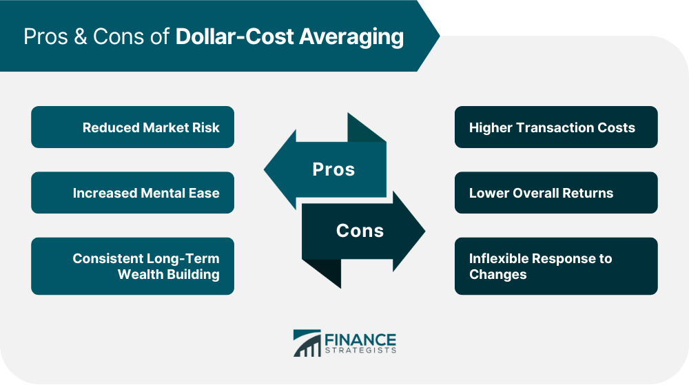

## Table of Contents

## What is dollar-cost averaging?

Dollar-cost averaging is a way to invest money over time, instead of all at once. You take a certain amount of money and divide it into smaller amounts, then invest those smaller amounts at regular intervals, like every month. This can help reduce the risk of investing all your money when prices are high. By spreading out your investments, you buy more shares when prices are low and fewer when prices are high.

This method can be useful for people who want to invest but are worried about market ups and downs. It helps take the emotion out of investing because you're following a plan. Over time, dollar-cost averaging can lead to a lower average cost per share, which can be good for your overall investment. It's a simple strategy that many people use to build their savings steadily.

## How does dollar-cost averaging work?

Dollar-cost averaging means you put money into an investment little by little instead of all at once. You decide on a set amount of money to invest, and then you split that money into smaller parts. You invest these smaller parts at regular times, like once a month. This way, you don't have to worry about when the best time to invest is because you're investing over time.

By doing this, you end up buying more shares when the price is low and fewer shares when the price is high. This can help lower the average price you pay for each share. It's like smoothing out the ups and downs of the market. Over time, this can be a good way to grow your investment without trying to guess the market's next move. It's a simple and steady way to invest.

## What are the basic advantages of using dollar-cost averaging?

One big advantage of dollar-cost averaging is that it helps you avoid the stress of trying to guess the best time to invest. Instead of putting all your money in at once, you spread it out over time. This means you don't have to worry about whether the market is going up or down right now. It takes the emotion out of investing because you're following a plan, not reacting to the market.

Another advantage is that dollar-cost averaging can lower the average price you pay for your investments. When you invest the same amount of money regularly, you end up buying more shares when prices are low and fewer when prices are high. Over time, this can lead to a lower average cost per share, which can be good for your overall investment. It's a simple way to build your savings steadily without trying to time the market.

## Can dollar-cost averaging reduce the impact of market volatility?

Dollar-cost averaging can help reduce the impact of market [volatility](/wiki/volatility-trading-strategies). When you use this method, you invest the same amount of money at regular times, like every month. This means you buy shares at different prices over time. When the market goes down, your money buys more shares because they are cheaper. When the market goes up, your money buys fewer shares because they are more expensive. By doing this, you smooth out the ups and downs of the market.

Over time, dollar-cost averaging can lead to a lower average cost for your investments. Instead of investing all your money when the market might be high, you spread it out. This way, you don't have to worry about the market's short-term changes. It's a simple way to invest that can help you feel more secure, even when the market is going up and down a lot.

## How does dollar-cost averaging help in managing emotions when investing?

Dollar-cost averaging helps manage emotions when investing by taking away the need to guess when the best time to invest is. Instead of trying to time the market, which can be stressful and lead to bad decisions, you just follow a simple plan. You invest the same amount of money at regular times, like every month. This means you don't have to worry about whether the market is going up or down right now. It takes the emotion out of investing because you're not reacting to the market's ups and downs.

By using dollar-cost averaging, you can feel more calm and in control. Knowing that you're investing little by little over time helps you avoid the panic that can come from watching your investments go up and down a lot. It's a steady way to build your savings without the stress of trying to predict the market. This can help you stick to your investment plan and make better decisions in the long run.

## What are the potential disadvantages of dollar-cost averaging?

One potential disadvantage of dollar-cost averaging is that it might not be the best choice if the market keeps going up. If you invest all your money at once when the market is low, you might get better returns than if you spread out your investments over time. By using dollar-cost averaging, you could miss out on some of the gains you would have made if you had invested everything at the start.

Another disadvantage is that dollar-cost averaging involves regular investments, which means you need to have money available to invest at those times. If you don't have a steady income or if your financial situation changes, it can be hard to keep up with the plan. This could lead to you not being able to invest as much as you wanted, or having to stop investing altogether.

## Is dollar-cost averaging suitable for all types of investments?

Dollar-cost averaging can work well with many types of investments, but it might not be perfect for all of them. It's often used with stocks, mutual funds, and exchange-traded funds (ETFs) because these investments can go up and down a lot. By spreading out your investments over time, you can smooth out the ups and downs and possibly get a better average price. It's a good strategy if you want to invest in the stock market without worrying about when to buy.

However, dollar-cost averaging might not be the best choice for investments that don't change in price much or that have fees for buying and selling. For example, if you're investing in bonds or other fixed-income investments, the prices might not move enough to make dollar-cost averaging worthwhile. Also, if the investments you're buying have high transaction fees, it could end up costing you more money to keep investing little by little. So, it's important to think about the type of investment and any costs before deciding to use dollar-cost averaging.

## How does dollar-cost averaging compare to lump-sum investing?

Dollar-cost averaging means you put money into an investment little by little over time, instead of all at once. This can be good if you're worried about the market going up and down a lot. By spreading out your investments, you buy more shares when prices are low and fewer when prices are high. This can help lower the average price you pay for each share. It's a simple way to invest without trying to guess the best time to buy. It can also help you feel less stressed about investing because you're following a plan, not reacting to the market.

Lump-sum investing is when you put all your money into an investment at one time. This can be good if you think the market will keep going up. If you invest all your money when the market is low, you might get better returns than if you spread out your investments. But, if the market goes down right after you invest, you could lose more money than if you had used dollar-cost averaging. Lump-sum investing can be riskier because it depends a lot on when you decide to invest. It's a good choice if you have a big amount of money ready to invest and you believe the market will do well soon.

## What are the tax implications of using dollar-cost averaging?

When you use dollar-cost averaging, you buy investments little by little over time. This can affect your taxes because each time you buy, it might be at a different price. If you sell your investments later, you'll have to figure out the cost basis for each purchase to know how much profit or loss you made. This can make your tax calculations a bit more complicated because you have to keep track of all those different purchases.

The good news is that dollar-cost averaging can help you manage your taxes better in some ways. If you spread out your investments, you might be able to sell some of your shares at a loss to offset any gains from other investments. This can lower your overall tax bill. But, it's always a good idea to talk to a tax advisor to understand how dollar-cost averaging will affect your specific situation.

## How can dollar-cost averaging be optimized for better results?

To get better results from dollar-cost averaging, you need to think about how often you invest and how much you put in each time. If you can, try to invest more money when the market is low. This way, you'll buy more shares at a lower price, which can help your investment grow faster. Also, think about how long you want to keep investing. The longer you use dollar-cost averaging, the more you can smooth out the ups and downs of the market. This can lead to a better average price for your investments over time.

Another way to optimize dollar-cost averaging is to pick the right investments. Choose investments that you believe will do well over the long term. Stocks, mutual funds, and ETFs are good choices because they can go up and down a lot, which makes dollar-cost averaging more effective. Also, keep an eye on the fees you pay when you buy and sell investments. If the fees are too high, they can eat into your returns. So, try to pick investments with low fees to make your dollar-cost averaging strategy work better.

## What are the long-term effects of dollar-cost averaging on investment returns?

Dollar-cost averaging can have a good effect on your investment returns over the long term. By putting money into your investments little by little over time, you buy more shares when prices are low and fewer when prices are high. This can help lower the average price you pay for each share. Over many years, this can lead to a better overall return because you're not putting all your money in when the market is high. It's like smoothing out the ups and downs of the market, which can be good for growing your savings steadily.

However, dollar-cost averaging might not always be the best way to get the highest returns. If the market keeps going up, putting all your money in at once might give you better results. But, most people don't know when the market will go up or down, so dollar-cost averaging can be a safer way to invest. It helps you avoid the stress of trying to guess the best time to buy. Over the long term, sticking to a plan like dollar-cost averaging can help you build your investments without worrying too much about short-term changes in the market.

## Are there any advanced strategies that can be combined with dollar-cost averaging to enhance performance?

One advanced strategy you can use with dollar-cost averaging is called rebalancing. Rebalancing means you check your investments from time to time and make sure they still match your plan. If some of your investments have gone up a lot, you might sell a bit of them and buy more of the ones that haven't done as well. This can help keep your investments balanced and might make your dollar-cost averaging work even better. By doing this, you're not just putting money in regularly, but you're also making sure your money is spread out the way you want it to be.

Another strategy is to use tax-loss harvesting with dollar-cost averaging. This means if some of your investments go down in value, you can sell them at a loss. You can use those losses to lower the taxes you owe on any gains from other investments. Then, you can use the money from selling those investments to buy similar ones, so you stay invested. By combining dollar-cost averaging with tax-loss harvesting, you can keep investing little by little and also manage your taxes better. It's a smart way to make the most out of your investments over time.

## What is Dollar-Cost Averaging?

Dollar-cost averaging (DCA) is an investment strategy whereby an individual allocates a fixed sum of money at regular intervals to purchase shares of a specific asset, irrespective of its market price at each interval. This systematic approach seeks to mitigate the effects of market volatility by spreading the purchases over time rather than investing a lump sum all at once. The underlying principle of DCA is that it results in acquiring more shares when prices are depressed and fewer shares when prices are elevated. 

For example, consider an investor who decides to invest $100 into a stock every month. If the stock’s price is $10 in a given month, the investor buys 10 shares. If the price drops to $5 the following month, the same $100 investment will allow them to buy 20 shares. Conversely, if the price rises to $20, only 5 shares will be purchased. This method leads to a lower average cost per share over the investment period, potentially reducing the impact of short-term price fluctuations.

Mathematically, the average cost per share using DCA can be expressed as:

$$
\text{Average Cost per Share} = \frac{\sum ( \text{Investment Amount} )}{\sum ( \text{Number of Shares Purchased} )}
$$

By adhering to a fixed investment schedule, DCA diminishes the influence of emotional decision-making and the pressure to time the market accurately—a notoriously difficult task. Instead, this technique promotes a disciplined investment approach, aligning with the perspective that investments should focus on long-term gains rather than short-term price movements. Though Dollar-Cost Averaging might not always yield higher returns than lump-sum investments during bull markets, its consistent application ensures that investors maintain regular investment habits and can be especially beneficial in volatile or bearish markets.

## References & Further Reading

[1]: Bogle, J. C. (1999). ["Common Sense on Mutual Funds: New Imperatives for the Intelligent Investor"](https://www.researchgate.net/publication/245704247_Common_Sense_on_Mutual_Funds_New_Imperatives_for_the_Intelligent_Investor) by John C. Bogle

[2]: Malkiel, B. G. (2015). ["A Random Walk Down Wall Street: The Time-Tested Strategy for Successful Investing."](https://yourknowledgedigest.org/wp-content/uploads/2020/04/a-random-walk-down-wall-street.pdf) W.W. Norton & Company.

[3]: Zweig, J. (2003). ["Your Money and Your Brain: How the New Science of Neuroeconomics Can Help Make You Rich."](https://www.amazon.com/Your-Money-Brain-Science-Neuroeconomics/dp/0743276698) Simon & Schuster.

[4]: Sharpe, W. F. (1994). ["The Sharpe Ratio."](https://web.stanford.edu/~wfsharpe/art/sr/SR.htm) The Journal of Portfolio Management, 21(1), 49-58.

[5]: Thorpe, E. O. (1967). ["Beat the Market: A Scientific Stock Market System"](https://www.amazon.com/Beat-Market-Scientific-Stock-System/dp/0394424395) Random House.