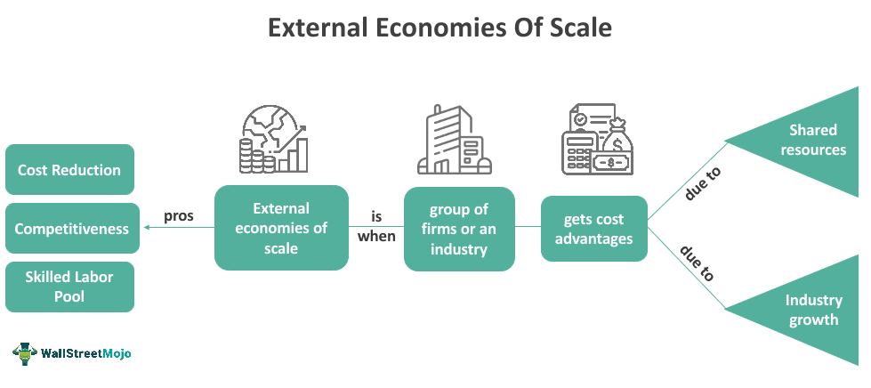

In the rapidly evolving financial landscape, algorithmic trading has emerged as a powerful tool, particularly in the Euro currency market. Algorithmic trading, defined as the use of computer systems to automate trading decisions and execute trades at optimal speeds and prices, has revolutionized the way currency trading is conducted. This technology allows traders to navigate the intricacies of the market with precision and efficiency that manual trading can scarcely match.

The Euro, introduced on January 1, 1999, represents a milestone in economic integration among European nations. As a widely-used and stable currency, the Euro facilitates trade and investment within the Eurozone and globally, reducing currency risk and fostering market efficiency. This economic significance makes it a critical currency for traders and investors worldwide. However, the Euro also presents specific challenges, such as a monetary policy that may not align with the economic needs of all member countries.



In this article, we will examine how traders leverage algorithmic trading strategies to capitalize on market opportunities and manage risks associated with Euro currency trading. The article will also address the economic implications of the Euro and weigh the benefits and drawbacks of its adoption. By exploring these aspects, traders and investors can gain a comprehensive understanding of the dynamics at play, enabling them to optimize their strategies in the Euro Forex market effectively.

## Table of Contents

## Understanding the Economic Role of the Euro

The Euro, introduced on January 1, 1999, was a landmark development in promoting economic integration across Europe. Serving as a unified currency, it significantly simplifies trade and investment activities among member nations by eliminating the complexities of dealing with multiple currencies. This transition to a single currency was designed to enhance economic stability and facilitate seamless transactions within the Eurozone, comprising several European Union countries that have adopted the Euro as their official currency.

Globally, the Euro stands as one of the most stable and widely-used currencies, second only to the US dollar in terms of use and reserve currency status. Its stability attracts international investors and contributes to its significant role in global finance. As the Euro accounts for a substantial portion of global forex trading activities, it is pivotal in maintaining the balance between major world economies.

Some benefits the Euro brings include the eradication of currency exchange risk within the Eurozone, resulting in improved market efficiency and fostering robust trade relationships among member states. This common currency reduces transaction costs and exchange rate uncertainties, providing businesses with a more predictable and conducive environment for international trade.

However, adopting the Euro also presents challenges. One significant drawback is the loss of individual monetary policy autonomy among the Eurozone countries. These nations must adhere to the monetary decisions made by the European Central Bank (ECB), affecting their ability to respond flexibly to local economic conditions. Consequently, the uniform policy approach may not adequately address the diverse economic needs of all member countries. For instance, a policy suiting stronger economies like Germany may be detrimental to weaker economies experiencing different economic cycles.

As such, traders in the foreign exchange market must thoroughly understand the economic implications of the Euro. Knowledge of its interaction with various global economic factors and the impacts of ECB monetary policy decisions is crucial for making informed trading decisions. The Euro's performance in the [forex](/wiki/forex-system) market is influenced by numerous variables, including economic data releases, geopolitical events, and shifts in monetary policy, underscoring the importance of comprehensive analysis by forex traders to optimize their trading strategies.

## Pros and Cons of Trading the Euro

The introduction of the Euro has significantly impacted trade and financial practices within the Eurozone, providing several advantages for traders. One of the primary benefits is the enhancement of trade activities within member countries. By using a common currency, businesses avoid the complexities and costs associated with currency conversion, facilitating smoother and more efficient cross-border transactions. This elimination of currency risks further stabilizes investments across different Eurozone nations. Without fluctuations in exchange rates, companies can engage in cross-border investments with greater confidence and predictability, leading to increased economic integration and growth.

Furthermore, having a unified currency creates a collective economic support system among the member states. This means that during economic downturns, countries can rely on the broader support of the Eurozone, which can potentially lead to increased fiscal stability and overall resilience against economic shocks.

However, trading the Euro is not without its challenges. One notable drawback is the rigid monetary policy imposed by the European Central Bank (ECB). This centralization can restrict individual member nations from implementing monetary policies tailored to their unique economic climates. For countries with struggling economies, this can result in policies that do not align with their specific needs, affecting economic growth and market strategies.

Additionally, there is a perceived bias towards stronger economies, such as Germany. These stronger economies significantly influence Eurozone policies, which may not always be in the best interest of the weaker member countries. This bias can lead to imbalances, affecting market conditions and complicating trading strategies.

Traders must carefully evaluate these factors when engaging in Euro currency trading. Optimizing trading strategies involves not only understanding these advantages and disadvantages but also implementing a robust risk assessment framework to minimize potential losses. Balancing the benefits of reduced currency risk and enhanced economic integration with the challenges posed by monetary policy rigidity and economic disparity is crucial for effective Euro trading.

## The Rise of Algorithmic Trading in Forex Markets

Algorithmic trading involves the use of sophisticated algorithms and computer systems to execute trades at high speeds and with precision. This method exploits market efficiencies and significantly reduces the likelihood of human error, which can complicate or detract from trading performance. In the Forex market, where the [volume](/wiki/volume-trading-strategy) of transactions is vast and can exhibit rapid price fluctuations, [algorithmic trading](/wiki/algorithmic-trading) has emerged as a vital tool.

Algorithms in Forex trading are designed to process enormous data sets in real-time, identifying trading opportunities based on pre-defined criteria such as price fluctuations, market patterns, or economic indicators. This capacity for data processing and swift decision-making enables traders to capitalize on fleeting opportunities that may be missed with slower, manual methods.

The application of algorithmic trading in the Euro currency market has notably increased, driven largely by technological advancements in computing power and data analytics. These advancements have enhanced both the speed and accuracy of algorithms, allowing for more complex analyses and faster trade execution. The capacity for these systems to analyze large quantities of past and present data to predict future price movements has given algorithmic traders a competitive edge in the market. 

For instance, Python has become an indispensable tool in algorithmic trading due to its extensive libraries for data manipulation and analysis. Libraries such as NumPy and pandas facilitate effective data processing, whereas tools like sci-kit-learn enable the implementation of [machine learning](/wiki/machine-learning) models for predictive analysis. An algorithm might be programmed in Python with the following basic structure to evaluate trading signals based on moving averages:

```python
import pandas as pd
import numpy as np

# Sample data
data = pd.DataFrame({'Close': [1.2, 1.15, 1.18, 1.21, 1.19, 1.22]})

# Calculate moving averages
short_window = 3
long_window = 5
data['Short_MA'] = data['Close'].rolling(window=short_window).mean()
data['Long_MA'] = data['Close'].rolling(window=long_window).mean()

# Define buy/sell signals
data['Signal'] = 0
data.loc[data['Short_MA'] > data['Long_MA'], 'Signal'] = 1
data.loc[data['Short_MA'] < data['Long_MA'], 'Signal'] = -1

# Print signals
print(data[['Close', 'Short_MA', 'Long_MA', 'Signal']])
```

In this example, the algorithm calculates short-term and long-term moving averages and establishes signals based on the crossover of these averages. Such algorithms can be expanded with additional rules and conditions to refine trading strategies further.

This surge in algorithmic trading usage within the Euro market is also influenced by increased market competition and the need for regulatory compliance, which encourages more transparent and efficient trading practices. Institutional and retail traders alike are keenly adopting algorithmic trading to enhance profitability, optimize execution speeds, and implement robust risk management strategies effectively. As a result, algorithmic trading has not only transformed traditional trading paradigms but continues to shape the future of financial markets.

## Effective Algorithmic Trading Strategies for the Euro

Algorithmic trading strategies are essential in managing the Euro currency market's complexities, employing systematic approaches to capitalize on market inefficiencies. Among the most effective strategies in this context are trend-following, [arbitrage](/wiki/arbitrage), and [momentum](/wiki/momentum)-based techniques, each of which leverages distinct market dynamics to achieve profitability.

### Trend-Following Strategies

Trend-following strategies involve analyzing historical price data to identify market trends and predict future price movements. Traders utilizing these strategies employ technical analysis tools, such as moving averages, to detect trends. The moving average, a common tool, is calculated by averaging a set number of prices over a specific period. For example, a 50-day moving average can be expressed as:

$$

\text{MA}_{50} = \frac{1}{50} \sum_{i=1}^{50} \text{Price}_i 
$$

where $\text{Price}_i$ is the daily closing price. Traders often compare different moving averages, such as the 50-day and 200-day moving averages, to identify crossover points that signal potential buy or sell opportunities.

### Arbitrage Strategies

Arbitrage strategies exploit price discrepancies across different markets or instruments. In the Euro currency market, traders might utilize [statistical arbitrage](/wiki/statistical-arbitrage), which involves using models to identify and profit from these discrepancies. High-frequency trading algorithms are often employed to execute simultaneous buy and sell orders across multiple trading platforms, ensuring quick reaction times essential for capturing these fleeting opportunities.

### Momentum-Based Strategies

Momentum-based strategies aim to capitalize on the continuation of existing market trends. Traders analyze indicators such as the Relative Strength Index (RSI) and Fibonacci retracements to determine the strength and potential reversal points of trends. These strategies often involve buying assets expected to continue rising in value or selling assets anticipated to fall. For instance, an RSI value above 70 might indicate an overbought condition, suggesting a potential price reversal.

### Risk Management in Algorithmic Trading

Risk management is a critical component of any algorithmic trading strategy, particularly given the Forex market's inherent [volatility](/wiki/volatility-trading-strategies). Traders must implement safeguards to handle unexpected market events and price movements. This includes setting stop-loss orders to automatically sell a position if it reaches a predetermined loss threshold, thus protecting against significant drawdowns. Additionally, [backtesting](/wiki/backtesting) strategies using historical data can help assess their robustness and viability before implementation in live markets.

Python, as a preferred programming language, provides an array of libraries such as NumPy, pandas, and TA-Lib for performing these analyses and strategy implementations. For instance, a simple moving average crossover strategy might look like this in Python:

```python
import pandas as pd

def simple_moving_average(data, window):
    return data.rolling(window=window).mean()

# Assuming 'data' is a DataFrame with a 'Close' column for closing prices
data['SMA_50'] = simple_moving_average(data['Close'], 50)
data['SMA_200'] = simple_moving_average(data['Close'], 200)

# Signal generation
data['Signal'] = 0
data['Signal'][50:] = np.where(data['SMA_50'][50:] > data['SMA_200'][50:], 1, -1)
```

This script calculates 50-day and 200-day simple moving averages and generates trade signals based on their crossover. Employing effective risk management strategies ensures that algorithmic approaches remain adaptable to market fluctuations, safeguarding against potential adverse outcomes.

In conclusion, by implementing these algorithmic trading strategies with careful risk management, traders can enhance their ability to navigate and profit from the Euro currency market.

## Challenges and Risks in Algorithmic Trading

Algorithmic trading, while advantageous, introduces several complexities and risks that traders must navigate carefully. One primary challenge is the requirement for precise and efficient coding. Algorithms must be developed with meticulous attention to detail to execute trades accurately and at the optimal times. Any bugs or inefficiencies in the code can lead to significant financial losses. For instance, an improperly coded algorithm might execute trades at incorrect prices or volumes, which could result in adverse outcomes. 

Backtesting is another crucial aspect that traders must conduct to ensure the strategy's viability. By simulating a trading strategy on historical data, traders can assess how the algorithm would have performed in the past, providing insights into potential future performances. Backtesting helps in identifying the strengths and weaknesses of a strategy and is essential for making informed adjustments before deploying the algorithm in live markets. However, backtesting also presents a risk of overfitting, where the algorithm is overly optimized for historical data but performs poorly in actual trading environments.

Regulatory changes, which can affect trading conditions and requirements, present another layer of complexity. Algorithmic traders must remain adaptable, continuously updating their systems in compliance with evolving financial regulations. This includes adhering to rules designed to mitigate the risks associated with high-frequency trading, such as market manipulation and flash crashes.

The inherent volatility of the Forex market can amplify the risks associated with algorithmic trading. Currency markets are highly liquid and can experience rapid price movements in response to geopolitical events, economic data releases, and other factors. Algorithms need robust risk management frameworks to handle such volatility. Traders often employ techniques such as stop-loss orders, risk-parity allocations, and dynamic position sizing to manage exposure and potential losses.

For example, in Python, a simple moving average crossover strategy, a popular algorithmic approach, can be implemented to mitigate some risk. However, it must be combined with risk management rules. Here is a basic example using Python and the Pandas library:

```python
import pandas as pd

# Sample data: Close prices
data = pd.DataFrame({
    'close': [1.3, 1.34, 1.32, 1.35, 1.33, 1.36, 1.31, 1.37]
})

# Calculate short and long moving averages
data['short_ma'] = data['close'].rolling(window=2).mean()
data['long_ma'] = data['close'].rolling(window=3).mean()

# Generate signals
data['signal'] = 0
data.loc[data['short_ma'] > data['long_ma'], 'signal'] = 1
data.loc[data['short_ma'] < data['long_ma'], 'signal'] = -1

# Implementing a risk management rule (e.g., stop-loss)
def risk_management(position, price, stop_loss=0.02):
    if position == 1:
        # Implementing stop-loss for a long position
        if (price - entry_price) / entry_price < -stop_loss:
            return 0  # Signal to exit
    return position

# Example usage (assuming entry_price is set beforehand)
entry_price = 1.35
data['risk_adjusted_signal'] = data.apply(lambda row: risk_management(row['signal'], row['close']), axis=1)

print(data)
```

This script calculates moving averages to generate basic buy or sell signals and includes a simplified risk management function to minimize potential losses from adverse price movements. As algorithmic trading continues to advance, traders must remain vigilant to the evolving challenges and strive to develop strategies that can adapt to an ever-changing financial landscape.

## Conclusion

The integration of algorithmic trading within the Euro currency market represents a substantial advancement in trading methodologies, offering the potential for enhanced efficiency and profitability. By utilizing sophisticated algorithms, traders can process vast amounts of financial data at unprecedented speeds, enabling them to execute trades under optimal conditions. This technological evolution has transformed how traders interact with the market, allowing for strategies that take advantage of even the smallest price discrepancies and trend movements.

However, despite these advantages, traders must remain vigilant and informed as the market landscape is continually evolving. The rapid pace of technological advancement necessitates ongoing strategy refinement and adaptation. Traders need to consider economic indicators, geopolitical events, and market sentiment, which can significantly impact currency valuation and trading conditions. In this context, the use of robust data analytics and algorithmic adaptability is crucial.

Moreover, a comprehensive understanding of both the economic environment of the Eurozone and the technical aspects of algorithmic trading is imperative. Traders equipped with this dual expertise are better positioned to identify and seize opportunities in the Euro Forex market. Such deep knowledge allows traders not only to design effective trading algorithms but also to implement them in a way that maximizes gains while mitigating potential risks.

In conclusion, while the landscape of Euro currency trading evolves with algorithmic innovations, the foundation of successful trading remains rooted in informed decision-making and careful strategy management. Traders who cultivate an understanding of both economic and technical dimensions can harness the full potential of algorithmic trading, thereby optimizing their performance in the Euro Forex market.

## References & Further Reading

[1]: Bergstra, J., Bardenet, R., Bengio, Y., & Kégl, B. (2011). ["Algorithms for Hyper-Parameter Optimization."](https://dl.acm.org/doi/10.5555/2986459.2986743) Advances in Neural Information Processing Systems 24.

[2]: ["Advances in Financial Machine Learning"](https://www.amazon.com/Advances-Financial-Machine-Learning-Marcos/dp/1119482089) by Marcos Lopez de Prado

[3]: ["Evidence-Based Technical Analysis: Applying the Scientific Method and Statistical Inference to Trading Signals"](https://www.amazon.com/Evidence-Based-Technical-Analysis-Scientific-Statistical/dp/0470008741) by David Aronson

[4]: ["Machine Learning for Algorithmic Trading"](https://github.com/PacktPublishing/Machine-Learning-for-Algorithmic-Trading-Second-Edition) by Stefan Jansen

[5]: ["Quantitative Trading: How to Build Your Own Algorithmic Trading Business"](https://books.google.com/books/about/Quantitative_Trading.html?id=j70yEAAAQBAJ) by Ernest P. Chan