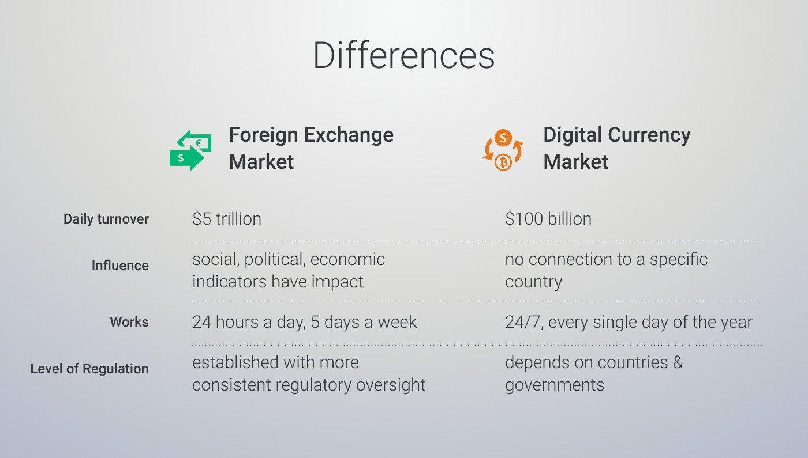

## Table of Contents

## What is Forex trading and how does it work?

Forex trading, short for foreign exchange trading, is the buying and selling of currencies on the foreign exchange market. It's the world's largest financial market, where people trade currencies to make profits from changes in their value. For example, if you think the US dollar will get stronger compared to the Euro, you might buy dollars with Euros. If the dollar does get stronger, you can sell it back for more Euros than you started with, making a profit.

The forex market works 24 hours a day, five days a week, because it spans across different time zones around the world. Traders use a platform provided by a broker to make trades. These platforms show the current exchange rates and let traders buy or sell currencies. The exchange rate is how much one currency is worth compared to another. Traders often use leverage, which means they can trade with more money than they actually have, but this can also increase their losses. The goal is to predict how currency values will change and make trades based on those predictions.

## What is Bitcoin and how does it function in the financial market?

Bitcoin is a type of digital money that you can use to buy things online or keep as an investment. It's different from regular money because it's not controlled by any government or bank. Instead, it uses a technology called blockchain, which is like a big, public record book that keeps track of every Bitcoin transaction. This makes it secure because it's hard for anyone to cheat the system.

In the financial market, Bitcoin functions as both a currency and an investment. People can buy Bitcoins with regular money and then use them to buy things from places that accept Bitcoin. They can also hold onto their Bitcoins, hoping that the price will go up so they can sell them later for a profit. The price of Bitcoin can change a lot, which makes it risky but also exciting for investors. Because it's not controlled by any one group, it's seen as a way to have more freedom with money, but it also means there's no one to help if something goes wrong.

## How can Bitcoin be used in Forex trading?

Bitcoin can be used in Forex trading by trading it against other currencies, like the US dollar or Euro. Instead of trading traditional currency pairs like EUR/USD, you can trade Bitcoin pairs like BTC/USD. This means you're betting on how the value of Bitcoin will change compared to the other currency. If you think Bitcoin will go up in value, you buy it; if you think it will go down, you sell it. Forex brokers that support cryptocurrency trading offer these Bitcoin pairs, allowing traders to use the same platforms they use for traditional Forex trading.

Using Bitcoin in Forex trading adds another layer of excitement and risk because Bitcoin's value can change a lot in a short time. This volatility can lead to big profits, but also big losses. Traders need to keep an eye on the news and events that can affect Bitcoin's price, like new laws about cryptocurrencies or changes in how people feel about using them. Because Bitcoin isn't controlled by a central bank, it can be influenced by different things than traditional currencies, which makes it unique in the Forex market.

## What are the basic advantages of using Bitcoin for Forex trading?

Using Bitcoin for Forex trading has some cool advantages. One big one is that Bitcoin can change a lot in value, which means you can make more money if you guess right. It's exciting because the price can go up or down really fast. Also, Bitcoin works all the time, 24/7, so you can trade whenever you want, not just when banks are open. This can be great if you see a chance to make money at any time of the day or night.

Another advantage is that Bitcoin isn't controlled by any one country or bank. This means you can trade without worrying about what one government might do with its money. It can feel more free and open. Plus, using Bitcoin can be cheaper because there are no big fees like with some traditional banks. So, if you're looking to save money on costs and have more control over your trading, Bitcoin might be a good choice for you.

## What are the potential risks and disadvantages of trading Forex with Bitcoin?

Trading Forex with Bitcoin can be risky because Bitcoin's price can change a lot in a short time. This is called volatility. If you're not careful, you could lose a lot of money quickly. Also, since Bitcoin isn't controlled by any government or bank, there's no one to help if something goes wrong. If you lose your Bitcoins or they get stolen, you might not be able to get them back. This makes trading with Bitcoin more risky than trading with regular money.

Another problem is that not all Forex brokers support Bitcoin trading. This means you might have fewer choices for where to trade. Plus, the rules about cryptocurrencies can change, and new laws could make it harder or even illegal to trade with Bitcoin. This uncertainty can make it tough to plan your trades. So, while trading Forex with Bitcoin can be exciting, it's important to understand these risks and be ready for them.

## How does the volatility of Bitcoin affect Forex trading?

The volatility of Bitcoin means its price can go up and down a lot in a short time. This can make Forex trading with Bitcoin exciting but also really risky. If you're trading Bitcoin against another currency, like the US dollar, and Bitcoin's price suddenly drops, you could lose a lot of money fast. On the other hand, if Bitcoin's price goes up quickly, you could make a big profit. Because of this, traders need to watch Bitcoin's price very closely and be ready to make quick decisions.

This big price movement can also affect how other currencies are traded. When Bitcoin's price changes a lot, it can make the whole Forex market more unpredictable. Traders who are used to trading regular currency pairs might find it harder to predict what will happen when Bitcoin is involved. This can lead to more uncertainty and risk in the Forex market, which can be challenging but also offer new opportunities for those who understand how to handle the volatility.

## What are the transaction fees and speed when using Bitcoin in Forex trading?

When you use Bitcoin for Forex trading, the transaction fees can be different depending on the broker you use and how busy the Bitcoin network is. Sometimes, the fees can be lower than what you pay with regular banks, which is good. But when a lot of people are using Bitcoin at the same time, the fees can go up because everyone is trying to get their transactions processed quickly. So, it's a good idea to check the fees before you start trading with Bitcoin.

The speed of Bitcoin transactions in Forex trading can also vary. Usually, Bitcoin transactions take about 10 minutes to be confirmed on the blockchain, but it can take longer if the network is really busy. This is slower than some traditional Forex transactions, which can happen almost instantly. If you need your trades to happen quickly, this could be a problem. But if you're okay with waiting a bit, using Bitcoin for Forex trading can still work well for you.

## How does the regulatory environment impact Forex trading with Bitcoin?

The rules about Bitcoin and other cryptocurrencies can make Forex trading with Bitcoin more complicated. Different countries have different laws about cryptocurrencies. Some places might have strict rules that make it hard to trade with Bitcoin, while other places might not have many rules at all. If a country decides to change its laws, it can affect how easy or hard it is to trade Bitcoin. For example, if a government bans Bitcoin trading, you won't be able to use it for Forex trading in that country. This uncertainty about what might happen with the rules can make it tricky to plan your trades.

Because Bitcoin isn't controlled by any one government or bank, it can feel more free, but it also means there's no one to help if something goes wrong. If you're trading Forex with Bitcoin and a new law comes out that affects cryptocurrencies, you might have to stop trading or change how you do it. This can be frustrating and risky. So, it's important to keep an eye on the news and understand the rules in your country and any country you're trading with. That way, you can be ready for any changes and make smart choices about your Forex trading with Bitcoin.

## What are the security considerations when trading Forex with Bitcoin?

When you trade Forex with Bitcoin, you need to think about security because Bitcoin is digital and not controlled by banks or governments. If someone hacks into your Bitcoin wallet, they could steal your Bitcoins, and there's no bank to help you get them back. So, it's really important to use strong passwords and keep your wallet safe. Some people use special hardware wallets that are like a safe for your Bitcoins, which can be safer than keeping them on a computer or phone that might get hacked.

Another thing to think about is that the Forex brokers you use need to be secure too. You want to make sure they have good security to protect your money and your personal information. Always check if the broker is trusted and has good reviews. Also, be careful about scams because some people might try to trick you into giving them your Bitcoins. Always do your research and be careful when you're trading Forex with Bitcoin to keep your money safe.

## How can one manage risks effectively when using Bitcoin in Forex trading?

Managing risks when using Bitcoin in Forex trading means being smart about how you trade. Bitcoin's price can change a lot, so you need to be ready for big ups and downs. One way to do this is by not putting all your money into one trade. Instead, spread it out over different trades. This is called diversification. It's like not putting all your eggs in one basket. Also, use something called a stop-loss order. This is a rule you set that tells your broker to sell your Bitcoin if the price drops to a certain level. It helps stop you from losing too much money if things go wrong.

Another important thing is to keep learning about Bitcoin and the Forex market. The rules about cryptocurrencies can change, and new news can affect Bitcoin's price. So, stay updated by reading news and talking to other traders. Also, think about using less money to trade, especially if you're new to it. This is called using less leverage. It can help you not lose too much if Bitcoin's price suddenly goes down. By being careful and always learning, you can handle the risks better and enjoy trading Forex with Bitcoin.

## What advanced strategies can be employed for Forex trading with Bitcoin?

One advanced strategy for Forex trading with Bitcoin is called scalping. This means you make a lot of small trades very quickly, trying to make small profits from tiny changes in Bitcoin's price. Because Bitcoin's price can move a lot, scalping can be exciting but also risky. You need to watch the market closely and act fast. It's a good idea to use special trading software that can help you see these small changes and make trades quickly. This way, you can take advantage of Bitcoin's fast price movements without having to watch the market all the time.

Another strategy is called swing trading. This is where you hold onto your Bitcoin for a bit longer, maybe a few days or weeks, trying to make money from bigger changes in its price. You need to be good at guessing where the price might go next, so it's important to learn about things that can affect Bitcoin's value, like new laws or what people think about it. Using charts and other tools can help you see patterns in Bitcoin's price and make better guesses about when to buy or sell. This strategy can be less stressful than scalping because you don't need to watch the market every second, but it still needs a lot of planning and research.

A third strategy you might try is called hedging. This is when you make trades to protect yourself from losing too much money if Bitcoin's price goes down. For example, if you have Bitcoins and you're worried the price might drop, you can make another trade that will make money if the price does go down. This way, you can balance out any losses from your Bitcoins. Hedging can be a bit tricky because it means you need to keep track of more than one trade at the same time, but it can help you feel safer when trading with Bitcoin.

## How does the future of Forex trading with Bitcoin look, considering current trends and developments?

The future of Forex trading with Bitcoin looks really interesting because more and more people are starting to use cryptocurrencies. Right now, we see that more Forex brokers are adding Bitcoin to their platforms, which means it's getting easier for people to trade with it. Also, new technology like blockchain is making transactions faster and safer. This could make Forex trading with Bitcoin more popular because people like things that are quick and secure. As more countries start to accept cryptocurrencies, we might see even more people using Bitcoin for Forex trading.

But there are still some challenges. The rules about cryptocurrencies can change a lot, and different countries have different laws. This can make it hard for people to know if they can trade with Bitcoin or not. Also, Bitcoin's price can go up and down a lot, which makes it risky. If the price keeps being so unpredictable, some people might not want to use it for Forex trading. Still, if we keep seeing new technology and more people using Bitcoin, it could become a big part of Forex trading in the future.

## Is Bitcoin a Major Player in Forex Markets?

Bitcoin has emerged as a significant asset within forex markets, reflecting its growing adoption as both a digital currency and an investment vehicle. Its decentralized nature, along with the technological underpinnings provided by blockchain, have brought new dynamics to traditional forex trading. Bitcoin's influence on forex markets arises through its utilization in currency pairs, offering an alternative to conventional fiat currencies. Traders may engage with Bitcoin to hedge against geopolitical risks or to capitalize on its high volatility.

Volatility is a defining characteristic of Bitcoin, with its value frequently exhibiting substantial fluctuations. This trait significantly affects forex market outcomes. The volatility index (VIX), commonly used to measure market risk, can approximate Bitcoin's behavior in forex trading. Traders often calculate Bitcoin's volatility using standard deviation or variance from its historical price data. For instance, given a dataset of historical prices $P_1, P_2, \ldots, P_n$, the volatility $\sigma$ can be expressed as:

$$
\sigma = \sqrt{\frac{\sum_{i=1}^{n} (P_i - \bar{P})^2}{n}}
$$

where $\bar{P}$ is the average price. High volatility implies greater potential for both profit and loss, necessitating sophisticated risk management strategies.

Bitcoin's influence extends to market sentiment analysis. Tools like sentiment analysis algorithms assess investor emotions surrounding Bitcoin. This assessment, increasingly important as crypto markets intersect with forex, can guide trading strategies based on collective sentiment insights. Additionally, correlations between Bitcoin and traditional forex pairs may inform predictions about currency movements, although these relationships can be unstable due to the fledgling nature of cryptocurrency markets.

Traders in forex markets must consider how Bitcoin’s regulatory environment, evolving technological infrastructure, and macroeconomic factors might impact its role in trading strategies. As Bitcoin integrates more into global finance, understanding its direct and indirect effects on currency valuation and trader psychology becomes crucial for optimizing forex market strategies.

## How is Algo Trading Transforming Cryptocurrency and Forex Markets?

Algorithmic trading, often referred to as algo trading, involves the use of computer programs to execute a large number of trades in financial markets at speeds and frequencies otherwise impossible for human traders. In the cryptocurrency and forex landscapes, algo trading is increasingly significant due to its ability to process vast amounts of data rapidly and execute trades based on predefined criteria.

Central to [algorithmic trading](/wiki/algorithmic-trading) are algorithms, which are sets of rules or instructions designed to perform tasks. In trading, these algorithms can range from simple conditions, such as buying a currency pair when its price drops to a certain threshold, to complex strategies involving multiple data inputs and market indicators. The primary advantage of algorithmic trading is the automation of repetitive tasks, thus enabling traders to enhance decision-making and efficiency.

For instance, consider the situation where a trader wishes to exploit [arbitrage](/wiki/arbitrage) opportunities. An algorithm can be programmed to identify price discrepancies for the same asset on different exchanges. Once detected, the algorithm can automatically execute simultaneous buy and sell orders to capitalize on the difference, a process known as triangular arbitrage in forex markets. In mathematical terms, if $A$, $B$, and $C$ represent three different currency exchanges, the algorithm ensures that:

$$
\text{Buy Price}_A < \text{Sell Price}_B > \text{Buy Price}_C
$$

Python, a popular programming language for algorithmic trading, offers various libraries and tools to facilitate these processes. The following snippet illustrates a basic algorithm to automatically buy a cryptocurrency if its price falls below a specific threshold:

```python
import requests

def get_crypto_price(crypto, currency='USD'):
    url = f'https://api.coingecko.com/api/v3/simple/price?ids={crypto}&vs_currencies={currency}'
    response = requests.get(url).json()
    return response[crypto][currency]

def auto_trade(threshold_price):
    current_price = get_crypto_price('bitcoin')
    if current_price < threshold_price:
        # hypothetical function to execute a trade
        execute_trade('buy', 'bitcoin', amount=1)
        return "Trade Executed"
    return "No Trade"

# Set a threshold price
threshold_price = 30000
trade_status = auto_trade(threshold_price)
print(trade_status)
```

Using algorithms, trades can be conducted 24/7, a significant advantage in the always-open cryptocurrency market. Additionally, algorithms can manage a trader's portfolio risk by executing orders based on volatility indicators or stop-loss conditions. This automation elevates trading efficiency and allows for more refined and strategic decision-making, minimizing human error and emotion-based decisions.

In conclusion, algorithmic trading significantly enhances the functionality and effectiveness of trading strategies in cryptocurrency and forex markets, offering unprecedented speed, accuracy, and market analysis capabilities.

## References & Further Reading

[1]: Bergstra, J., Bardenet, R., Bengio, Y., & Kégl, B. (2011). ["Algorithms for Hyper-Parameter Optimization."](https://papers.nips.cc/paper/4443-algorithms-for-hyper-parameter-optimization) Advances in Neural Information Processing Systems 24.

[2]: ["Advances in Financial Machine Learning"](https://www.amazon.com/Advances-Financial-Machine-Learning-Marcos/dp/1119482089) by Marcos Lopez de Prado

[3]: ["Evidence-Based Technical Analysis: Applying the Scientific Method and Statistical Inference to Trading Signals"](https://www.amazon.com/Evidence-Based-Technical-Analysis-Scientific-Statistical/dp/0470008741) by David Aronson

[4]: ["Machine Learning for Algorithmic Trading"](https://github.com/stefan-jansen/machine-learning-for-trading) by Stefan Jansen

[5]: ["Quantitative Trading: How to Build Your Own Algorithmic Trading Business"](https://www.amazon.com/Quantitative-Trading-Build-Algorithmic-Business/dp/1119800064) by Ernest P. Chan