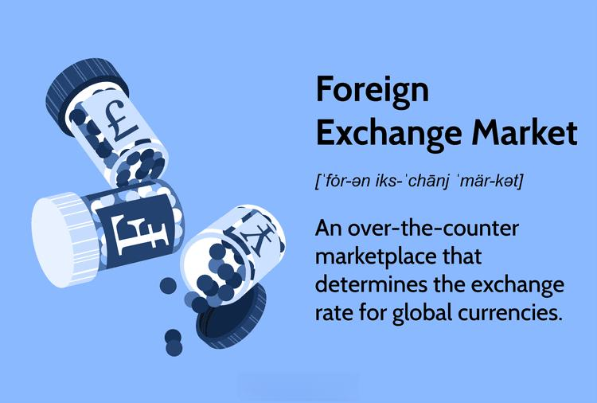

The rise of digital innovation has significantly transformed the landscape of financial markets, with cryptocurrency, foreign exchange (forex), and algorithmic (algo) trading emerging as prominent forces. Each of these arenas has carved its niche within global trading, attracting traders and investors worldwide due to their unique dynamics and opportunities for profit.

Cryptocurrency trading, fueled by the surge in popularity of digital assets like Bitcoin, Ethereum, and others, has become a key component of modern financial markets. Cryptocurrencies offer a decentralized alternative to traditional fiat currencies, challenging established financial systems and reshaping how value is exchanged and held. Meanwhile, the forex market remains the largest and most liquid financial market in the world, enabling traders to buy, sell, exchange, and speculate on currency pairs. The integration of cryptocurrencies into forex trading has led to innovative approaches in trading strategies, where digital currencies are used alongside or in replacement of fiat currencies in currency pairs.



The convergence of these markets is further amplified by the advent of algorithmic trading, a practice that leverages cutting-edge technology to automate trading strategies. Algo trading enables the execution of trading orders at speeds and frequencies that would be impossible for human traders, utilizing complex algorithms to analyze market patterns and make informed trading decisions. This integration is not only changing how trades are executed but also impacting broader market dynamics and liquidity.

This article will explore the interplay between cryptocurrency forex trading, Bitcoin's role within forex markets, and the transformative power of algorithmic trading. These topics are integral to understanding how modern trading strategies are evolving and the potential they hold for shaping the future of global financial markets.

## Table of Contents

## Understanding Cryptocurrency Forex Trading

Cryptocurrency forex trading refers to the process of using digital currencies to trade traditional currency pairs. This innovative approach is increasingly gaining traction as it leverages the decentralized nature of cryptocurrencies to offer unique advantages in the forex market. Traditional forex trading involves trading pairs of national currencies, such as the EUR/USD (Euro/US Dollar) or the GBP/JPY (British Pound/Japanese Yen). In contrast, cryptocurrency forex trading might include pairs like BTC/USD (Bitcoin/US Dollar) or ETH/EUR (Ethereum/Euro), where one of the currencies is a cryptocurrency.

One of the primary appeals of using cryptocurrencies in forex markets lies in their decentralized valuations. Unlike fiat currencies regulated by central banks, cryptocurrencies are typically governed by decentralized blockchain networks. This characteristic can, in theory, result in valuations less susceptible to government policy changes or economic instability in any single nation, offering traders a broader array of opportunities. 

Moreover, trading with cryptocurrencies can often lead to lower transaction costs. Traditional [forex](/wiki/forex-system) transactions are typically conducted through intermediaries such as banks or brokers, who may charge various fees. In contrast, the peer-to-peer nature of [cryptocurrency](/wiki/cryptocurrency) transactions means that they often come with smaller fees due to reduced intermediary involvement.

Here's a simple Python code snippet that demonstrates how one might use basic logic to convert cryptocurrency prices to determine profitable exchange rates between different currency pairs:

```python
# Example: Calculating potential arbitrage opportunities
btc_to_usd = 40000     # Current Bitcoin to USD rate
eth_to_usd = 2500      # Current Ethereum to USD rate
btc_to_eth = 16        # Current Bitcoin to Ethereum rate

# Calculate if there's a profitable exchange possibility
potential_eth = btc_to_usd / eth_to_usd
if potential_eth > btc_to_eth:
    print("Profitable arbitrage opportunity: Convert USD -> BTC -> ETH and back to USD")
else:
    print("No profitable arbitrage found")
```

Cryptocurrency forex trading also allows for trading operations 24/7, unlike traditional forex markets that may have downtime tied to banking hours. This constant market availability provides traders with increased flexibility to take advantage of market movements at any time. However, it should be noted that this constant trading availability requires careful risk management and vigilance to mitigate potential losses from market [volatility](/wiki/volatility-trading-strategies).

In summary, cryptocurrency forex trading represents a modern evolution in forex markets, characterized by the use of digital currencies that offer decentralized valuations, potentially lower transaction costs, and continuous market access. These features present both opportunities and challenges that traders must navigate in this dynamic trading environment.

## Bitcoin: A Major Player in Forex Markets

Bitcoin has emerged as a significant asset within forex markets, reflecting its growing adoption as both a digital currency and an investment vehicle. Its decentralized nature, along with the technological underpinnings provided by blockchain, have brought new dynamics to traditional forex trading. Bitcoin's influence on forex markets arises through its utilization in currency pairs, offering an alternative to conventional fiat currencies. Traders may engage with Bitcoin to hedge against geopolitical risks or to capitalize on its high volatility.

Volatility is a defining characteristic of Bitcoin, with its value frequently exhibiting substantial fluctuations. This trait significantly affects forex market outcomes. The volatility index (VIX), commonly used to measure market risk, can approximate Bitcoin's behavior in forex trading. Traders often calculate Bitcoin's volatility using standard deviation or variance from its historical price data. For instance, given a dataset of historical prices $P_1, P_2, \ldots, P_n$, the volatility $\sigma$ can be expressed as:

$$
\sigma = \sqrt{\frac{\sum_{i=1}^{n} (P_i - \bar{P})^2}{n}}
$$

where $\bar{P}$ is the average price. High volatility implies greater potential for both profit and loss, necessitating sophisticated risk management strategies.

Bitcoin's influence extends to market sentiment analysis. Tools like sentiment analysis algorithms assess investor emotions surrounding Bitcoin. This assessment, increasingly important as crypto markets intersect with forex, can guide trading strategies based on collective sentiment insights. Additionally, correlations between Bitcoin and traditional forex pairs may inform predictions about currency movements, although these relationships can be unstable due to the fledgling nature of cryptocurrency markets.

Traders in forex markets must consider how Bitcoin’s regulatory environment, evolving technological infrastructure, and macroeconomic factors might impact its role in trading strategies. As Bitcoin integrates more into global finance, understanding its direct and indirect effects on currency valuation and trader psychology becomes crucial for optimizing forex market strategies.

## Algo Trading: Transforming Cryptocurrency and Forex Markets

Algorithmic trading, often referred to as algo trading, involves the use of computer programs to execute a large number of trades in financial markets at speeds and frequencies otherwise impossible for human traders. In the cryptocurrency and forex landscapes, algo trading is increasingly significant due to its ability to process vast amounts of data rapidly and execute trades based on predefined criteria.

Central to [algorithmic trading](/wiki/algorithmic-trading) are algorithms, which are sets of rules or instructions designed to perform tasks. In trading, these algorithms can range from simple conditions, such as buying a currency pair when its price drops to a certain threshold, to complex strategies involving multiple data inputs and market indicators. The primary advantage of algorithmic trading is the automation of repetitive tasks, thus enabling traders to enhance decision-making and efficiency.

For instance, consider the situation where a trader wishes to exploit [arbitrage](/wiki/arbitrage) opportunities. An algorithm can be programmed to identify price discrepancies for the same asset on different exchanges. Once detected, the algorithm can automatically execute simultaneous buy and sell orders to capitalize on the difference, a process known as triangular arbitrage in forex markets. In mathematical terms, if $A$, $B$, and $C$ represent three different currency exchanges, the algorithm ensures that:

$$
\text{Buy Price}_A < \text{Sell Price}_B > \text{Buy Price}_C
$$

Python, a popular programming language for algorithmic trading, offers various libraries and tools to facilitate these processes. The following snippet illustrates a basic algorithm to automatically buy a cryptocurrency if its price falls below a specific threshold:

```python
import requests

def get_crypto_price(crypto, currency='USD'):
    url = f'https://api.coingecko.com/api/v3/simple/price?ids={crypto}&vs_currencies={currency}'
    response = requests.get(url).json()
    return response[crypto][currency]

def auto_trade(threshold_price):
    current_price = get_crypto_price('bitcoin')
    if current_price < threshold_price:
        # hypothetical function to execute a trade
        execute_trade('buy', 'bitcoin', amount=1)
        return "Trade Executed"
    return "No Trade"

# Set a threshold price
threshold_price = 30000
trade_status = auto_trade(threshold_price)
print(trade_status)
```

Using algorithms, trades can be conducted 24/7, a significant advantage in the always-open cryptocurrency market. Additionally, algorithms can manage a trader's portfolio risk by executing orders based on volatility indicators or stop-loss conditions. This automation elevates trading efficiency and allows for more refined and strategic decision-making, minimizing human error and emotion-based decisions.

In conclusion, algorithmic trading significantly enhances the functionality and effectiveness of trading strategies in cryptocurrency and forex markets, offering unprecedented speed, accuracy, and market analysis capabilities.

## Benefits of Cryptocurrency Algo Trading

Algorithmic trading, often referred to as algo trading, involves the use of computer programs to automate trading decisions and execute orders based on predefined criteria. When combined with cryptocurrencies, algo trading offers a formidable set of advantages in forex markets, enhancing both the speed and efficiency of trading activities.

One of the primary benefits of integrating algorithmic trading with cryptocurrencies in forex markets is speed. Algorithms can process market data and execute trades at a much faster rate than humans can achieve manually. This capability is crucial in the forex market where price movements can be rapid and opportunities can vanish in seconds. For instance, algorithms can scan multiple cryptocurrency exchanges, analyze order [books](/wiki/algo-trading-books), and execute buy/sell orders within milliseconds, allowing traders to capitalize on even the smallest market inefficiencies.

Efficiency is another significant benefit of cryptocurrency algo trading. Algorithms can handle bulk trading and execute large volumes of transactions without the risk of human error. This level of efficiency is particularly important in highly volatile cryptocurrency markets where quick decision-making across multiple currency pairs can result in optimal trading outcomes. Moreover, automated processes reduce trading costs by minimizing errors and improving execution quality.

Risk management is also enhanced through algorithmic trading. Algorithms can be programmed to follow specific risk management rules, such as stop-loss and take-profit levels, ensuring disciplined trading practices. Additionally, they can incorporate advanced risk metrics like Value at Risk (VaR) and Sharpe ratios to evaluate the potential for losses and adjust trading strategies accordingly.

The ability to conduct trades 24/7 is a unique advantage of cryptocurrency algo trading. Unlike traditional forex markets, which have fixed trading hours and are closed on weekends, cryptocurrency markets operate around the clock. Algorithms can monitor these markets continuously and place trades at all hours, enabling traders to capitalize on opportunities even when they are not actively monitoring the markets. This constant market presence can increase profitability by ensuring that trading strategies are executed promptly as new information becomes available.

In conclusion, the fusion of cryptocurrencies with algorithmic trading in forex markets brings advantages such as rapid execution, enhanced efficiency, superior risk management, and round-the-clock trading capabilities. These benefits position cryptocurrency algo trading as a dynamic tool that can offer significant competitive advantages in today's fast-paced financial environment.

## Risks and Challenges in Cryptocurrency Forex and Algo Trading

Cryptocurrency forex and algorithmic trading have emerged as significant components of the global trading landscape, yet they [carry](/wiki/carry-trading) inherent risks and challenges that traders must navigate. A primary concern is market volatility. Both cryptocurrencies and forex markets are known for their rapid price fluctuations. Cryptocurrencies, in particular, can experience dramatic swings due to their relatively nascent market, susceptibility to market sentiment shifts, regulatory news, and other geopolitical factors. Forex markets, while less volatile than cryptocurrencies, are influenced by macroeconomic indicators, political developments, and central bank policies. This volatility can lead to increased risk of significant financial loss if not properly managed.

Technological failures present another substantial risk. Algorithmic trading, which relies heavily on the seamless operation of complex software and hardware systems, can be disrupted by technical glitches or system outages. These disruptions can result in delayed trades, erroneous executions, or even complete trading halts, potentially leading to substantial losses.

Security concerns also loom large in the cryptocurrency and forex markets. Cyber threats are an omnipresent risk, with the potential for hacking, fraud, and data breaches posing significant threats to traders. The decentralized nature of cryptocurrencies, while advantageous in many respects, can also complicate the security landscape, making it imperative for traders to employ robust security measures, such as two-[factor](/wiki/factor-investing) authentication, encryption, and regular software updates.

To manage these risks effectively, traders should adopt comprehensive risk management strategies. One approach is diversification; by spreading investments across different assets, traders can mitigate the impact of volatility on their portfolios. Additionally, setting stop-loss and take-profit orders can help limit potential losses and secure gains automatically based on predetermined price levels.

Employing robust technological safeguards is crucial to prevent and respond to technological failures. Regularly maintaining and testing trading systems can minimize the risk of unexpected breakdowns. Furthermore, staying informed about and adhering to industry best practices for cybersecurity can reduce exposure to security threats.

Continuous education and staying updated on market trends and regulatory changes can also equip traders to better anticipate and respond to market dynamics. By combining these strategies, traders can effectively navigate the risks inherent in cryptocurrency forex and algorithmic trading, while maximizing their potential for success.

## How to Start Trading in Crypto Forex Markets Using Algorithms

Starting to trade in the crypto forex markets with algorithmic trading tools requires a structured approach that emphasizes education, the selection of an appropriate trading platform, and the development and [backtesting](/wiki/backtesting) of strategies. Here’s a detailed guide for beginners interested in entering this innovative trading space.

### Importance of Education

Understanding the complexities of cryptocurrency and forex markets is paramount. Prospective traders should familiarize themselves with key concepts such as market dynamics, trading strategies, and risk management. Educational resources include online courses, webinars, and books dedicated to financial markets and algorithmic trading. Websites like Investopedia and Coursera offer comprehensive courses on these subjects.

### Selecting the Right Trading Platform

Choosing the right trading platform is crucial for implementing algorithmic trading strategies. A good platform should offer:

1. **User-friendly Interface**: An intuitive interface helps in easy navigation and efficient trading.
2. **Real-time Data and Analytics**: Access to live market data and analytical tools is essential for informed decision-making.
3. **API Access**: For algorithmic trading, API access allows the integration of custom trading algorithms with the platform.
4. **Security**: Ensuring that the platform has robust security protocols to protect user data and funds.

Popular platforms include MetaTrader 4/5 for forex trading, and Binance and Coinbase Pro for cryptocurrency trading. Opening a demo account on these platforms can provide hands-on experience without financial risk.

### Backtesting Strategies

Backtesting is a critical step in algorithmic trading that involves testing a trading strategy using historical data. This process helps identify whether a strategy is viable before risking real capital. The steps involved in backtesting include:

1. **Define a Strategy**: Clearly outlining entry and exit rules, and choosing indicators such as moving averages or RSI.
2. **Collect Historical Data**: Gathering sufficient historical data relevant to the chosen asset or currency pair.
3. **Implement the Strategy**: Coding the strategy using a programming language like Python. Libraries such as `pandas` for data manipulation and `TA-Lib` for technical analysis are invaluable in this process.

   ```python
   import pandas as pd
   import ta

   # Load historical data
   data = pd.read_csv('historical_data.csv')

   # Example of a simple moving average crossover strategy
   data['SMA_10'] = data['close'].rolling(window=10).mean()
   data['SMA_50'] = data['close'].rolling(window=50).mean()

   data['Signal'] = 0
   data.loc[data['SMA_10'] > data['SMA_50'], 'Signal'] = 1
   ```

4. **Analyze Results**: Evaluating the performance by calculating benchmarking metrics such as Sharpe Ratio or Maximum Drawdown to understand risk-adjusted returns.

   ```python
   # Calculate returns
   data['Returns'] = data['close'].pct_change()
   data['Strategy_Returns'] = data['Returns'] * data['Signal'].shift(1)

   # Assess performance
   sharpe_ratio = data['Strategy_Returns'].mean() / data['Strategy_Returns'].std() * (252**0.5)
   print('Sharpe Ratio:', sharpe_ratio)
   ```

### Practical Implementation

Once a strategy has been properly backtested and refined, implementing it in a live environment requires close monitoring. It is advisable to start with small trades to gauge performance and make necessary adjustments. Regular evaluation and adaptation of strategies based on market conditions and new insights will enhance resilience and adaptability.

In summary, entering the crypto forex market with algorithmic trading tools is an intricate process that combines education, technology, and strategic analysis. By taking a systematic approach, beginners can effectively navigate this dynamic financial landscape and enhance their trading proficiency.

## Future Trends in Cryptocurrency Forex and Algo Trading

Cryptocurrency, forex, and algorithmic trading are witnessing a rapid evolution driven by technological advancements and shifting regulatory landscapes. As these sectors continue to intertwine, several key trends are shaping their future.

One significant advancement is the increased integration of Artificial Intelligence (AI) and Machine Learning (ML) into trading strategies. These technologies enhance the ability of traders to analyze vast datasets, predict market trends, and execute trades with precision. For example, AI algorithms can process high-frequency trading data to identify patterns that are imperceptible to human traders. ML models, particularly neural networks, are increasingly used to forecast currency price movements based on historical data, which allows for more informed trading decisions.

Moreover, AI-driven sentiment analysis is becoming crucial in predicting market movements by assessing public sentiment from news articles, social media platforms, and other digital content. This enables traders to gauge market sentiment and anticipate potential market shifts, making their strategies more adaptable and responsive.

Python, as a versatile programming language, is often employed in developing these algorithms due to its vast libraries and frameworks, such as TensorFlow and Keras for AI, and Pandas and NumPy for data analysis. A simple Python script for data analysis might look something like this:

```python
import pandas as pd
import numpy as np

# Load dataset
data = pd.read_csv('crypto_forex_data.csv')

# Calculate moving average
data['Moving_Average'] = data['Price'].rolling(window=50).mean()

# Identify trading signals
data['Signal'] = np.where(data['Price'] > data['Moving_Average'], 'Buy', 'Sell')
```

In addition to technological advancements, regulatory frameworks are evolving to keep pace with the rapid growth of cryptocurrencies. Several governments are reassessing their regulatory approaches, focusing on establishing rules that safeguard investors without stifling innovation. Regulatory clarity is expected to enhance the institutional adoption of cryptocurrencies in forex trading by reducing uncertainty and building trust among traditional financial institutions.

Furthermore, distributed ledger technologies, such as blockchain, are being explored to increase transparency and efficiency in trading processes. Smart contracts, which automatically execute trade conditions, could significantly streamline trading operations while reducing the need for intermediaries, thus lowering transaction costs and increasing execution speeds.

As these trends continue to shape the cryptocurrency, forex, and algorithmic trading landscapes, traders must remain agile and informed. Embracing emerging technologies and adapting to regulatory changes will be essential for harnessing the full potential of these evolving markets.

## Conclusion

Cryptocurrency, forex, and algorithmic trading have reshaped the global trading landscape by introducing novel opportunities along with a set of challenges. As discussed, cryptocurrency forex trading merges the dynamics of digital currencies with traditional currency pairs, offering benefits such as decentralized valuations and reduced costs. Bitcoin, in particular, has become a significant entity within forex markets, influencing market strategies through its inherent volatility.

Algorithmic trading represents a powerful tool, automating processes and enhancing decision-making for both cryptocurrency and forex markets. The combination of cryptocurrencies with algo trading introduces advantages such as increased speed, efficiency, and improved risk management. It also supports continuous trading, capitalizing on market movements around the clock.

However, these opportunities are not without risks. Traders must navigate market volatility, technological vulnerabilities, and security threats. It is crucial to implement strategies to mitigate these risks, such as continuous education, selecting appropriate platforms, and rigorously backtesting strategies before execution.

Looking ahead, the future of cryptocurrency, forex, and algo trading will be shaped by emerging technologies, anticipated regulatory changes, and advancements in AI and [machine learning](/wiki/machine-learning). To succeed, traders must remain informed and adapt their strategies to keep pace with this fast-evolving market. By maintaining a balanced perspective that weighs both opportunities and risks, traders can strategically position themselves within this dynamic ecosystem.

## References & Further Reading

[1]: Bergstra, J., Bardenet, R., Bengio, Y., & Kégl, B. (2011). ["Algorithms for Hyper-Parameter Optimization."](https://papers.nips.cc/paper/4443-algorithms-for-hyper-parameter-optimization) Advances in Neural Information Processing Systems 24.

[2]: ["Advances in Financial Machine Learning"](https://www.amazon.com/Advances-Financial-Machine-Learning-Marcos/dp/1119482089) by Marcos Lopez de Prado

[3]: ["Evidence-Based Technical Analysis: Applying the Scientific Method and Statistical Inference to Trading Signals"](https://www.amazon.com/Evidence-Based-Technical-Analysis-Scientific-Statistical/dp/0470008741) by David Aronson

[4]: ["Machine Learning for Algorithmic Trading"](https://github.com/stefan-jansen/machine-learning-for-trading) by Stefan Jansen

[5]: ["Quantitative Trading: How to Build Your Own Algorithmic Trading Business"](https://www.amazon.com/Quantitative-Trading-Build-Algorithmic-Business/dp/1119800064) by Ernest P. Chan