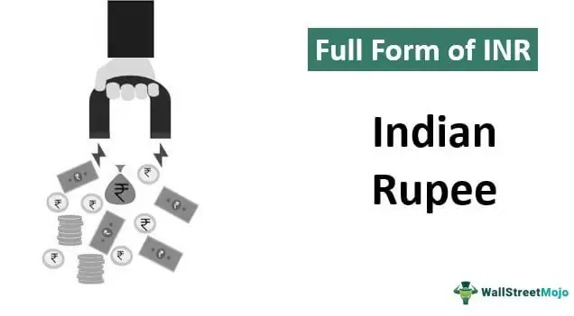

This article explores the intricate ties between currency policy, the economy, rupee convertibility, and algorithmic trading, highlighting the dynamic interplay in the financial world. Currency policies are vital instruments for national and global economies, significantly affecting trade, investment, and overall economic stability. By managing a currency's value and exchange rates, governments and central banks influence how economies perform on a broad scale, bearing implications for inflation control, foreign reserves, and international competitiveness.

Rupee convertibility is a crucial component of India’s economic strategy, determining how easily the Indian currency can be exchanged for other currencies. The measure of convertibility directly influences India’s economic openness and capacity to engage with global financial markets. Since the early 1990s, when India started liberalizing its economy, the rupee's convertibility has been progressively relaxed, impacting international trade and investment flows. Understanding rupee convertibility sheds light on the economic frameworks defining India's role in the global economy and its future trajectories.



Algorithmic trading refers to the use of complex algorithms and rapid computing power to automate trading decisions in financial markets. It revolutionizes the trading landscape by allowing decisions to be made at speeds and efficiencies unattainable by human traders, taking into account a myriad of factors including currency policies and market dynamics. The increasing adoption of algorithmic trading underscores the necessity of understanding the influence of regulatory measures and financial conditions on trading strategies and outcomes.

Grasping these concepts is essential for understanding broader economic implications and preparing for future financial landscapes. As the global economy continues to evolve, the interplay between currency policy, rupee convertibility, and algorithmic trading will remain a significant determinant of financial dynamics, demonstrating both challenges and opportunities for economic stability and growth.

## Table of Contents

## Understanding Currency Policy

Currency policy is a fundamental aspect of economic management, involving various regulatory measures employed by governments or central banks to maintain the national currency's value and control exchange rates. These policies are pivotal in ensuring economic stability, managing inflation, and overseeing foreign reserves.

Primarily, currency policies aim to stabilize the economy by managing fluctuations in currency value and exchange rates. This stability is crucial for fostering a predictable economic environment that encourages domestic and international investment. Inflation control is another critical goal, as unchecked inflation can erode purchasing power and economic growth. By implementing monetary policy measures such as interest rate adjustments and open market operations, central banks can influence inflation levels, ensuring they remain within targeted limits.

Several types of currency policies exist, each serving distinct purposes. One common approach is intervention in foreign exchange markets, where central banks buy or sell the national currency to influence its value. This method can be employed to counteract excessive [volatility](/wiki/volatility-trading-strategies) or to address trade imbalances. Interest rate management is another tool, wherein central banks adjust the cost of borrowing to influence economic activity, capital flows, and inflation rates. These adjustments can impact the currency's strength relative to other currencies, thereby affecting trade competitiveness.

Currency convertibility policies, determining the ease with which a currency can be exchanged for others, play a significant role in the economic landscape. Convertibility can be categorized into current account convertibility, facilitating international trade transactions, and capital account convertibility, affecting cross-border investments and asset exchanges. The degree of convertibility a currency possesses can influence its attractiveness to foreign investors and its integration into the global financial system.

The role of currency policy extends beyond national borders, influencing international trade and investment. By affecting exchange rates and cross-border capital flows, currency policies directly impact a country's competitiveness in the global market. For example, a devalued national currency can make exports more competitive by lowering their price in foreign markets, potentially boosting economic growth. Conversely, policies that strengthen the currency may encourage imports by making foreign goods cheaper.

In summary, currency policy is crucial for economic stability, inflation control, and international competitiveness. Through interventions in [forex](/wiki/forex-system) markets, [interest rate](/wiki/interest-rate-trading-strategies) management, and convertibility measures, governments and central banks guide the national economy, influencing its interaction with the global financial ecosystem. Understanding these policies is vital for comprehending their broad economic implications and preparing for future financial landscapes.

## Economy and Rupee Convertibility

Rupee convertibility plays a pivotal role in shaping India's economic landscape, influencing the ease with which the Indian currency can be exchanged for other global currencies. The concept gained prominence during the liberalization process of the Indian economy in the early 1990s, a period marked by significant economic reforms aimed at opening up the economy to global markets. This liberalization marked the beginning of partial convertibility of the rupee, specifically on the current account, wherein individuals and businesses could engage in foreign trade and transactions with fewer restrictions.

The introduction of partial convertibility had profound impacts on international trade and investment flows. For one, it improved market [liquidity](/wiki/liquidity-risk-premium) by allowing easier access to foreign exchange for legitimate trade purposes, thereby facilitating smoother cross-border trade. Additionally, it opened up avenues for global investment opportunities, as foreign investors found it easier to repatriate profits and engage in direct investments in India.

However, rupee convertibility is not without its challenges. One significant concern is the potential for increased market volatility. As the rupee becomes more convertible, it is subjected to the whims of global currency markets, which can lead to rapid and significant fluctuations in its value. This volatility can affect economic stability, making it a crucial consideration for policymakers. Additionally, increased exposure to foreign debt burdens is another potential downside, as easier access to foreign capital can lead to over-reliance on external borrowings.

The debate surrounding full convertibility of the rupee remains ongoing. Proponents argue that moving towards full convertibility would enhance economic openness, making India more attractive to foreign investors and thereby boosting economic growth. The increased capital flows could lead to improved infrastructure and technology transfers, spurring further development. Nevertheless, skeptics caution that full convertibility could expose the economy to greater risks of capital flight and market instability, particularly in the context of global financial uncertainties.

In summary, while partial convertibility has facilitated greater economic integration and growth opportunities, the path towards full convertibility requires careful balancing of risks and benefits, ensuring that economic stability is maintained while maximizing the potential advantages of a more open financial system.

## Types of Convertibility

Currency convertibility is a crucial concept in international finance, determining the ease with which a country's currency can be exchanged for other currencies. It is broadly categorized into two types: current account convertibility and capital account convertibility.

**Current Account Convertibility** refers to the ability of a country's currency to be freely exchanged for foreign currencies in the context of transactions concerning goods, services, and income. This type of convertibility facilitates international trade by allowing businesses and individuals to transact across borders without restrictive currency controls. It includes all trade-related transactions, such as export and import of goods and services, and also encompasses remittances and payment of income like dividends or interest earnings from abroad.

**Capital Account Convertibility**, on the other hand, involves the freedom to conduct capital transactions, which include investments and asset purchases, across borders. This kind of convertibility permits foreign direct investments, portfolio investments, and the purchase and sale of financial assets without significant restrictions. While capital account convertibility can enhance economic growth by allowing more foreign capital inflow, it also exposes the economy to potential risks from abrupt capital flight or speculative attacks.

The Indian rupee is currently convertible on the current account but not on the capital account. This means that India allows the free exchange of its currency for international trade in goods and services, but maintains certain restrictions on the flow of capital across its borders. These restrictions on the capital account are in place to mitigate risks such as sudden capital withdrawals, which can lead to economic instability.

Understanding the distinction between these two types of convertibility is fundamental to analyzing a country's economic policies. Policies regarding convertibility affect the country's integration with global financial markets and have significant implications for its economic stability and growth. They also influence the decision-making processes of businesses and investors, guiding the flow of trade and investments both into and out of the country.

For a nation like India, where the rupee is not fully capital account convertible, maintaining a balance between promoting economic growth through liberalization and ensuring economic stability is crucial. This balance dictates the pace and extent of any policy changes towards further liberalization of the currency.

## Influence of Rupee Convertibility on Algorithmic Trading

Algorithmic trading, a prominent facet of modern financial markets, leverages advanced computational algorithms to make efficient and timely trading decisions. This automation considers various factors, including market data, news, historical trends, and, importantly, currency policies such as rupee convertibility. Rupee convertibility refers to the ability to freely exchange the Indian rupee against foreign currencies, a [factor](/wiki/factor-investing) critical in determining market liquidity and volatility.

Changes in rupee convertibility can significantly influence the dynamics of the foreign exchange (forex) market. When the rupee moves towards greater convertibility, it typically increases market liquidity, thereby providing algorithmic traders with more opportunities and data points to optimize their trading strategies. Conversely, restrictions on convertibility can lead to decreased liquidity, which may pose challenges for algorithms that rely heavily on [volume](/wiki/volume-trading-strategy) and transaction speed.

Algorithmic trading systems are designed to react to real-time changes in forex market conditions. As rupee convertibility policies shift, these algorithms must quickly adapt to manage currency risk and capitalize on [arbitrage](/wiki/arbitrage) opportunities that may arise due to mispriced assets. For instance, if a sudden policy change results in currency volatility, algorithms can adjust trading strategies to hedge positions or take advantage of short-term price movements.

The adaptive nature of [algorithmic trading](/wiki/algorithmic-trading) ensures that trading systems are constantly updated to reflect regulatory changes and market volatility associated with rupee convertibility. Techniques such as [machine learning](/wiki/machine-learning) enable these systems to learn from past data, improve prediction accuracy, and refine trading decisions. For example, a simple mean-reversion strategy could be implemented in Python:

```python
import numpy as np

# Simulated historical price data
prices = np.array([100, 102, 101.5, 103, 102.5, 104])

# Calculate rolling mean
window_size = 3
rolling_mean = np.convolve(prices, np.ones(window_size)/window_size, mode='valid')

# Trading decisions based on mean-reversion
for i, price in enumerate(prices[window_size-1:], start=window_size-1):
    if price < rolling_mean[i-window_size+1]:  # Price below the rolling mean
        print(f"Buy at price {price}")
    elif price > rolling_mean[i-window_size+1]:  # Price above the rolling mean
        print(f"Sell at price {price}")
```

In this example, the algorithm identifies buying or selling opportunities based on whether the current price is above or below a rolling average. Such strategies, when informed by ongoing assessments of rupee convertibility, can adjust in real-time to ensure optimal trading performance.

Ultimately, as India navigates the complexities of rupee convertibility, algorithmic trading will play an increasingly pivotal role in defining forex market behavior and investment outcomes. The continued evolution of these trading systems will depend on their ability to integrate adaptive algorithms that account for regulatory influences and economic conditions impacting the rupee's convertibility.

## The Benefits and Risks of Full Convertibility

Full convertibility of the Indian rupee presents various potential benefits and risks that deeply impact India's financial landscape. On the benefits side, full convertibility can be an indicator of economic stability. When the rupee is fully convertible, it suggests that the Indian economy possesses the resilience to withstand external shocks. This perception can attract foreign investors seeking secure investment destinations. Increased foreign direct investments (FDI) could stimulate higher economic growth by providing capital, technology transfer, and employment opportunities, significantly bolstering domestic industries.

Moreover, full convertibility enhances India's engagement in global trade. It reduces transaction costs associated with currency exchange, leading to more efficient trade processes and stronger participation in international markets. Businesses can conduct transactions without worrying about currency exchange restrictions, thereby fostering more robust economic linkages and facilitating cross-border collaborations and partnerships.

Despite these advantages, full convertibility is not devoid of risks. It can lead to significant market volatility as the currency becomes more susceptible to speculative attacks and rapid shifts in investor sentiment. Such volatility might destabilize financial markets and push inflation rates upwards, affecting economic stability.

Another significant risk involves challenges in maintaining regulatory control. With full convertibility, it becomes more difficult to regulate the flow of capital across borders, potentially resulting in a mismatch between economic policy objectives and market realities. This could complicate efforts to control monetary policy and maintain macroeconomic balances.

Additionally, full convertibility exposes the economy to global financial uncertainties, such as economic recessions in major economies or fluctuations in global interest rates, which could have adverse ripple effects on India's economy. 

Policymakers must carefully assess these benefits and risks to craft strategies that leverage full convertibility's economic opportunities while safeguarding against its potential pitfalls. This includes establishing strong regulatory frameworks and enhancing financial market infrastructures to support monetary stability and economic growth.

By weighing these factors, India can sustainably navigate the complexities of full rupee convertibility, optimizing its economic potential while minimizing exposure to the inherent risks of an open financial system.

## Conditions for Achieving Full Rupee Convertibility

Achieving full rupee convertibility necessitates a sound economic framework characterized by low non-performing assets (NPAs), stable fiscal deficits, and controlled inflation. A low level of NPAs is crucial as it indicates a healthy banking sector with minimal risks of loan defaults. This fiscal health is essential to maintain investor confidence and economic stability. Alongside, maintaining stable fiscal deficits is pivotal, as persistent high deficits could lead to inflationary pressures or undermine the government's ability to manage economic shocks.

Controlled inflation is another cornerstone for full convertibility. Inflation management ensures price stability, which is vital for maintaining the purchasing power of the currency and supporting long-term economic growth. Governments and central banks employ a mix of monetary and fiscal policies to keep inflation within a targeted range, ensuring that the economy does not overheat or stagnate.

Efficient regulatory infrastructure is critical for navigating the complexities of full currency convertibility. Robust regulations help prevent fraudulent activities, stabilize the financial system, and instill investor confidence. Additionally, comprehensive financial market monitoring assists in recognizing systemic risks early and addressing them promptly, thereby mitigating potential market disruptions. Regulatory bodies are tasked with supervising market operations, ensuring that trading practices align with international norms, and maintaining liquidity and transparency.

India's gradual progress towards these conditions highlights the dual nature of challenges and opportunities on its path to deeper economic globalization. Structural reforms aimed at reducing NPAs, adopting prudent fiscal policies, and augmenting regulatory frameworks demonstrate India's commitment to creating a favorable environment for full convertibility. Additionally, advances in technology aid regulatory bodies in monitoring and managing market risks effectively, further supporting healthy financial integration.

India's strides in strengthening its economic fundamentals underscore the interplay between policy measures and the necessary prerequisites for achieving full rupee convertibility. Such efforts not only bolster India's economic resilience but also pave the way for becoming an integrated player in the global financial markets.

## Conclusion

Currency policy, rupee convertibility, and algorithmic trading are vital elements that shape modern economic landscapes. These components are deeply interlinked, influencing each other and collectively impacting global and national financial systems. A profound understanding of these factors is essential for anyone aiming to navigate future economic trends and make well-informed investment decisions.

The integration of algorithmic trading with currency policy highlights a significant evolution in the financial industry. Algorithmic trading relies on vast amounts of data, including currency fluctuations and policy changes, to execute trades with precision and speed. This ability to swiftly react to currency policy adjustments underscores the importance of understanding these dynamics for traders and investors alike.

Rupee convertibility, which pertains to the ease with which the Indian rupee can be exchanged with other currencies, remains a crucial aspect of India’s financial strategy. As the nation strives for deeper financial integration with the global economy, the balance between the risks and benefits associated with rupee convertibility becomes more pronounced. On one hand, increased convertibility can enhance market liquidity and attract foreign investments; on the other, it presents risks such as increased vulnerability to global market volatility.

To achieve a harmonious balance, policymakers need to ensure robust economic frameworks and effective regulatory infrastructures. This can entail maintaining a low level of non-performing assets, ensuring stable fiscal deficits, and controlling inflation rates. As India advances toward economic globalization, these measures will play an essential role in managing the potential downsides while maximizing the opportunities presented by full rupee convertibility.

Ultimately, the interconnectedness of currency policy, rupee convertibility, and algorithmic trading means that developments in one area can have far-reaching implications across the financial landscape. Recognizing and understanding these interactions will be pivotal as economies adapt to rapid technological advancements and evolving market conditions.

## References & Further Reading

[1]: ["The Art of Currency Trading: A Professional's Guide to the Foreign Exchange Market"](https://www.amazon.com/Art-Currency-Trading-Professionals-Exchange/dp/1119583551) by Brent Donnelly

[2]: ["International Economics: Theory and Policy"](https://open.umn.edu/opentextbooks/textbooks/276) by Paul R. Krugman and Maurice Obstfeld

[3]: ["Globalization and Its Discontents Revisited: Anti-Globalization in the Era of Trump"](https://books.google.com/books/about/Globalization_and_Its_Discontents_Revisi.html?id=3skpDwAAQBAJ) by Joseph E. Stiglitz

[4]: ["Algorithmic Trading: Winning Strategies and Their Rationale"](https://books.google.com/books/about/Algorithmic_Trading.html?id=WAlFDwAAQBAJ) by Ernest P. Chan

[5]: ["India's Economy: Performance and Challenges: Essays in Honour of Montek Singh Ahluwalia"](https://www.semanticscholar.org/paper/India's-Economy%3A-Performance-and-Challenges%3A-Essays-Acharya-Mohan/1ffa4c220904d81250db0c7e13bd12071e18bf1c) edited by Shankar Acharya and Rakesh Mohan