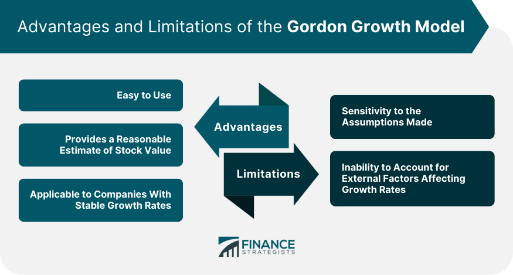

## Table of Contents

## What is the Gordon Growth Model?

The Gordon Growth Model, also known as the dividend discount model, is a way to figure out what a company's stock is worth. It does this by looking at the dividends the company pays out to its shareholders. The main idea is that the value of a stock is the total of all its future dividends, but because we can't add up an endless number of dividends, we use a formula. This formula says the stock's value is the next year's dividend divided by the difference between the discount rate (which is like an interest rate) and the growth rate of the dividends.

This model is simple and works well for companies that are stable and expected to keep growing their dividends at a steady rate forever. However, it has some limits. For example, it assumes that the growth rate of dividends will always be less than the discount rate, which might not be true for all companies. Also, it's not the best model to use for companies that don't pay dividends or whose dividends don't grow at a steady rate. Despite these limits, the Gordon Growth Model is a useful tool for investors who want a quick way to estimate the value of a stock based on its dividends.

## How is the Gordon Growth Model calculated?

The Gordon Growth Model is a way to figure out how much a stock is worth by looking at its dividends. The formula is simple: you take the expected dividend for next year and divide it by the difference between the discount rate and the growth rate of the dividends. The discount rate is like an interest rate that shows how much you value getting money now instead of later. The growth rate is how fast the company's dividends are expected to grow each year. For example, if next year's dividend is expected to be $2, the discount rate is 10%, and the growth rate is 5%, the stock's value would be $2 divided by (10% - 5%), which equals $40.

This model works best for companies that are stable and expected to keep paying dividends that grow at a steady rate forever. But it has some limits. It assumes that the growth rate of dividends will always be less than the discount rate, which might not be true for all companies. Also, it doesn't work well for companies that don't pay dividends or whose dividends don't grow at a steady rate. Despite these limits, the Gordon Growth Model is a handy tool for investors who want a quick way to estimate the value of a stock based on its dividends.

## What are the key assumptions of the Gordon Growth Model?

The Gordon Growth Model makes some important guesses about how companies work. It assumes that a company will keep paying out dividends and that these dividends will grow at a steady rate forever. This means the company must be stable and not change much over time. The model also assumes that the rate at which the dividends grow will always be less than the discount rate, which is the rate used to figure out how much money today is worth compared to money in the future.

These assumptions can make the Gordon Growth Model a bit tricky to use. For example, if a company's dividends don't grow at a steady rate or if they stop paying dividends, the model won't give a good estimate of the stock's value. Also, if the growth rate of the dividends is higher than the discount rate, the formula won't work because it would give a negative or infinite value. Despite these limits, the model is still useful for investors who want a simple way to guess a stock's value based on its dividends.

## What are the main advantages of using the Gordon Growth Model?

The Gordon Growth Model is easy to use and understand. It only needs a few pieces of information, like the expected dividend for next year, the discount rate, and the growth rate of the dividends. This makes it a quick way for investors to guess how much a stock is worth based on its dividends. Because it's so simple, it's a good tool for people who want a fast and straightforward way to value a stock.

Another big advantage is that the model works well for companies that are stable and expected to keep growing their dividends at a steady rate. If a company fits this description, the Gordon Growth Model can give a good estimate of its stock value. This can help investors make better decisions about which stocks to buy or sell, especially if they are looking at companies that regularly pay dividends and have a predictable growth pattern.

## Can you explain how the Gordon Growth Model simplifies dividend valuation?

The Gordon Growth Model makes figuring out the value of a stock based on its dividends really simple. It uses a formula that only needs three numbers: the dividend expected next year, the discount rate, and the growth rate of the dividends. By dividing next year's expected dividend by the difference between the discount rate and the growth rate, you get the stock's value. This makes it easy for anyone to quickly estimate what a stock might be worth without needing a lot of complicated math or data.

This model is especially useful for companies that are steady and keep growing their dividends at a regular pace. If a company fits this description, the Gordon Growth Model can give a good guess of its stock value. It's like a quick tool for investors who want to see if a stock is a good buy based on the dividends it pays out. Even though it has some limits, like assuming the growth rate will always be less than the discount rate, it's still a handy way to get a simple estimate of a stock's worth.

## What are some common disadvantages of the Gordon Growth Model?

The Gordon Growth Model can be tricky to use because it makes some guesses that might not be true for all companies. It assumes that a company will keep paying dividends and that these dividends will grow at a steady rate forever. But in real life, companies can change a lot, and their dividends might not grow at a steady pace or might even stop. If a company's dividends don't grow as expected or if they stop paying dividends, the model won't give a good estimate of the stock's value. This can make it hard for investors to rely on the model for companies that are not stable or predictable.

Another problem with the Gordon Growth Model is that it assumes the growth rate of the dividends will always be less than the discount rate. The discount rate is like an [interest rate](/wiki/interest-rate-trading-strategies) that shows how much you value getting money now instead of later. If the growth rate of the dividends is higher than the discount rate, the formula won't work because it would give a negative or infinite value. This limits the model's usefulness for companies that might have high growth rates. Despite these issues, the Gordon Growth Model can still be a helpful tool for investors who want a quick and simple way to guess a stock's value based on its dividends, but they should be aware of its limits.

## How does the Gordon Growth Model handle different growth rates?

The Gordon Growth Model assumes that dividends grow at a steady rate forever. This means it works best for companies that are stable and keep increasing their dividends at the same pace year after year. If a company's dividends grow at a different rate, like going up and down or stopping, the model won't give a good estimate of the stock's value. It's like trying to use a straight line to predict a bumpy road - it just doesn't fit.

The model also has a big rule: the growth rate of the dividends must always be less than the discount rate. The discount rate is like an interest rate that shows how much you value getting money now instead of later. If the growth rate is higher than the discount rate, the formula breaks because it would give a negative or infinite value. This means the Gordon Growth Model can't handle companies that might have very high growth rates. So, while it's a simple tool for investors, it has its limits when it comes to different growth rates.

## What are the limitations of the Gordon Growth Model in predicting stock prices?

The Gordon Growth Model has some big limits when it comes to guessing stock prices. It assumes that a company will keep paying dividends and that these dividends will grow at a steady rate forever. But in real life, companies can change a lot, and their dividends might not grow at a steady pace or might even stop. If a company's dividends don't grow as expected or if they stop paying dividends, the model won't give a good estimate of the stock's value. This can make it hard for investors to rely on the model for companies that are not stable or predictable.

Another problem with the Gordon Growth Model is that it assumes the growth rate of the dividends will always be less than the discount rate. The discount rate is like an interest rate that shows how much you value getting money now instead of later. If the growth rate of the dividends is higher than the discount rate, the formula won't work because it would give a negative or infinite value. This limits the model's usefulness for companies that might have high growth rates. So, while the Gordon Growth Model can be a helpful tool for investors who want a quick and simple way to guess a stock's value based on its dividends, it has its limits and should be used carefully.

## How does the Gordon Growth Model compare to other valuation models?

The Gordon Growth Model is one way to guess how much a stock is worth, but there are other ways too. One popular method is the Discounted Cash Flow (DCF) Model. The DCF Model looks at all the money a company might make in the future, not just the dividends. It's more detailed and can be used for companies that don't pay dividends or have uneven growth. The Gordon Growth Model is simpler and faster to use, but it only works well for stable companies that pay steady dividends. So, while the Gordon Growth Model is easy, the DCF Model might give a better picture of a company's value if it's more complicated.

Another way to value stocks is the Price-to-Earnings (P/E) Ratio. This method compares a company's stock price to its earnings per share. It's quick and easy to use, like the Gordon Growth Model, but it doesn't look at dividends. The P/E Ratio can be good for comparing companies in the same industry, but it doesn't tell you much about future growth or dividends. The Gordon Growth Model focuses on dividends and steady growth, which makes it different from the P/E Ratio. Each model has its own strengths and weaknesses, so investors might use different models depending on what they're looking for in a stock.

## In what scenarios is the Gordon Growth Model most effective?

The Gordon Growth Model works best for companies that are stable and keep growing their dividends at a steady rate. If a company is expected to keep paying out dividends that grow at the same pace every year, this model can give a good guess of its stock value. It's like using a simple tool to measure something that doesn't change much, which makes it easy and quick for investors to use.

But, the Gordon Growth Model has some limits. It won't work well for companies that don't pay dividends or whose dividends don't grow at a steady rate. If a company's dividends go up and down or stop, the model won't give a good estimate of the stock's value. It's important for investors to know these limits and use the model carefully, especially when looking at companies that might not fit the model's assumptions.

## How can the Gordon Growth Model be adjusted for companies with variable dividend policies?

The Gordon Growth Model is tricky to use for companies with dividends that change a lot. It assumes dividends grow at the same rate every year, but if a company's dividends go up and down or stop, the model won't give a good guess of the stock's value. To adjust the model for these companies, you might need to use a different way to value the stock, like the Discounted Cash Flow (DCF) Model. The DCF Model looks at all the money a company might make in the future, not just the dividends, which can be better for companies with uneven dividends.

Another way to handle variable dividends is to break the company's future into different stages. You could use the Gordon Growth Model for the time when the dividends are steady, and then use another model or method for the times when the dividends change a lot. This way, you can still use the Gordon Growth Model for part of the company's future, but you'll need to be careful and use other tools to get a full picture of the stock's value. It's important for investors to know the limits of the Gordon Growth Model and use it wisely, especially with companies that don't have steady dividends.

## What advanced techniques can be used to improve the accuracy of the Gordon Growth Model?

To make the Gordon Growth Model more accurate, you can use a technique called multi-stage dividend discount modeling. This means you split the company's future into different parts. In the first part, you might use a different model, like the Discounted Cash Flow (DCF) Model, to guess the stock's value when the dividends are changing a lot. Then, once the dividends become steady, you can switch to the Gordon Growth Model. This way, you can still use the simple Gordon Growth Model for the stable part of the company's future, but you'll get a better overall guess of the stock's value by using other models for the times when the dividends are not steady.

Another way to improve the Gordon Growth Model is by using more detailed data and better guesses about the future. Instead of just using one number for the growth rate, you could use different growth rates for different time periods. For example, you might guess that the dividends will grow fast for the next few years and then slow down after that. By using these more detailed guesses, you can make the model fit the company's real situation better. This can help you get a more accurate estimate of the stock's value, even though it makes the model a bit more complicated to use.

## What is Understanding Investment Valuation?

Investment valuation is the process of determining the worth of a financial asset, most commonly a stock or a portfolio of securities. It is a critical component of financial markets, as it empowers investors to make informed decisions by providing insights into the intrinsic value of assets. Understanding the intrinsic value helps investors decide whether a security is overvalued, undervalued, or fairly priced compared to its current market price. This valuation is fundamental in aiding both individual and institutional investors in crafting effective investment strategies, managing risk, and achieving financial goals.

Various investment valuation methods are used in financial markets, each with its unique approach and assumptions. One of the prominent methods is the Gordon Growth Model (GGM), a model specifically used to estimate the intrinsic value of a stock based on the expected future dividends that it will generate. The GGM operates under the assumption of a stable dividend growth rate, simplifying the valuation process. The GGM formula is expressed as:

$$
\text{Intrinsic Value} = \frac{D_1}{k - g}
$$

Where:
- $D_1$ is the expected dividend in the next year,
- $k$ is the required rate of return,
- $g$ is the growth rate of the dividends.

The simplicity of the GGM lies in its assumption that dividends will grow at a constant rate indefinitely, making it particularly useful for valuing companies with stable dividend policies and mature business models.

In comparison, other valuation methods, such as the discounted cash flow (DCF) model and the price-to-earnings (P/E) ratio, offer different perspectives. The DCF model involves estimating the present value of an asset's expected future cash flows and is considered more comprehensive as it encompasses all cash inflows, not just dividends. It involves detailed projections of future revenues, costs, and cash flows, making it suitable for evaluating companies with complex cash flow structures. However, this complexity can also be a drawback in scenarios with high uncertainty about future cash flows.

The P/E ratio, on the other hand, is a simpler method that compares a company's current share price to its earnings per share. It is widely used due to its ease of calculation and ability to provide a quick snapshot of a company's valuation relative to its earnings power. Nevertheless, it does not consider future growth rates or the time value of money, which can lead to less accurate valuations in certain contexts.

The GGM's focus on dividends makes it particularly appealing for valuing dividend-paying stocks, as it provides a direct link between expected dividends and stock valuation. Its primary limitation is its reliance on the assumption of constant dividend growth, which may not hold in all cases, especially for companies in rapidly changing industries or those that do not consistently pay dividends. Despite these limitations, the GGM remains a valuable tool when estimating intrinsic value, largely owing to its straightforward approach and adaptation for companies with stable dividend growth trajectories.

## What is the Gordon Growth Model?

The Gordon Growth Model (GGM) is a fundamental method in financial analysis used to evaluate the intrinsic value of a stock based on a predictable stream of future dividends that grow at a constant rate. The basic formula is:

$$
\text{Intrinsic Value (IV)} = \frac{D_1}{k - g}
$$

Where:\ D_1 is the expected dividend in the next period,\
k is the required rate of return, and\
g represents the dividend growth rate.

### Assumptions Underlying the GGM

The GGM operates under several key assumptions:

1. **Constant Growth Rate**: The model assumes that dividends will continue to grow indefinitely at a constant rate (g). This assumption makes the GGM suitable primarily for companies with stable cash flows and mature, predictable businesses.

2. **Stable Financial Leverage**: It presumes that the company's capital structure remains stable. Consequently, the cost of equity (k) does not fluctuate significantly over time, ensuring consistent future returns.

3. **Dividends as a Proxy for Cash Flows**: Dividends are used as proxies for a company's cash flows, which assumes that a firm’s profitability and its dividend payout patterns remain proportionate.

### Advantages of the GGM

The simplicity of the GGM allows analysts to swiftly compare the intrinsic values of stocks across various industries and market conditions. Its focus on dividends as a measure of cash flow aligns well with companies that have a long history of dividend payments. This makes it particularly useful for evaluating firms in sectors like utilities, where dividend payments are a significant aspect of investor returns.

Moreover, the GGM provides a straightforward analytic comparison for stocks that historically maintain steady growth and can help in forming a benchmark for assessing current stock prices against their calculated intrinsic values.

### Limitations and Potential Biases

Despite its usefulness, the GGM has notable limitations:

1. **Assumption of Constant Growth**: The model's assumption of a perpetual constant growth rate is unlikely to hold in dynamic and volatile markets where growth rates may fluctuate due to varying economic conditions.

2. **Inapplicability to Non-Dividend Paying Stocks**: The GGM cannot be applied to companies that do not pay dividends, nor is it effective for firms that have erratic or cyclical dividend patterns.

3. **Sensitive to Input Variables**: The intrinsic value calculated by the GGM is sensitive to chosen growth rates and required rates of return. Small misestimations in these variables can lead to significant valuation errors, potentially introducing bias in valuation conclusions.

4. **Market Volatility Impact**: Market volatility can significantly affect the components of the model, such as k, leading to unreliable valuations during periods of market instability.

While the GGM offers a valuable framework for determining the intrinsic value of steadily growing dividend-paying stocks, analysts must consider its assumptions and potential biases when applying it to real-world scenarios. Adjustments and comprehensive evaluations are necessary to enhance its applicability across different contexts.

## How can GGM be integrated into financial analysis?

Financial analysts employ the Gordon Growth Model (GGM) as an integral part of their valuation toolkit to estimate a stock's intrinsic value based on expected future dividends. The formula for the GGM is:

$$
\text{Intrinsic Value} = \frac{D_1}{k - g}
$$

where $D_1$ is the expected dividend per share in the next period, $k$ is the required rate of return, and $g$ is the expected dividend growth rate. This model is particularly useful for analyzing companies with stable and predictable dividend growth.

### Adjustments and Considerations in Real-World Scenarios

When applying the GGM to real-world situations, analysts often make several adjustments and considerations to account for the model's assumptions and limitations:

1. **Growth Rate Estimation**: Estimating the growth rate $g$ accurately is crucial, as small changes can significantly affect the intrinsic value. Analysts typically assess a company's historical dividend growth patterns, industry trends, and economic conditions.

2. **Required Rate of Return**: The selection of an appropriate discount rate ($k$) is vital. It often reflects the investor's opportunity cost or the company's weighted average cost of capital (WACC). Analysts might adjust this rate based on factors such as risk premium adjustments for market volatility or sector-specific risks.

3. **Stable Growth Assumption**: The GGM assumes a perpetual and constant growth rate, which may not be realistic for all companies. Analysts may adjust their models to accommodate varying growth phases by employing multi-stage models that initially reflect higher growth rates, transitioning to a stable, perpetual rate.

4. **Dividend Payout Policies**: Analysts must consider the company's dividend payout policy. Some firms might reinvest earnings into growth opportunities instead of paying dividends, requiring adjustments to factor these decisions into the valuation.

### Influence on Investment Decisions

The intrinsic value derived from the GGM aids investors in making informed buying or selling choices. For example, if the calculated intrinsic value exceeds the current market price, the stock may be considered undervalued, representing a potential buying opportunity. Conversely, if the intrinsic value is below the market price, it might indicate that the stock is overvalued, suggesting a sell decision. 

In sectors where dividends are significant, such as utilities, telecommunications, or consumer staples, the GGM's insights are invaluable. Additionally, portfolio managers use these valuations to align investment strategies with income-focused objectives or assess company performance in comparison to sector averages.

By integrating the GGM with broader financial analyses and cross-verifying with other models like discounted cash flow (DCF) or price-to-earnings (P/E) ratios, analysts can achieve a holistic view, ensuring more robust and resilient investment strategies.

## References & Further Reading

[1]: ["The Theory of Investment Value"](https://resources.caih.jhu.edu/textbooks/Resources/download/Theory_Of_Investment_Value_John_Burr_Williams.pdf) by John Burr Williams

[2]: ["Security Analysis"](https://www.amazon.com/Security-Analysis-Foreword-Buffett-Editions/dp/0071592539) by Benjamin Graham and David Dodd

[3]: ["Investment Valuation: Tools and Techniques for Determining the Value of Any Asset"](https://books.google.com/books/about/Investment_Valuation.html?id=5SRHAAAAQBAJ) by Aswath Damodaran

[4]: Fama, E. F., & French, K. R. (2002). ["The Equity Premium"](https://onlinelibrary.wiley.com/doi/abs/10.1111/1540-6261.00437). Journal of Finance, 57(2), 637-659.

[5]: Lo, A. W., & MacKinlay, A. C. (1997). ["The Econometrics of Financial Markets"](https://www.jstor.org/stable/1344712) Princeton University Press.