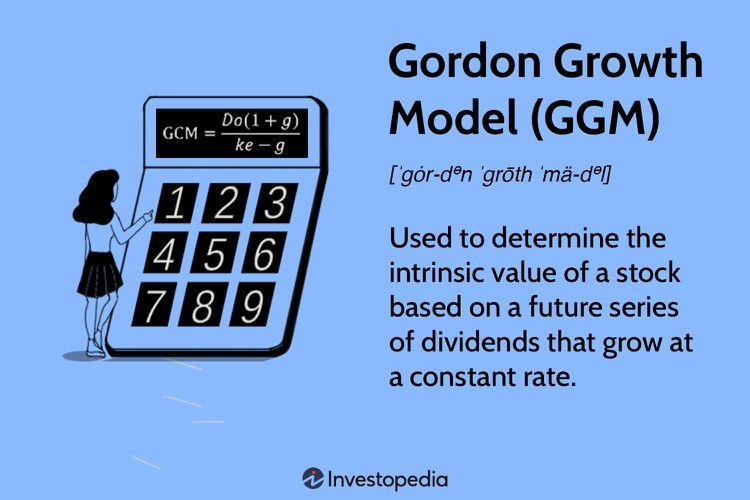

Investment valuation models and algorithmic trading are two principal elements of contemporary financial analysis. Investment valuation models aim to quantify the intrinsic value of a company’s stock, which is essential for informed investment decisions. Among these models, the Gordon Growth Model (GGM) stands out for its relevance and simplicity in determining the intrinsic value based on expected future dividends. The Gordon Growth Model uses the formula:

$$
\text{Intrinsic Value} = \frac{D_1}{k - g}
$$



where $D_1$ represents the expected dividend next year, $k$ is the required rate of return, and $g$ denotes the growth rate of dividends. This model is particularly favored for its ability to offer a streamlined approach to valuing stocks with an assumption of perpetual dividend growth at a constant rate. By estimating future dividends and factoring in growth expectations, the GGM provides investors with a clear valuation metric that facilitates comparison across different stocks and market conditions.

Algorithmic trading, on the other hand, has revolutionized the financial markets by automating decision-making processes. Utilizing sophisticated algorithms, these systems analyze vast datasets in real time to execute trades based on pre-defined criteria, often incorporating traditional financial models like GGM. The integration of algorithmic trading allows for the optimization of trading strategies by enhancing speed, precision, and objectivity, free from human emotional biases.

This article explores the integration of these two domains—traditional financial valuation models such as the GGM and state-of-the-art algorithmic trading techniques. The objective is to assess how historical models are being adapted to interface with advanced computational tools to enhance their predictive power and applicability in today's fast-paced financial environments. Through this synthesis, investors and financial analysts gain a deeper understanding of the potential benefits and challenges inherent in combining these methodologies, ultimately supporting more robust and dynamic investment strategies.

## Table of Contents

## Understanding Investment Valuation

Investment valuation is the process of determining the worth of a financial asset, most commonly a stock or a portfolio of securities. It is a critical component of financial markets, as it empowers investors to make informed decisions by providing insights into the intrinsic value of assets. Understanding the intrinsic value helps investors decide whether a security is overvalued, undervalued, or fairly priced compared to its current market price. This valuation is fundamental in aiding both individual and institutional investors in crafting effective investment strategies, managing risk, and achieving financial goals.

Various investment valuation methods are used in financial markets, each with its unique approach and assumptions. One of the prominent methods is the Gordon Growth Model (GGM), a model specifically used to estimate the intrinsic value of a stock based on the expected future dividends that it will generate. The GGM operates under the assumption of a stable dividend growth rate, simplifying the valuation process. The GGM formula is expressed as:

$$
\text{Intrinsic Value} = \frac{D_1}{k - g}
$$

Where:
- $D_1$ is the expected dividend in the next year,
- $k$ is the required rate of return,
- $g$ is the growth rate of the dividends.

The simplicity of the GGM lies in its assumption that dividends will grow at a constant rate indefinitely, making it particularly useful for valuing companies with stable dividend policies and mature business models.

In comparison, other valuation methods, such as the discounted cash flow (DCF) model and the price-to-earnings (P/E) ratio, offer different perspectives. The DCF model involves estimating the present value of an asset's expected future cash flows and is considered more comprehensive as it encompasses all cash inflows, not just dividends. It involves detailed projections of future revenues, costs, and cash flows, making it suitable for evaluating companies with complex cash flow structures. However, this complexity can also be a drawback in scenarios with high uncertainty about future cash flows.

The P/E ratio, on the other hand, is a simpler method that compares a company's current share price to its earnings per share. It is widely used due to its ease of calculation and ability to provide a quick snapshot of a company's valuation relative to its earnings power. Nevertheless, it does not consider future growth rates or the time value of money, which can lead to less accurate valuations in certain contexts.

The GGM's focus on dividends makes it particularly appealing for valuing dividend-paying stocks, as it provides a direct link between expected dividends and stock valuation. Its primary limitation is its reliance on the assumption of constant dividend growth, which may not hold in all cases, especially for companies in rapidly changing industries or those that do not consistently pay dividends. Despite these limitations, the GGM remains a valuable tool when estimating intrinsic value, largely owing to its straightforward approach and adaptation for companies with stable dividend growth trajectories.

## The Gordon Growth Model

The Gordon Growth Model (GGM) is a fundamental method in financial analysis used to evaluate the intrinsic value of a stock based on a predictable stream of future dividends that grow at a constant rate. The basic formula is:

$$
\text{Intrinsic Value (IV)} = \frac{D_1}{k - g}
$$

Where:\ D_1 is the expected dividend in the next period,\
k is the required rate of return, and\
g represents the dividend growth rate.

### Assumptions Underlying the GGM

The GGM operates under several key assumptions:

1. **Constant Growth Rate**: The model assumes that dividends will continue to grow indefinitely at a constant rate (g). This assumption makes the GGM suitable primarily for companies with stable cash flows and mature, predictable businesses.

2. **Stable Financial Leverage**: It presumes that the company's capital structure remains stable. Consequently, the cost of equity (k) does not fluctuate significantly over time, ensuring consistent future returns.

3. **Dividends as a Proxy for Cash Flows**: Dividends are used as proxies for a company's cash flows, which assumes that a firm’s profitability and its dividend payout patterns remain proportionate.

### Advantages of the GGM

The simplicity of the GGM allows analysts to swiftly compare the intrinsic values of stocks across various industries and market conditions. Its focus on dividends as a measure of cash flow aligns well with companies that have a long history of dividend payments. This makes it particularly useful for evaluating firms in sectors like utilities, where dividend payments are a significant aspect of investor returns.

Moreover, the GGM provides a straightforward analytic comparison for stocks that historically maintain steady growth and can help in forming a benchmark for assessing current stock prices against their calculated intrinsic values.

### Limitations and Potential Biases

Despite its usefulness, the GGM has notable limitations:

1. **Assumption of Constant Growth**: The model's assumption of a perpetual constant growth rate is unlikely to hold in dynamic and volatile markets where growth rates may fluctuate due to varying economic conditions.

2. **Inapplicability to Non-Dividend Paying Stocks**: The GGM cannot be applied to companies that do not pay dividends, nor is it effective for firms that have erratic or cyclical dividend patterns.

3. **Sensitive to Input Variables**: The intrinsic value calculated by the GGM is sensitive to chosen growth rates and required rates of return. Small misestimations in these variables can lead to significant valuation errors, potentially introducing bias in valuation conclusions.

4. **Market Volatility Impact**: Market volatility can significantly affect the components of the model, such as k, leading to unreliable valuations during periods of market instability.

While the GGM offers a valuable framework for determining the intrinsic value of steadily growing dividend-paying stocks, analysts must consider its assumptions and potential biases when applying it to real-world scenarios. Adjustments and comprehensive evaluations are necessary to enhance its applicability across different contexts.

## Integrating GGM in Financial Analysis

Financial analysts employ the Gordon Growth Model (GGM) as an integral part of their valuation toolkit to estimate a stock's intrinsic value based on expected future dividends. The formula for the GGM is:

$$
\text{Intrinsic Value} = \frac{D_1}{k - g}
$$

where $D_1$ is the expected dividend per share in the next period, $k$ is the required rate of return, and $g$ is the expected dividend growth rate. This model is particularly useful for analyzing companies with stable and predictable dividend growth.

### Adjustments and Considerations in Real-World Scenarios

When applying the GGM to real-world situations, analysts often make several adjustments and considerations to account for the model's assumptions and limitations:

1. **Growth Rate Estimation**: Estimating the growth rate $g$ accurately is crucial, as small changes can significantly affect the intrinsic value. Analysts typically assess a company's historical dividend growth patterns, industry trends, and economic conditions.

2. **Required Rate of Return**: The selection of an appropriate discount rate ($k$) is vital. It often reflects the investor's opportunity cost or the company's weighted average cost of capital (WACC). Analysts might adjust this rate based on factors such as risk premium adjustments for market volatility or sector-specific risks.

3. **Stable Growth Assumption**: The GGM assumes a perpetual and constant growth rate, which may not be realistic for all companies. Analysts may adjust their models to accommodate varying growth phases by employing multi-stage models that initially reflect higher growth rates, transitioning to a stable, perpetual rate.

4. **Dividend Payout Policies**: Analysts must consider the company's dividend payout policy. Some firms might reinvest earnings into growth opportunities instead of paying dividends, requiring adjustments to factor these decisions into the valuation.

### Influence on Investment Decisions

The intrinsic value derived from the GGM aids investors in making informed buying or selling choices. For example, if the calculated intrinsic value exceeds the current market price, the stock may be considered undervalued, representing a potential buying opportunity. Conversely, if the intrinsic value is below the market price, it might indicate that the stock is overvalued, suggesting a sell decision. 

In sectors where dividends are significant, such as utilities, telecommunications, or consumer staples, the GGM's insights are invaluable. Additionally, portfolio managers use these valuations to align investment strategies with income-focused objectives or assess company performance in comparison to sector averages.

By integrating the GGM with broader financial analyses and cross-verifying with other models like discounted cash flow (DCF) or price-to-earnings (P/E) ratios, analysts can achieve a holistic view, ensuring more robust and resilient investment strategies.

## Automating Investment Strategies with Algo Trading

Algorithmic trading, often referred to as algo trading, is the use of automated and pre-programmed trading instructions to execute orders in financial markets. These instructions are derived from a variety of variables, including timing, price, and [volume](/wiki/volume-trading-strategy), which are processed rapidly by algorithms without human intervention. Algo trading plays a critical role in automating investment strategies, providing numerous advantages over traditional trading methods.

One of the primary benefits of [algorithmic trading](/wiki/algorithmic-trading) is speed. Automated systems can process and execute trades within milliseconds, compared to the seconds or even minutes that it might take a human trader to place an order. This speed enables traders to capitalize on fleeting market opportunities and provides a competitive edge, especially in markets with high [volatility](/wiki/volatility-trading-strategies). Furthermore, algo trading enhances precision, facilitating the execution of trades at the exact moment when certain conditions are met, thereby reducing slippage and improving overall trade execution quality.

Additionally, emotional bias is minimized through algo trading. Human traders may be susceptible to psychological biases that can influence decision-making, such as fear or overconfidence. Algorithms, however, operate based on predefined rules and models, ensuring consistent decision-making irrespective of market sentiment.

Integrating investment valuation models, such as the Gordon Growth Model (GGM), into algorithmic trading systems allows for automated decision-making based on calculated intrinsic values of stocks. The GGM estimates the intrinsic value using the formula $\text{Intrinsic Value} = \frac{D_1}{k - g}$, where $D_1$ is the expected dividend per share one year from now, $k$ is the required rate of return, and $g$ represents the growth rate of dividends. By embedding such valuation models into algo trading systems, traders can program algorithms to execute trades based on the discrepancy between the market price and the intrinsic value if it exceeds a certain threshold, potentially identifying undervalued or overvalued assets automatically.

Data inputs for algo trading systems that use valuation models like the GGM often include financial statements, historical stock prices, dividend announcements, interest rates, and economic indicators. These data inputs must be integrated into the algorithm’s decision-making logic, which entails performing complex computations swiftly. For instance, Python, a popular programming language among traders, allows for such computations with libraries like NumPy and Pandas for data manipulation, and scikit-learn for incorporating [machine learning](/wiki/machine-learning) techniques to enhance predictive accuracy. Here is a basic example in Python demonstrating how an algorithm might compare calculated intrinsic value with market price:

```python
import pandas as pd

# Sample financial data
financial_data = pd.DataFrame({
    'expected_dividend': [2.5],
    'required_return': [0.08],
    'growth_rate': [0.03],
    'market_price': [40]
})

# Gordon Growth Model Calculation
def calculate_intrinsic_value(row):
    D1 = row['expected_dividend']
    k = row['required_return']
    g = row['growth_rate']
    intrinsic_value = D1 / (k - g)
    return intrinsic_value

# Apply the GGM to calculate intrinsic values
financial_data['intrinsic_value'] = financial_data.apply(calculate_intrinsic_value, axis=1)

# Define trading logic
def trading_decision(row):
    if row['intrinsic_value'] > row['market_price']:
        return 'Buy'
    elif row['intrinsic_value'] < row['market_price']:
        return 'Sell'
    else:
        return 'Hold'

# Determine trading decisions based on intrinsic value
financial_data['trading_decision'] = financial_data.apply(trading_decision, axis=1)

print(financial_data[['intrinsic_value', 'trading_decision']])
```

This example demonstrates how financial models can automatically inform trading decisions through algorithmic processes, enhancing the efficiency and effectiveness of investment strategies.

## Challenges and Considerations

Investment valuation models, such as the Gordon Growth Model (GGM), present unique challenges when applied to algorithmic trading in volatile market environments. One major issue is the assumption of constant growth rates inherent in the GGM, which may not hold in rapidly changing markets. Given the dynamic conditions of financial markets, these assumptions can lead to inaccurate stock valuations and suboptimal trading decisions if not properly adjusted. 

In algorithmic trading, the GGM's assumptions must be continuously evaluated against real-time market conditions. This is crucial since the model's reliability can be compromised by market anomalies, abrupt changes in company performance, and external factors like economic downturns that affect dividend stability. Therefore, traders must ensure that their algorithms can dynamically update valuation metrics in response to market movements.

Backtesting is central to refining and validating algorithms that incorporate the GGM. It involves testing trading strategies against historical data to evaluate performance. Effective [backtesting](/wiki/backtesting) helps ensure that algorithms are not only theoretically sound but also capable of performing well in practice. Traders must use data representative of different market conditions to ensure robustness and avoid data-snooping biases, which can give a false sense of confidence in the model’s predictive power.

Here's a simple example of a backtesting framework in Python using pandas and numpy, assuming access to historical stock prices and dividends:

```python
import pandas as pd
import numpy as np

# Assume 'data' is a DataFrame with historical 'price', 'dividends', and 'growth rate' (g)
data = pd.read_csv('historical_data.csv') 

def gordon_growth_model(dividend, growth_rate, required_return):
    return dividend / (required_return - growth_rate)

# Example for backtesting
required_return = 0.08  # Assume a required return rate of 8%
data['predicted_price'] = gordon_growth_model(data['dividends'], data['growth rate'], required_return)

# Performance Analysis
data['returns'] = (data['price'].shift(-1) - data['price']) / data['price']
strategy_returns = np.where(data['predicted_price'] > data['price'], data['returns'], 0)
data['strategy_returns'] = pd.Series(strategy_returns)

cumulative_returns = (1 + data['strategy_returns']).cumprod() - 1
print(f"Cumulative returns from backtesting: {cumulative_returns.iloc[-1]}")
```

Ethical and regulatory considerations are critical in algorithmic trading, especially when using valuation models like GGM to drive automated decisions. The use of such systems raises concerns about market manipulation, transparency, and fairness. Regulators like the U.S. Securities and Exchange Commission (SEC) have implemented guidelines to ensure that algorithmic trading does not disrupt market integrity. Algorithms must be designed to comply with these regulations and include mechanisms for scrutiny and adjustment to avert unintended impacts, such as market crashes or flash trading incidents.

Moreover, the ethical implication of automating trading requires that algorithms be monitored to prevent them from exploiting market inefficiencies to the detriment of other market participants. It is essential for traders and firms to establish robust compliance frameworks to oversee algorithmic operations and to ensure adherence to established financial regulations and ethical standards. 

Overall, while integrating the GGM within algorithmic trading offers significant prospects, it necessitates careful attention to model assumptions, rigorous backtesting, and adherence to regulatory frameworks to mitigate risks associated with its application in volatile market environments.

## Future Prospects

The future of financial analysis is increasingly intertwined with advancements in algorithmic trading techniques. A pivotal role is played by machine learning (ML) and [artificial intelligence](/wiki/ai-artificial-intelligence) (AI) in refining and enhancing predictive models. These technologies offer financial analysts the ability to process vast amounts of data, uncover patterns, and make more informed decisions quickly and accurately. The incorporation of AI and ML has the potential to transform traditional investment valuation by optimizing algorithms to better handle volatility and adapt to changing market conditions. 

Potential innovations in investment valuation methodologies emphasize the blending of quantitative models with AI-driven analytics. For instance, machine learning algorithms can be used to recalibrate models like the Gordon Growth Model (GGM) based on real-time data and changing market dynamics. This adaptability allows for continuous modification of model assumptions, such as growth rates and discount rates, to better reflect the current economic environment. 

Moreover, advancements in natural language processing (NLP) are playing a critical role. NLP can analyze news articles, financial reports, and even social media to gauge investor sentiment and project potential market movements. Such data integration expands the scope of algorithmic trading far beyond historical price patterns, allowing for more comprehensive risk assessments and opportunity identification.

Another area poised for development is the field of quantum computing, which holds the promise of exponential increases in computational power. Quantum algorithms could provide solutions to optimization problems faster than classical computers, enhancing the efficiency and performance of trading strategies. However, practical implementation of quantum computing in finance is still emerging and requires further exploration.

On the regulatory front, the evolving landscape calls for a deeper consideration of compliance, particularly regarding the ethical deployment of automated trading systems. Ensuring transparency, fairness, and accountability in algo trading practices is essential to maintain market integrity and investor trust.

In summary, the future of financial analysis will likely be shaped by these technological advancements and their integration into investment strategies. The embrace of AI, ML, and potentially quantum computing in refining valuation methodologies will further bridge the gap between traditional financial principles and modern-[day trading](/wiki/day-trading-spy) innovations. This evolving paradigm not only enhances analytical precision but also offers new dimensions for exploring and deploying financial models in real-world scenarios.

## Conclusion

The synthesis of investment valuation models, particularly the Gordon Growth Model (GGM), with algorithmic trading exemplifies a significant advancement in financial analytics. The GGM, by focusing on dividend growth and stock valuation, provides a solid foundation for assessing the intrinsic value of investments, which, when combined with the speed and efficiency of algorithmic trading, offers a robust framework for making informed investment decisions. This intersection underscores the critical need for continuous adaptation and learning in financial markets. 

Algorithmic trading utilizes the strength of automated systems to process vast amounts of data and execute trades with precision and speed that human traders cannot match. The integration of models like GGM into these automated systems allows for enhanced decision-making capabilities by systematically incorporating [fundamental analysis](/wiki/fundamental-analysis) into trading algorithms. Such integration provides the potential for more accurate predictions and optimized trading strategies.

However, the dynamic nature of financial markets necessitates ongoing research and innovative approaches. There is immense scope for further exploration in refining these systems, particularly through the application of machine learning and artificial intelligence, which promise to enhance predictive accuracy and valuation model sophistication. As algorithmic trading continues to evolve, its synergy with traditional financial models presents promising avenues for innovation and efficiency in the financial industry. Embracing this evolution can yield significant benefits, including improved investment outcomes and a more resilient financial ecosystem.

## References & Further Reading

[1]: ["The Theory of Investment Value"](https://resources.caih.jhu.edu/textbooks/Resources/download/Theory_Of_Investment_Value_John_Burr_Williams.pdf) by John Burr Williams

[2]: ["Security Analysis"](https://www.amazon.com/Security-Analysis-Foreword-Buffett-Editions/dp/0071592539) by Benjamin Graham and David Dodd

[3]: ["Investment Valuation: Tools and Techniques for Determining the Value of Any Asset"](https://books.google.com/books/about/Investment_Valuation.html?id=5SRHAAAAQBAJ) by Aswath Damodaran

[4]: Fama, E. F., & French, K. R. (2002). ["The Equity Premium"](https://onlinelibrary.wiley.com/doi/abs/10.1111/1540-6261.00437). Journal of Finance, 57(2), 637-659.

[5]: Lo, A. W., & MacKinlay, A. C. (1997). ["The Econometrics of Financial Markets"](https://www.jstor.org/stable/1344712) Princeton University Press.