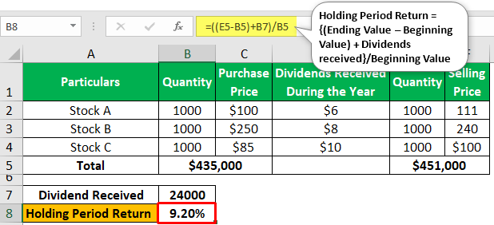

In the world of investments, choosing between individual stocks and a diversified portfolio is a pivotal decision for investors. Investing in single stocks offers avenues for high returns, often driven by the performance of individual companies. However, this approach is accompanied by inherent risks and volatility, which can lead to significant financial losses if a company underperforms. On the other hand, a diversified portfolio serves to spread risk across various asset classes, reducing the impact of adverse performance by individual entities. 

The advent of algorithmic trading has transformed investment strategies, allowing for automation in trading and portfolio management. Algorithms can handle vast amounts of data and execute trades at speeds and efficiencies far beyond human capabilities. This technological advancement aids in mitigating errors and optimizing trade execution, thus playing a crucial role in contemporary investment strategies.



A balanced perspective on single stock investment and algorithmic trading assists investors in making informed decisions. Understanding the interplay between the potential rewards and the risks involved with single stock investments, along with the benefits conferred by algorithmic trading, allows investors to tailor strategies that align with their risk tolerance and financial objectives. Exploring how single stocks can be effectively integrated into a diversified portfolio using algorithmic trading techniques will offer strategic insights for both novice and experienced investors.

## Table of Contents

## Understanding Single Stocks

Single stocks represent ownership in a particular company through individual shares. This form of investment enables investors to direct capital towards specific companies rather than a collective basket, such as an index fund or mutual fund. Selecting single stocks can be attractive for investors seeking higher returns, largely due to the potential growth of individual companies. For instance, investing in a company that experiences significant growth can yield substantial profits compared to broader market investments.

However, investing in single stocks inherently carries risks and volatility that are not typically present in more diversified investment products. The performance of any single stock is influenced by numerous factors including company performance, industry trends, and broader economic conditions. This concentration risk can lead to significant losses if the chosen company underperforms or faces unforeseen challenges. 

Investors opting for single stocks are often compelled by stories of remarkable gains in historically thriving companies, such as technology giants, where early investment could have multiplied several times over. Consequently, the allure of capitalizing on such opportunities often leads investors toward this route, albeit at a greater potential risk. In summary, while single stocks offer the enticement of high returns, they demand careful consideration of associated volatility and risk.

## Pros of Investing in Single Stocks

Investing in single stocks can offer several advantages for investors aiming to maximize their returns. One of the primary benefits is the opportunity for high returns when the chosen company performs well. For instance, suppose an investor purchases shares in a company that experiences significant growth or unveils an innovative product. In that case, the stock's value may skyrocket, providing substantial profits for the early-stage investor. This potential for high returns is particularly appealing compared to more diversified investment strategies, which typically yield moderate returns due to their risk mitigation focus.

Another advantage of investing in single stocks is the direct ownership it grants investors. With direct ownership, investors can specifically target companies they have confidence in, supporting businesses aligned with their values or interests. This approach not only empowers investors to personally connect with their investment choices but also allows them to conduct focused research on the company, making informed decisions about buying or selling based on the company’s performance, management strategies, and industry position.

Moreover, holding single stocks presents an opportunity to capitalize on short-term market movements. Investors can actively trade based on these fluctuations, buying and selling stocks in response to market conditions, news events, or company announcements. This strategy, often referred to as swing trading, offers the ability to realize quick profits by timing the market effectively. For example, a tech company releasing a successful new gadget might see an immediate increase in its stock price, allowing investors who anticipated this development to benefit promptly.

To summarize, the investment in single stocks can appeal to those pursuing the potential for high returns, direct engagement with chosen companies, and the agility to respond to market changes swiftly. These factors can significantly enhance an investor’s chance to achieve financial success, provided they manage the inherent risks associated with less diversified portfolios.

## Cons of Investing in Single Stocks

Investing in single stocks carries a higher risk due to a lack of diversification. When investors choose to allocate capital to individual stocks, their portfolios become susceptible to company-specific risks, which can lead to significant losses if the chosen company underperforms or fails. Unlike diversified investment strategies, which spread risk across various assets, single stock investments concentrate risk on specific entities, exposing investors to [volatility](/wiki/volatility-trading-strategies) resulting from company-specific news, management decisions, and industry shifts.

Volatility is a critical concern when investing in single stocks. It refers to the degree of variation in the price of a stock over time, often measured by the standard deviation of returns. High volatility can lead to rapid and substantial changes in the value of single stocks, amplifying the potential for losses. For instance, if a company's earnings report falls short of market expectations, its stock price may experience a sharp decline, quickly eroding investment value.

Consider the formula for standard deviation, $\sigma$, which is often used to quantify the risk or volatility of an investment:

$$
\sigma = \sqrt{\frac{1}{N}\sum_{i=1}^{N}(x_i - \mu)^2}
$$

where $N$ is the number of observations, $x_i$ is each individual observation, and $\mu$ is the mean of the observations. In single stock investment, a high $\sigma$ reflects greater uncertainty and risk.

Moreover, investing in single stocks demands extensive research and continuous monitoring. Investors are required to stay informed about a company's operations, financial health, competitive landscape, and macroeconomic factors affecting its performance. This research is necessary to make informed decisions and mitigate potential risks but can be time-consuming and require a deep understanding of market mechanics and financial reports.

Active monitoring also plays a crucial role in single stock investing. Investors need to remain vigilant to react promptly to market changes, such as earnings releases, industry developments, and geopolitical events that could influence stock prices. This level of engagement might not be feasible for all investors, particularly those with limited time, expertise, or access to resources required for detailed analysis.

In summary, while single stocks offer the potential for high returns, they also bear heightened risks due to lack of diversification, inherent volatility, and the need for thorough research and active management. These factors make single stock investments a more challenging and risky endeavor for individual investors.

## Role of Algorithmic Trading

Algorithmic trading is characterized by the use of computer algorithms to execute trading orders at speeds and frequencies that are impossible for human traders. This process leverages complex mathematical models and computational techniques to determine the timing, price, and quantity of orders, enhancing the decision-making process in stock investments.

The primary advantages of [algorithmic trading](/wiki/algorithmic-trading) include faster execution and a significant reduction in human error. By automating the trading process, algorithms can execute orders within milliseconds, capitalizing on market opportunities that might be missed by manual trading. This speed advantage is critical in markets where prices can change in fractions of a second.

Algorithmic trading also minimizes human error by removing emotional and psychological biases from trading decisions. These biases can result in sub-optimal trading strategies, such as second-guessing or overreacting to news. An algorithm can consistently apply pre-defined trading rules, ensuring a disciplined approach to market opportunities.

Moreover, algorithmic trading often employs strategies such as statistical [arbitrage](/wiki/arbitrage) or mean reversion, which analyze historical data to forecast short-term price moves. For example, mean reversion algorithms might predict that if a stock price deviates significantly from its historical average, it is likely to return to that average, thereby guiding trade execution.

The enhanced decision-making process offered by algorithmic trading further extends to risk management. Algorithms can rapidly assess and act to mitigate risks associated with volatility, swiftly adjusting strategies to reflect real-time market conditions. This capacity for quick adaptation is particularly beneficial in markets subject to abrupt shifts due to economic, political, or social events.

In conclusion, algorithmic trading not only enhances the execution speed and accuracy of stock investments but also provides a framework for more structured and objective decision-making. This technology enables investors to harness sophisticated strategies that would be impractical to manage manually, thus offering a competitive edge in the fast-paced world of stock trading.

## Integrating Single Stocks into a Diversified Portfolio

Achieving diversification is a fundamental strategy to reduce the risks associated with investing in single stocks. By incorporating a variety of stocks with different risk levels, investors can stabilize their portfolios and mitigate potential losses. Diversification benefits arise from the tendency of various asset classes and individual securities to react differently to the same market events. When one stock underperforms, another may experience gains, thereby offsetting potential losses.

To effectively integrate single stocks into a diversified portfolio, investors can utilize algorithmic trading, which leverages computer algorithms to make precise and rapid trading decisions. This technology allows for the analysis and management of large datasets to optimize portfolio balance according to an investor's specified risk profile. Algorithms can assess the statistical behavior of stocks, such as volatility and correlation with other assets, to ensure that the portfolio's composition aligns with diversification goals.

Algorithmic trading systems can perform tasks such as rebalancing portfolios to maintain the desired asset weightings or implementing stop-loss and take-profit orders to manage individual stock positions effectively. By reducing human error and biases, these systems aid in maintaining a strategic approach to portfolio management.

For example, consider a simple algorithm written in Python that rebalances a portfolio:

```python
import numpy as np

# Define the target proportion of each stock in the portfolio
target_weights = np.array([0.3, 0.4, 0.3])

# Current market value of each stock
current_values = np.array([10000, 15000, 12000])

# Calculate total value of the portfolio
total_value = current_values.sum()

# Calculate current weights of each stock
current_weights = current_values / total_value

# Determine the difference between current and target weights
weight_diff = target_weights - current_weights

# Calculate the amount to trade for rebalancing
trade_amounts = weight_diff * total_value

print("Trade the following amounts to rebalance the portfolio:", trade_amounts)
```

This example demonstrates how investors can automate the process of adjusting their holdings to match their target asset allocation, thus maintaining a balanced portfolio. In conclusion, the strategic integration of single stocks, alongside algorithmic trading, enables investors to maintain diversified portfolios that are less susceptible to the specific risks associated with individual securities.

## The Impact of Market Trends on Single Stock Investments

Market trends exert a significant influence on the performance of single stock investments. The value of individual stocks can fluctuate widely in response to economic indicators, geopolitical events, and shifts in consumer preferences. These factors can lead to unpredictability in stock prices, posing challenges but also offering opportunities for investors. Understanding and anticipating these market trends is essential for making informed investment decisions.

Algorithmic trading plays a pivotal role in navigating these market trends effectively. By leveraging advanced mathematical models and computational power, algorithmic trading systems can process vast amounts of data in real-time, identifying patterns and trends that may not be immediately apparent to human analysts. This capability allows traders to anticipate market shifts and execute trades at optimal times, thereby potentially maximizing profit and minimizing risk.

A crucial component of algorithmic trading is the analysis of historical data. This data provides insights into how stocks have reacted to past market conditions, helping to predict future behavior. For instance, if historical data indicates that a particular stock typically rises following a specific economic report, an algorithm can be programmed to buy the stock ahead of such reports. This strategy, known as [backtesting](/wiki/backtesting), involves running the algorithm using historical data to check its accuracy and effectiveness before deploying it in live trading.

Python, a popular programming language in financial markets, facilitates the process of historical data analysis and algorithm development. Using Python libraries like NumPy, pandas, and scikit-learn, traders can create sophisticated models to test their hypotheses about market trends. For example, a simple moving average crossover strategy, a common algorithmic trading technique, can be implemented in Python to identify potential buy or sell signals based on historical price data.

Consider the following Python code snippet, which demonstrates a moving average crossover strategy:

```python
import pandas as pd
import numpy as np

# Load historical stock data
data = pd.read_csv('historical_stock_data.csv')

# Calculate moving averages
data['short_ma'] = data['Close'].rolling(window=50).mean()
data['long_ma'] = data['Close'].rolling(window=200).mean()

# Define buy/sell signals
data['signal'] = 0
data['signal'][50:] = np.where(data['short_ma'][50:] > data['long_ma'][50:], 1, 0)
data['positions'] = data['signal'].diff()

# Print buy/sell dates
buy_signals = data[data['positions'] == 1]
sell_signals = data[data['positions'] == -1]

print("Buy Signals:\n", buy_signals[['Date', 'Close']])
print("Sell Signals:\n", sell_signals[['Date', 'Close']])
```

This code calculates the short-term and long-term moving averages of stock prices to determine buy and sell signals, based on the crossover points. By executing such algorithms, traders can capitalize on stock movements influenced by prevailing market trends.

Overall, while market trends can lead to volatility in single stock investments, algorithmic trading offers a structured and strategic method for anticipating these fluctuations. By combining historical data analysis with real-time market insights, investors can enhance their trading strategies and potentially improve their outcomes in dynamic financial markets.

## Conclusion

Investing in single stocks presents both opportunities and risks. The key to successfully integrating them into an investment strategy lies in leveraging strategic tools and methods. Algorithmic trading, for instance, can significantly enhance an investor's ability to manage these investments. By automating trading processes, algorithmic trading allows for quicker reaction to market conditions, thereby reducing the likelihood of human error and emotional decision-making. These algorithms can analyze vast amounts of data in real time, providing insights that inform strategic decisions on when to buy or sell individual stocks.

However, the importance of a well-balanced approach cannot be overstated. Achieving a proper balance between risk and reward is essential. Single stocks can yield substantial returns, but they also come with inherent risks, including volatility and company-specific downturns. By developing a diversified portfolio strategy, investors can mitigate some of these risks. Diversification involves combining single stocks with a range of asset classes to create a spectrum of varying risk levels. This approach stabilizes the portfolio, ensuring that a downturn in one stock does not overly impact the overall portfolio performance.

Investors should tailor their strategy based on their specific risk tolerance and investment goals. Some may have a high risk tolerance and opt for a larger allocation of single stocks, while others may prioritize security and lean more heavily towards diversification. Tools such as algorithmic trading can be utilized to optimize this balance, adjusting allocations promptly as market conditions evolve.

With the right blend of tools and strategy, single stocks can indeed be an effective component of a well-diversified investment strategy. Recognizing the unique characteristics and potential of individual stocks, while also managing their risks, empowers investors to achieve their financial objectives more effectively. Therefore, informed decision-making, supported by technological tools like algorithmic trading, is vital for harnessing the benefits and navigating the pitfalls associated with investing in single stocks.

## References & Further Reading

[1]: Bergstra, J., Bardenet, R., Bengio, Y., & Kégl, B. (2011). ["Algorithms for Hyper-Parameter Optimization."](https://dl.acm.org/doi/10.5555/2986459.2986743) Advances in Neural Information Processing Systems 24.

[2]: ["Advances in Financial Machine Learning"](https://www.amazon.com/Advances-Financial-Machine-Learning-Marcos/dp/1119482089) by Marcos Lopez de Prado

[3]: ["Evidence-Based Technical Analysis: Applying the Scientific Method and Statistical Inference to Trading Signals"](https://www.amazon.com/Evidence-Based-Technical-Analysis-Scientific-Statistical/dp/0470008741) by David Aronson

[4]: ["Machine Learning for Algorithmic Trading"](https://github.com/stefan-jansen/machine-learning-for-trading) by Stefan Jansen

[5]: ["Quantitative Trading: How to Build Your Own Algorithmic Trading Business"](https://www.amazon.com/Quantitative-Trading-Build-Algorithmic-Business/dp/1119800064) by Ernest P. Chan